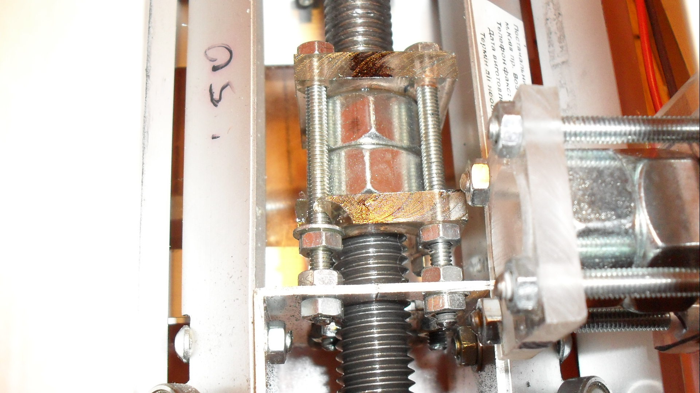

# CNC 1

I became interested in CNC since the first video I saw on YouTube. There was a lot of things to learn before I was able to build my own CNC router.

I ordered particle board cutting and assembled everything from wood, plexiglass and aluminium. Originally I was going to build the router as a closable box. But wooden walls were vibrating too much and making a lot of noise, so in the end I had to cut out as much particle board as possible.

Everything was meant to be cheap, because I did not want to buy expensive components and screw everything up without experience. Regular M10 rods are used as feed-screws.

This is “backlash nut” design.

Other parts are shown above.

[Video: first cuts](https://www.youtube.com/watch?v=pnqxeROW-kw)

Router was controlled by Mach3 software running on a notebook, connected to self-designed [3 axis STEP-DIP stepper motor controller](http://localhost:8080/?page_id=455). Computer ATX power supply was used to provide power to controller and motors.

[Video: machining with dremel](https://www.youtube.com/watch?v=s4yCN-370ro)

The accuracy of cutting is ~0.2 mm. Actually it is much less than I can measure. The main problem of this design is low stiffness. Under some conditions the spindle can start to vibrate and cut incorrectly.

After playing for a while, I disassembled it because it had low stiffness, produced a lot of noise and took too much space. Currently I am building second CNC completely from steel.

### Lessons learned
- stiffness is much more important than accuracy;
- wood and aluminium are bad materials for CNC. Everything should be made from steel. I had to replace aluminium rails with steel to increase stiffness;
- noise is a problem. CNC is meant to work for several hours. I am thinking about noise-isolated box for the next design;
- more weight = less vibration = less noise. CNC should be heavy.
