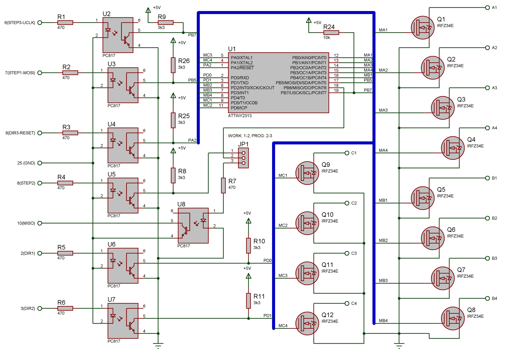
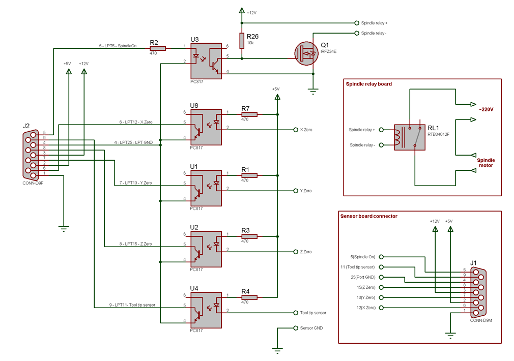
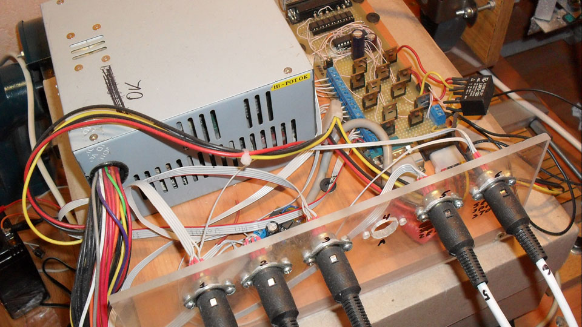
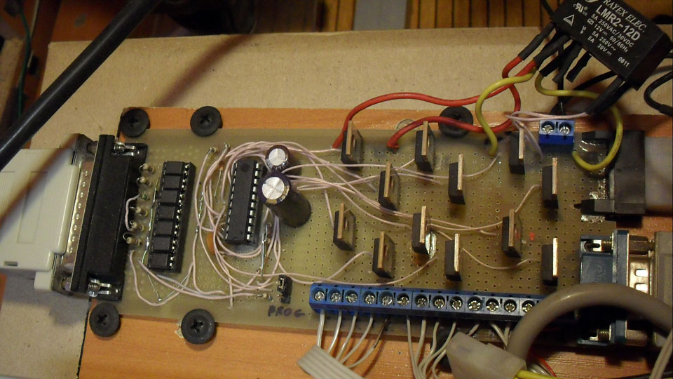
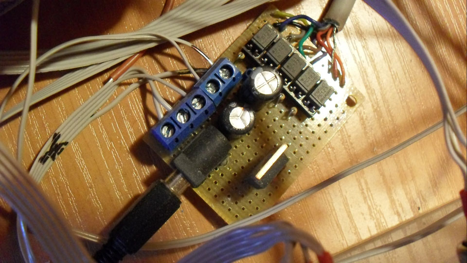
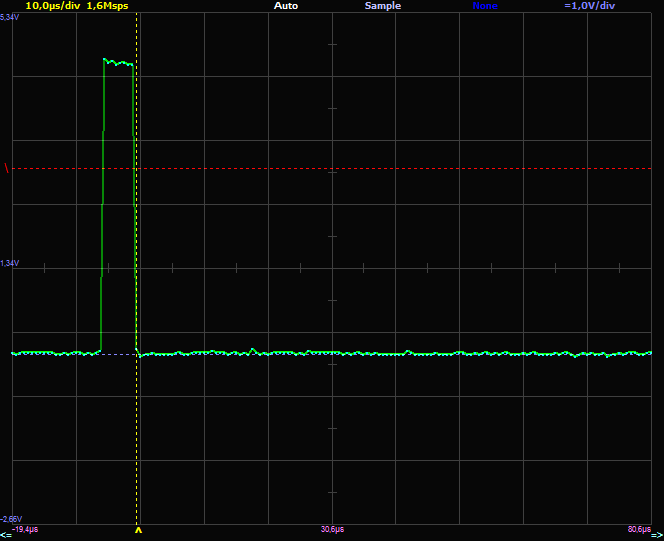
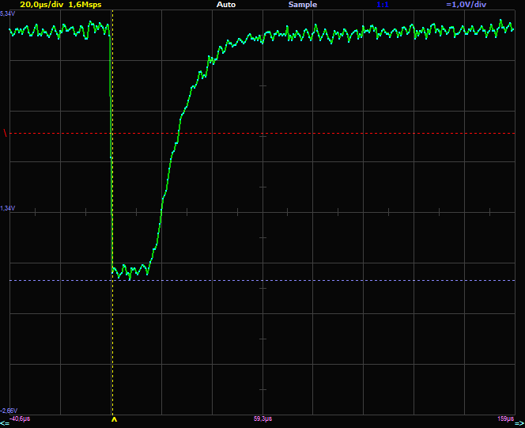

# 3 axis STEP-DIR controller

I designed 3 axis STEP-DIR unipolar stepper motor controller for [my CNC](/filesystem/CNC/2008-05_DIY_CNC1\DIY_CNC1.md).

The controller is based on ATTiny2313 micro-controller and custom firmware. Schematic is given below:

A separate sensor boards allows to connect X,Y and Z zero sensors, tool tip sensor and Spindle On:

Controller is optoisolated (this was the main design goal). I have been using computer ATX power source to power controller and motors. Two motors were connected to +12V, and one to +5V.

There are no axis limit sensors. These are not a part of controller. I were using off switches to disconnect motors from power source when axis limit is reached to prevent CNC damage. Software limits were tracked by Mach3 software.

 

Custom firmware can be configured to run each channel in one of the 4 modes:

- 4-step microstep;
- half-step;
- full phase full step;
- half-phase full step;

In full-phase full step, one of the coils will be enabled at at time.

In half-phase full spte, two coils will be enabled at at time. This mode can be used to increase momentum of motor.

In half-step more, controller will double number of steps by introducing midle steps where two coils is enabled.

In 4-step microstep, controller will 4x increase number of steps by approximating sinusoidal current on coils using PWM.

Also controller will decrease current 2x with PWM when idle.

## Microstepping mode considerations

Due to schematic simplicity, controller does not have current-feedback circuits. This means software will try to drive coils assuming fully resistive load, which is totally wrong for motor coils. Also PWM is software and has a frequency of ~7KHz. Such frequency is too low – current is able to fade out completely during off period. So actually there is "momentum" PWM, not a "current" PWM. All in all, controller schematic is too simple to implement microstepping correctly. I would advise to look at [hCNC3+_controller by Horren](http://vri-cnc.ru/forum/viewtopic.php?f=13&t=1438).

Due to simplistic implementation, microstepping mode may not increase accuracy, but it does a good work of smoothing steps and considerably decreasing noise produced by stepper motors. I were using microstepping on all axes.

I know there are several wrong places in schematic. Transistor gates should not be connected directly to micro-controller. There should be more capacitors and diodes. But IT JUST WORKS, and I never replaced any part during my experiments. MOSFETS were cold with motors I were using (< 1A). I am going to design another controller for my second CNC: with current feedback and correct micostepping. Schematic complexity will increase however.

## Minimum pulse length and maximum step rate

One important thing is 3k3 resistors connected to optocouplers. Theese are responcible for optocouplers recovery time.

Consider Mach 3 software running with 25kHz kernel frequency and step/dir pulse length of 5us. You should notice that firmware does not use hardware interrupts to catch STEP pulses, but continuosly checks STEP pins instead. While microntroller is running at 8Mhz, it is able to check STEP pins every ~18us. So why it does not miss the 1us pulses?!

The key is optocoupler recovery time. Every single input pulse saturates optocoupler for ~20us. So pulse length setting in Mach3 does not have effect actually. A positive 5us input pulse became ~20us negative pulse at optocoupler output, and firmware is able to detect it easily. This is the key principle which allowed single ATTiny to drive 3 motors.

*With 25 kHz kernel frequency, minimum pulse length in Math 3 is 5 us regradles of settings (which allows 1 us setting).*

*At the optocouple routput, 5ms positive pulse became 20us negative TTL pulse.*  
*Optocoupler is loaded with 3k3 resistor and AVR pullup resistor (~50kOhm).*

*Maximum pulse rate for controller is 12.5kHz(period = 80us),*  
*which can be achieved by setting velocity * steps_per < 12500.*

## Firmware

Firmware is written in CodevisionAVR.

The cool thing about this controller is that firmware can be programmed in-place, without a need of programmer. Properly configured AVRDUDE software can be found [here](http://localhost:8080/hax/downloads/3axis_controller.zip). Controller is switched between normal/programming mode with JP1. You will notice that avrdude parameters include delay, which is required to allow optocouplers to switch.

Micro-controller fuses should be programmed to run controller from internal 8MHz oscillator. Schematic is using all micro-controller lines, including RESET, so RESET should be configured as output. As you know, you will not be able to reprogram micro-controller with RESET line disabled anymore, unless you have parallel programmer. I would advise to experiment with 2 axes and configure RESET line last thing.

Controller was tested with Mach3 software.

Tool tip sensor can be used to set Z axis zero in Math3 software.

[Schematic in Proteus and Firmware Source in CodevisionAVR](http://localhost:8080/hax/downloads/3axis_controller.zip)

## Lessons learned

- optoisolation part of schematic works fine and can be used in other projects;
- in order to increase speed, momentum, and implement microstepping correctly, a current feedback circuit should be added;
- PWM should be implemented in hardware;
- integrated mosfet drivers should be used to implement PWM with power MOSFETS.
