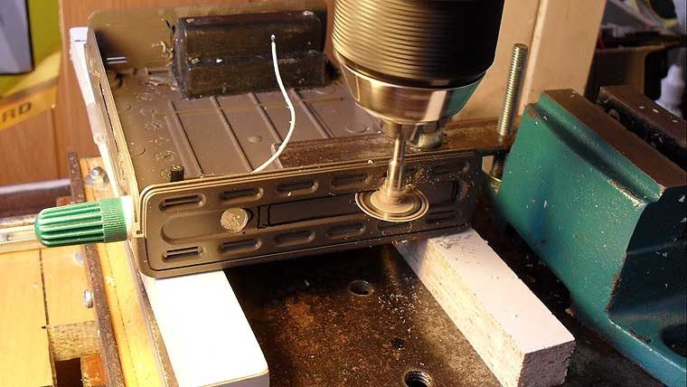
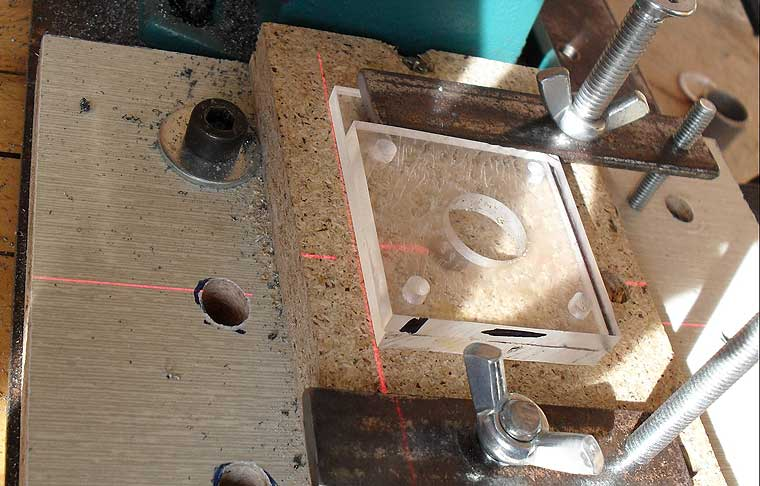
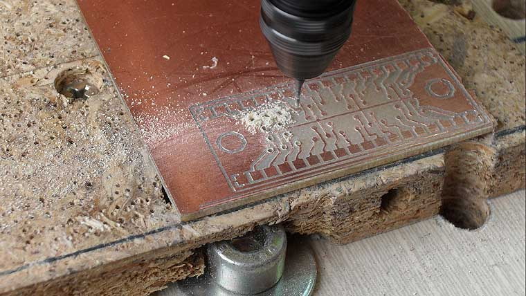
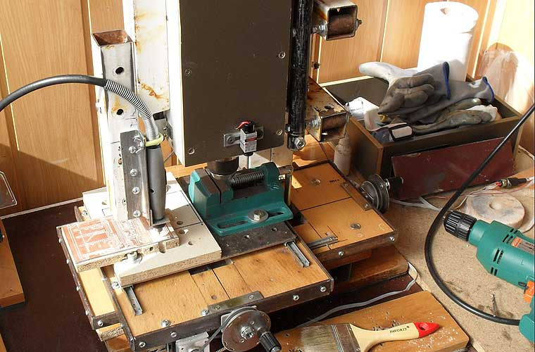

# CNC 2

[YouTube: CNC 2 Video](https://www.youtube.com/watch?v=1mvdvO63yrA)

Second CNC was built with with experience gained while building first CNC.

It consists from metal frame and wooden tables. Modified furniture rails are used for XY table. Z axis is built from broken gas springs bodies and ball bearings.

Generic M8 rods and nuts are used on all axes.

X and Y axes are driven by small unipolar motors from printers.

Z axis is driven by ДШИ-200-3 motor.

Controller is designed by me, it is ATMega8535 4 axis 16x microstep driver with current control.

There are two spindles. Main spindle is used for drilling and is made of 350W drill.

Second spindle is for engraving/machining, designed for low noise long time operation, 2700 rpm motor with Dremel attachment.

CNC is capable of drilling steel, and engraving/machining wood, plastic, PCBs.

CNC has linear laser attachments for aiming and LED illumination of working zone.

Working zone size is 20 x 12 cm.

The main achievement is ultra-low noise operation, because amount of noise produced by CNC is the main factor whether it can be used in flat or not.

Stepper motor noise is decreased by using 16x microstepping mode and belt drive. Engraving spindle noise is very low thanks to brushless 60W motor from old air conditioner. Overall noise is decreased by using metal frame and heavy support table, reinforced by concrete. I aim for middle-speed milling to decrease noice.

Actually, sometimes I forgot to turn off CNC because I do not heat it.

## Future work

- replace brushed brill motor on main spindle with brushless 3-phase motor + frequency inverter to decrease noise and allow continuous operation;
- put second spindle inside main spindle body
- replace furniture rails with linear all bearings to allow stable aluminium machining.
