# 4-axis Step/Dir Stepper Motor Controller 2

*Article published on [radiokot.ru](http://radiokot.ru/circuit/digital/security/26/)*

This article describes a step/dir controller for unipolar stepper motors.
The controller is used to control a [homemade drilling and milling machine](/?start=2&folder=CNC%2F2013-09_4_axis_Step-Dir_%D0%BA%D0%BE%D0%BD%D1%82%D1%80%D0%BE%D0%BB%D0%BB%D0%B5%D1%80_%D1%88%D0%B0%D0%B3%D0%BE%D0%B2%D1%8B%D1%85_%D0%B4%D0%B2%D0%B8%D0%B3%D0%B0%D1%82%D0%B5%D0%BB%D0%B5%D0%B9_2&file=CNC%2F2009-06_DIY_CNC_2%2FDIY_CNC_2.md).

It is assumed that the reader is already familiar with homemade CNC machines; otherwise, it is recommended to study the materials listed at the end of the article.

The controller was developed to replace an existing primitive 3-axis controller based on ATTiny2313. The main requirements were microstepping support and hardware current control in the windings to reduce noise and increase movement speed.

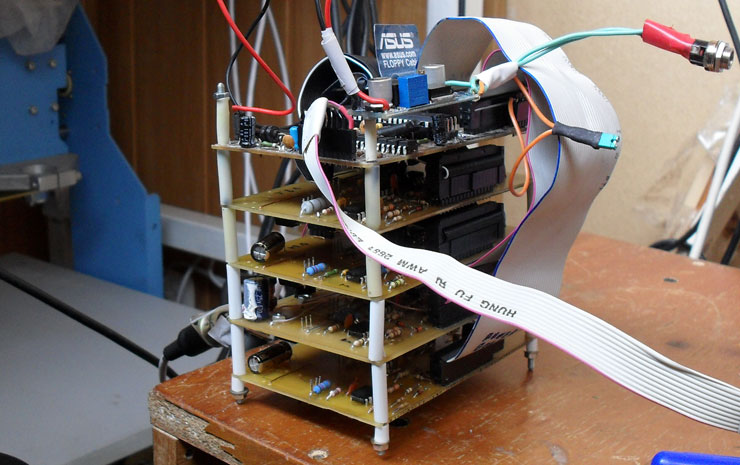

Specifications:
* 4 axes;
* for unipolar motors;
* hardware current control in windings (PWM);
* optoisolation from LPT port;
* holding mode with current reduction to a specified value;
* full step, half step, 4, 8, 16 microstep selectable separately for each channel;
* maximum step pulse frequency: 12.5 kHz (period – 80µs);
* minimum step and dir pulse width: 5µs;
* motor current – up to 2A, individually for each axis (more than 2A was not tested, the circuit allows it);
* motor supply voltage – up to 30V, with possibility of increase (more than 19V was not tested).

Overall, this turned out to be a rather "tricked-out" controller made from inexpensive, common components. None of the homemade controllers known to me possess such a set of features.

[http://www.youtube.com/watch?v=0DMpauxEPgk](http://www.youtube.com/watch?v=0DMpauxEPgk)

## Control Module

The control module is built around an ATMega8535 microcontroller operating at 16MHz. The controller's task is to process Step/Dir signals and output enable signals and reference voltages for the power section of the circuit.

Reference voltages are generated by the M62359 chip – this is an 8-bit 8-channel DAC with SPI interface.

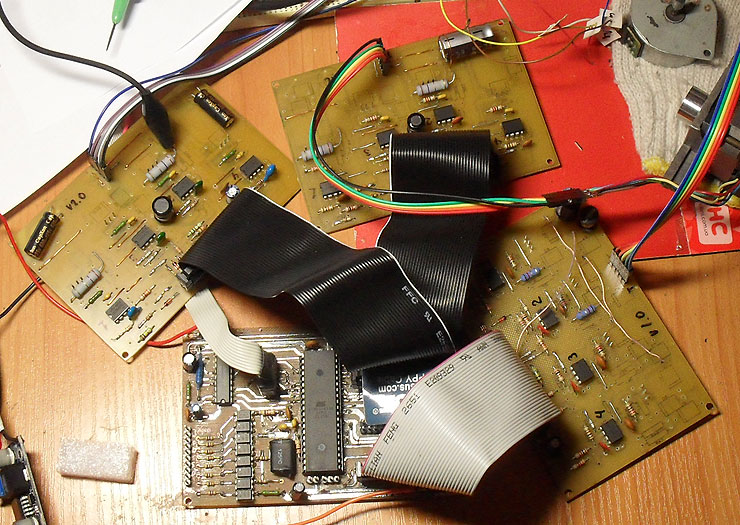

Optoisolation is implemented using PC817 optocouplers and is an integral part of the controller. This point needs to be discussed separately.

As can be seen from the schematic, unlike similar controllers, the Step signals are not connected to microcontroller pins that trigger hardware interrupts.
Instead, the controller runs in an infinite loop, checking if logic levels on the inputs have changed. This ensures stable, predictable controller operation.

One cycle (checking inputs, response, outputting control signals) takes approximately ~26µs in the current implementation. At the same time, the claimed minimum Step pulse width is 5µs. How does the controller not miss pulses?

This is, so to speak, my know-how 🙂
The secret lies in the properties of the optocouplers.

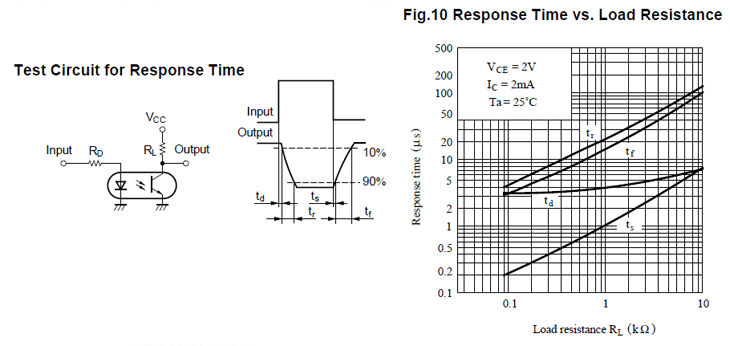

In the PC817 datasheet, you can find Response time graphs. After the input signal disappears, the optocoupler requires a certain time (ts + tf) to turn off. This time depends on the current flowing through the phototransistor.

In practice, it looks like this:
Input pulses – 5µs, period – 80 µs:

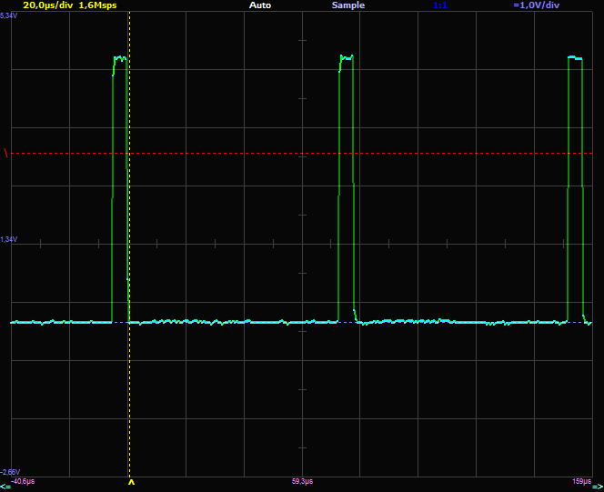

Load resistor 10kΩ at 5V – input pulse of 5µs turns into ~28µs (the area of confident AVR input reading as "0" – 0.8Vcc = 1V):

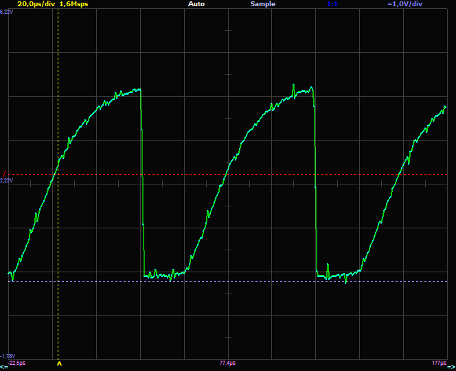

Thus, the microcontroller has at least 28 µs to poll the inputs.
As a result, it can handle all 4 axes by itself.

## Power Section

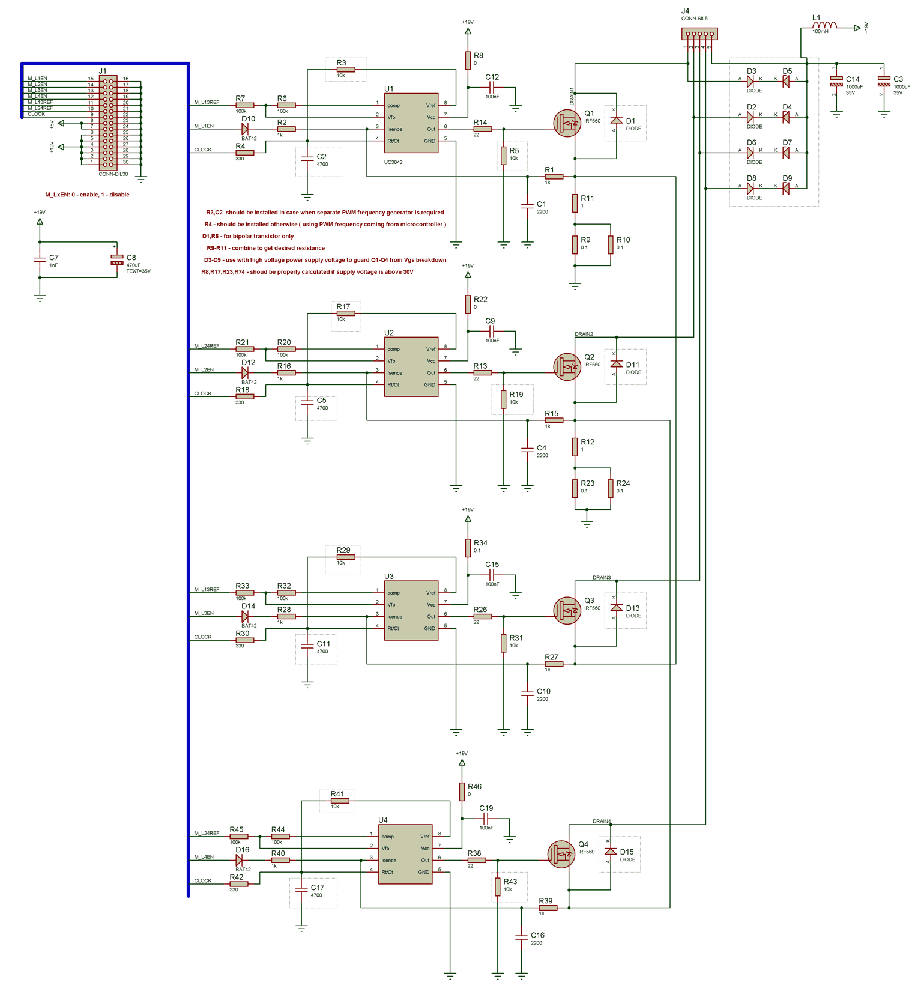

The four power section boards are completely identical and assembled on UC3842 chips and IRFZ44 or IRF560 transistors (transistors are located on the back side of the board):

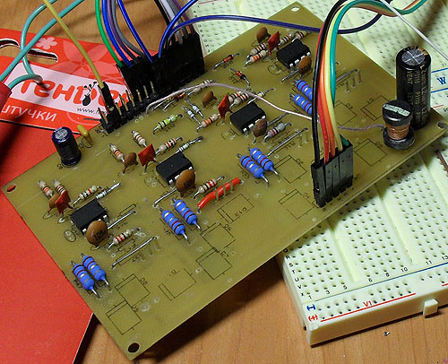

Current in each winding is controlled by a separate chip and transistor:

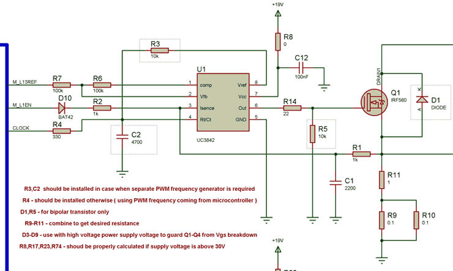

The UC3842 chip is a PWM controller for switching power supplies. It contains a PWM generator, current comparator, RS flip-flop, and MOSFET driver. In general, it is perfectly suited for these purposes 🙂

Initially, I tried to build the controller using TL494 chips. However, as it turned out, these chips are not designed for maximum current control during one PWM period. Their input current and voltage sensors must be limited by filters with a frequency of 10-15kHz.

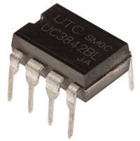

The UC3842, on the contrary, is designed to limit the maximum current through a transformer winding during one period. It turns off the transistor at the moment the set current is reached:

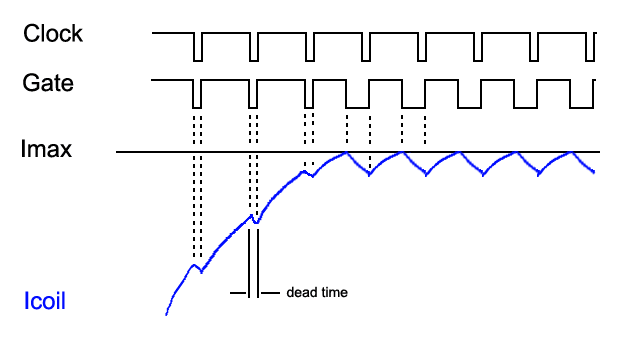

The reference voltage generated by the DAC on the control module is fed to the Comp input of the chip. At the beginning of the PWM period, the chip opens the transistor. Current in the winding begins to rise gradually. As soon as the current exceeds the set value, the chip closes the transistor.

The UC3842 measures current in the winding by the voltage drop across a current-sensing resistor. In addition to comparing with the reference voltage, the chip provides maximum current protection that disconnects the transistor when the voltage on Isense exceeds 1V. Therefore, the current-sensing resistor should be selected so that the voltage drop across it at maximum current is slightly less than 1V. The exact maximum current value is set in the firmware. The board has provisions for resistors R9-R11, which allow selecting the required resistance.

The chip contains a built-in oscillator whose frequency is set by the R3C2 chain.

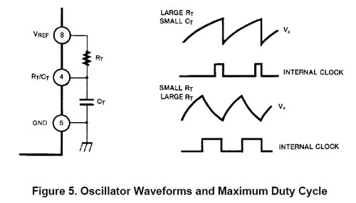

During capacitor discharge, the output transistor is closed (this is dead time). By selecting R3C2 values, you can set both the frequency and dead time. Naturally, these components should be the same for all windings.

The PWM frequency is selected individually for the motor, taking into account increased motor heating with increased frequency.

To avoid installing additional components, you can use the Clock signal generated by the microcontroller. Frequency and dead time are then set in the firmware. Components R3C2 are not installed – resistor R4 is installed instead.

One DAC output generates reference voltage for a pair of windings (only one of which can be enabled at any given time). Therefore, the control module disables (with a high logic level) the paired winding using the /M_L1EN signal.

The R1C1 chain is selected to suppress the current spike that occurs when the transistor opens:

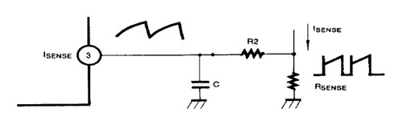

Diode D1 is installed optionally. The built-in diodes in the MOSFET were sufficient for me.

When transistors are turned off, back-EMF spikes occur, with voltage spikes on Drain-Source of transistors potentially exceeding the supply voltage by 3 times: supply – 19V, DSHI-200:

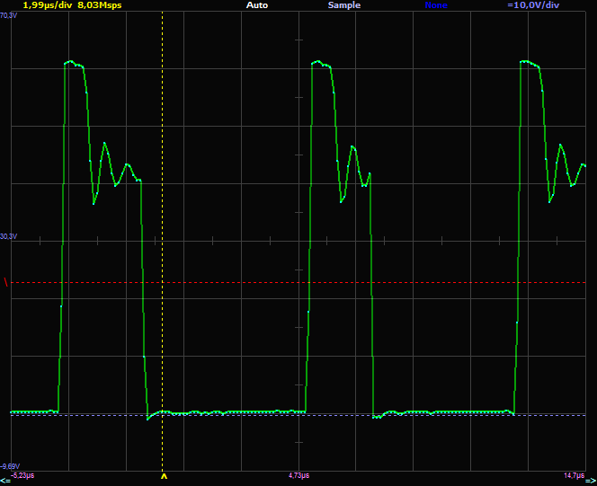

Classically, these spikes are suppressed by shunting diodes installed on the windings, or diverted to the power supply. However, it should be noted that a shunted winding brakes the motor and does not allow achieving high rotation speeds. Therefore, spikes should only be suppressed when exceeding the limit value, which is ensured by connecting a zener diode in opposition to the diode:

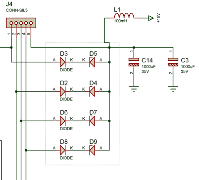

It is preferable to simply choose transistors with a sufficiently large Vdss. I used IRF540N (Vdss = 100V) for the DSHI-200 motor and IRFZ44N (Vdss = 55V) for motors from printers.

Recall that Vdss is the voltage between Drain and Source at which the transistor spontaneously turns on. In practice, this causes incorrect controller operation, transistor heating at relatively low currents through them, or transistor failure. For motors up to 3A, MOSFETs should be cold; heatsinks are not installed on them.

## Power Supply

The controller is powered by a laptop power supply of 19V 3A.

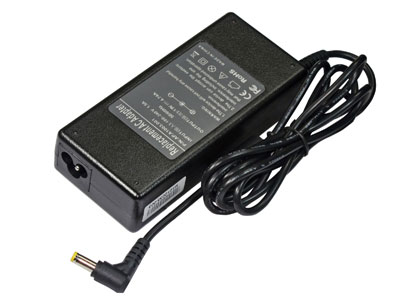

5V is obtained using a ready-made DC-DC converter module on LM2596, available on eBay:

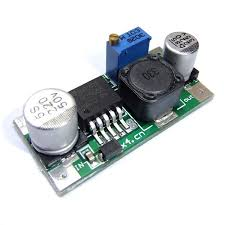

## Why Current Control is Important

In a steady state, current in the winding is determined only by the active resistance of the winding and supply voltage. But at the moment of switching, current in the winding depends on both active and reactive resistance. Therefore, instead of rectangular current pulses, we will see the following picture:

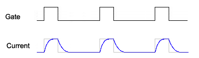

The higher the winding inductance, the longer the current rise and fall times will be. As rotation speed increases, the current will not have time to reach its maximum value, and the motor torque will begin to drop:

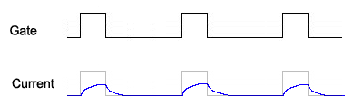

To ensure fast current rise, the supply voltage needs to be increased. But in a steady state, current in the winding is limited only by the active resistance of the winding. Therefore, current limiting when increasing supply voltage is mandatory.

Another method of increasing RPM should be mentioned. The motor supply voltage is increased, and the motor itself is switched through a powerful resistor. This reduces the proportion of reactive resistance in the winding circuit. Thus, two tasks are effectively solved at once: increasing motor RPM and heating the workshop 🙂

## Motor Operating Modes

The motor operating mode is specified in the firmware individually for each axis.

### Full Step, Full Phase (one winding)

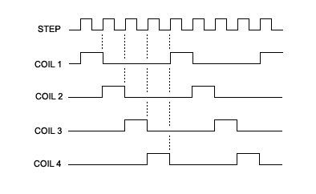

Classic mode in which one winding is enabled at any given time.

### Full Step, Half Phase

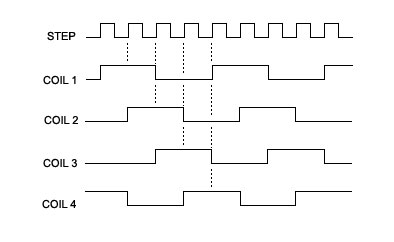

A mode in which 2 adjacent windings are enabled simultaneously. This switching can be used to increase motor torque (easily implementable but not used in current firmware).

### Half Step

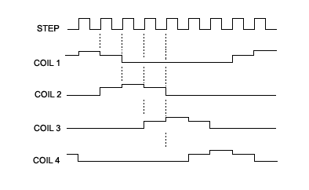

Combination of previous modes. The number of steps is doubled. When two windings are enabled, current in each is set to 0.707 * Imax.

### Microstep 4, 8, 16

If you imagine how the motor rotates in full step mode – you can notice that it moves jerkily: first it accelerates, attracted by the next winding, then brakes, reaching the final position. This causes vibrations of the shaft and the entire machine as a whole.
This is how a machine works when noise reduction was not considered during its creation:

[http://www.youtube.com/watch?v=YQvpDsHbOX8](http://www.youtube.com/watch?v=YQvpDsHbOX8)

Here everything is bad – powerful motors in full step mode, a huge resonating body made of chipboard… Just like my first machine, which had to be disassembled due to noisiness 🙂 In a residential space, noise reduction is not a whim, it is a question of whether it will be possible to use the machine at all.

To ensure smooth motor rotation, the motor must be powered with sinusoidal current. For this purpose, in stepper motor controllers, the moment of transition from one winding to another is divided into 4-16 microsteps. At each microstep, current in the first winding decreases, while in the second it increases, according to a sinusoidal law:

At the same time, the Step pulse frequency must be increased by 4-16 times respectively.

Using microstepping allows significantly reducing motor noise and obtaining higher torque at high speeds. The machine begins to "sound professional":

[http://www.youtube.com/watch?v=Xa-EOXH8j98](http://www.youtube.com/watch?v=Xa-EOXH8j98)

I personally do not consider microstepping as a method of improving positioning accuracy, because the rotor and stator construction does not guarantee uniform distribution of microsteps. Moreover, with small force, or when switching to holding mode, the motor shaft may "fall out" to full step positions.

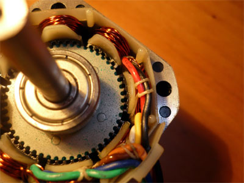

## Holding Mode

In the absence of Step pulses for ~2 seconds, the controller reduces current in the windings to values specified individually for each axis in the firmware.

## Comparison with Allegro Chip Modules

The popularity of homemade 3D printers has caused ready-made modules on A4983 chips to appear on eBay, which are quite difficult to compete with using "discrete" components. On the other hand, I felt more comfortable experimenting with a circuit where in the worst case I would have to replace switches, than with a 3×3mm chip that would explode at any mistake.

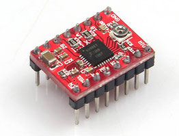

In addition, it is planned to expand the controller in the future for standalone operation from a small control panel, since composing a program every time a clean cut is required is inconvenient. And in the distant future, it may be possible to implement USB control (this is when the controller receives step descriptions from USB-UART and generates steps itself).

The described controller is equivalent to 4 such modules + optoisolation board.

Differences:
– In Allegro chips, current spikes when turning on bridge transistors are ignored for a fixed time interval – 1µs. Here, spikes are suppressed by the R1C1 chain;
– Allegro chips can enable "fast current decay mode". If on the next microstep the current in the winding should decrease, the chip briefly shunts the winding by opening bridge transistors. Introducing such capability into this (unipolar) controller would complicate the circuit too much;
– The A4983 has a maximum STEP pulse frequency of 1/2µs = 500kHz.

I tried connecting the same motor to this controller in unipolar and to A4983 in bipolar connection. Subjectively, unipolar connection gave greater torque at high speeds. Possibly due to lower winding inductance with unipolar connection.

[http://www.youtube.com/watch?v=UT1nMZGH0vg](http://www.youtube.com/watch?v=UT1nMZGH0vg)

## Printed Circuit Boards

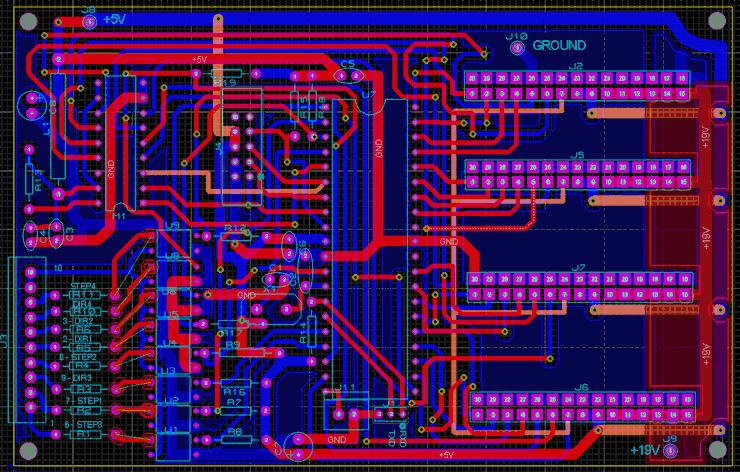

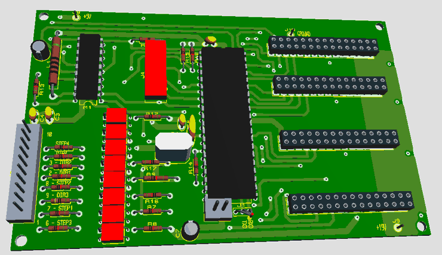

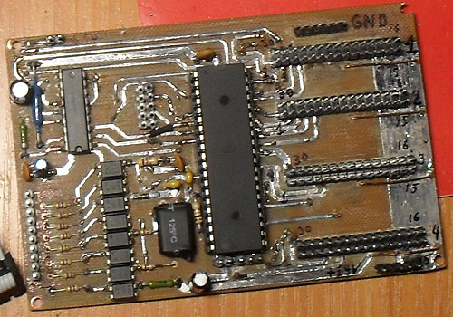

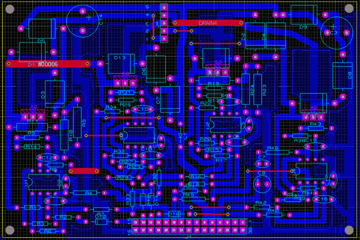

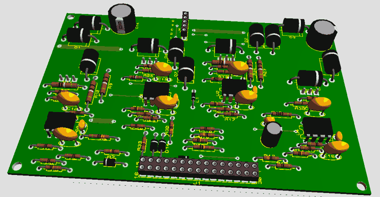

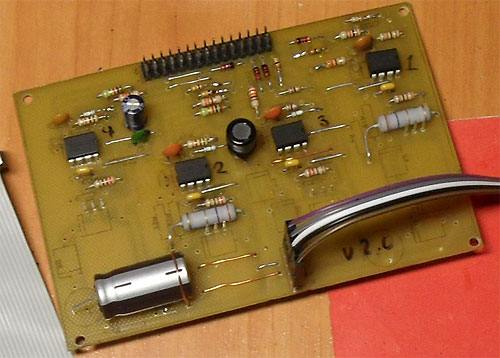

## Firmware, Fuses

The firmware is written in C for CodevisionAVR 2.05.

With great desire, the main loop can be rewritten in assembly and increase the maximum Step pulse frequency to ~20kHz.

When programming the microcontroller, power to the power section must be disconnected.

## Mach 3 Configuration

Ideally, the control program should be able to generate Step pulses exactly at the required frequency. In practice, in Mach3 and similar programs, the driver operates at a fixed frequency (Kernel speed):

Therefore, Mach3 can only generate pulses at Kernel speed period boundaries. For example, if it is necessary to generate pulses at 16kHz (period – 62.5 µs) with a kernel frequency of 25kHz (period – 40µs), the pulses will be uneven – with periods that are multiples of 40 µs:

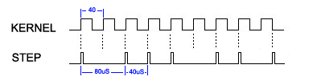

From the oscillogram at the optocoupler output, it can be seen that the recovery time for confident "1" reading by the microcontroller is approximately 50µs. After that, "one" must be held for one program cycle (26µs), totaling ~76µs. Therefore, at a kernel frequency of 25kHz, the maximum Step pulse frequency should not exceed 12500Hz, so that there are at least two periods of 40 µs between pulses.

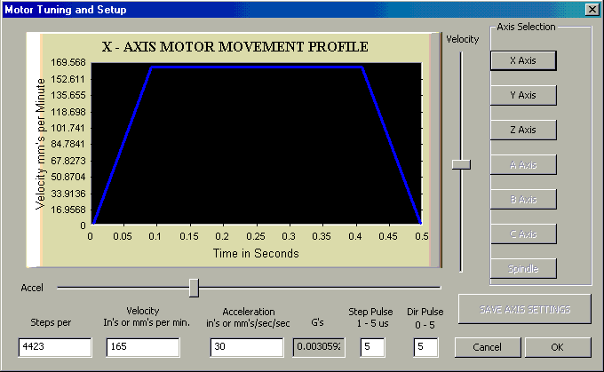

For this, the following condition must be met:

*Steps per * Velocity / 60 < 12500*

Step pulse polarity is set to positive:

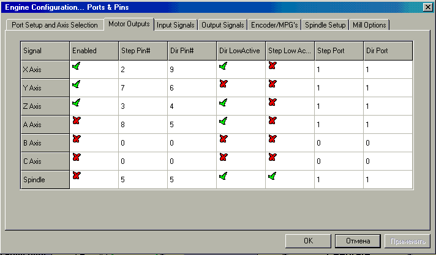

## Oscillograms

Voltage across current-sensing resistor, low and medium rotation speed (microstep 8x):

(should be close to abs(sin(x))).

Voltage across current-sensing resistor, high rotation speed:

## Construction Replication/Disadvantages/Improvements

Communication with the M62359 chip occurs at a frequency exceeding that declared in the datasheet, so it is desirable to replace it with something faster. In practice, I have not observed any problems in controller operation. I successfully mill printed circuit boards, processing of which includes hatching the entire board with 0.3mm pitch:

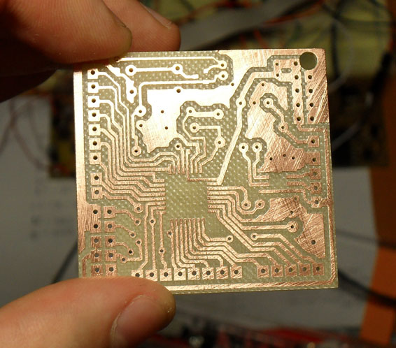

The power section boards were routed "for all occasions". It may make sense to remove mounting locations for optional components and reduce dimensions. Or make the entire controller on one large board in SMD version.

The power boards were planned to be inserted into the control module vertically, like into a computer motherboard, but in the end I made them on ribbon cables. Because of this, the cables had to be crimped with an offset. If I were doing it from the beginning – I would route for ready-made cables from floppy drives.

The controller was not tested with currents greater than 2A – perhaps more attention should be paid to routing.

The motor supply voltage can be raised up to 60V. In this case, transistors with a larger Vdss must be installed and resistor R8 in the UC3842 power supply circuit must be selected (the chip contains an internal zener diode at 30V). The supply voltage cannot be raised infinitely, because breakdown in the motor windings can occur.

I immediately want to warn that an oscilloscope is absolutely necessary for controller tuning. Without it, understanding what is happening in the windings will be impossible.

## Source Codes

Source codes (Codevision AVR 2.05)
[CNCController2_src.zip](CNCController2_src.zip)

Schematic, PCBs
[CNCContoller2_schematics.zip](CNCContoller2_schematics.zip)

## Materials

UC3842 CURRENT MODE PWM CONTROLLER
[http://www.ti.com/lit/ds/symlink/uc3842.pdf](http://www.ti.com/lit/ds/symlink/uc3842.pdf)

DMOS Microstepping Driver with Translator A4983
[http://www.allegromicro.com/~/media/Files/Datasheets/A4983-Datasheet.ashx](http://www.allegromicro.com/~/media/Files/Datasheets/A4983-Datasheet.ashx)

Accelerating Stepper Motors
[http://vri-cnc.ru/modules.php?name=News&file=article&sid=22](http://vri-cnc.ru/modules.php?name=News&file=article&sid=22)

Accelerating Stepper Motors 2
[http://vri-cnc.ru/modules.php?name=News&file=article&sid=4&mode=&order=0&thold=0](http://vri-cnc.ru/modules.php?name=News&file=article&sid=4&mode=&order=0&thold=0)

Losing steps in Mach3: Kernel Speed, Pulse Width and "Sherline 1/2 Pulse mode"
[http://ivan.blogs.chimerical.com.au/post/2010/07/07/Losing-steps-in-Mach3-Kernel-Speed-Pulse-Width-and-Sherline-12-Pulse-mode.aspx](http://ivan.blogs.chimerical.com.au/post/2010/07/07/Losing-steps-in-Mach3-Kernel-Speed-Pulse-Width-and-Sherline-12-Pulse-mode.aspx)

Electronics and Mechanics of a Homemade 3-Coordinate CNC Machine (Hobby CNC).
[http://radiokot.ru/lab/hardwork/33/](http://radiokot.ru/lab/hardwork/33/)

hCNC3+ (ATMega16, Step\Dir, 3 axis, PWM, manual control).
[http://vri-cnc.ru/modules.php?name=Forums&file=viewtopic&t=1438&start=0&postdays=0&postorder=asc&highlight=](http://vri-cnc.ru/modules.php?name=Forums&file=viewtopic&t=1438&start=0&postdays=0&postorder=asc&highlight=)

Simple Bipolar Driver on PIC
[http://cncmasterkit.ru/viewtopic.php?f=3&t=1393](http://cncmasterkit.ru/viewtopic.php?f=3&t=1393)

Microstepping Stepper Motor Controller Based on PIC18F2320 V4.1
[http://robozone.su/cnc-home/50-mikroshagovyjj-kontroller-shagovogo-dvigatelja-na.html](http://robozone.su/cnc-home/50-mikroshagovyjj-kontroller-shagovogo-dvigatelja-na.html)

STEP/DIR Controller for 3 Stepper Motors on Microcontroller (for CNC Machine)
[http://radiokot.ru/circuit/digital/automat/25/](http://radiokot.ru/circuit/digital/automat/25/)

3 axis STEP-DIR controller
[3_axis_STEP-DIR_controller.md](/?start=2&folder=CNC%2F2013-09_4_axis_Step-Dir_%D0%BA%D0%BE%D0%BD%D1%82%D1%80%D0%BE%D0%BB%D0%BB%D0%B5%D1%80_%D1%88%D0%B0%D0%B3%D0%BE%D0%B2%D1%8B%D1%85_%D0%B4%D0%B2%D0%B8%D0%B3%D0%B0%D1%82%D0%B5%D0%BB%D0%B5%D0%B9_2&file=CNC%2F2008-06_3_axis_STEP_DIR_controller%2F3_axis_STEP-DIR_controller.md)