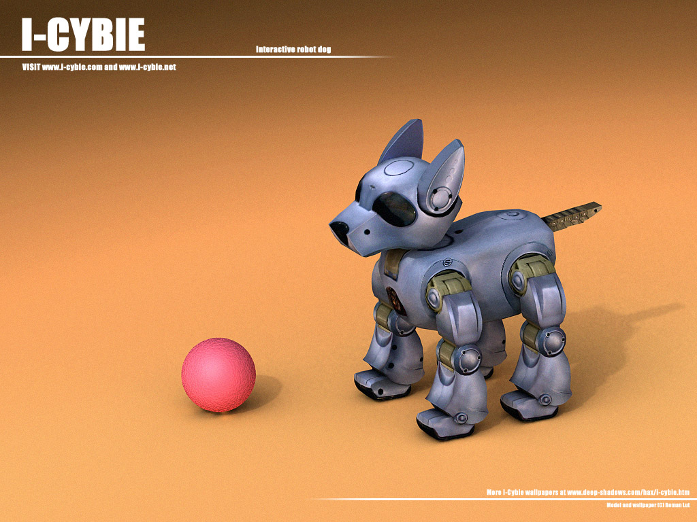
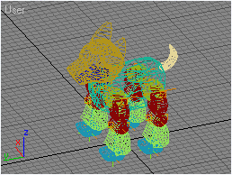
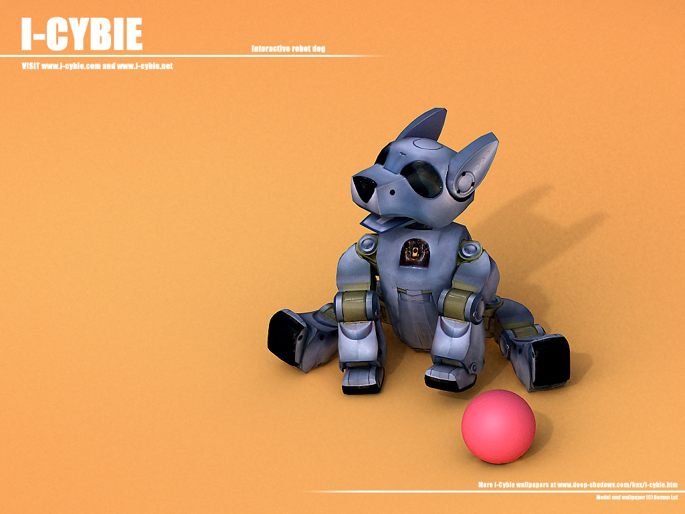
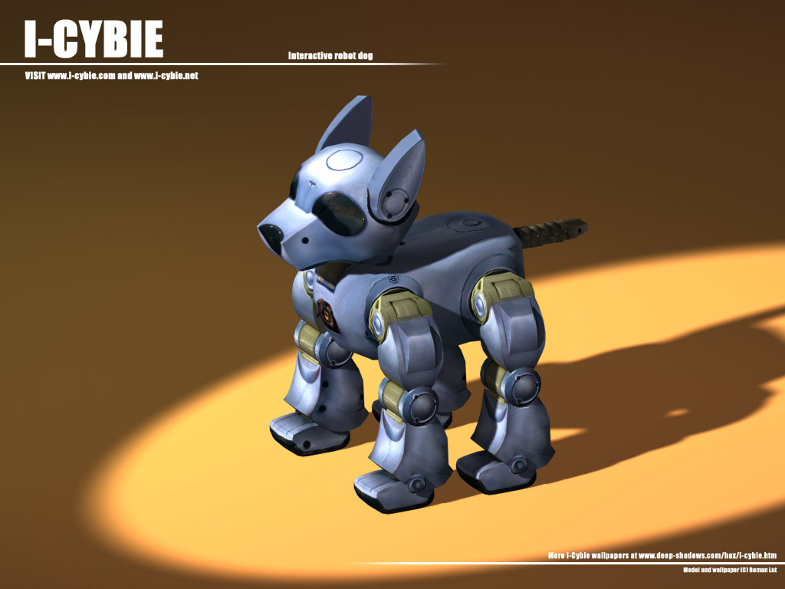

# I-Cybie

I was very surprised when I first saw this cute toy in a store. Being a toy, at the same time it is an intergal of lastest advanced technologies. The most good news was that it appeared to be low cost, and very talented peson ICybiePet already reverce-engeneered this robot and made SDK.

**Date:** 2004
**Platform:** I-Cybie 🙂
**Language:** C, asm

### About I-Cybie

I-Cybie is wondefull robot toy. It has 16bit CPU, 8K RAM, 256+256K ROM, 16 motors, a lot of sensors, voice recognition chip and other features. A lot of people say that it is a younger brother of a famous Aibo.

This toy was originaly developed by SilverlIt toys in 2001. Unfortunately for various reasons it did not have commecial success. I-Cybies are not produced now, but anyway still can be bought.

Some time after I-Cybie release, ICybiePet reverce-engeneered this toy, and a Super I-Cubie and SDK have appeared.

At present time SDK is at 2.0 version and does include all functions needed for experiments with this low-cost robotic platform.

### Step 1. My SIC upgrade

In order to start programming I-Cybie, one has to solder RS-232 interface.

Using descriptions from [Aibohack](http://www.aibohack.com/icybie/index.html) site, I sucessfully did Super I-Cybie upgrade. It was really hard – I had a rev D board with extremely small pins.

As a result, I've got a small robot which can be programmed with a C language.

### Goals

What I wanted to achieve as a result of I-Cybie programming was a fully autonomous robot with smooth animation, intelligent house navigation and immediate feedback interactivity.

Standart ROM lacks all this features and present only basic behaviour, which became boring after a very short time.

### Step2. 3D model for experiments

I did a 3D model of I-Cybie for my experiments. It is available in Download section below (3ds MAX 5.1 format).

Model has IK and custom attributes setup ready for animation (use custom attributes of "body" object to controll head, neck and tail).

As a side effect, I spent some time creating I-Cybie wallpapers and have done several variants of them. They all are available in Download section too.

### Step 3. Creating new animation

[Video: Animation in original ROM](https://www.youtube.com/watch?v=4bMwyOmIxLc)

*Animation in original ROM*

What I do not like in animation from original ROM is its sequental structure. Sometimes dog moves only single leg from one position to another, while it could do a lot of movements simulaneously to produce much more smooth and realistic animation.

The problem with robot animation is that it is different from games. In 3DS Max you can position body as you want, even in the air, but this obvious will not work when you download animation to the real robot.

Another problem is that limb positioning is extremely not precise. This can cause a lot of problems.

There was an idea is to create animation player with physical simulation engine to test new animation without downloading it to the real robot.

### Results

19/10/2004 I have got first results in downloading animation from 3DS MAX to robot.

Unfortunatelly I must conclude that it is not possible to achieve what I want on this hardware.

I modified SDK and implemented PID Control algorithm for leg servos, but animation still sucks. Angle sensors are too impresise; motor speed is dependent on number of motors running (battery load).

Also sensons available in robor would not allow to build responsive behaviour.

Considering all this, I stopped this project.

### Download

[3DS Max model of I-Cybie here](i-cybie_max.zip)
[I-Cybie wallpapers pack here](i-cybie_wallp.zip)

 
