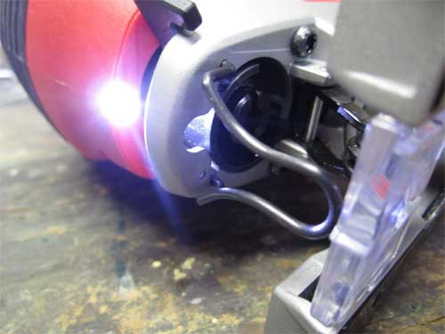
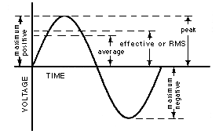
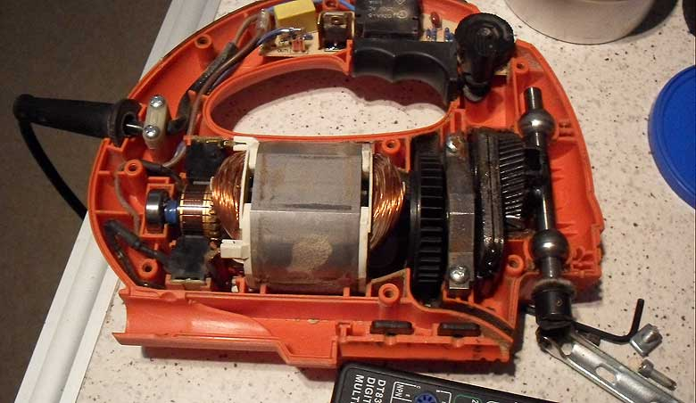
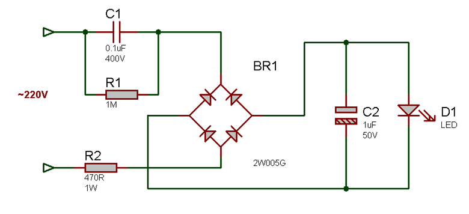
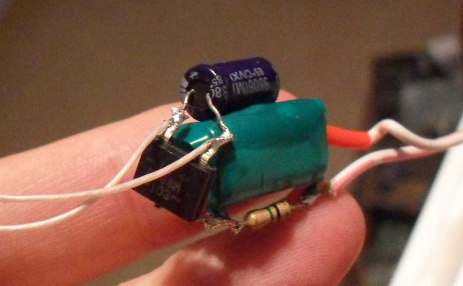
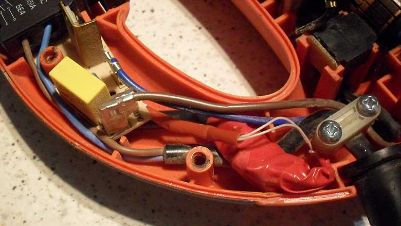
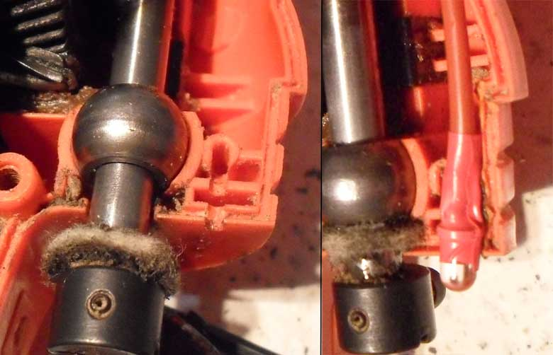
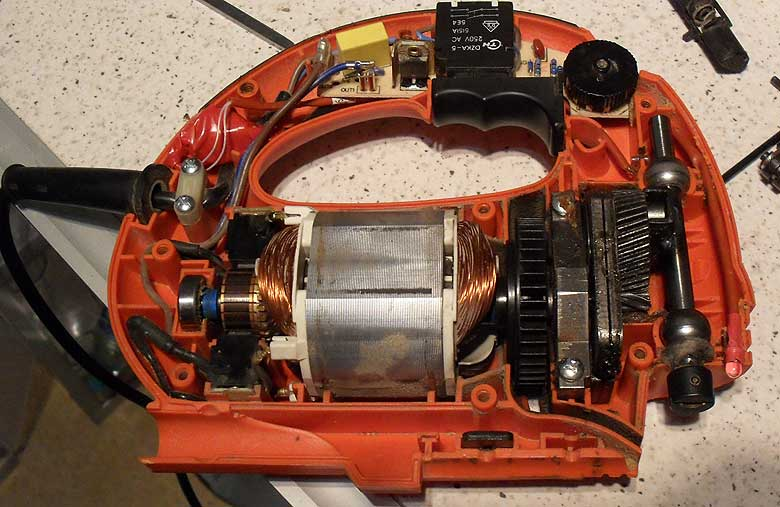
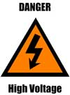

# Adding LED light to jigsaw

Good lighting is essential to make precise cut. Unfortunately I overlooked this when I chose jigsaw model to buy. Jigsaw I bought did not have LED light which currently can be seen on some models.

As I rarely had good lighting when I need to cut something, I decided to modify my jigsaw and add LED light myself.

Typical solution to power LED is to use 5-10V power supply and resistor.

Unfortunately there is no space inside jigsaw for power supply. We have to power LED from 220V directly.

Naive solution would be to use current limiting resistor with value calculated for 220V:

( 220V-2.5V ) / 0.02A = ~10kOhm

where 220V is power socket voltage, 2.5V is voltage drop on LED, 0.02A is LED current.

1. There are four problems.

220V is Root Square Mean voltage ( RMS ). Peak voltage in power socket is:

220V*sqrt(2) = ~311V.

2. Under negative phase of AC voltage, ~311V will be applied to LED, which will kill it very quickly.

3. The power dispassion on 10kOhm resistor is:

10000Ohm * 0.02A^2 = ~4W

which is quate a lot.

4. Led will pulse with power socket frequency ( 50Hz ). While it is not noticeable in generic conditions, it will introduce unwanted stroboscope effect on jissaw blade.

While it is still possible to use simple resistor-LED schematics by calculating resistance for peak voltage and adding inverted diode or another LED in parallel to first LED, I would prefer using capacitor instead of resistor. Capacitor can limit current with reactance without power dispassion.

The resistance of capacitor in AC schematics is:

Хс = 1 / ( 2 * 3,14 * 50 * С ) = 0,0032/С

where Xc is capacitor reactance in Ohms, 50 is frequency in Hz, C is capacitance in Farades.

In order to avoid pulsing and remove large negative voltage from LED, I added diode bridge and electrolitic capacitor.

Assuming 311V and 0.02A, the resistance is:

(311V – 2.5V ) / 0.02A = ~16,5kOhm

The capacitance is:

0.0032 / 16500 Ohms = ~ 2mF.

In my case, I took 0.1mf capacitor with lower physical sise because LED has enough brightness even under 1mA.

Also it is good practice to add resistor with resistance of 10% of capacitor. This purpose is to limit current on power on/off.

This final schematic is shown below.

C1 has to have voltage at least 400V. Voltage applied to C2 will always be 2.5V, unless LED brake. In this case capacitor can explode…

R1 is required to discharge capacitor after power off.

I took diode bridge from broken power supply:

Whole shematic has been covered with isolated type and paced inside jigsaw body.

### Take caution!

>Make sure wires do not touch any metallic surfaces in jigsaw. Make sure Wires has good isolation and will not be damaged by moving parts. All schematic is under high voltage.
