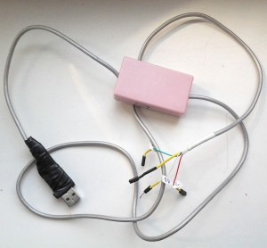
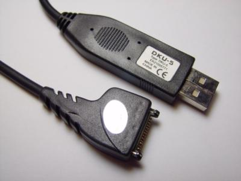
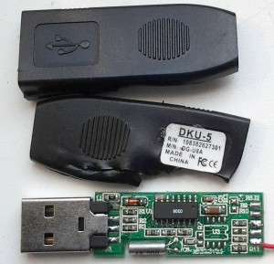
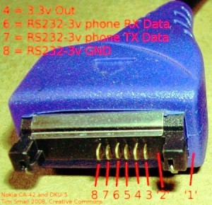
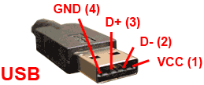
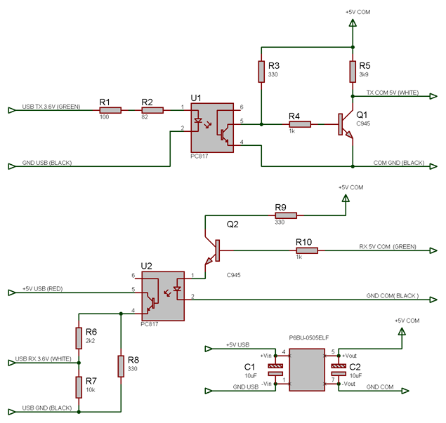

# USB to RS232 TLL Optoisolated

I need RS232 port to connect my devices to notebook. While cheap USB2RS232 converters are available, I do not dare to connect my experimental devices directly to expensive notebook. So I built a small optoisolated USB to RS232 converter with TTL output levels, based on DKU-5 cable for Nokia phones.

## DCU-5

DCU-5 cable for Nokia phone is ready for use USB to RS232 converter with 3.6V output levels. This cable is very cheap, even cheaper than FT232 chip alone, so using it for converter is the best option. CA-42 cable can be used also.

 

Cables which are sold are based on different chips. You will have to disassemble usb connector, find and solder  RX,TX, and GND pins.

Beware of very cheap cables: I had a bad luck with the cable on picture above. It seems to be built on some microcontroller which emulates very old revision of pl2303 chip. Diode is used to power microcontroller from 5V with 0.3V voltage drop. Output levels are 4.2V which actually might damage the phone. It requires very old revision of drivers from prolific. The worst thing is that it can't pass loopback test even on 9600Bps. I had to throw it away.

+5V is taken from USB connector.

I used PC817 optocouplers because I had a lot of them. These optocouplers are slow. The maximum speed which can be achieved is 19200Bps. This is enough for communications with AVR devices. If you need 115200+, you can use H11L1.

I also added DC-DC isolated converter to power small devices directly from USB port ( 200 mA max). Please note, that P6BU* chips do not output stable 5V despite description in datasheet. Output voltage can vary between 4.5V…5.5V. Adding a diode with 0.6V voltage drop may be required to protect AVR devices.
