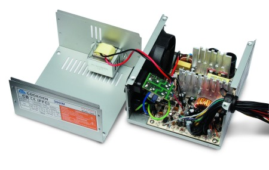
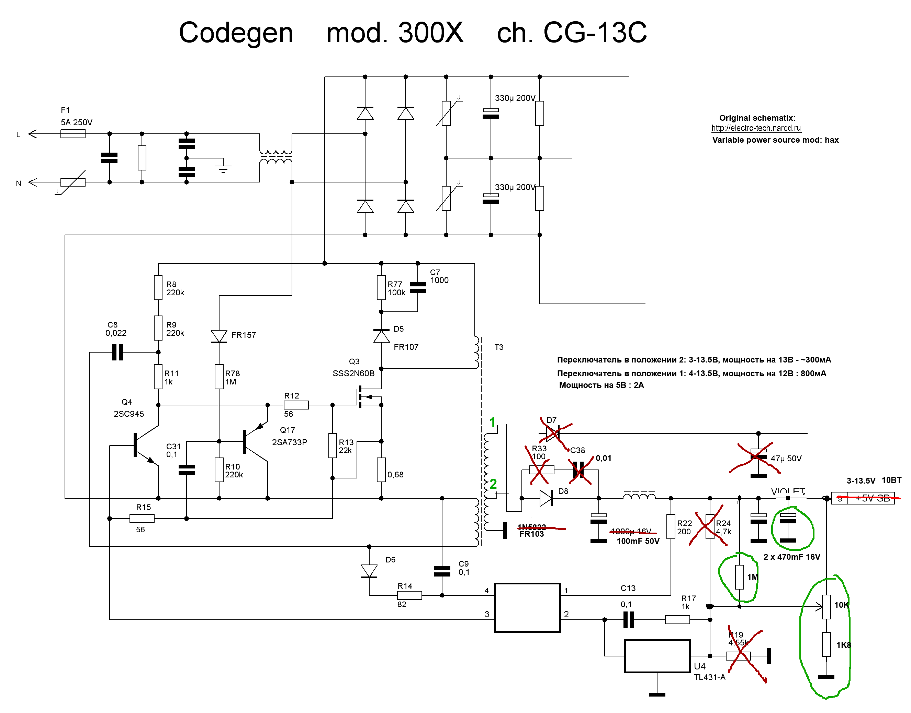
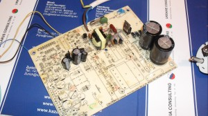
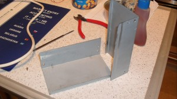
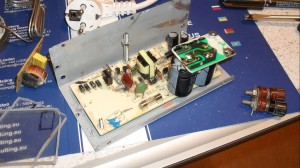
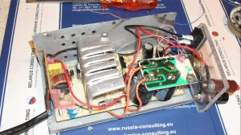
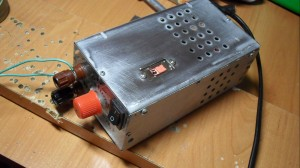
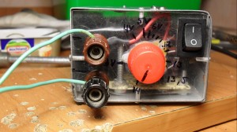

# Regulated power source from ATX PSU

## Regulated power source from standby part of computer ATX power source

Computer ATX power source consists from two parts: small standby 5V power supply wich is always enabled, and main power supply. Standby power source can provide up to 10W of power( 5V, 2A ). If main power supply is dead, than standby power supply can be used to build a small regulated power source.

First step is to desolder all components of main part. In order to make it regulated, variable resistor should be added as shown on the schematic.

The transformer has two output coils: one for 5V and one for 12V. Second can provide only 300mA, but it is more stable on higher voltages. In final design I added switch to select coil.

I made cover from original power source cover.

 

I cut board in a half and placed capacitors on top. A smaller capacitors can be used, because output power is much smaller then in original power supply.

 

Final power source can regulate output voltage between 3.3V – 14.4V. Maximum output power is 10W. There is small voltage drop (<0.5V) under load on voltages > 10V. The output voltage in stable on 5V.

Power source does not have short circuit protection, but maximum current protection only. It may overheat if short circuit is applied continuously.

### Precautions

Part of the power suply is under 220V voltage. Please think twise before doing anything!

Make sure there is an isolation between transistor and cooler. This part is under 220V voltage.

Capacitors may stay charged 220V after disconnection from power socket.

Do measure resitance between power source cover and both power socket pins before plugging in!

Do measure resitance between output pins and both power socket pins before plugging in!