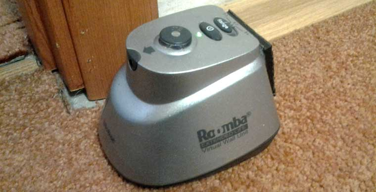
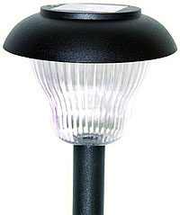
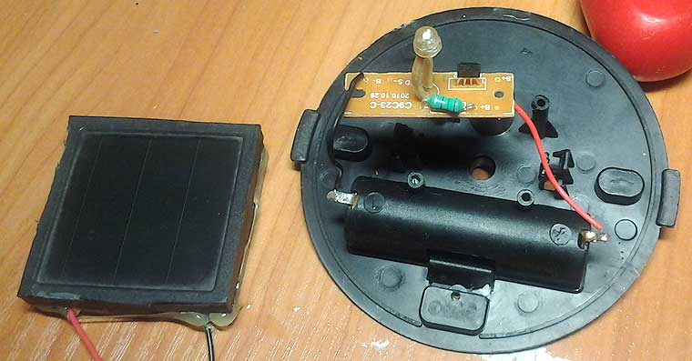
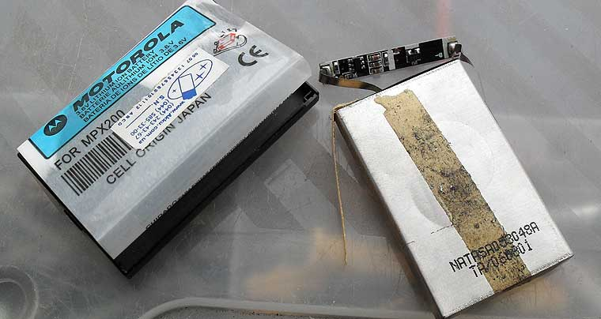
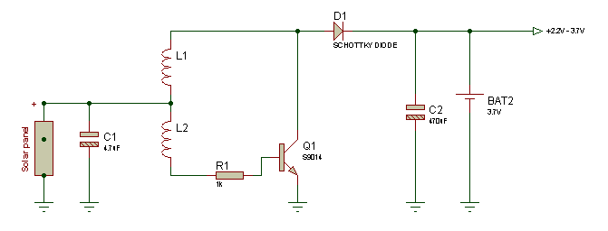
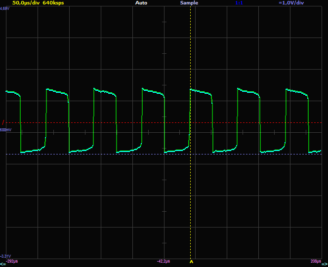
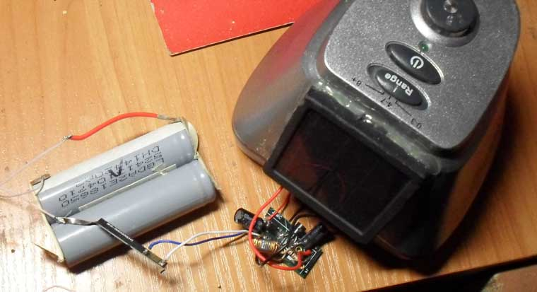
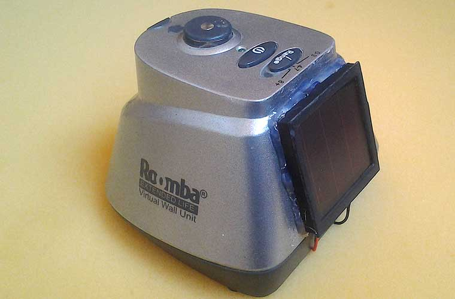

# Roomba Virtual Wall mod

I have two Roomba Virtual wall units which are using "D" size batteries.

Unfortunately this type of batteries are not common. I am using AA and AAA rechargeable batteries everywhere for a long time.

First though was to convert battery slots for AA type, but I got better idea how to have wall unit always operational when I need it.

Cheap garden lamp contains 1.5V solar battery, one AA rechargeable battery, white LED and a special qx5252 chips which is boost-up converter to power 2.5V LED from 1.5V battery.

The most interesting part is solar battery, which can provide up to 10mA at 2V.

First idea was to use qx5252 to power Virtual wall unit from single AA rechargeable battery, but this appeared to be too inefficient because there is no way to turn on and off boost up converter reliably – it's logic is controlled by current coming from solar battery.

So I took 3.7 Li-Ion rechargeable battery (actually two ones connected in parallel) extracted from old notebook battery.

Li-Ion battery should not be over-discharged or overcharged. The protection circuit can be extracted from any used mobile phone battery. I took one from Motorolla MPX 200 battery.

The purpose of circuit is to prevent discharge lower then 2.2V, and overcharge higher then 4.2V.
Actually, new mobile phone battery can be used in this mod.

Li-Ion batteries require special circuit for charging. Incorrect charging can heat up the battery and it may explode. However, with such small current which we can get from solar battery, this will newer happen.

So very simple schematics will work fine. Charging with low current will kill battery eventually, but this is just a small stop on the way to trash bin for battery anyway.

An output from solar battery is 1.5-2V. In order to charge 3.7V battery, a one-transistor boost-up converter can be used. Coil is wired on ferrite beard extracted from broken lamp, it has 10 + 20 turns.

Boost up converter produces output 2.5-4V. A low voltage drop schottky diode should be used. The width of pulses depend on lighting conditions – more light results in 50% ratio with higher frequency.

*Voltage on collector*

Power consumption of virtual wall unit depends on distance settings.
- 8+ – power consumption = 70mA
- 4-7 – 30mA

Solar battery with boost up converter can produce max 10 ma as seen from experiments, and can charge battery up to 3.5V max.

So to work for 1 hour in 4-7 mode, virtual wall unit has to be charged at least for 4 hours.
This is acceptable as long as Roomba is not used to clean every day.

