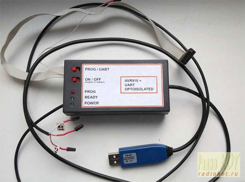
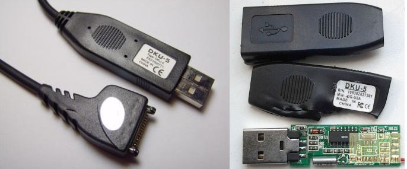
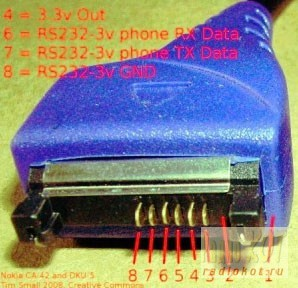
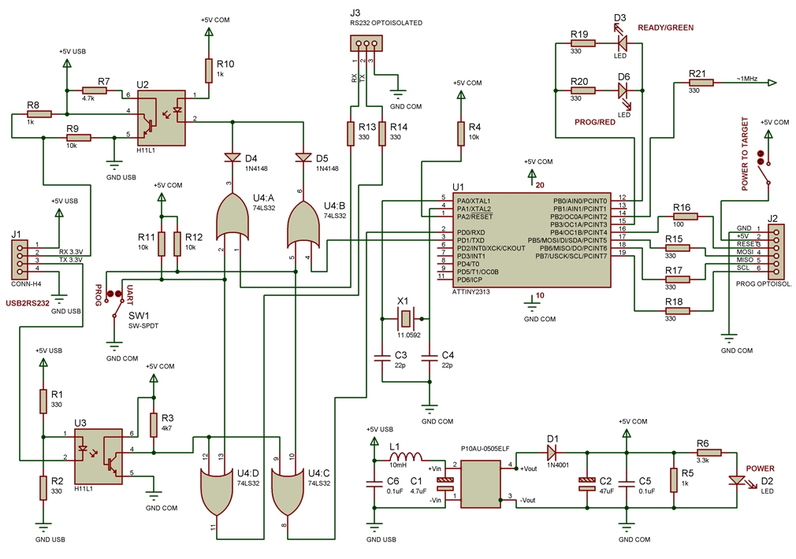

# USB программатор AVR910 с опторазвязкой

> Статья опубликована на сайте [Радиокот](http://radiokot.ru/circuit/digital/pcmod/46/) 09.04.2013.

С окончательным переходом с десктопов на ноутбуки, у меня появилась острая необходимость в программаторе AVR с USB интерфейсом.

Поэкспериментировав с программатором [Prottoss](https://prottoss.com/projects/AVR910.usb.prog/avr910_usb_programmer.htm), я обнаружил, что устройства с программной эмуляцией USB являются USB low-speed device, максимальная скорость передачи которых составляет 800 байт/сек, что приводит к низкой скорости прошивки. Правда, если повезёт, то программатор может заработать и со скоростью до 5кб/сек на USB хостах, которые не придерживаются стандарта. Но мне не повезло.

Кроме того, обязательным требованием для меня является гальваническая развязка. Стрёмно подключать к новому ноутбуку устройства, в которых может быть, скажем, 40В! Где-то проводок не так ляжет на breadboard - и всё... Всё-таки пару оптронов проще поменять, чем материнку.

С этим программатором пришлось бы ставить либо дорогостоящую гальваническую развязку на USB интерфейс (ADUM 4160), либо развязывать 5 линий SPI интерфейса.

Гораздо проще развязать 2 линии RS232 интерфейса! Поэтому за основу был взят [RS232 программатор на ATTINY2313](https://www.klaus-leidinger.de/mp/), а в качестве преобразователя USB->RS232 - кабель DKU-5 (он же CA-42) от Нокия.

Этот кабель стоит $5 (практически по цене FT232RL), идёт в собранном виде с разъемом, корпусом и кабелем, и для него есть драйвера для всех версий Windows, включая x64. На выходе кабеля - логические уровни 3.3V. Сам кабель в китайском исполнении собран на каком-то микроконтроллере, который эмулирует чипы Prolific ранних ревизий.

Для развязки использованы высокоскоростные оптроны H11L1, чтобы достичь скорости обмена 115200 бод. Проведённые эксперименты показали, что более медленные PC817 не позволяют достичь скорости выше 19200.

Программатор питается от USB порта. Для развязки применяется изолированный DC-DC преобразователь P10AU-0505ELF. Замечу, что, вопреки даташиту, выходное напряжение преобразователя не стабилизируется и составляет 5.6V без нагрузки, поэтому для снижения напряжения до 4.8V установлен диод D1. В программаторе есть возможность запитать программируемое устройство (4.5V-4.8V, максимум 400mA - предел DC-DC преобразователя).

Поскольку программатор содержит полноценный опторазвязанный USB to RS232-TTL преобразователь, я решил добавить переключатель в режим RS232-TTL, чтобы общаться с AVR устройствами через программатор. Микросхема 74LS32 используется для того, чтобы можно было поставить переключатель с одной группой контактов. Можно обойтись и без неё.

Скорость обмена на 115200 бод составляет ~30Кб/сек, но реальная скорость программирования зависит от ПО. AVRProg позволяет прошить ATMega8 меньше чем за 5 сек, а CVAVR требует 10.

Устройство собрано на макетке.

Прошивка взята с вышеуказанного сайта и модифицирована, чтобы получить ~1Mhz меандр на выводе PB2, который можно использовать для тактирования контроллера, если случайно прошили неправильные фьюзы и включили отсутствующий внешний кварц.

Можно использовать кварцевый резонатор с другой частотой, но тогда нужно раскомментировать соответствующую секцию в прошивке.

[Прошивка и схема в Proteus](https://www.deep-shadows.com/hax/wordpress/?page_id=793)
