# hxESRMeter

The article was published on [radiokot.ru](http://radiokot.ru/circuit/digital/measure/93/)

[https://www.youtube.com/watch?v=hMJI921-XLo](https://www.youtube.com/watch?v=hMJI921-XLo)

## Device Description

The device is designed for measuring capacitance, inductance, resistance, and ESR of electrolytic capacitors.

ESR can be measured in-circuit.

The device is intended for hobbyist use and does not claim high measurement accuracy. In hobbyist practice, it is usually sufficient to know the approximate value of a parameter in order to assemble a circuit. The measurement accuracy in the table below is approximate, based on measuring known components whose parameter tolerance is typically up to 10%.

**Table. Measurement Ranges and Accuracy**

| Parameter | Measurement Range | Accuracy |
|----------|-------------------|----------|
| Resistance | 1Ω – 2MΩ | better than 10% in the range up to 400K, better than 20% in the range 400K–2MΩ |
| Capacitance | 1pF – 3μF | better than 10% |
| Inductance | 1μH – 100mH | better than 10% |
| ESR | 0.01Ω – 10Ω | better than 20% |

The front panel of the device features an LCD display (8 digits), a connector for R/L/C measurement, a connector for ESR measurement, and a zero adjustment button. Mode switching buttons are located on the side panel. As an alternative, ESR can be measured in-circuit using test probes routed to the top panel.

A DLink DI-524 router enclosure was used as the case.

## Operating Principle

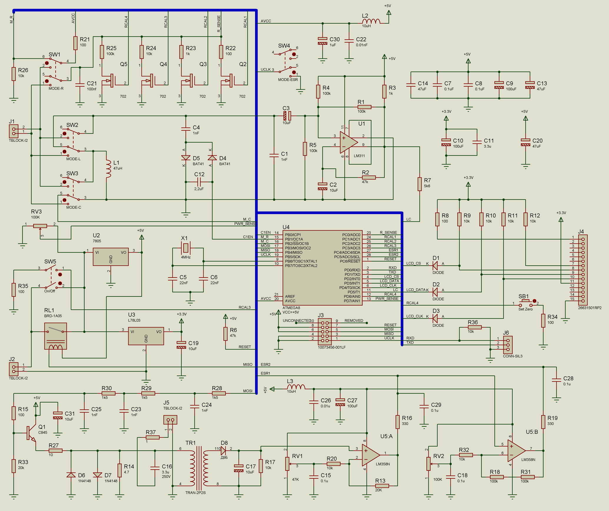

### Measuring Resistance

To measure the resistance of a component, it is connected in series with known resistors. The circuit contains 4 known resistors (R22–R25) for different ranges, which are connected one at a time by the microcontroller.

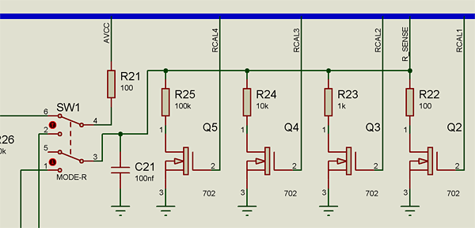

Due to circuit design specifics, a resistor R21 (100 Ω) is connected in series with the resistor under test to prevent short circuits when switching SW1–SW4.

2N7002 transistors desoldered from a motherboard are used as switches.

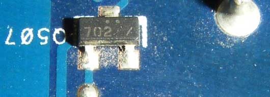

Filtered supply voltage (Uavcc, 5V) is applied to the chain (R21 + Rx + Rcal), and the voltage drop across the resistor Rcal (Usence) is measured.

Rx = Rcal * Uavcc / Usence – Rcal – R21

The measurement that yields the best accuracy is selected from all readings. To achieve this, the device computes a simplified derivative of the function above. Given that the ADC resolution is 1024 steps, it is sufficient to compute the change in Rx when Usence increases by Uavcc/1024. The value with the smallest change is taken as the most accurate.

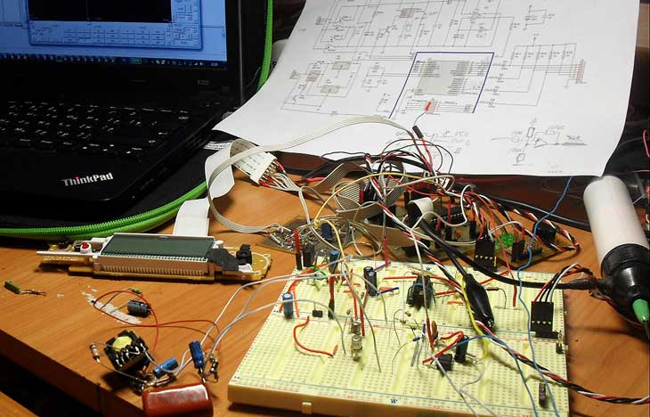

### Measuring Capacitance

Capacitance measurement is based on measuring the oscillation frequency of an LC circuit. The unknown capacitance is connected in parallel with a known inductance L1 and capacitance C1.

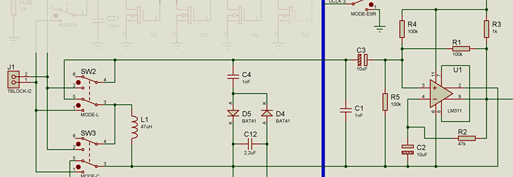

The natural frequency of the resonant circuit is calculated as:

F = 1/ (2 * pi * sqrt ( L * C ) )

Component parameter tolerances can significantly alter the oscillation frequency, so direct frequency measurement cannot yield reliable results.
The device calibrates measurement parameters using components L1, C1, and C4.

To do this, the device measures the oscillation frequencies of the L1C1 and L1(C1+C4) resonant circuits: The D4D5C12 chain allows connecting capacitor C4 to the resonant circuit by changing the potential on the C1EN pin of the microcontroller.

Only the calibration capacitor C4 requires high precision.

Oscillation frequency of the L1C1 resonant circuit:

F1 = 1 / ( 2 * pi * sqrt( L1 * C1 ) )

Oscillation frequency of the L1( C1 + C4 ) resonant circuit:

F2 = 1 / ( 2 * pi * sqrt( L1 * ( C1 + C4 ) ) )

Oscillation frequency of the L1( C1 + Cx ) resonant circuit:

F3 = 1 / ( 2 * pi * sqrt( L1 * ( C1 + Cx ) ) )

From the equations above, we derive the value of Cx, which depends only on C4:

Cx = C4 * ( F1 / F3 )^2 / ( F1 / F2 )^2

Device calibration (measuring F1 and F2) is performed when switching to the capacitance measurement mode, so nothing should be connected to the device connector at that point. Calibration can also be re-initiated using the zero adjustment button (with an empty connector). Calibration data is stored in EEPROM.

The value of capacitor C1 does not need to exactly match the value shown in the schematic. Instead, it is sufficient to measure C1 with a known-accurate instrument and enter the capacitance value into the firmware.


### Measuring Inductance

Inductance measurement is based on the same principle as capacitance measurement. The unknown inductance is connected in series with inductance L1.

Only the calibration capacitor C4 requires high precision.

Oscillation frequency of the L1C1 resonant circuit:

F1 = 1 / ( 2 * pi * sqrt( L1 * C1 ) )

Oscillation frequency of the L1C1+C4 resonant circuit:

F2 = 1 / ( 2 * pi * sqrt( L1 * ( C1 + C4 ) ) )

Oscillation frequency of the (L1+Lx)C1 resonant circuit:

F2 = 1 / ( 2 * pi * sqrt( ( L1 + Lx ) * C1 ) )

We derive the formula for calculating Lx, which depends only on C4:

Lx = ( ( F1/F3 ) ^2 – 1 ) * ( ( F2/F3 ) ^2 – 1 ) * ( 1/C4 ) * ( 1 / ( 4 * pi^2 * F1^2 ) )

Due to circuit design specifics, calibration in inductance measurement mode is not possible — it must be performed in capacitance measurement mode. Therefore, before the very first use of the device, or to obtain more accurate results, you need to briefly switch to capacitance measurement mode. Afterward, the calibration is stored in EEPROM.

### Measuring ESR

ESR measurement is based on measuring the voltage drop across an unknown component when a 100kHz sinusoidal signal is applied. At this frequency, the reactive impedance of a capacitor is close to zero and can be ignored. The magnitude of the voltage drop reflects the active resistance of the component.

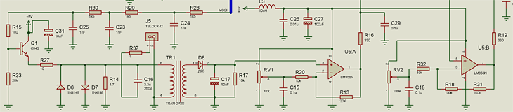

The amplitude of the applied sinusoidal signal does not exceed 80mV, which allows measuring ESR without desoldering capacitors from the circuit. At this voltage, silicon and germanium junctions do not conduct and do not affect the measurement results. However, keep in mind that low resistance does not necessarily confirm that a capacitor is healthy, since the total resistance of the circuit is being measured — for example, that of capacitors connected in parallel. On the other hand, high resistance most likely indicates a faulty component.

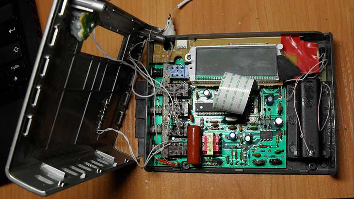

A 100kHz square wave is generated by the microcontroller on the MOSI pin and passes through the R28C24 R29C23 R30C25 filter, which retains only the 100kHz sinusoidal harmonic.

The emitter follower Q1 generates a sinusoidal current across the R27 R14 TR1-1 chain.

The R16C37Rx chain is connected in parallel with the TR1-1 winding. Thus, the resistance Rx affects the current flowing through the primary winding of TR1.

Diodes D5, D7, and capacitor C16 are used to protect the device when connecting to a circuit with charged capacitors.

Resistor R37 is needed to eliminate the parasitic influence of the resonant circuit formed by capacitor C16, the transformer winding, and the probe wires. By introducing additional resistance, we reduce the "Q factor" of the circuit and the resonance amplitude.

The voltage amplified by the transformer is rectified by the D8C17 chain and amplified by operational amplifiers U5:A and U5:B by factors of 3 and 3*21, respectively. The first value is used for measuring large resistance values (> 3 Ω), and the second — for small ones.

The device uses a WYEE-16C pulse transformer from the standby section of a Codegen-300X computer power supply, used without rewinding.

The measured resistance has a nonlinear effect on the current flowing through the TR1 winding. Additionally, the measured voltages at the output are strongly affected by the transformer and component parameter tolerances. Therefore, the device is calibrated using a set of known resistors. Calibration data is stored in EEPROM.

### Power Supply

A brief press of button SW5 applies power to the device, after which the microcontroller maintains the power supply via reed relay RL1. The device automatically shuts down after 5 minutes of inactivity if nothing is connected to the connectors, or after 15 minutes if something is connected.

To force a power-off, press and hold SW5 until the screen goes dark.

The device measures battery voltage (for low-battery indication) through resistor RV3.

The PCB and schematic are provided for a version powered by a 9V battery. In the actual device, I opted to use three AA rechargeable batteries. In this case, the 78L05 is replaced with a jumper, and stable 5V power is supplied from a boost converter built on the mc34063.

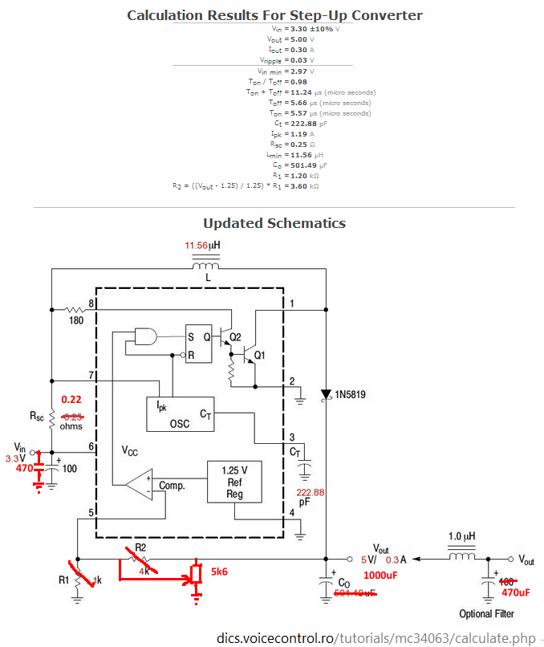

In this case, the normally-open relay contacts should be placed in the "+" line from the batteries.
It is also necessary to route the battery "+" after the relay contacts to pin 3 of RV3.

### Device Setup

Setting up the device requires an oscilloscope, an RS232-TTL cable, and a set of calibration resistors with values of 0.1 Ω (3 pcs), 0.2, 0.3, 0.6, 1.0, 2.2, 3.6, 4.7, 6.6, and 10 Ω.

#### Setting Up Resistance Measurement

Setting up resistance measurement comes down to verifying the presence of the RCAL1–RCAL4 switching pulses.

Resistors R21–R25 require high precision, but their exact resistance does not need to match the values shown in the schematic. Instead, it is sufficient to measure the actual resistors with a known-accurate instrument and enter the measured resistance values into the firmware.

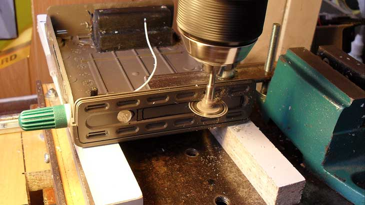

#### Setting Up Capacitance Measurement

Verify that there is a square wave at the output of IC U1, whose frequency varies depending on the connected capacitance.

#### Setting Up Inductance Measurement

Verify that there is a square wave at the output of IC U1, whose frequency varies depending on the connected inductance.

#### Setting Up ESR Measurement

Setting up the ESR mode is the most complex.

9. Connect the RS232-TTL cable to connector J6.

1. Switch SW4 to the "On" position. Pin 19 of U4 is set to "0", and the device enters "ESR" mode. The terminal displays the following lines:

```
MODEESR: ….
```

2. Use an oscilloscope to verify the presence of 100kHz square wave pulses on pin 17 of U4 (0.5-second bursts with 1-second pauses).

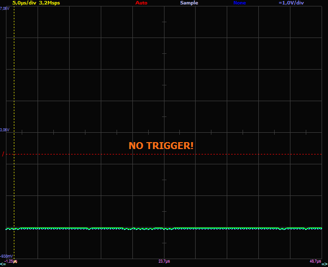

3. After passing through the R28C24 R29C23 R30C25 filter, the pulses are converted into a near-sinusoidal waveform.

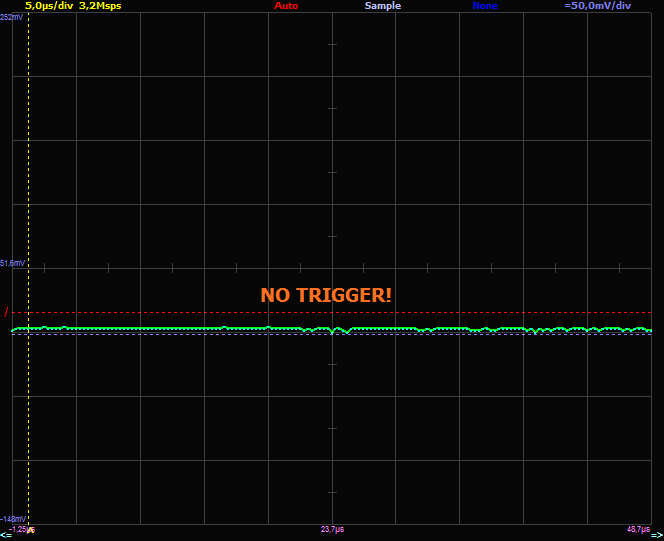

The signal is then applied to the base of transistor Q1 through the R15R33 voltage divider, which should be selected so that when a 10 Ω resistor is connected to the probes, the lower point of the sine wave slightly exceeds the transistor turn-on voltage (~600mV), and the signal amplitude at the base creates ~80mV peak-to-peak oscillations across resistor R14.

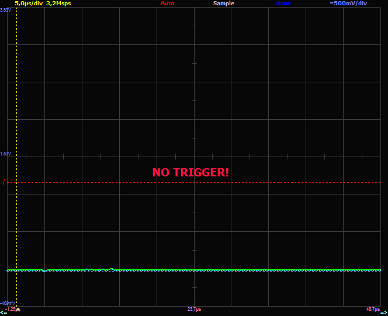

4. Verify the presence of a sine wave on the secondary winding of the transformer.

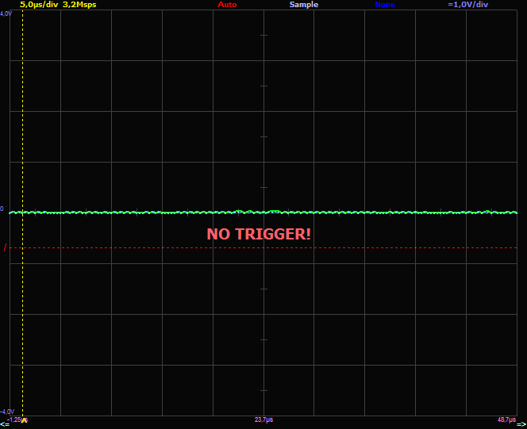

5. Perform operational amplifier calibration.
Short the ESR meter probes. Adjust the offset voltage of U5:A using trimmer RV1. Ensure that when sinusoidal pulses appear, the voltage at output 1 of U5:A rises to approximately 300 mV.

6. Then perform the same adjustment for amplifier U5:B using trimmer RV2, monitoring output 7 with the oscilloscope.

7. Connect the ESR meter probes to a calibration resistor with a resistance of 10 Ω (this is the upper measurement limit of the device).
When pulses appear, the voltage at output 1 of U5:A should rise to approximately 3.5V. If the voltage exceeds 3.7V, the gain set by resistors R20R13 needs to be adjusted.

Resistors R32R18R31 set the gain of the second amplifier, which is used for measuring small resistance values.

The original circuit uses gain factors of 3 and 21. If these are changed, the constant ESR2_MUL = 21/3 in the firmware needs to be updated accordingly.

8. By connecting different known resistors to the ESR meter probes, verify that lower resistance values correspond to lower voltages at output 1 of U5:A, and vice versa (the relationship is nonlinear).

8. Begin the software calibration of the device.
Short the ESR meter probes and press button SB1 (hold for 1 second). The device records the voltages on the ESR1 and ESR2 lines. These are displayed in the terminal as zero=… and should be in the range of 10–200 if the output levels of the operational amplifiers were correctly set up.

```
MODEESR: ESR1=67(zero:67)
ESR2=21(zero:20)
ESR=1
res*1000=0
```

9. Connect a 0.05 Ω calibration resistor (two 0.1 Ω resistors in parallel). In the terminal, send the characters "c", "a". This stores the calibration values for 0.1 Ω resistance in EEPROM. The following response is displayed:

```
Done: xx
```

The calibration table is then printed. Repeat the same procedure for the remaining calibration resistors, pressing "c", "b", "c", "d", and so on accordingly. The calibration resistor values can be changed in the firmware in the s_ESR_CAL_R table.

Upon completion, it is a good idea to plot a graph from the obtained values to confirm that everything "looks reasonable."

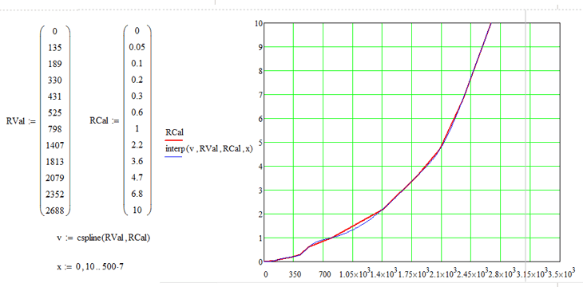

### Flashing the Firmware

Firmware flashing is performed through connector J3 (non-standard format for my programmer). During programming, the device must be switched to any mode other than ESR, and the power button must be held down the entire time.

### Reproducing the Circuit and Components Used

I designed the circuit for my own use, so it uses components that I had on hand or that were easier for me to source. In particular, the device uses a specific LCD display with an mpd7225 controller, salvaged from a broken Sony tape recorder. Obviously, when reproducing the circuit, it should be replaced with any other 8-segment display with an SPI interface, and the display communication routines in the firmware should be updated (files LCD_D7225.h, LCD_D7225.c). The level-shifting chains R9–R12, D1–D3, U3 (for 5V-to-3.3V conversion) can also be removed.

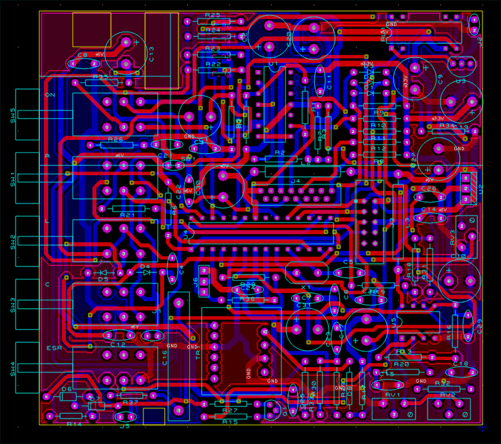

[PCB project (Proteus) + firmware (CVAVR).](hxESRMeter.rar)

## Update: Using an HD44780 Controller

Since the display I used is virtually impossible to find, I adapted the circuit for an HD44780 display.

An SPI adapter for the HD44780 needs to be built according to this [article](http://www.rlocman.ru/shem/schematics.html?di=67315).

The circuit is used without modifications.

The adapter PCB can look like this:

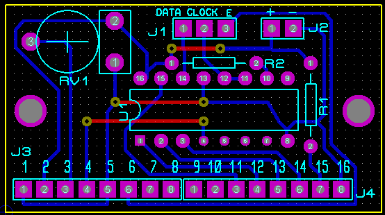

The adapter is powered with 5V from the main board (e.g., from capacitor C20). The Data, Clock, and E pins are connected to the LCD_DATA, LCD_CLOCK, and LCD_CS signals from the main board respectively (the cathode side of diodes D1–D3). Diodes D1–D3 and resistors R8–R12 on the main board can be left unpopulated.

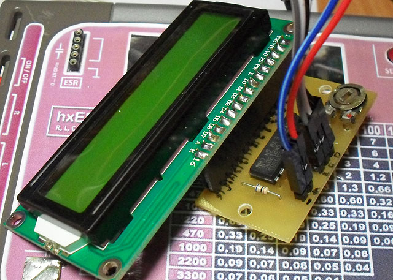

Firmware 1.2:
– HD44780 support (uncomment #define USE_HD44780 in LCD_Impl.c)
– improved resistance measurement algorithm.

Source code (Codevision AVR 2.05):
[hxESRMeter1.2_src.zip](hxESRMeter1.2_src.zip)

Binary compiled for the following components:

```
=============================
//This file contains definitions for resistors/capacitors used in actual schematics
//Precise value for R22, Ohm * 10, f.e. 97.2 Ohm -> 972
#define RCAL1_VAL 1000 //100
//Precise value for R23, Ohm
#define RCAL2_VAL 10000 //10000
//Precise value for R24, Ohm
#define RCAL3_VAL 100000 //100000
//Precise value for R25, Ohm
#define RCAL4_VAL 1000000 //1000000
//Precise value for C4, Farades
#define CCAL 0.000000001 //0.000000001
//calibration resistors for ESR calibartion, Ohm
flash const float s_ESR_CAL_R[ ESR_CAL_COUNT ] = { 0, 0.05, 0.1, 0.2, 0.33, 0.6, 1.0, 2.2, 3.6, 4.7, 6.6, 10.0 };
=============================
```

[hxESRMetter1.2.bin.zip](hxESRMetter1.2.bin.zip)

Schematic and adapter PCB in Proteus:
[HD44780_SPI.zip](HD44780_SPI.zip)

Fuses:

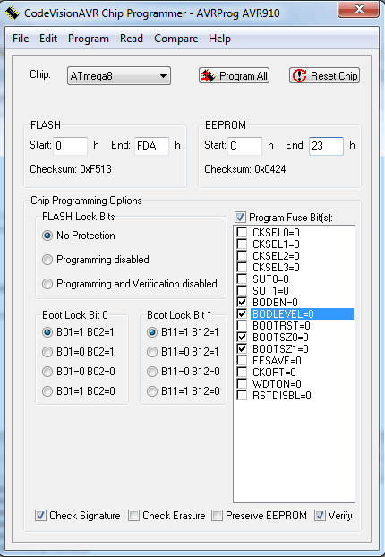

[https://www.youtube.com/watch?v=-HjN9lNII4M](https://www.youtube.com/watch?v=-HjN9lNII4M)
