# DIY 1W LED Flashlight

This article was published on [radiokot.ru](http://radiokot.ru/circuit/analog/games/22/)

I found a simple circuit on the internet and decided to convert a flashlight to a 1W LED:

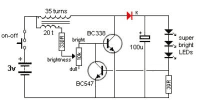

It turned out to be not so simple, and I had to tinker with it quite a bit. Behind the simplicity of the circuit lies inefficiency – at the required 350mA for the LED, the transistor overheats significantly. The oscillogram at the base looks like this:

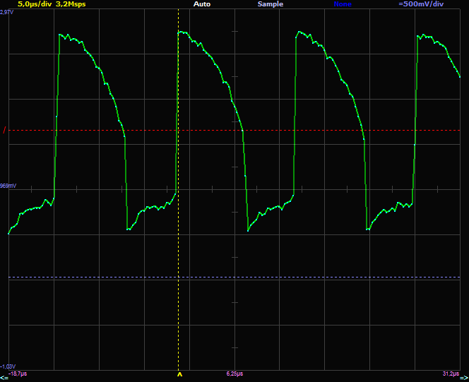

The second problem is that the oscillation frequency is determined by the transformer, and the duty cycle is fixed at 50%. When powered by two AA rechargeable batteries, as in my case, due to losses in the diode and resistor, it's impossible to boost the input voltage of <2.1V to the required 3.6V.

For the second attempt, the following circuit was found:

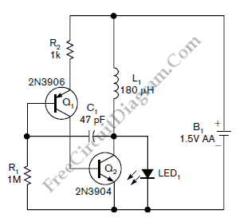

The situation with this one is essentially the same, except the oscillation frequency is now set by the capacitor and inductor. There is still no way to adjust the duty cycle or boost the voltage when the batteries are depleted.

The transistor overheating problem can be solved by adding a Schmitt trigger built with two transistors:

With this addition, the pulses at the base of the power transistor become a square wave, and the overheating stops.

This circuit is perfectly functional and can be used when powered by 3 AA batteries, with the addition of a current limiting circuit as in the very first schematic.

I couldn't find any other circuits using discrete components. Of course, specialized ICs exist, but they exist abstractly, somewhere thousands of kilometers away with at least two weeks of delivery time, while the weekend and a box of old circuit boards are right here :), so the search continued through boost-up converter schematics. As a result, this excellent 6->14V boost converter circuit with regulation was found:

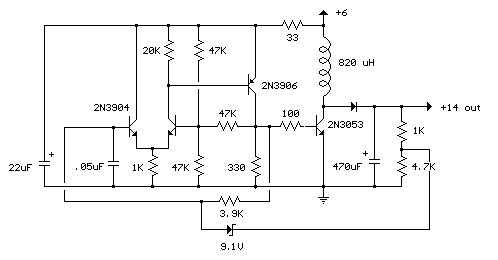

As testing on a breadboard showed, the circuit continues to operate when the input voltage drops down to 1.5V with virtually no changes.

The circuit is essentially a Schmitt trigger looped back on itself with a delay provided by a timing capacitor. The duration of the positive pulse that opens the power transistor is fixed and set by the timing capacitor. The duty cycle is regulated by changing the pulse repetition rate, i.e., by changing the oscillation frequency of the circuit.

To limit the LED current at 350mA, a resistive current sense element can be used as in the very first circuit. However, the sense resistance would need to be quite high, and consequently, energy would be wasted heating it. In reality, the current through the LED is highly dependent on the applied voltage, so it's sufficient to simply limit the voltage at 3.6V.

Since a 2.9V zener diode was not available, and I didn't want to waste a TL431, a chain of diodes D3-D7 was installed to clamp the voltage at 3.3V, which corresponds to a current of ~300mA through the LED. The current is slightly reduced to conserve battery life and limit heating of the LED itself.

The circuit performed excellently, and an SMD version was assembled:

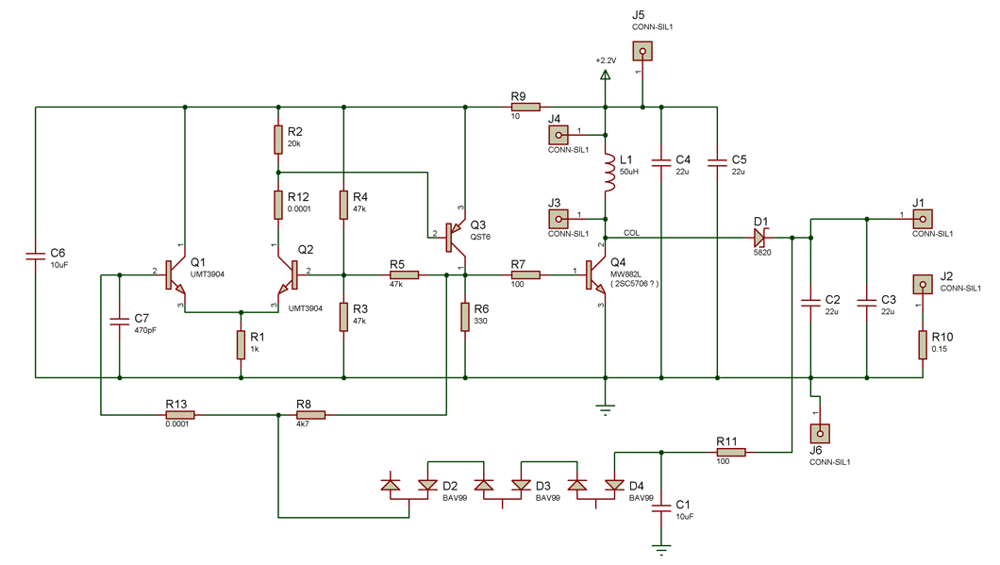

Transistors Q1, Q2 are any NPN type, Q3 is any PNP type. The MW882L transistor in a SOT-89 package, desoldered from a video card, was used as the power switch. Thanks to the sharp-edged pulses at the base, the transistor does not heat up:

I couldn't find its datasheet, but in theory, it's a low-resistance transistor designed for power converters, similar to the 2SC5706.

The inductor was desoldered from a laptop motherboard and looks roughly like this:

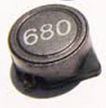

The inductor was disassembled and rewound with thin wire, as much as would fit (ended up with 50uH, originally 6.8uH). The circuit will work with inductors in the 20-100uH range.

Resistor R10 is only soldered in for debugging (to measure the LED current). In the final version, it is replaced with a jumper.

PCB layout:

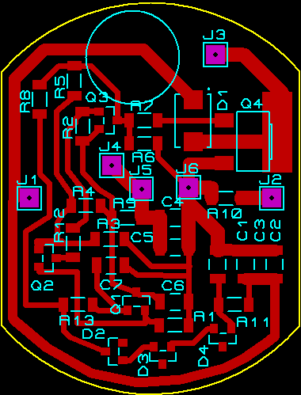

inserted into an existing flashlight, after some filing:

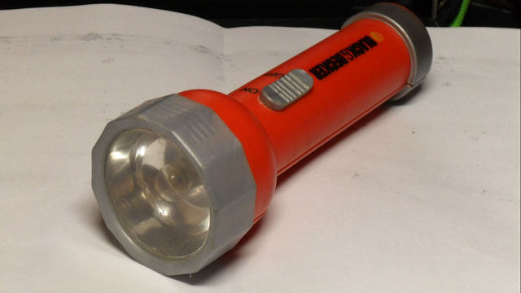

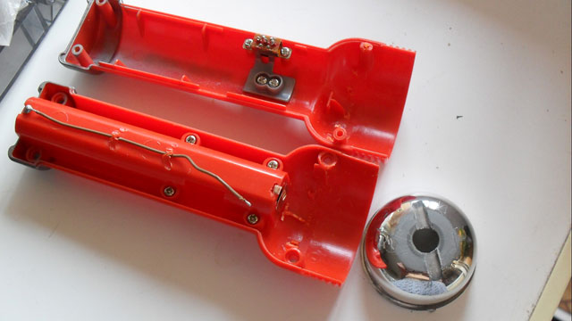

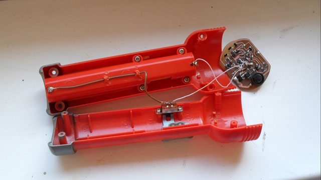

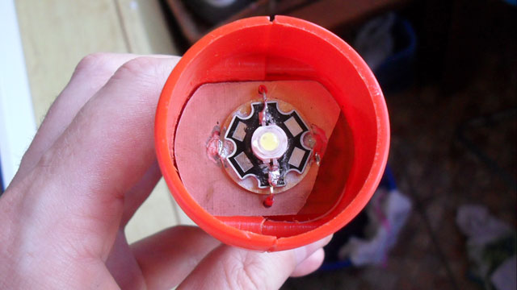

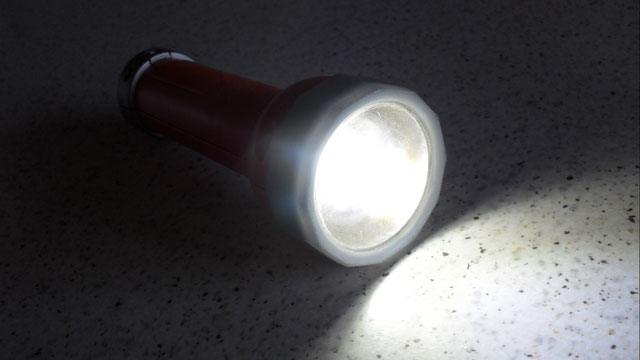

Due to the simple regulation circuit, the LED current decreases as the supply voltage drops. In practice, this is actually a good thing, since with depleted batteries the priority shifts from brightness to keeping the light on as long as possible – a sort of "battery saving mode" during deep discharge.

| Supply voltage, V | Current draw*, mA | LED voltage*, V | LED current, mA | Frequency, kHz | Efficiency, % |
|---|---|---|---|---|---|
| 1.57 | 11 | 2.52 | 8 | 20 | 85.6 |
| 1.66 | 70 | 2.67 | 46 | 60 | 92.4 |
| 1.72 | 150 | 2.8 | 90 | 85 | 91.5 |
| 1.9 | 280 | 2.97 | 166 | 85 | 92.6 |
| 2.0 | 320 | 3.0 | 186 | 85 | 87.1 |
| 2.33 | 440 | 3.2 | 260 | 87 | 81.1 |
| 2.4 | 450 | 3.3 | 286 | 84 | 87.3 |
| 2.54 | 460 | 3.28 | 290 | 78 | 81.4 |
| 2.6 | 520 | 3.28 | 326 | 71 | 79.0 |
| 2.7 | 550 | 3.32 | 338 | 68 | 75.5 |
| 2.81 | 560 | 3.4 | 353 | 67 | 76.2 |
| 3.0 | 600 | 3.5 | 386 | 66 | 75.0 |

* average current and voltage. The circuit has ripple up to 10%.

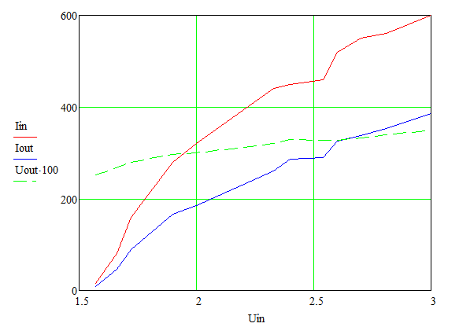

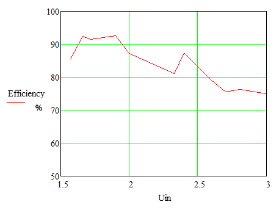

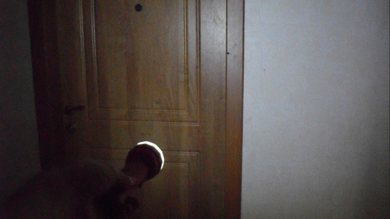

Schematic and PCB (Proteus): [Lighter2.rar](Lighter2.rar)

### References

LED driver electronic project using transistors
[http://www.electroniq.net/led-drivers/led-driver-electronic-project-using-transistors.html](http://www.electroniq.net/led-drivers/led-driver-electronic-project-using-transistors.html)

Two Transistors Single Cell Battery LED Driver
[http://freecircuitdiagram.com/2010/10/25/two-transistors-single-cell-battery-led-driver/](http://freecircuitdiagram.com/2010/10/25/two-transistors-single-cell-battery-led-driver/)

2 Watt Switching Power Supply
[http://www.bowdenshobbycircuits.info/page4.htm#ps5.gif](http://www.bowdenshobbycircuits.info/page4.htm#ps5.gif)

My BJT/FET multivibrator boost converter beats Minty Boost!
[http://www.electro-tech-online.com/electronic-projects-design-ideas-reviews/120932-my-bjt-fet-multivibrator-boost-converter-beats-minty-boost.html](http://www.electro-tech-online.com/electronic-projects-design-ideas-reviews/120932-my-bjt-fet-multivibrator-boost-converter-beats-minty-boost.html)

Single and Two Cell White LED Drivers Without Inductors
[http://www.cappels.org/dproj/PulseBoostLED/Pulse_Boost_White_LED.html](http://www.cappels.org/dproj/PulseBoostLED/Pulse_Boost_White_LED.html)
