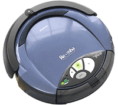
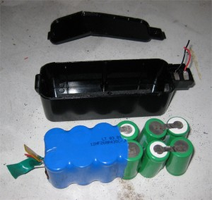
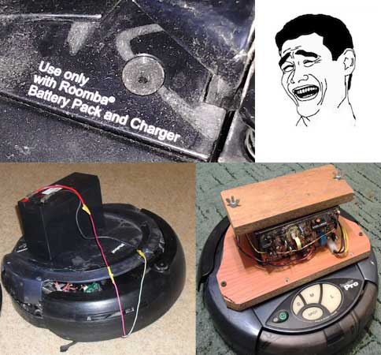
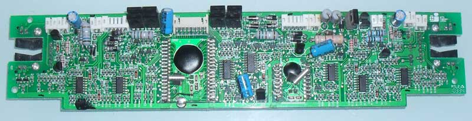
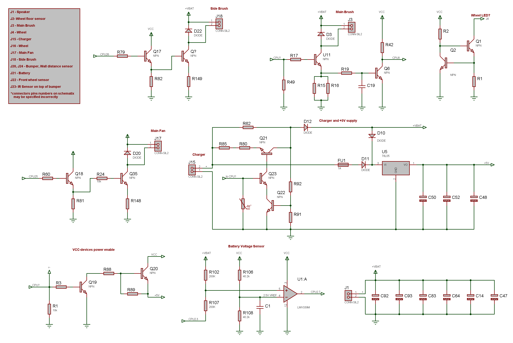
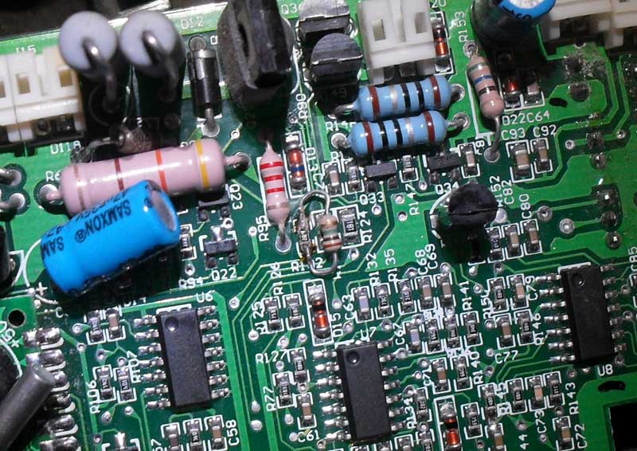
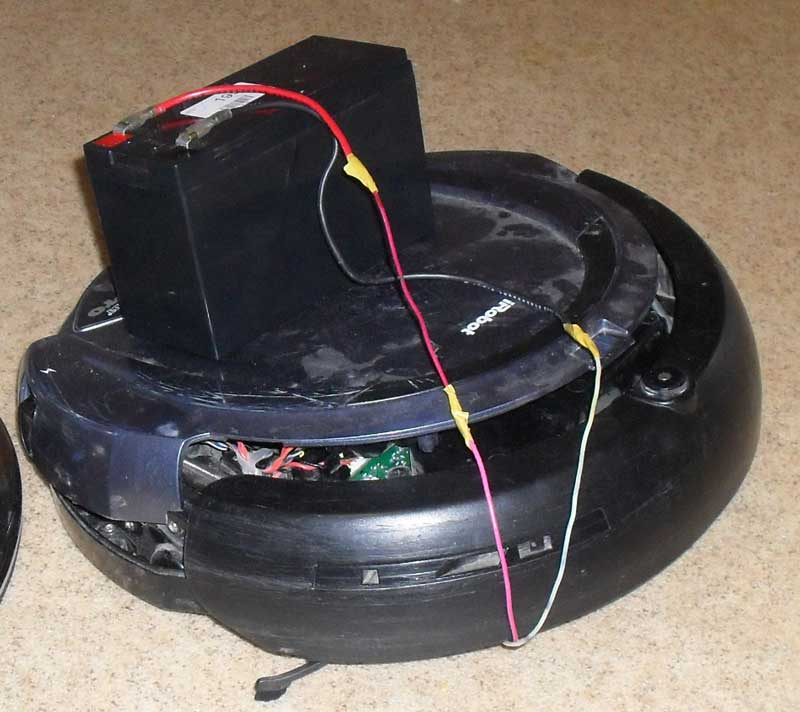
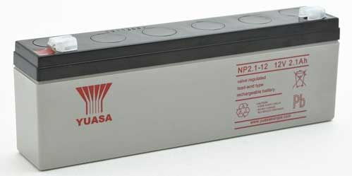
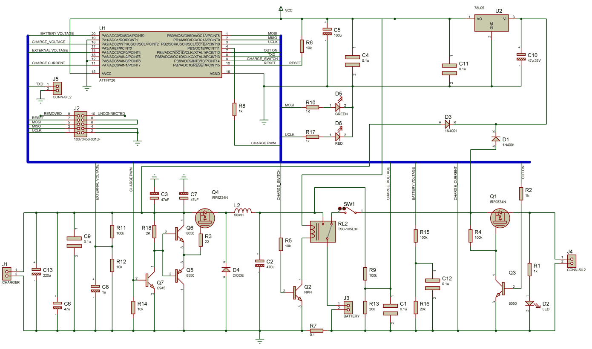
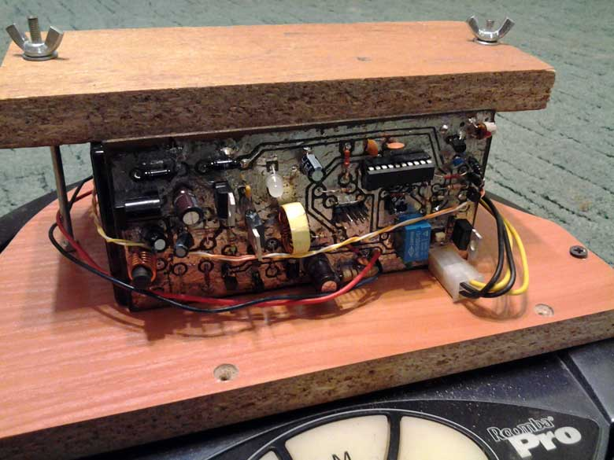

# Roomba Pro SLA battery mod

I have a very old Roomba Pro but it still cleans, like Wally 🙂

However running time has decreased significantly and I had to replace the battery.

I have been replacing NiMh batteries once already. I disassembled battery pack and put in 3000mAH NiMh batteries a year ago. Unfortunately total cost for this replacement was >$50 because NiMh batteries are expensive.

This time I decided to do a SLA battery mod. Please note: this is not a low-cost replacement for NiMh batteries. If you can get original or compatible Roomba battery pack for $25, then just buy it. The main reason I did this mod is to have some fun soldering. Another reason is that I can not get NiMh battery pack for less than $50. SLA battery cost is $13. Also I am not satisfied with Charging time – it requires >12 hours to charge NiMh batteries with original Roomba Pro charger. And I am not happy with batteries discharge slowly over time.

The original NiMh battery consists of 12 cells 1.2V each, which gives 12*1.2 = 14.4V. Voltage can drop to 0.9*12 = 10.8V. However, Roomba will stop much earlier at <~12.5V.

The voltage of 12V SLA battery is 6*2.3V = 13.8V and should never be dropped lower then 6*1.9V=11.4V.

In practice, Roomba still runs fine on voltage as low as 11V.

In order for Roomba to work on SLA battery efficiently, I had to modify power sensing schematics. I traced part of main board schematics and found voltage sensing circuit consisting of R102, R106, R107, R108 and LMV339M comparator.

I am not sure how they could sense voltage with R107 connected to CPU pin, but R102 and R107 definitely is a voltage divider. To set lower threshold, R102 should have smaller resistance. I simply soldered 500k resitor in parallel to R102.

One important note about SLA battery is that this battery should not be discharged lower then 11.4V. It would be even better if voltage should be limited at 11.8V for longer battery life. The lower battery is discharged, the faster battery degrades. DO NOT discharge SLA batter below 11V because this is a direct way to recycle bin. SLA battery will survive no more then 10 over-discharges.

Always charge SLA battery after usage. These batteries should be stored fully charged. Over Discharged SLA battery stored for a month will die.

If you are going to charge SLA battery from external charger, you better replace R102 with variable resistor and adjust lower threshold to 11.8V.

A quick test with SLA battery proved that Roomba runs fine. Unfortunately 7Ah battery I was going to use appeared to be too heavy for the robot, so I bought smaller 2.1Ah battery. This battery allows robot to run for 40 minutes on carpet and requires ~1 hour to recharge.

SLA battery has different charging algorithm. If you use internal charger with SLA battery, it will kind of work for some time, but then battery will became dead.

I disconnected internal charger and made my own charger based on ATTiny26 micro controller. This charge controller is independent from Roomba and can also be used for other applications. It can provide charging current up to 3A and is powered from external DC power supply 16-25V. I am using 18V 3A power supply from notebook.

Controller disconnects consumer from battery when voltage drops below 11.8V preventing over-discharge.

Firmware implements the following charging algorithm:

- fast charging: charge battery with current limiting to 0.67A ( specified in firmware) until voltage reaches 14.4V;
- charge with voltage limit of 14.4V until current drops below 200mA;
- hold mode: switch to voltage limit of 13.7V.

D5,D6 is single red-green LED. LED is red when charger is limiting charging current. LED is yellow when charger is limiting voltage. LED is green blinking when charging is completed.
LED is blinking RED if external power supply is unable to provide enough power ( charging still continues, with slower speed ).

In normal mode, LED fades from green to red indicating battery discharge level. When battery voltage is too low, consumer is disconnected and LED blinks RED.

Step-down converter is built on Q4-Q7 and is controlled by PWM output from ATTiny26. D4 is 3A schottky diode.
RL2 ( 5V relay) disconnects battery from consumer when charging.
R7 is charge current sensing resistor (0.5W).
Q1 is used to disconnect consumer from battery if voltage is low.

[https://www.youtube.com/watch?v=ved5ivAEoFU](https://www.youtube.com/watch?v=ved5ivAEoFU)

Firmware is written in CodevisionAVR.

[Download firmware and schematics](RoombaSLA.rar)