# Midi Player for AVR

*The article was published on [radiokot.ru](https://www.radiokot.ru/circuit/digital/game/51/)*
*Prize Winner of the “Congratulate the Cat Like a Human, 2013” Contest*

This article describes the principles of music synthesis on AVR. The included software allows you to convert any MIDI file into C source code for AVR microcontrollers, enabling you to add music playback to existing projects. A usage example in a music box is also covered.

To start, a short video of how it all works:

[https://www.youtube.com/watch?v=HkgqKiw3UaI](https://www.youtube.com/watch?v=HkgqKiw3UaI)

## What the Software Can Do

The PC software generates C source code for CodeVision AVR that plays a selected MIDI file:

1. Add common\hxMidiPlayer.h, common\hxMidiPlayer.c to your project. Copy the templates ATMega8Example\melody.h, ATMega8Example\melody.c, ATMega8Example\hxMidiPlayer_config.h and include them.
2. Launch MidiToC.exe
3. Load a MIDI file.
4. Configure the player: sampling rate, number of channels, waveform, etc. The software plays the melody exactly as the AVR will.
5. Click "Create player config" and paste the source code into hxMidiPlayer_config.h.
6. Click "Create melody code" and paste the source code into melody.c
7. Implement the Player_Output() method in your project for sound output via PWM or an external DAC.
8. Set up a timer at the Sampling rate frequency, and call Player_TimerFunc() from the interrupt handler.
9. Call Player_StartMelody( &s_melody, 0 ).

The melody is played from a timer interrupt. This means the microcontroller can also perform useful work during playback.

## How It Works

In the rest of the article, I will try to briefly explain how all of this is implemented. Unfortunately, brevity is not really possible here — there is a lot of material. If you are not interested, you can skip directly to the "Software Description" and "Player API" sections.

## What Is Music


Music is a sequence of sounds of varying frequency and duration. The fundamental frequency of a sound must correspond to the frequency of a specific note. If the oscillation frequency deviates from the note frequencies, the music sounds "out of tune."

Table. Note frequencies, Hz.


All notes are divided into octaves, with 7 notes in each plus 5 semitones (the black keys on a piano). The frequencies of notes in adjacent octaves differ by exactly a factor of 2.

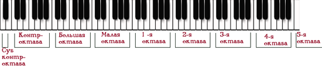

The simplest music player contains a table with the sequence of notes (note + duration) of a melody and a table of note frequencies. One of the timer channels is used to generate a square wave for sound synthesis:

[https://www.youtube.com/watch?v=3ChSBh00tnU](https://www.youtube.com/watch?v=3ChSBh00tnU)

Unfortunately, such a primitive player has a fixed waveform (square wave), which does not closely resemble real musical instruments, and can only play one note at a time.

A real melody contains at least two parts (solo + bass), and when playing the piano, the previous note continues to sound after the next one begins. This is easy to understand when you recall how a piano works — each note corresponds to a separate string. We can make several strings sound simultaneously by running a hand across the keys.

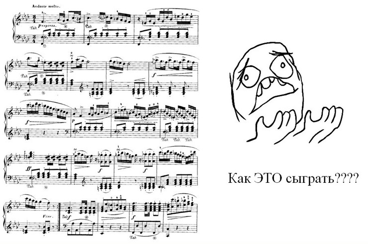

Some microcontrollers have multiple timer channels that can be used to play several notes simultaneously. However, these channels are typically a valuable resource, and using all of them is undesirable — unless, of course, we are simply building a music box.
In summary, to achieve polyphony and different instrument sounds, we need to use sound synthesis.

## Sound Synthesis on AVR

hxMidiPlayer uses sound synthesis and can play polyphony with various waveforms. The player calculates the output signal amplitude in a timer interrupt handler at a rate of 8–22kHz (as much as the processor can handle; this also depends on the waveform and number of channels).

The principle of sound synthesis can be explained using the example of synthesizing a sine wave.


Let us take a table of 64 entries, where each cell contains the sine amplitude values at points index * 2 * PI / 64 (one period):

```c
static const flash uint8_t s_sineTable[ 64 ] = {
  0x80, 0x82, 0x84, 0x86, 0x88, 0x8A, 0x8C, 0x8D, 0x8F, 0x90, 0x91, 0x93, 0x93, 0x94, 0x95, 0x95,
  0x95, 0x95, 0x95, 0x94, 0x93, 0x93, 0x91, 0x90, 0x8F, 0x8D, 0x8C, 0x8A, 0x88, 0x86, 0x84, 0x82,
  0x80, 0x7E, 0x7C, 0x7A, 0x78, 0x76, 0x74, 0x73, 0x71, 0x70, 0x6F, 0x6D, 0x6D, 0x6C, 0x6B, 0x6B,
  0x6B, 0x6B, 0x6B, 0x6C, 0x6D, 0x6D, 0x6F, 0x70, 0x71, 0x73, 0x74, 0x76, 0x78, 0x7A, 0x7C, 0x7E };
```

128 (0x80) corresponds to zero, 255 (0xff) is the highest positive point, 0 is the lowest negative point.

Now, suppose we output values from the table to an external DAC in a timer interrupt called at 1000 Hz:

```c
static uint8_t s_index = 0;
// Timer1 output compare A interrupt service routine
interrupt [TIM1_COMPA] void timer1_compa_isr(void)
{
  SetDac( s_sineTable[ s_index] );
  if ( s_index == 63 )
  {
    s_index = 0;
  }
  else
  {
    s_index++;
  }
}
```

What do we get at the output? We get sinusoidal oscillations at a frequency of 1000/64 Hz.

Now let us increment the index by two instead of one in the interrupt.
Obviously, the output oscillation frequency will be 1000/64 * 2 Hz.

In the general case, to obtain frequency F, the table index needs to be incremented by:
add = F / 1000 * 64

This number can be fractional, but fixed-point arithmetic is used for high-speed operation.

The number of table entries and the timer frequency affect the quality of the synthesized sound. In our case, 64 entries per period and a timer frequency of 12kHz are sufficient. The minimum acceptable timer frequency is 8kHz, and the ideal one is 44kHz.

Obviously, at a timer frequency of 12kHz we can generate at most a 6kHz square wave, since at least two transitions per period are needed. However, higher frequencies will still be recognizable if the output state is correctly calculated on each timer tick.

You can enter values for a non-sinusoidal waveform period into the table to produce a different sound.

## Decay

If the musical instrument is string-based (e.g., piano), the sound gradually fades after a key is pressed. To achieve a more natural synthesizer sound, it is necessary to smoothly decrease the oscillation amplitude after a note starts ("wrap" the oscillations in a decay shape — an "envelope").


The player contains a decay table that it uses to reduce the sine (or other waveform) amplitude from the moment a note starts.
A "sine" wrapped in such an envelope resembles the sound of a mechanical music box.

## Square Wave Synthesis

The special shape of a square wave allows for significantly simplified synthesis. No tables are used. It is sufficient to calculate what state (1 or 0) the output should have at a given frequency on the current timer tick. This is done using integer arithmetic, which runs very fast — hence the popularity of using square waves for melody playback in 8-bit game consoles.

Example: declare a counter:

```c
static uint16_t s_counter = 0;
```

which we increment by 0x8000 in each timer interrupt, and output the most significant bit of the counter to the port:

```c
// Timer1 output compare A interrupt service routine
interrupt [TIM1_COMPA] void timer1_compa_isr(void)
{
  PORTA.0 = ( s_counter >> 15 ) & 1;
  s_counter += 0x8000;
}
```

Since 0x8000 + 0x8000 = 0x10000, the variable s_counter overflows, the 17th bit is discarded, and 0x0000 is written to the variable.
Thus, at a timer frequency of 8kHz, the output will be a 4kHz square wave.
If the counter is incremented by 0x4000, the result will be a 2kHz square wave.

In the general case, frequency F can be obtained by adding:
add = F / 8000 * 0x10000

For example, to produce a 1234Hz square wave, you need to add 0x277C. The actual frequency will differ slightly from the target because the addend is rounded to an integer. This is acceptable in a synthesizer.

## Synthesizing Real Instrument Sounds

You can digitize the sound of a C note on a piano (using an ADC, save the sound amplitude values in memory at equal time intervals):
and then play back the sound (using a DAC, output the recorded values at equal time intervals).


These time intervals are defined by the "sampling rate," which should be in the range of 4kHz–96kHz. The higher the sampling rate, the higher the quality of the recorded sound.

This can be done for all notes of a musical instrument, making it possible to play any note at the right moment.
But a sampling rate of 8kHz means that storing one second of sound requires 8000 bytes (if each "sample" is stored in an int8_t variable).

Recording all notes would require too much memory.

An alternative approach: we have a recording of the C note from the 1st octave. We need to obtain the C note from the 2nd octave. We know that the frequency of a note in the 2nd octave is exactly 2 times higher than the corresponding note in the 1st octave. Therefore, to obtain C-2 from C-1, we need to raise the pitch of C-1 by 12 semitones: treat the entire sound as one period of a function, decompose it into harmonics, double the harmonic frequencies, and reassemble.
Obviously, this requires a lot of computation.

Therefore, a greatly simplified method is often used: if you take the C-1 note recorded at a sampling rate of 8kHz and play it back at 16kHz, you get C-2. The same result can be achieved by playing C-1 at 8kHz but skipping every 2nd sample.
Unfortunately, this method has a significant drawback: the resulting note will be exactly 2 times shorter. If the melody uses a wide range of notes, the music will not sound very pleasant, but with limited available memory, this trade-off is unavoidable.
hxMidiPlayer allows loading the sound of a C-5 note from any instrument and playing the melody with that instrument.

## Drum Synthesis


In general, drum synthesis requires recording drum sounds and playing them at the right moments. In 8-bit game consoles, "white noise" is used instead of drum sounds. The amplitude values for "white noise" are obtained using a random number generator. Memory requirements in this case are minimal.
hxMidiPlayer uses "white noise" for drum synthesis.

## Channel Mixing


The sound amplitude at a given timer tick is calculated separately for each channel. To obtain the final amplitude value, the values from all channels must be added together. Strictly speaking, the sum should be corrected since perceived loudness follows a logarithmic relationship, but in such a simple synthesizer we have to settle for plain addition. Therefore, the maximum amplitude of each channel is 255/N.

## Sound Output from AVR

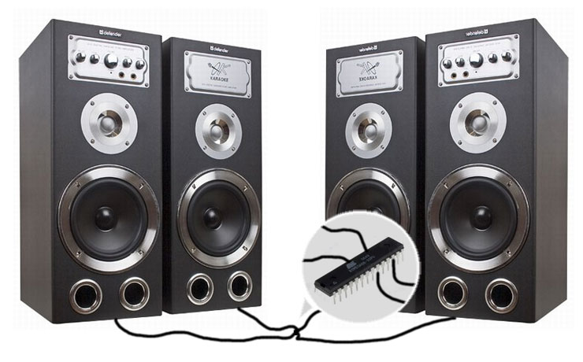

After performing all necessary calculations, the player obtains the signal level that needs to be converted to analog. An external DAC or PWM can be used for this purpose.
It should be noted that in both cases, the resulting signal should ideally be filtered — removing high-frequency noise that arises due to the low synthesis frequency and rounding.

## Output via External Parallel DAC

Since there is no point in using precision DAC ICs, R2R resistor ladders are typically used in such projects:

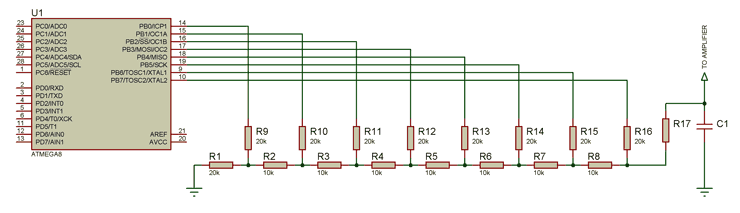

With this circuit, we simply output the computed amplitude to a port:

```c
PORTB = sample;
```

Disadvantages:
1) the signal at the R2R ladder output is too weak, requiring an analog amplifier;
2) at least 5 pins (preferably 8) must be used;
This method is justified only when no free PWM channels are available.

(To save pins, an external DAC with an SPI interface can be used).

## PWM

If a free PWM channel is available, this method is the simplest to use.

PWM initialization (ATMega8):

```c
// Timer/Counter 2 initialization
// Clock source: System Clock
// Clock value: 20000,000 kHz
// Mode: Fast PWM top=0xFF
// OC2 output: Non-Inverted PWM
ASSR=0x00;
TCCR2=0x69;
TCNT2=0x00;
OCR2=0x00;
```

And sample output:

```c
void Player_Output( uint8_t sample )
{
  OC2 = sample.
}
```

The standard practice of using PWM involves smoothing the output signal with an RC filter:

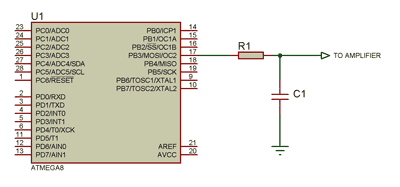

Unfortunately, after filtering, the signal is attenuated too much, so an analog amplifier is required to connect a speaker.

To simplify the circuit, it is better to stay "digital" all the way to the speaker. Since a cheap speaker cannot reproduce frequencies above 30kHz anyway, there is no need to filter them. The speaker cone itself will "filter out" the high PWM frequencies.


If more current is needed, a transistor amplifier can be used. R1 is chosen to provide the required current to the speaker.

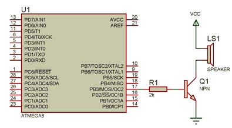

This is suitable for connecting small speakers from toys:

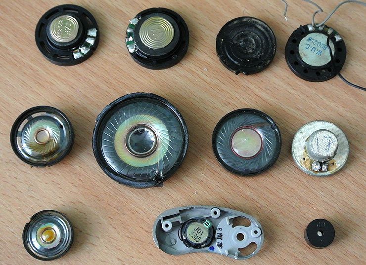

For larger speakers, it is better to build a push-pull driver using two transistors and add an LC filter to remove noise:

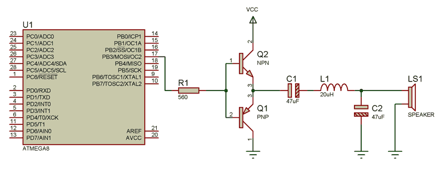

Capacitor C1 limits the current through the speaker when PWM is not active. Also, thanks to the series capacitor, the signal reaching the speaker is symmetrical around zero. This means the speaker cone moves relative to its central "relaxed" position, which positively affects sound quality.
In this case, the transistors operate in switching mode, so there is no need to compensate for base bias.

## PWM, Two-Pin Connection


The disadvantage of the first two circuits is that only unidirectional current flows through the speaker. If we alternate the current direction, loudness can be doubled without exceeding the allowable power. To achieve this, the speaker is connected to two microcontroller pins — non-inverted and inverted, for example OC1A and /OC1A. If a non-inverted output is not available, the second channel in inverted mode (OC1B) can be used:

```c
// Timer/Counter 1 initialization
// Clock source: System Clock
// Clock value: 24500,000 kHz
// Mode: Fast PWM top=0x00FF
// OC1A output: Non-Inv.
// OC1B output: Inverted
// Noise Canceler: Off
// Input Capture on Falling Edge
// Timer1 Overflow Interrupt: Off
// Input Capture Interrupt: Off
// Compare A Match Interrupt: Off
// Compare B Match Interrupt: Off
TCCR1A=0xB1;
TCCR1B=0x09;
TCNT1H=0x00;
TCNT1L=0x00;
ICR1H=0x00;
ICR1L=0x00;
OCR1AH=0x00;
OCR1AL=0x00;
OCR1BH=0x00;
OCR1BL=0x00;
```

```c
void Player_Output( uint8_t sample )
{
  OCR1A = sample;
  OCR1B = sample;
}
```

## PWM, Two Pins, Class D Amplifier

The disadvantage of the proposed circuits is the current consumption during silence.
"Silence" corresponds to signal level 128, meaning PWM with 50% duty cycle — current always flows through the speaker!

By slightly modifying the software, a fairly powerful software-hardware Class D amplifier can be built:

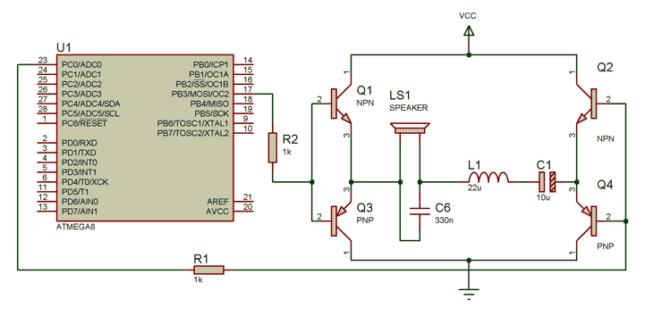

```c
void Player_Output( uint8_t sample )
{
  if ( sample >= 128 )
  {
    TCCR2=0x21; //normal, clear on compare match
    TCCR2=0x21 | 0x80; //CLEAR OC2
    PORTC.0 = 0;

    TCCR2=0x69; //non-inverting PWM
    OCR2 = (sample-128) * 2;
  }
  else// if ( sample < 128 )
  {
    TCCR2=0x31; //normal, set on compare match
    TCCR2=0x31 | 0x80; //SET OC2
    PORTC.0 = 1;

    TCCR2=0x79; //inverting PWM
    OCR2 = (128-sample) *2;
  }
}
```

One pair of transistors is connected to the PWM output, the other to a regular digital output.

As can be seen from the code, we treat the signal above 128 as current flowing in one direction, and the signal below 128 as current flowing in the opposite direction. At level 128, both speaker terminals are connected to the same power supply rail, and no current flows. As the level deviates from 128, the PWM duty cycle increases, and current of the corresponding polarity flows through the speaker.

An important implementation detail is the forced switching of the PWM output to the desired state at the moment of switching the second (regular digital) output (PORTC.0). Writing to the OCR2 register is buffered to prevent PWM "glitches." However, we need to switch the PWM output immediately, without waiting for the end of the period.

The last circuit is, in my opinion, the best option in terms of simplicity, energy efficiency, and output power.

## Sound Output with SquareWave Waveform


Simplified algorithms are used for square wave synthesis.

Each channel (including drums) outputs either 0 or 1. Thus, a 3-channel player outputs values in the range 0..3. Therefore, when using PWM, the output procedure looks like this:

```c
void Player_Output( uint8_t sample )
{
  OCR2 = sample * ( 255 / HXMIDIPLAYER_CHANNELS_COUNT );
}
```

If PWM is not used, two regular digital outputs and a 2-bit R2R ladder are sufficient for playing a 3-channel melody.

## MIDI Format


A Standard MIDI File is a specially designed file format intended for storing data recorded and/or played by a sequencer, which can be either a computer program or a hardware module.

This format stores standard MIDI messages (i.e., status bytes and corresponding data bytes), as well as timestamps or markers for each message (i.e., sequences of bytes indicating how many time units (pulses, ticks) must elapse before the next MIDI event is executed).
For synthesizer implementation, only the "note start," "note velocity," and "instrument selection" messages matter. "Instrument selection" events need to be processed to approximately determine the note duration and to distinguish percussion.

If you look at the size of MIDI files, you will find that they are still too large for AVR. Therefore, it is better to do all preprocessing on the PC and save the data in a custom format that contains only note start/stop events on a synthesizer channel:

```
{
    [timer ticks to wait before this event]
    [channel]
    [note or 0 === disable]
}
```

where note 1...127 requires 7 bits, channel 0..15 requires 4 bits, and delta gets 13 bits so that an event fits in 3 bytes:

```c
///=====================================================
///=====================================================
typedef struct
{
  //highest bit is highest for channel index
  uint8_t m_noteNumber;

  ///15-3 bits - Delta value, 2,1,0 bits - channel index
  uint16_t m_delta;
} TPlayerStateChange;
```

The melody code will be an array of TPlayerStateChange structures.

A MIDI file can contain up to 16 channels. MIDI channels are unrelated to synthesizer channels. MIDI channels are used to enable disabling certain parts (bass, solo). For example, solo notes are recorded on channel 1, and bass on channel 2. To listen to only the solo part, channel 2 is disabled. But often all notes simply go on channel 1.
Notes from all channels are distributed across synthesizer channels.

## Melody Compression


If you look at the resulting melody code, it is easy to notice that the array uses repeating numbers from a small range. This makes sense: the melody uses a limited number of notes within 1–2 octaves, the melody tempo is fixed (identical delays), and the number of channels is in the range 0..15.
All of this means that the resulting array can be significantly reduced by applying some compression algorithm.
Algorithms like ZIP provide good compression but also require a lot of memory (ZIP dictionary is 64KB). We can apply a very simple compression method that requires almost no memory, based on the following principle.

In one byte, all numbers are uniformly distributed in the range 0...255, and each number is represented by 8 bits. In our case, some numbers appear much more frequently than others. If frequently occurring numbers are encoded with fewer bits and less frequent ones with more bits, we can achieve memory savings.

We choose a fixed encoding scheme: bit combinations 000, 001, and 010 (length 3 bits) will represent the 3 most frequent numbers. Bit combinations 0110, 0111 (length 4 bits) represent the next 2 most frequent numbers, and so on:

```
 //000..010 - 0..2
 //011 x 3..4
 //100 xx 5..8
 //101 xxx 9..16
 //110 xxx 17..24
 //111 immediate
```

The combination starting with 111 (length 11 bits) will encode all remaining numbers.
The bit encoding scheme can be different. I tried several methods and chose this one as giving the best results on this type of data.

The compression procedure is as follows:
1. Count the total occurrences of number X in the stream for X = [0...255].
2. Sort by decreasing frequency of occurrence.
3. Take the first 25 numbers. They will be encoded with fewer bits.
4. Encode the input stream.

The output is an array of the 25 most frequently occurring numbers and a bit stream.
This compression achieves approximately 50% compression with minimal memory and performance overhead. Unfortunately, the player code size increases, so compression is not recommended for short melodies.

## Storing Note Frequencies

It is quite memory-intensive to store the frequencies of all notes in a table. In fact, there is a formula for determining a note's frequency by its MIDI number:

```
f = 2^((N - 69)/12) * 440, Hz
```

But computing a fractional power is fairly complex. Instead, the player stores 12 note frequencies of the highest octave. Frequencies of lower octave notes are determined by dividing the frequency by 2^Y, where Y is the number of octaves down.

## Further Compression Development

Melodies often contain repeating fragments ("choruses," "verses"). By finding repeating fragments and representing the melody as a sequence of fragments, the melody can be reduced by another ~50%, with almost no runtime memory or performance cost. I chose not to implement this algorithm to avoid complicating the project.

## Software Description

Main window of the converter program:

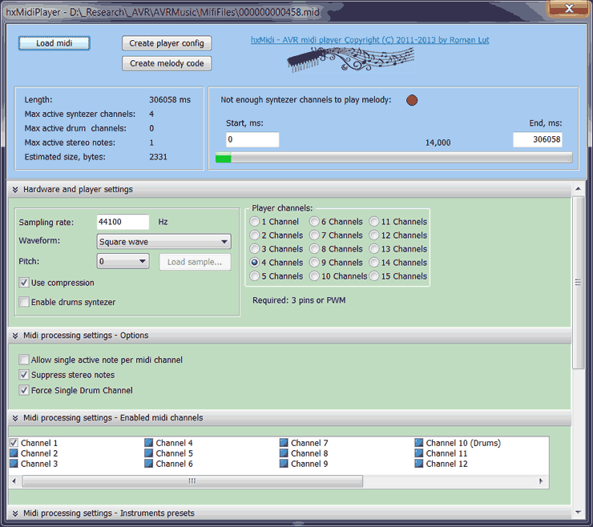

The Load Midi button allows loading a MIDI file. The program immediately starts playing the file with the currently selected settings, simulating the sound that the hardware will produce.


The information window (4) displays:
- Length — length of the selected melody fragment in ms;
- Max Active synthesizer channels — maximum number of simultaneously active synthesizer channels;
- Max active drum channels — maximum number of simultaneously active synthesizer channels playing "percussion";
- Max active stereo notes — maximum number of channels playing the same note (see below);
- Estimated size, bytes — melody size in bytes. In "Custom Sample" mode, the size is shown as A+B, where A is the melody size and B is the sample size. The player code size is not included here.


The progress window shows the current playback position.
You can click on the progress bar to start playback from a specific point.
The input boxes on the left and right allow specifying the start and end of the melody fragment in ms.

The "Not enough channels to play melody" label in red indicates that the current settings do not provide enough synthesizer channels to play the melody. If the player cannot find a free channel, it turns off the oldest note. In many cases, this will work fine. Increasing the number of channels is only worthwhile when the melody audibly sounds incorrect.

Settings can be roughly divided into player settings and MIDI file processing settings. The player will be able to play the generated melody code if the player configuration and melody code were created with the same player settings. Additionally, the player will be able to play a melody whose code was created for a player with fewer (but not more) channels.

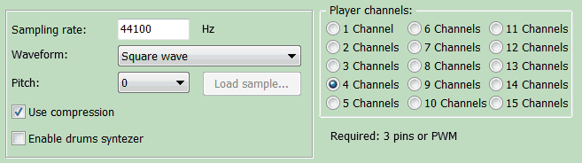

Player hardware settings include:

- Sampling Rate — synthesis frequency. The maximum synthesis frequency is determined experimentally. For an ATMega at 16MHz, you can start with 12000Hz for a 6-channel player and increase as desired until distortions become audible in the hardware player. The maximum frequency depends on the number of channels, waveform, and complexity of the melody itself.

- Waveform — waveform type:
  - Square wave;
  - Sine;
  - Sine + Envelope — sine with decay;
  - Waveform * + Envelope — various non-sinusoidal wave variants with and without decay;
  - Custom Sample — use an instrument sample.

The "Load Sample" button allows loading a sample from a WAV file. The WAV file must be in PCM 8-bit mono format, 4173Hz, note C-5. Hint: You can increase the frequency and lower the note, then adjust the Pitch in the player settings. No format checking is performed — if the format is wrong, the sound will play incorrectly.
Pitch — allows changing the pitch. For example, to play one octave higher, set Pitch to +12.

Use compression — use melody compression.
Enable drums synthesizer — enable the drum synthesizer.

Player Channels: number of synthesizer channels (maximum number of notes that will sound simultaneously).

MIDI file processing settings include:

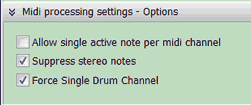

- Allow single active note per midi channel — turn off the previous note on a MIDI channel when the next one starts on that channel.
- Suppress stereo notes — suppress identical notes. Some MIDI files contain the same part on two channels with a slight time offset to create a stereo effect. Unfortunately, this "clogs" the synthesizer channels. Identical notes should preferably be suppressed.
- Force Single Drum Channel — play drums on only one synthesizer channel.


Checkboxes allow disabling processing of a specific MIDI channel. If a channel has no notes, the checkbox will be inactive.


Instrument settings allow choosing the note duration for each instrument. MIDI instrument codes can be found here:
[http://www.midi.org/techspecs/gm1sound.php](http://www.midi.org/techspecs/gm1sound.php)

Typically, such fine-tuning is not required. These settings can be left at their defaults.

## Player API

The player implementation is in the files Common\hxMidiPlayer.c and Common\hxMidiPlayer.h. These files must be added to the project. A file hxMidiPlayer_config.h must also be created, containing the configuration.
The player is written in C without assembly inserts, making it easy to port to other microcontrollers.

```c
extern void Player_StartMelody( const flash TMelody* _pMelody, uint16_t _delay );
```

Start melody playback. _delay specifies the initial delay before playback, 255 units = 1 second.

```c
void Player_Stop();
```

Stop melody playback.

```c
extern bool Player_IsPlaying();
```

Returns false when melody playback has finished.

```c
extern void Player_WaitFinish();
```

Wait until melody playback is complete.

```c
extern void Player_TimerFunc();
```

This function must be called from the timer interrupt at the sampling rate frequency specified in the configuration. When melody playback is complete, calls can be omitted.

```c
extern void Player_Output( uint8_t sample );
```

Must be implemented by the user. Called by the player when the next sample needs to be output.

```c
extern void Player_Started();
```

Must be implemented by the user. Called when the player begins melody playback. Can be used to configure timer interrupts.

```c
extern void Player_Finished();
```

Must be implemented by the user. Called when the player has finished melody playback. Can be used to disable timer interrupts or start playback of another melody.

```c
//#define NOTES_TO_EEPROM
//#define SINETABLE_TO_EEPROM
//#define ENVELOPE_TO_EEPROM
```

These lines should be uncommented in hxMidiPlayer_config.h if the note table, sine table, and decay table need to be placed in EEPROM.

## Example Projects

The archive contains example projects:


ATTiny2313Example — project for ATTiny2313, 20MHz, PWM output on PB3.

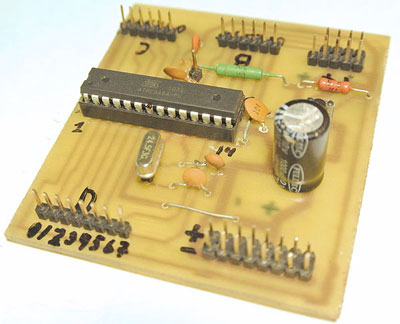

ATMega8Example — project for ATMega8, 24.5MHz, PWM output on PB3.


ATMega644Example — project for ATMega644, 25MHz, PWM output on PB3.

## Memory Requirements

Table. Player and melody sizes in flash.

| Player settings | "Bare" project size with player for ATMega8, bytes* | RAM consumption, bytes | Melody 1 size, bytes | Melody 2 size, bytes | Melody 3 size, bytes |
|---|---|---|---|---|---|
| Square wave, 2 channels, 16000Hz | 1076 | 13 | 1029 | 2436 | 5742** |
| Square wave, 2 channels, 16000Hz, compression | 1708 | 21 | 742 | 1068 | 2700** |
| Square wave, 4 channels, 16000Hz | 1075 | 21 | 1236 | 2541 | 8646 |
| Square wave, 4 channels, 16000Hz, compression | 1707 | 29 | 938 | 1089 | 4319 |
| Sine + Envelope, 4 channels, 16000Hz | 1413 | 25 | 669 | 2670 | 4497 |
| Sine + Envelope, 4 channels, 16000Hz, compression | 2034 | 33 | 531 | 1582 | 2766 |

\*when adding the player to an existing non-empty project, the code size will be smaller

\*\*not enough channels for proper melody playback

Melody 1: bach_minuet_in_g.mid, 35 sec
Melody 2: yiruma-river_flows_in_you.mid, 165 sec
Melody 3: Franz Schubert – Serenade.mid, 217 sec

As can be seen from the table, in the minimum configuration, a fairly long melody can fit even in an ATTiny2313. Compression can achieve more than a twofold reduction of the melody, but the player code size increases by ~600 bytes.

The note, sine, and decay tables can be placed in EEPROM, saving approximately 16, 50, and 100 bytes of flash respectively.

When using a sample from a WAV file, the sample size in bytes must be added to the player code size.

## Usage Example

As an example of using the player, let us walk through the process of creating a music box.

We take a ready-made MDF box:

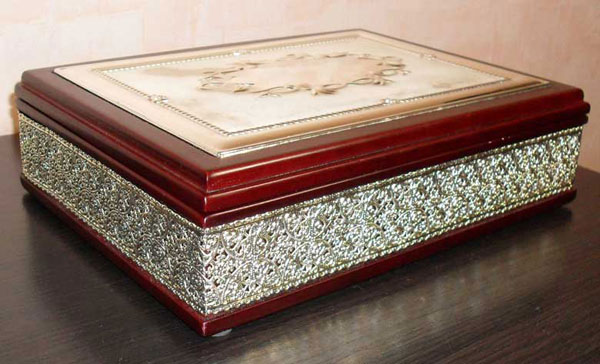

As the microcontroller, we choose the ATTiny85 in an SO-8 package as the cheapest option with a sufficiently large amount of memory. We will overclock it to 27MHz to achieve a synthesis frequency of 18kHz with 4 Sine+Envelope channels.

The amplifier will be Class D on 4 transistors to conserve battery life.

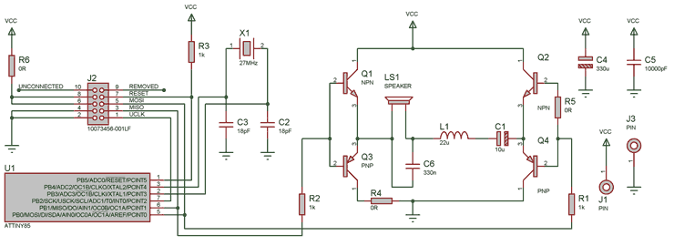

The transistors operate in switching mode and can be of any type. Inductor L1 and capacitor C6 are selected to taste to achieve sound without high-frequency noise. R1 and R2 can be increased to 2K to reduce volume and minimize speaker rattle.

PCB layout:


The box has sufficiently thick walls to accommodate the board, a 3cm diameter speaker, and 3 AAA batteries:


A limit switch from a floppy drive fits perfectly, as if it were specifically designed for a music box (operates on break — opening the lid powers on the board):


The firmware source code is in the ATTiny85MusicBox directory.

8KB accommodated:
1) player: 18000Hz, 4 channels, Sine+Envelope, Pitch+12, compression, plays melodies in sequence (the last one is saved in EEPROM)
2) Yiruma — River Flows in You
3) Franz Schubert — Serenade
4) P.I. Tchaikovsky — "October"

Result on video:

[https://www.youtube.com/watch?v=hVL_nkzSY3c](https://www.youtube.com/watch?v=hVL_nkzSY3c)

## Further Development

In principle, the player could be further enhanced, turning it into a full-fledged MIDI or MOD player. Personally, I believe that for high-quality music, it would be easier to connect an SD card and play any WAV files from it with much better quality than is achievable through software synthesis at all. And such a player is an order of magnitude simpler both in software and hardware. The niche for hxMidiPlayer is adding decent sound to existing projects when only a couple of pins and a bit of flash space remain. It handles this task excellently in its current form.

I think this closes the matter of creating various music boxes/ringtones on AVR :)

Download link: [hxMidiPlayer](AVRMusic.rar) — software (Delphi 2010), firmware, source code (CodeVision AVR), schematics, PCBs (Proteus)

## References

Playing music with ATMega328 PWM
[http://code.google.com/p/playing-music-with-atmega328-pwm/](http://code.google.com/p/playing-music-with-atmega328-pwm/)

Touch Piano
[http://www.pic24.ru/doku.php/osa/articles/pk2_osa_piano](http://www.pic24.ru/doku.php/osa/articles/pk2_osa_piano)

The deMIDulator is a MIDI-controlled audio synthesizer, lo-fi audio sampler and PIC
[http://badhandshake.com/demidulator/](http://badhandshake.com/demidulator/)

Chiptunes on a PIC microcontroller
[https://www.youtube.com/watch?v=SsBf6Veq-Ps](https://www.youtube.com/watch?v=SsBf6Veq-Ps)

AVR MOD player
[http://elektronika.kvalitne.cz/ATMEL/MODplayer3/MODplayer3_eng.html](http://elektronika.kvalitne.cz/ATMEL/MODplayer3/MODplayer3_eng.html)

Wavetable Melody Generator
[http://elm-chan.org/works/mxb/report.html](http://elm-chan.org/works/mxb/report.html)
