# Midi Player для AVR

*Статья опубликована на сайте [radiokot.ru](https://www.radiokot.ru/circuit/digital/game/51/)* 
*Статья - призер конкурса "Поздравь Кота по-человечески 2013!"* 

В статье описываются принципы синтеза музыки на AVR. Прилагаемое ПО позволяет сконвертировать любой midi файл в исходный код на C для микроконтроллеров AVR, чтобы добавить воспроизведение музыкальных фрагментов готовые разработки. Рассмотрен пример использования ПО в музыкальной шкатулке.

Для начала, небольшое видео, как всё работает:

[https://www.youtube.com/watch?v=HkgqKiw3UaI](https://www.youtube.com/watch?v=HkgqKiw3UaI)

## Что позволяет ПО

ПО для PC позволяет получить исходник на C для CodeVision AVR, который воспроизводит выбранный midi файл:

1. В свой проект подключаем common\hxMidiPlayer.h, common\hxMidiPlayer.c. Копируем заготовки ATMega8Example\melody.h, ATMega8Example\melody.c, ATMega8Example\hxMidiPlayer_config.h и подключаем.
2. Запускаем MidiToC.exe
3. Загружаем Midi файл.
4. Настраиваем проигрыватель: sampling rate, количество каналов, waveform и др. ПО воспроизводит мелодию так же, как будет играть AVR.
5. Нажимаем "Create player config" и пастим исходник в hxMidiPlayer_config.h.
6. Нажимаем "Create melody code" и пастим исходник в melody.c
7. В своём проекте реализуем метод Player_Output() для вывода звука через PWM или внешний ЦАП.
8. Настраиваем таймер на частоту Sampling rate, из прерывания вызываем Player_TimerFunc().
9. Вызываем Player_StartMelody( &s_melody, 0 ).

Мелодия воспроизводится из прерывания таймера. Это значит, что во время воспроизведения микроконтроллер также может заниматься полезной работой.

## Как это работает

В остальной части статьи я постараюсь кратко объяснить, как всё это реализовано. К сожалению, совсем кратко не получится -- материала очень много. Если не интересно -- можно сразу перейти к разделам "Описание ПО" и "API плейера".

## Что такое музыка


Музыка -- это последовательность звуков различной частоты и длительности. Частота основной гармоники звука должна соответствовать частоте определённой ноты. Если частота колебаний звуков отличается от частот нот -- нам кажется, что музыкант "фальшивит".

Таблица. Частоты нот, Гц.

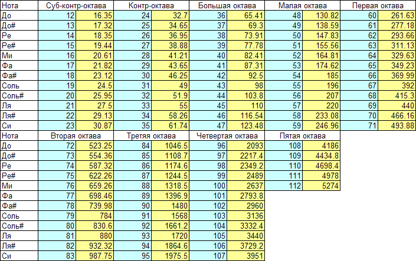

Все ноты поделены на октавы, по 7 нот в каждой + 5 полутонов (чёрные клавиши на пианино). Частоты нот соседних октав отличаются ровно в 2 раза.


Простейший музыкальный плейер содержит таблицу с последовательностью нот(нота+длительность) мелодии и таблицу с частотами нот. Для синтеза звука используется один из каналов таймера, который формирует меандр:

[https://www.youtube.com/watch?v=3ChSBh00tnU](https://www.youtube.com/watch?v=3ChSBh00tnU)

К сожалению, такой примитивный плейер имеет фиксированную форму волны (меандр), которая не очень-то похожа на реальные музыкальные инструменты, и может воспроизводить только одну ноту одновременно.

Реальная мелодия содержит как минимум две партии ( соло + бас ), к тому же при игре на пианино предыдущая нота всё ещё продолжает звучать, когда началась следующая. Это легко понять, вспомнив устройство пианино -- каждой ноте соответствует отдельная струна. Мы можем заставить звучать несколько струн одновременно, проведя рукой по клавишам.


В некоторых микроконтроллерах есть несколько каналов таймера, их можно использовать для воспроизведения нескольких нот одновременно. Но обычно эти каналы являются ценным ресурсом, и использовать их все -- нежелательно. Если мы, конечно, не делаем просто музыкальную шкатулку.
Итого, чтобы получить полифонию и различные звуки музыкальных инструментов, нужно использовать синтез звука.

## Синтез звука на AVR

hxMidiPlayer использует синтез звука и может воспроизводить полифонию с различными формами волны. Плейер рассчитывает амплитуду выходного сигнала в обработчике прерывания от таймера с частотой 8-22КГц ( насколько хватит мощности процессора; также зависит от формы волны и количества каналов ).

Принцип синтеза звука можно объяснить на примере синтеза синусоиды.

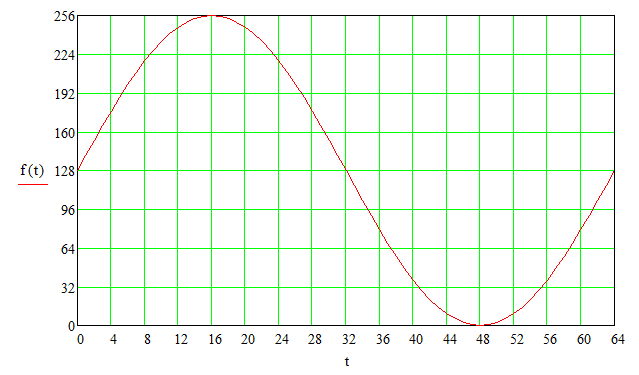

Возьмём таблицу размером 64, в каждой ячейке которой записаны значения амплитуды синуса в точках index * 2 * PI / 64 ( один период ):

```c
static const flash uint8_t s_sineTable[ 64 ] = {
  0x80, 0x82, 0x84, 0x86, 0x88, 0x8A, 0x8C, 0x8D, 0x8F, 0x90, 0x91, 0x93, 0x93, 0x94, 0x95, 0x95,
  0x95, 0x95, 0x95, 0x94, 0x93, 0x93, 0x91, 0x90, 0x8F, 0x8D, 0x8C, 0x8A, 0x88, 0x86, 0x84, 0x82,
  0x80, 0x7E, 0x7C, 0x7A, 0x78, 0x76, 0x74, 0x73, 0x71, 0x70, 0x6F, 0x6D, 0x6D, 0x6C, 0x6B, 0x6B,
  0x6B, 0x6B, 0x6B, 0x6C, 0x6D, 0x6D, 0x6F, 0x70, 0x71, 0x73, 0x74, 0x76, 0x78, 0x7A, 0x7C, 0x7E };
```

128 (0x80) соответствует нулю, 255 (0xff) -- наибольшей положительной точке, 0 -- наибольшей отрицательной точке.

Теперь допустим, мы будем выводить значения из таблицы на внешний ЦАП в прерывании от таймера, вызываемого с частотой 1000 Гц:

```c
static uint8_t s_index = 0;
// Timer1 output compare A interrupt service routine
interrupt [TIM1_COMPA] void timer1_compa_isr(void)
{
  SetDac( s_sineTable[ s_index] );
  if ( s_index == 63 )
  {
    s_index = 0;
  }
  else
  {
    s_index++;
  }
}
```

Что мы получим на выходе? Мы получим синусоидальные колебания с частотой 1000/64 Гц.

Теперь давайте увеличивать индекс в прерывании не на 1, а на два.
Очевидно, что частота выходных колебаний будет уже 1000/64 *2 Гц.

В общем случае, чтобы получить частоту F, нужно увеличивать индекс в таблице на:
add = F / 1000 * 64

Это число может быть дробным, но для получения высокой скорости работы используют fixed point arithmetic.

Количество записей в таблице и частота таймера влияют на качество синтезированного звука. В нашем случае достаточны 64 записи в таблице на период, и частота таймера 12kHz. Минимально приемлемая частота таймера -- 8кГц, идеальная -- 44кГц.

Очевидно, что при частоте таймера 12кГц мы сможем сгенерировать максимум 6кГц меандр, так как нужно сделать как минимум два переключения за период. Однако, частоты выше всё равно будут узнаваемы, если правильно рассчитывать состояние выхода на каждом тике таймера.

В таблицу можно внести значения для периода колебаний несинусоидальной формы и получить другой звук.

## Затухание

Если музыкальный инструмент основан на струнах( например, пианино), то после нажатия клавиши звук плавно затухает. Чтобы получить более естественное звучание синтезатора, необходимо плавно уменьшить амплитуду колебаний после старта ноты ("обернуть" колебания в форму затухания -- "envelope").

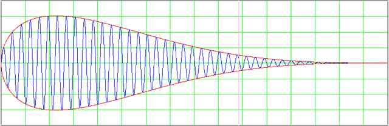

Плейер содержит таблицу затухания, которую использует для уменьшения амплитуды синуса (или другой формы волны) с момента старта ноты.
"Синус" "завёрнутый" в такую оболочку напоминает звук механической музыкальной шкатулки.

## Синтез меандра

Особая форма волны меандра позволяет значительно упростить синтез. Таблицы при этом не используются. Достаточно рассчитать, какое состояние (1 или 0) должен иметь выход при заданной частоте на текущем тике таймера. Это делается с помощью целочисленной арифметики, работает очень быстро, чем и объясняется популярность использования меандра для воспроизведения мелодий в 8-бит приставках.

Пример: объявляем счетчик:

```c
static uint16_t s_counter = 0;
```

который будем увеличивать на 0x8000 в каждом прерывании от таймера, а в порт будем выводить старший бит счётчика:

```c
// Timer1 output compare A interrupt service routine
interrupt [TIM1_COMPA] void timer1_compa_isr(void)
{
  PORTA.0 = ( s_counter >> 15 ) & 1;
  s_counter += 0x8000;
}
```

Поскольку 0x8000 + 0x8000 = 0x10000, происходит переполнение переменной s_counter, 17-й бит отбрасывается, и в переменную записывается 0x0000.
Таким образом, при частоте таймера 8КГц на выходе получится меандр 4КГц.
Если увеличивать счётчик на 0x4000, то получится меандр 2КГц.

В общем случае, можно получить частоту F, если прибавлять:
add = F / 8000 * 0x10000

Например, чтобы получить меандр частотой 1234Гц, нужно прибавлять 0x277C. Реальная частота немного будет отличаться от заданной, потому что мы округляем слагаемое до целого числа. В синтезаторе это допустимо.

## Синтез звуков реальных инструментов

Можно оцифровать звук ноты До пианино ( с помощью АЦП сохранить в памяти значения амплитуды звука через равные промежутки времени):
а потом воспроизвести звук ( с помощью ЦАП вывести записанные значения через равные промежутки времени ).

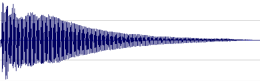

Указанные промежутки времени задаются "частотой семплирования", которая должна быть в диапазоне 4кГц -- 96кГц. Чем выше частота семплирования, тем выше качество записанного звука.

Так можно поступить со всеми нотами музыкального инструмента, чтобы иметь возможность воспроизводить любую ноту в нужный момент.
Но частота семплирования 8КГц означает, что для хранения одной секунды звука понадобится 8000 байт ( если каждый "семпл" хранить в переменной int8_t ).

Запись всех нот потребует слишком много памяти.

Можно поступить по-другому: у нас есть запись ноты До 1-й октавы. Нужно получить ноту До 2-й октавы. Мы знаем, что частота ноты 2-й октавы ровно в 2 раза выше частоты соответствующей ноты 1-й октавы. Поэтому, чтобы получить До-2 из До-1, нужно повысить Pitch До-1 на 12 полутонов: приняв весь звук за один период функции, разложить его на гармоники, увеличить частоту гармоник в 2 раза, и собрать обратно.
Очевидно, что это требует большого количества вычислений.

Поэтому часто применяется совсем упрощённый метод: если взять ноту До-1, записанную с частотой семплирования 8КГц, и воспроизвести её с частотой 16КГц, то получится До-2. То же самое можно получить, воспроизведя До-1 с частотой 8Кгц, но выбросив каждый 2-й семпл.
К сожалению, этот способ имеет существенный недостаток: полученная нота будет ровно в 2 раза короче. Если мелодия использует широкий диапазон нот, то музыка будет звучать не очень красиво, но при малом количестве доступной памяти с этим приходится мириться.
hxMidiPlayer позволяет загрузить звук ноты До-5 произвольного инструмента и воспроизводить мелодию этим инструментом.

## Синтез ударных

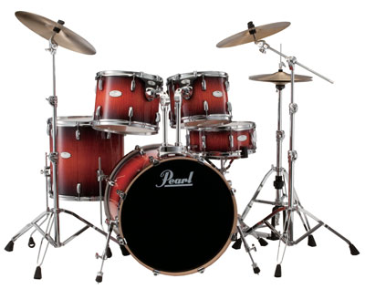

В общем случае, для синтеза ударных необходимо записать звуки барабанов и воспроизводить их в нужный момент. В 8-бит приставках вместо звуков барабанов используют "белый шум". Значения амплитуды для "белого шума" получают с помощью генератора случайных чисел. Затраты по памяти при этом -- минимальны.
hxMidiPlayer использует "белый шум" для синтеза ударных.

## Микширование каналов


Амплитуда звука на данном тике таймера рассчитывается для каждого канала отдельно. Чтобы получить финальное значение амплитуды, необходимо прибавить значения всех каналов. По-правильному необходимо корректировать сумму, так как воспринимаемая громкость подчиняется логарифмической зависимости, но в таком простом синтезаторе придётся обойтись простым сложением. Поэтому максимальная амплитуда каждого канала равна 255/N.

## Вывод звука из AVR


После проведения всех необходимый вычислений, плейер получает уровень сигнала, который нужно перевести в аналог. Для этих целей можно использовать внешний DAC или PWM.
Здесь следует заметить, что в обоих случаях полученный сигнал желательно отфильтровать -- убрать высокочастотные шумы, которые возникают из-за низкой частоты синтеза и округлений.

## Вывод на внешний параллельный DAC

Поскольку не имеет смысла использовать точные микросхемы DAC, в таких проектах обычно обходятся R2R матрицей:


При такой схеме мы просто выводим вычисленную амплитуду в порт:

```c
PORTB = sample;
```

Недостатки:
1) на выходе R2R матрицы получается слишком слабый сигнал, использование аналогового усилителя обязательно;
2) необходимо использовать как минимум 5 выводов ( а лучше 8 );
Этот метод оправдан только тогда, когда нет свободных PWM каналов.

( для экономии выводов можно воспользоваться внешним АЦП с SPI интерфейсом).

## PWM

Если есть свободный PWM канал, то проще всего воспользоваться именно этим способом.

Инициализация PWM ( ATMega8):

```c
// Timer/Counter 2 initialization
// Clock source: System Clock
// Clock value: 20000,000 kHz
// Mode: Fast PWM top=0xFF
// OC2 output: Non-Inverted PWM
ASSR=0x00;
TCCR2=0x69;
TCNT2=0x00;
OCR2=0x00;
```

И вывод сампла:

```c
void Player_Output( uint8_t sample )
{
  OC2 = sample.
}
```

Обычная практика использования PWM подразумевает сглаживание выходного сигнала с помощью RC фильтра:


К сожалению, после фильтрации сигнал слишком сильно ослабевает, поэтому для подключения динамика приходится делать аналоговый усилитель.

Чтобы упростить схему, лучше оставаться "в цифре" до самого динамика. Поскольку дешёвый динамик всё равно не может воспроизводить частоты выше 30кГц -- фильтровать их не нужно. Диффузор сам "отфильтрует" высокие частоты PWM.

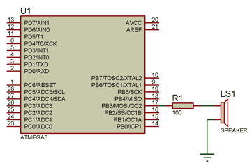

Если необходимо получить больший ток, можно применить усилитель на транзисторе. R1 выбирается так, чтобы обеспечить необходимый ток на динамике.


Так можно подключать небольшие динамики из игрушек:


Для динамиков побольше лучше собрать раскачку на 2-х транзисторах и поставить LC-фильтр, чтобы убрать шумы:


Конденсатор С1 служит для ограничения тока через динамик, когда ШИМ не работает. Также благодаря включению последовательного конденсатора, на динамик попадает сигнал, симметричный относительно нуля. Таким образом, диффузор динамика будет двигаться относительно центрального "расслабленного" положения, что положительно сказывается на качестве звука.
В данном случае транзисторы работают в ключевом режиме, поэтому компенсировать смещение базы не нужно.

## PWM, подключение к двум выводам

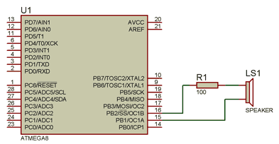

Недостатком первых двух схем является то, что на динамик подаётся ток одного направления. Если мы будем изменять направление тока, то громкость можно увеличить в 2 раза не превышая допустимую мощность. Для этого динамик подключается к двум выводам микроконтроллера -- неинвертированному и инвертированному, например OC1A и /OC1A. Если неинвертированный вывод отсутствует, можно использовать второй канал в инвертированном режиме (OC1B):

```c
// Timer/Counter 1 initialization
// Clock source: System Clock
// Clock value: 24500,000 kHz
// Mode: Fast PWM top=0x00FF
// OC1A output: Non-Inv.
// OC1B output: Inverted
// Noise Canceler: Off
// Input Capture on Falling Edge
// Timer1 Overflow Interrupt: Off
// Input Capture Interrupt: Off
// Compare A Match Interrupt: Off
// Compare B Match Interrupt: Off
TCCR1A=0xB1;
TCCR1B=0x09;
TCNT1H=0x00;
TCNT1L=0x00;
ICR1H=0x00;
ICR1L=0x00;
OCR1AH=0x00;
OCR1AL=0x00;
OCR1BH=0x00;
OCR1BL=0x00;
```

```c
void Player_Output( uint8_t sample )
{
  OCR1A = sample;
  OCR1B = sample;
}
```

## PWM, Два вывода, усилитель D-класса

Недостатком предложенных схем является потребляемый ток во время тишины.
"Тишина" у нас соответствует уровню сигнала 128, то есть ШИМ с 50% заполнением -- ток через динамик течёт всегда!

Немного изменив программную часть, можно получить достаточно мощный программно-аппаратный усилитель D класса:


```c
void Player_Output( uint8_t sample )
{
  if ( sample >= 128 )
  {
    TCCR2=0x21; //normal, clear on compare match
    TCCR2=0x21 | 0x80; //CLEAR OC2
    PORTC.0 = 0;

    TCCR2=0x69; //non-inverting PWM
    OCR2 = (sample-128) * 2;
  }
  else// if ( sample < 128 )
  {
    TCCR2=0x31; //normal, set on compare match
    TCCR2=0x31 | 0x80; //SET OC2
    PORTC.0 = 1;

    TCCR2=0x79; //inverting PWM
    OCR2 = (128-sample) *2;
  }
}
```

При этом одна пара транзисторов подключается к выходу PWM, вторая -- к обычному цифровому выходу.

Как видно из кода, мы рассматриваем сигнал выше 128 -- как ток, направленный в одну сторону, а сигнал ниже 128 -- как ток, направленный в другую сторону. При уровне 128 оба вывода динамика подключены к одному и тому же выводу источника питания, и ток отсутствует. При отклонении от уровня 128 заполнение PWM увеличивается, и через динамик течёт ток соответствующей полярности.

Важным моментом реализации является принудительное переключение вывода PWM в нужное состояние в момент переключения второго (обычного цифрового ) вывода (PORTC.0). Запись в регистр OCR2 буфферизируется, чтобы исключить "глюки" PWM. Нам же необходимо переключить вывод PWM сразу, не дожидаясь окончания периода.

Последняя схема IMHO является наилучшим вариантом в плане простоты, экономии энергии, и выходной мощности.

## Вывод звука с формой волны SquareWave


При синтезе меандра применяются упрощённые алгоритмы.

Каждый канал ( включая ударные ) выводит на выход либо 0, либо 1. Таким образом, 3-х канальный проигрыватель выводит на выход значения в диапазоне 0..3. Поэтому при использовании PWM процедура вывода выглядит:

```c
void Player_Output( uint8_t sample )
{
  OCR2 = sample * ( 255 / HXMIDIPLAYER_CHANNELS_COUNT );
}
```

Если же не использовать PWM, то для вывода 3-х канальной мелодии достаточно двух обычных цифровых выходов и 2-х битовой R2R матрицы.

## Формат MIDI

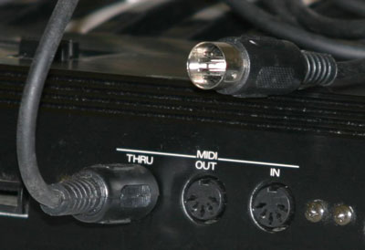

Стандартный MIDI-файл -- это специально разработанный формат файлов, предназначенный для хранения данных, записываемых и/или исполняемых секвенсором, секвенсор может быть как программой для компьютера, так и аппаратно выполненным модулем.

В этом формате хранятся стандартные MIDI-сообщения (то есть статус-байты и соответствующие им байты данных), а также временные метки или маркеры для каждого сообщения (то есть последовательности байтов, указывающие, какое количество условных единиц времени (импульсов, тиков) необходимо подождать перед тем, как исполнить следующее событие MIDI).
При реализации синтезатора нам важны только сообщения "старт ноты", "установка громкости ноты" и "установка инструмента". События "установка инструмента" необходимо обрабатывать, чтобы примерно знать длительность звука ноты и отличать ударные.

Если посмотреть на размер midi файлов, то обнаружится, что всё-таки они великоваты для AVR. Поэтому лучше сделать весь препроцессинг на PC и сохранить данные в свой формат, который будет содержать только события старта/остановки ноты на канале синтезатора:

```
{
    [тиков таймера подождать до этого события]
    [канал]
    [нота или 0 === отключить]
}
```

где нота 1...127 -- достаточно 7 бит, канал 0..15 -- достаточно 4 бита, а на delta выделим 13 бит, чтобы вместить событие в 3 байта:

```c
///=====================================================
///=====================================================
typedef struct
{
  //highest bit is highest for channel index
  uint8_t m_noteNumber;

  ///15-3 bits - Delta value, 2,1,0 bits - channel index
  uint16_t m_delta;
} TPlayerStateChange;
```

Код мелодии будет представлять собой массив структур TPlayerStateChange.

Midi файл может содержать до 16 каналов. Midi каналы не имеют отношения к каналам синтезатора. Midi каналы используются для того, чтобы можно было отключать некоторые партии ( бас, соло). Например, ноты для соло записывают на 1-м канале, а бас -- на 2-м канале. Для прослушивания только соло, отключают второй канал. Но часто все ноты просто идут в 1-м канале.
Ноты со всех каналов "разбрасываются" по каналам синтезатора.

## Компрессия мелодии


Если посмотреть на полученный код мелодии, то легко заметить, что в массиве используются повторяющиеся числа из небольшого диапазона. Это и понятно: в мелодии используется ограниченное количество нот в пределах 1-2 октав, темп мелодии фиксированный -- одинаковые задержки, количество каналов находится в диапазоне 0..15.
Всё это означает, что полученный массив можно значительно уменьшить, применив какой-нибудь алгоритм сжатия.
Алгоритмы типа ZIP дают хорошее сжатие, но также требуют много памяти для работы (словарь ZIP -- 64Кб). Мы можем применить очень простой метод сжатия, практически не требующий памяти, суть которого состоит в следующем.

В одной байте все числа равномерно распределены в диапазоне 0...255, и каждое число представляется 8-мью битами. В нашем случае некоторые числа встречаются гораздо чаще, чем другие. Если кодировать часто встречающиеся числа меньшим количеством битов, а реже встречающиеся -- большим, можно получить выигрыш по памяти.

Выбираем фиксированный способ кодирования: комбинации битов 000,001 и 010 (длина -- 3 бита) будут представлять 3 наиболее часто встречающиеся числа. Комбинации битов 0110, 0111 (длина -- 4 бита) -- следующие 2 наиболее часто встречающиеся числа и т.д:

```
 //000..010 - 0..2
 //011 x 3..4
 //100 xx 5..8
 //101 xxx 9..16
 //110 xxx 17..24
 //111 immediate
```

Комбинация, начинающаяся с 111 (длина -- 11 бит) будет кодировать все остальные числа.
Способ кодирования битами может быть другой. Я перепробовал несколько методов и выбрал этот, как дающий наилучшие результаты на таких данных.

Процедура сжатия выглядит так:
1. Подсчитать общее количество числа X в потоке для X = [0...255].
2. Отсортировать по уменьшению частоты появления в потоке.
3. Взять первые 25 чисел. Они будут кодироваться меньшим количеством бит.
4. Закодировать входной поток.

На выходе получаем массив из 25 наиболее часто встречающихся чисел и битовый поток.
Такая компрессия позволяет получить 50% сжатие при мизерных затратах памяти и производительности. К сожалению, код плейера при этом увеличивается, поэтому для коротких мелодий применять сжатие не рекомендуется.

## Хранение частот нот

Довольно накладно по памяти хранить частоты всех нот в таблице. На самом деле существует формула для определения частоты ноты по её midi номеру:

```
f = 2^((N - 69)/12) * 440, Гц
```

Но вычислять дробную степень достаточно сложно. Вместо этого плейер хранит 12 частот нот верхней октавы. Частоты нот нижних октав определяются уменьшением частоты в 2^Y более раз, где Y -- количество октав вниз.

## Дальнейшее развитие компресии

В мелодии часто встречаются повторяющиеся фрагменты ( "припевы", "куплеты" ). Найдя повторяющиеся фрагменты и представив мелодию в виде фрагментов, можно уменьшить мелодию ещё процентов на 50%, почти не затрачивая оперативную память и производительность. Я не стал реализовывать такой алгоритм, чтобы не усложнять проект.

## Описание ПО

Основное окно программы-конвертора:


Кнопка Load Midi позволяет загрузить midi файл. Программа сразу начинает воспроизведение файла с текущими выбранными параметрами, имитируя звук, который будет в "железе".

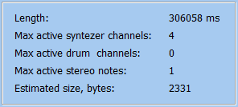

Окно информации (4) отображает:
- Length -- длина выбранного фрагмента мелодии в мс;
- Max Active syntezer channels -- максимальное количество одновременно активных каналов синтезатора;
- Max active drum channels -- максимальное количество одновременно активных каналов синтезатора, воспроизводящих "ударные";
- Max active stereo notes -- максимальное количество каналов, воспроизводящих одну и ту же ноту (см. ниже);
- Estimated size, bytes -- размер мелодии в байтах. В режиме "Custom Sample" размер отображается в виде A+B, где А -- размер мелодии, B -- размер семпла. Размер кода проигрывателя здесь не указывается.


Окно прогресса отображает текущее положение воспроизведения.
Можно кликнуть на progressbar, чтобы начать воспроизведение с указанного момента.
Input Box слева и справа позволяют указать начало и конец фрагмента мелодии в мс.

Метка "Not enought channels to play melody" красным цветом указывает, что для воспроизведения мелодии при текущих настройках недостаточно каналов синтезатора. Если проигрыватель не находит свободный канал, то выключает самую давнюю ноту. Во многих случаях это будет работать нормально. Увеличивать количество каналов имеет смысл только тогда, когда мелодия на слух звучит неправильно.

Настройки условно можно разделить на настройки проигрывателя и настройки обработки midi файла. Проигрыватель сможет воспроизвести полученный код мелодии, если конфигурация проигрывателя и код мелодии были созданы с одинаковыми настройками проигрывателя. Кроме того, проигрыватель сможет воспроизвести мелодию, код которой создан для проигрывателя с меньшим (но не бОльшим ) количеством каналов.


Аппаратные настройки проигрывателя включают:

- Sampling Rate -- частота синтеза. Максимальная частота синтеза определяется экспериментально. В расчёте на Atmega 16MHz, можно начать с 12000Гц для проигрывателя с 6 каналами, и повышать по желанию, пока в аппаратном проигрывателе на слух не станут заметны искажения мелодии. Максимальная частота зависит от количества каналов, формы волны и сложности самой мелодии.

- Waveform -- форма волны:
  - Square wave -- меандр;
  - Sine -- синус;
  - Sine + Envelope -- синус с затуханием;
  - Waveform * + Envelope -- различные варианты несинусоидальных волн с затуханием и без;
  - Custom Sample -- использовать семпл инструмента.

Кнопка "Load Sample" позволяет загрузить семпл из WAV файла. WAV файл должен быть в формате PCM 8-bit mono, 4173Гц, нота До-5. Hint: Можно повысить частоту и понизить ноту, но в настройках проигрывателя изменить Pitch. Никаких проверок формата не производится -- если формат другой, то звук будет воспроизводиться неправильно.
Pitch -- позволяет изменить высоту звука. Например, чтобы играть на 1 октаву выше, нужно выставить Pitch +12.

Use compression -- использовать сжатие мелодии.
Enable drums synteser -- включить синтезатор ударных.

Player Channels: количество каналов синтезатора ( максимальное количество нот, которые будут звучать одновременно).

Настройки обработки midi файла включают:


- Allow single active note per midi channel -- выключать предыдущую ноту на midi канале при старте следующей на этом канале.
- Suppress stereo notes -- подавлять одинаковые ноты. Некоторые midi файлы содержат одну и ту же партию на двух каналах с небольшим смещением по времени, чтобы получить стерео-эффект. К сожалению, это "забивает" каналы синтезатора. Одинаковые ноты желательно подавлять.
- Force Single Drum Channel -- воспроизводить ударные только на одном канале синтезатора.

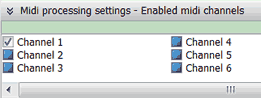

Checkbox позволяют выключить обработку указанного канала midi. Если на канале нет нот, то Checkbox будет неактивен.

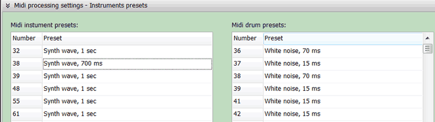

Настройки инструментов позволяют выбрать, какую длительность будут иметь ноты того или иного инструмента. Коды инструментов midi можно посмотреть здесь:
[http://www.midi.org/techspecs/gm1sound.php](http://www.midi.org/techspecs/gm1sound.php)

Обычно, такая тонка настройка не требуется. Эти настройки можно оставить по умолчанию.

## API плейера

Реализация плейера находится в файлах Common\hxMidiPlayer.c и Common\hxMidiPlayer.h. Эти файлы необходимо подключить к проекту. Также необходимо создать файл hxMidiPlayer_config.h, в который нужно поместить конфигурацию.
Плейер написан на C без ассемблерных вставок, что позволит легко портировать его на другие микроконтроллеры.

```c
extern void Player_StartMelody( const flash TMelody* _pMelody, uint16_t _delay );
```

Начать воспроизведение мелодии. _delay задаёт начальную задержку перед воспроизведением, 255 единиц = 1 секунда.

```c
void Player_Stop();
```

Прекратить воспроизведение мелодии.

```c
extern bool Player_IsPlaying();
```

Возвращает false, если воспроизведение мелодии завершено.

```c
extern void Player_WaitFinish();
```

Подождать, пока воспроизведение мелодии завершится.

```c
extern void Player_TimerFunc();
```

Эту функцию нужно вызывать в прерывании от таймера с частотой семплирования, заданной в конфигурации. Когда воспроизведение мелодии завершено, вызовы можно не делать.

```c
extern void Player_Output( uint8_t sample );
```

Должна быть реализована пользователем. Вызывается плейером, когда необходимо вывести следующий семпл.

```c
extern void Player_Started();
```

Должна быть реализована пользователем. Вызывается, когда плейер начинает воспроизводить мелодию. Может быть использована для настройки прерываний от таймера.

```c
extern void Player_Finished();
```

Должна быть реализована пользователем. Вызывается, когда плейер завершил воспроизведение мелодии. Может быть использована, чтобы отключить прерывания от таймера, или запустить воспроизведение другой мелодии.

```c
//#define NOTES_TO_EEPROM
//#define SINETABLE_TO_EEPROM
//#define ENVELOPE_TO_EEPROM
```

Эти строки нужно раскомментировать в файле hxMidiPlayer_config.h, если таблицу нот, таблицу синуса и таблицу затухания необходимо расположить в eeprom.

## Проекты-примеры

В архиве содержатся проекты-примеры:

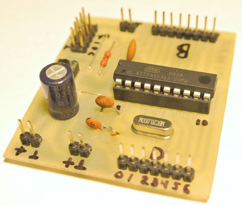

ATTiny2313Example -- проект для ATTiny2313, 20MHz, вывод PWM на PB3.


ATMega8Example -- проект для ATMega8, 24.5MHz, вывод PWM на PB3.

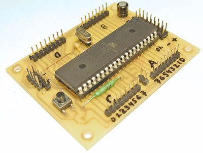

ATMega644Example -- проект для ATMega644, 25MHz, вывод PWM на PB3.

## Требования к памяти

Таблица. Размер плейера и мелодий во flash.

| Настройки плейера | Размер "голого" проекта с плейером для ATMega8, байт* | Потребление RAM, байт | Размер мелодии 1, байт | Размер мелодии 2, байт | Размер мелодии 3, байт |
|---|---|---|---|---|---|
| Square wave, 2 канала, 16000Гц | 1076 | 13 | 1029 | 2436 | 5742** |
| Square wave, 2 канала, 16000Гц, сжатие | 1708 | 21 | 742 | 1068 | 2700** |
| Square wave, 4 канала, 16000Гц | 1075 | 21 | 1236 | 2541 | 8646 |
| Square wave, 4 канала, 16000Гц, сжатие | 1707 | 29 | 938 | 1089 | 4319 |
| Sine + Envelope, 4 канала, 16000Гц | 1413 | 25 | 669 | 2670 | 4497 |
| Sine + Envelope, 4 канала, 16000Гц, сжатие | 2034 | 33 | 531 | 1582 | 2766 |

\*при добавлении плейера в имеющийся непустой проект, размер кода будет меньше

\*\*для нормального воспроизведения мелодии не хватает каналов

Мелодия 1: bach_minuet_in_g.mid, 35 сек
Мелодия 2: yiruma-river_flows_in_you.mid, 165 сек
Мелодия 3: Franz Schubert -- Serenade.mid, 217 сек

Как видно из таблицы, в минимальной конфигурации можно втиснуть достаточно длинную мелодию даже в ATTiny2313. Компрессия может дать более чем двукратное уменьшение мелодии, но размер кода плейера при этом увеличивается на ~600 байт.

Таблицы нот синуса и затухания можно поместить в EEPROM, сэкнономив примерно 16, 50 и 100 байт flash соответственно.

При использовании семпла из wav файла, к размеру кода плейера нужно добавить собственно размер семпла в байтах.

## Пример использования

В качестве примера использования плейера расcмотрим процесс создания музыкальной шкатулки.

Берём готовую шкатулку из МДФ:


В качестве микроконтроллера берём ATTiny85 в SO-8 корпусе как наиболее дешёвый с достаточно большим количеством памяти. Мы разгоним его до 27МГц, чтобы получить частоту синтеза 18Кгц при 4-х каналах Sine+Envelope.

Усилитель будет D-класса на на 4-х транзисторах, чтобы экономить батареи.


Транзисторы работают в ключевом режиме и могут быть любые. Дроссель L1 и конденсатор C6 подбираются по вкусу для получения звука без высокочастотных шумов. R1 и R2 можно поднять до 2К, чтобы снизить громкость и уменьшить дребезг динамика.

Печатная плата:

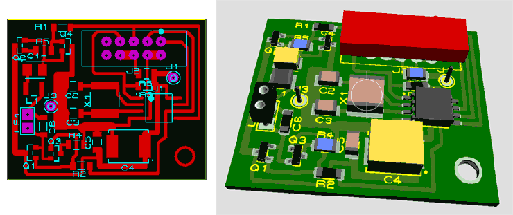

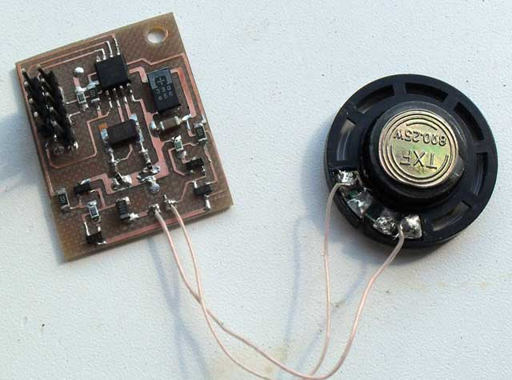

У шкатулки достаточно толстые стенки, чтобы вместить плату, динамик диаметром 3см и 3 батарейки AAA:

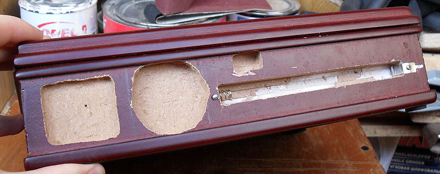

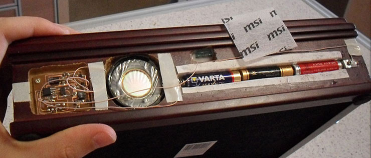

Конечный выключатель из дисковода подходит идеально, будто специально для шкатулки и создан (работает на размыкание -- при открывании крышки на плату подаётся питание):


Исходники прошивки находятся в каталоге ATTiny85MusicBox.

В 8Кб поместились:
1) плейер: 18000Гц, 4 канала, Sine+Envelope, Pitch+12, сжатие, воспроизводит мелодии по очереди ( последняя сохраняется в EEPROM )
2) Yiruma -- River Flows in You
3) Франц Шуберт -- Серенада
4) П.И. Чайковский "Октябрь"

Результат на видео:

[https://www.youtube.com/watch?v=hVL_nkzSY3c](https://www.youtube.com/watch?v=hVL_nkzSY3c)

## Дальнейшее развитие

В принципе, плейер можно и дальше "наворачивать", доведя до полноценного Midi или MOD плейера. Я лично считаю, что для получения высококачественной мелодии проще будет подключить SD карту и играть с нее любые WAV файлы с намного лучшим качеством, чем вообще возможно получить программным синтезом. И такой плейер программно и аппаратно на порядок проще. Ниша hxMidiPlayer -- добавление неплохого звука в готовые прокты, когда осталось пару ножек и немного места во flash. С этой задачей он справляется на "отлично" уже в существующем виде.

Думаю, на этом вопрос создания всяких музыкальных шкатулок/звонков на AVR можно закрыть :)

Линк для скачивания: [hxMidiPlayer](AVRMusic.rar) -- ПО (Delphi 2010), прошивки, исходники ( CodeVision AVR ) схемы, печатки (Proteus)

## Материалы

Playing music with ATMega328 PWM
[http://code.google.com/p/playing-music-with-atmega328-pwm/](http://code.google.com/p/playing-music-with-atmega328-pwm/)

Сенсорное пианино
[http://www.pic24.ru/doku.php/osa/articles/pk2_osa_piano](http://www.pic24.ru/doku.php/osa/articles/pk2_osa_piano)

The deMIDulator is a MIDI-controlled audio synthesizer, lo-fi audio sampler and PIC
[http://badhandshake.com/demidulator/](http://badhandshake.com/demidulator/)

Chiptunes on a PIC microcontroller
[https://www.youtube.com/watch?v=SsBf6Veq-Ps](https://www.youtube.com/watch?v=SsBf6Veq-Ps)

AVR MOD player
[http://elektronika.kvalitne.cz/ATMEL/MODplayer3/MODplayer3_eng.html](http://elektronika.kvalitne.cz/ATMEL/MODplayer3/MODplayer3_eng.html)

Wavetable Melody Generator
[http://elm-chan.org/works/mxb/report.html](http://elm-chan.org/works/mxb/report.html)
