# Модернизация мощного фонаря на светодиод 5 Ватт

*Статья опубликована на сайте [cxem.net](https://cxem.net/cms/drafts/637/preview/)* 

В результате бесконечного стремления производителя удешевить продукцию, на прилавки попадают товары такого качества, что их по-хорошему нужно бы запретить выпускать, иначе промышленность работает практически в мусорное ведро.

В качестве примера берём фонарь, фирмы "Doberman":
Внешне выглядящий надёжно, на поверку внутри содержит свинцовый аккумулятор 6V 7А/ч, выключатель и лампочку 6V 20W.

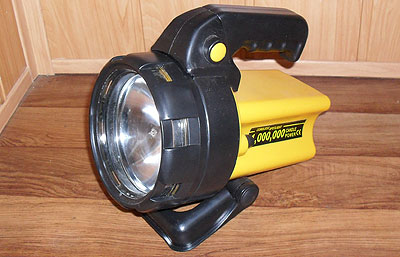

Все, кто знаком с условиями эксплуатации свинцово-кислотных аккумуляторов, знают, что эти аккумуляторы не терпят глубокого разряда. Буквально: десяток глубоких разрядов и хранение в разряженном состоянии полностью "убивают" аккумулятор. То есть стоит несколько раз оставить такой фонарь включенным – аккумулятор можно выбрасывать, так как лампочка 20W легко садит его в ноль.

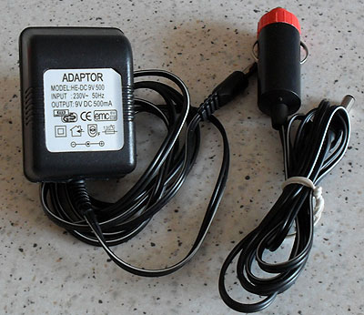

Во вторых, для заряда аккумулятора прилагается "зарядное устройство", которое представляет собой блок питания 9V 500mA. Для ограничения тока заряда в фонарь установлен резистор 10Ом. Если оставить фонарь на заряд больше суток, аккумулятор "закипит" и опять же быстро придёт в негодность.

В таком состоянии он и попал ко мне: аккумулятор выдавал 3.7 В и заряжаться не желал.
Просто покупать новый аккумулятор не имело смысла, поэтому я решил добавить внутрь фонаря контроллер заряда и заодно переделать на мощный светодиод.

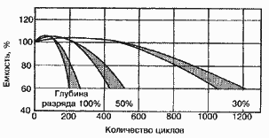

Электронная начинка фонаря должна включать в себя драйвер мощного светодиода и контроллер заряда/разряда аккумулятора. Задача драйвера – обеспечивать стабильный ток на светодиоде. Задача контроллера заряда – обеспечить правильный режим заряда аккумулятора. Задача контроллера разряда – отключить аккумулятор от нагрузки при снижении напряжения ниже установленного предела, для предотвращения глубокого разряда.

## Схема

Существуют специализированные микросхемы драйверов светодиодов и контроллеров заряда. Для меня в данном случае было удобнее применить распространённый микроконтроллер ATTiny26 для контроля всех параметров. В отличие от блоков питания, где требуется высокая скорость реакции на изменение тока, в зарядом устройстве и драйвере светодиода скорость работы микроконтроллера более чем достаточна.

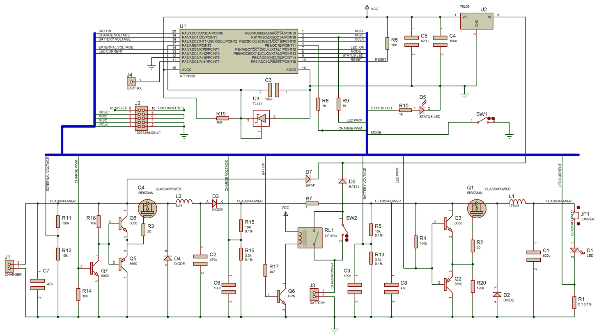

Микроконтроллер контролирует факт подключения зарядного устройства и его напряжение, ток заряда, напряжение на аккумуляторе, и ток светодиода с помощью ADC входов 1,2,3,4,5 соответственно (ток заряда вычисляется из разности напряжений External Voltage и Charge Voltage).

Прошивка рассчитана на использование двухпозиционного выключателя SW2.
Герконовое реле RL1 подключает батарею к зарядному устройству, если внешнее питание подключается при выключенном переключателе SW2.

Диод D6 – любой диод с низким падением напряжения, стабилизатор U2 – желательно с низким падением напряжения, но подойдёт и обычный. При напряжении 5.8В на батарее, напряжение на контроллере при использовании диода BAT31 и стабилизатора 78l05 составляет 4.5В, что приемлемо.

Все биполярные транзисторы работают в ключевом режиме, и поэтому могут быть заменены на аналогичные с учетом максимального тока коллектора.

Диоды D2,D3 и D4 – диоды Шотки, например – 5820.

Резисторы R15,R16,R5,R13 – высокоточные, или подобранные обычные ( важно обеспечить равенство отношений R15:R16, R5:R13 – по падению напряжения измеряется ток заряда).

Дроссели взяты из компьютерного БП без перемотки. Измеренная реальная индуктивность указана на схеме.

## Описание работы

Если зарядное устройство отключено, контроллер подключает нагрузку ( 5Вт светодиод D1 ) и контроллирует выходной ток. Если напряжение батареи снижается ниже 6В, начинает медленно мигать светодиод D5(скважность – 25%), сигнализируя о низком заряде батареи.

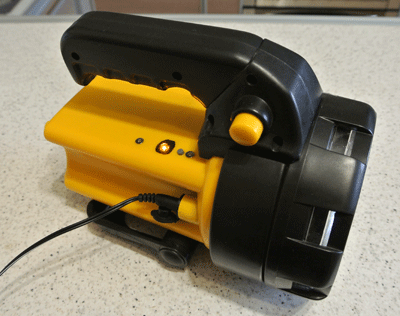

Нажатие на кнопку SW1 переключает два режима яркости свечения ( 0.9A и 0.45А).
При снижении напряжения на батарее ниже 5.8В, нагрузка отключается.

Алгоритм заряда:

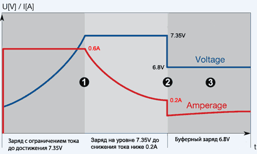

При подключении зарядного устройства светодиод D1 отключается, и контроллер начинает процесс заряда аккумулятора. В первой фазе работает ограничение тока заряда 0.6А и ограничение напряжения на батарее 7.35В. Светодиод D5 быстро мигает со скважностью 50%.

Контроллер также контролирует уровень напряжения с зарядного устройства. При снижении внешнего питания ниже 7.3В, ток заряда будет ограничиваться ( считается, что подключен блок питания низкой мощности). В качестве внешнего источника может применяться блок питания 9-19В или переходник на "прикуриватель".

При достижении стабильного напряжения на батарее 7.2В…7.35В, контроллер начинает отслеживать, снизился ли зарядный ток ниже 0.2А. Светодиод медленно мигает со скважностью 50%.

После снижения зарядного тока или по истечению 2-х часов, контроллер переключается standby режим заряда – напряжение на батарее удерживается на уровне 6.8В. В этом режиме аккумулятор может находиться длительное время без вреда. Светодиод D5 горит.

Нажатием на кнопку SW1 можно включить фонарь во время заряда. При этом его ток ограничен 0.3А, чтобы обеспечить нормальный режим заряда аккумулятора.

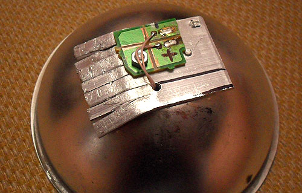

## Прошивка

При программировании контроллера нужно снимать перемычку X1, так как в процессе заливки прошивки на светодиод может пойти очень большой ток. Нечаянные эксперименты показали, что 5W светодиод кратковременно выдерживает 3А, так что в процессе разработки ни один светодиод не умер.

Фюзы:

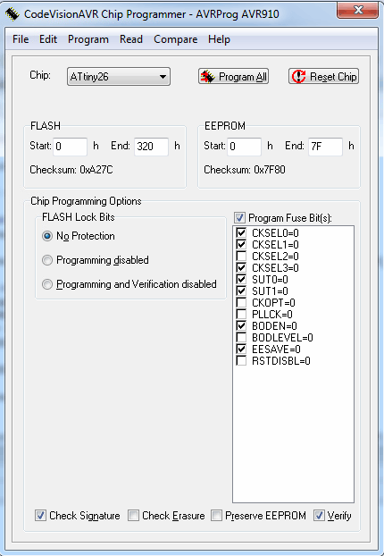

Максимальное значение выходного тока можно ставить не больше 1.249A, поскольку при резисторе 0.1Ом и умножителе x20 это как раз предел измерения ADC. Чтобы увеличить ток, проще всего взять резистор поменьше, или убрать умножитель на x20 в прошивке.

Я пробовал запускать светодиод на 1.2А – полевик не греется. Но сам светодиод греется очень сильно, пришлось доработать радиатор. В итоге решил поставить 0.9A для исключения перегрева – диод работает в закрытом корпусе, т.е. охлаждаться ему некуда. Такой яркости вполне достаточно.

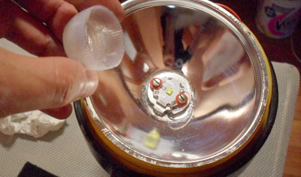

Если номиналы элементов не соответствуют схеме, нужно внести точные значения в исходник прошивки и перекомпилировать ( все константы определены в начале файла main.c ).

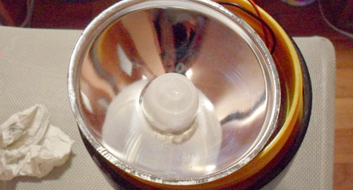

## Настройка

Перед первым включением вместо светодиода D1 нужно подключить резистор 2 Ом 5 Вт, или оригинальную лампочку. Устройство включаем и проверяем наличие прямоугольных импульсов LED PWM. Проверяем ток через нагрузку – падение напряжения на резисторе R1 должно быть около 0.9В.

Подключаем внешний блок питания. Реле RL1 должно включиться, а нагрузка отключиться. Проверяем наличие прямоугольных импульсов Charge PWM.

В течении заряда контролируем напряжение и ток на аккумуляторе ( см. график выше ).

Если что-то не так, то в прошивке нужно включить вывод отладочной информации ( раскомментировать соответствующие функции stx_string() ) и проверить, что видит микроконтроллер. К пину A7 подключают UART вход, чтобы увидеть отладочную информацию (19200N1).

## Печатная плата

Внутри фонаря достаточно места, конструкция выполнена на выводных деталях:

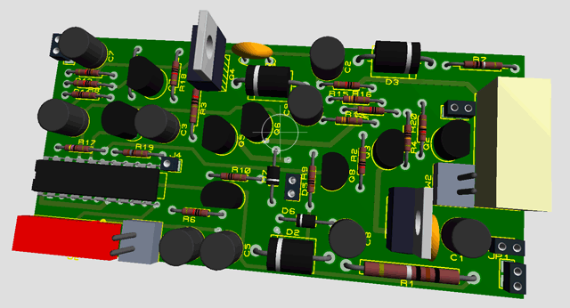

**По сути, предложенная схема является контроллером свинцового аккумулятора с ограничением максимального тока. Её можно применять и в других устройствах, например – детском автомобиле с аккумулятором 6V.**

Схема, печатка, прошивка (исходники Codevision AVR): [lighter_src.zip](lighter_src.zip)

Откомпилированная прошивка для номиналов, указанных в схеме. Ток светодиода – 0.9А, ток заряда – 0.6А, напряжение окончания "быстрого" заряда (cycle use) – 7.35В, standby режим: 6.8В: [lighter_hex.zip](lighter_hex.zip)

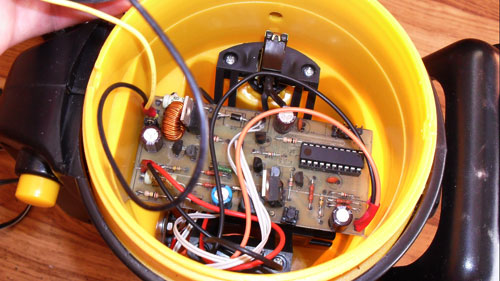

p.s. Через месяц фонарь перестал работать… При попытке зарядить аккумулятор напряжение быстро поднималось до максимума, как будто аккумулятор "выкипел" и больше не принимал заряд. Я было расстроился: наверно в прошивке ошибка, убил аккумулятор… Детальная проверка показала, что сопротивление китайского выключателя SW2 при токе в ампер возрастало до 100 Ом, что и не давало контроллеру функционировать нормально. После замены выключателя схема возобновила нормальную работу.

## Материалы

- [Cree® XLamp® XT Family LEDs](http://www.cree.com/~/media/Files/Cree/LED%20Components%20and%20Modules/XLamp/Data%20and%20Binning/XLampXTE_BL.pdf)
- [AVR450: Battery Charger for SLA, NiCd, NiMH and Li-Ion Batteries](http://www.gaw.ru/pdf/Atmel/app/avr/AVR450.pdf)
