# Распознавание ИК команд с помощью UART на AVR

*Статья опубликована на сайте [cxem.net](http://cxem.net/ik/2-21.php)*

## Введение


О распознавании команд с инфракрасного пульта написано много статей. В-основном, речь идёт о протоколе RC5 от пультов Philips [1]. Этот протокол не единственный и не самый распространённый. Хорошее описание других форматов на русском языке можно найти в документе [2].

Во всех найденных мною статьях распознавание производится чтением состояния датчика TSOP в строго определённые моменты времени ( в обработчике прерывания от таймера или в основном цикле программы ). Однако в моём последнем проекте мне нужно общаться с внешним устройством со строгими временными задержками, из-за чего приходится запрещать прерывания на периоды до 2мс. Этот факт делает невозможным опрос состояния датчика TSOP с требуемой точностью ( раз в 560мкс +-100мкс ).

Так родилась идея использовать UART как "хитрый" сдвиговый регистр. В полученной реализации при декодировании NEC-подобного протокола необходимо неспешно опрашивать состояние датчика лишь раз в 4мс, при этом сам микроконтроллер может находиться в idle mode или даже в power down mode!

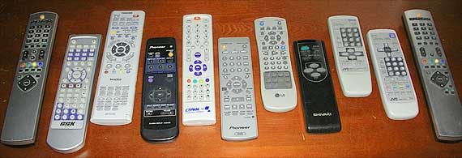

## ИК протоколы

Не вижу смысла повторять описание протоколов ИК пультов – они описаны достаточно хорошо в статье [2]. Обозначу лишь основные моменты:

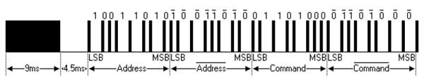

ИК-посылка на примере протокола NEC состоит из Mark pulse(9мс), Space pulse(4.5мс) и последовательности импульсов данных.

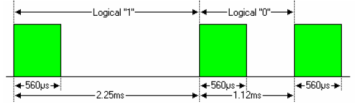

В разных протоколах биты данных кодируются по-разному, но длина импульса одной полярности всегда равна или кратна длине импульса противоположной полярности (разницу в несколько микросекунд можно игнорировать, так как накопленная ошибка в течении посылки не мешает декодированию. Важно, что в середине импульса можно получить значение бита).

Следует отметить, что на выходе датчика TSOP показанный сигнал будет инвертирован:

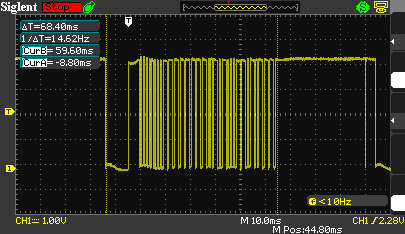

Для декодирования команды необходимо синхронизироваться с фронтом первого импульса данных, подождать его середины (280мкс), и продолжить опрос состояния датчика каждые 560мкс:

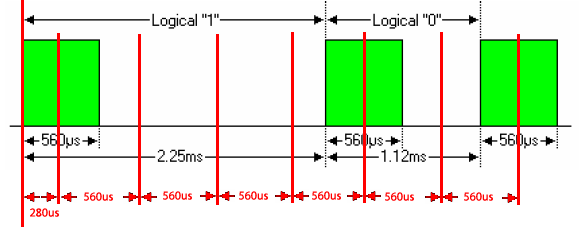

Моменты опроса датчика должны быть соблюдены достаточно точно (не более +-100мкс).

Если временнЫе промежутки соблюсти невозможно, то программное декодирование работать не будет. Нужно искать какое-то другое решение. Решением "в лоб" было бы использовать второй микроконтроллер, или специализированную микросхему-декодер.

Однако стоит вспомнить, что "на борту" у AVR есть масса устройств, которые можно попробовать применить не по назначению :)

## UART протокол

UART использует простой последовательный протокол [3]:

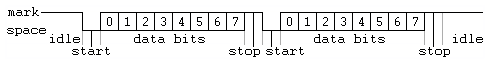

При простое линия держится в стоянии "1". Начало передачи определяется спадающим фронтом "стартового" бита (0). Далее следуют биты данных, далее – бит четности (может не использоваться ), далее – один или два стоповых бита (1). То есть после передачи байта линия возвращается в состояние 1, и цикл передачи начинается снова. Длины всех битов одинаковы и равны 1/Baud rate.

Протокол UART не совместим с ИК протоколами.

Однако, если забыть о UART протоколе и рассматривать приёмник UART как сдвиговый регистр с таймером и синхронизацией по спадающему фронту, то окажется, что он подходит для распознавания (почти) любых последовательностей.

О том, как именно работает приёмник UART, можно прочесть в даташите на AT90USB162[4].

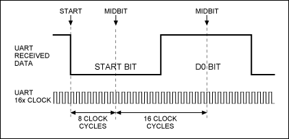

После определения спадающего фронта приёмник делает паузу длинной ½ бита, после чего проверяет, что линия всё еще в "0" ( valid start bit detection).

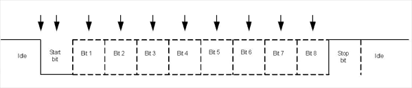

После этого начинается цикл приёма битов данных, без всяких проверок, через промежутки, равные длине бита. Биты данных "заезжают" в сдвиговый регистр приёмника, а первый стоповый бит – в флаг FE в инвертированном виде.

Если описать весь этот процесс упрощенно, то в режиме 7N1 приемник ждёт спадающего фронта, после чего читает вход 8 раз через равные промежутки времени. Но именно так и работает программное декодирование ИК протокола, описанное выше!

## Распознавание ИК команд с помощью UART

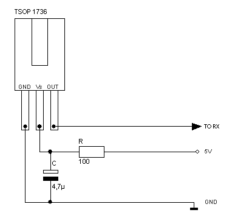

Давайте посмотрим что будет, если "скормить" сигнал с ИК приёмника в UART.

Мой пульт использует протокол с временнЫми промежутками как в протоколе NEC[2], хотя сам формат команды отличается.

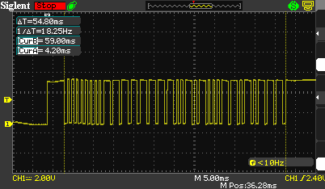

Настроим UART в режим 7N1 ( 7 бит данных, без битов чётности, 1 стоповый бит). Baud rate установим в 1.000.000 / 560мкс = 1786 бод.

Импульс Mark длиной 9мс ("0" на выходе датчика TSOP ) будет принят приёмником как 0000000b с ошибочным стоповым битом:

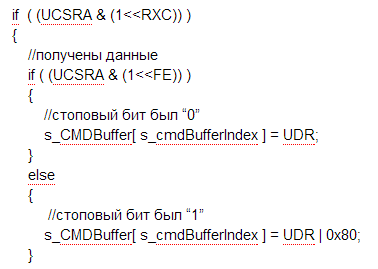

После этого приёмник будет ждать следующего спадающего фронта (пропустит до конца Mark и весь Space ). С началом ИК посылки приёмник синхронизируется на середину бита (560мкс / 2 = 280 мкс ) и прочитает 7 бит данных + стоповый бит:

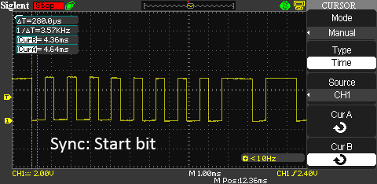

После приёма 7+1 бит, UART будет ждать следующего спадающего фронта, причём если последний бит был "0", то линия должна сначала вернуться в "1". В этот момент у нас происходит некий "пробел" в приёме, что делает невозможным точное декодирование ИК протоколов, в которых биты кодируются длиной импульсов. Но даже в этом случае уникальный пакет будет формировать уникальные данные в приёмнике UART. Поскольку задачей является не декодирование содержания команды, а распознавание посылки, такая ситуация нас полностью устраивает.

## Реализация

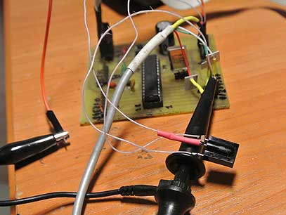

Пример написан на Codevision AVR 2.05 для ATMega8A, кварцевый резонатор 8МГц.

Основной цикл программы опрашивает состояние UART каждые 4мс и записывает полученные данные в циклический буфер длиной 12 байт. Длина буфера выбирается исходя из длины ИК посылки.

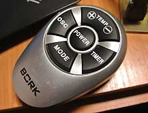

У моего пульта посылка имеет длину 54мс. 54000 / 560 = 96 бит или 12 полных байт. Выбираем 11 байт и +1 для стартового нулевого (разбирать всю посылку не обязательно, но очень важно, чтобы посылка привела к зацикливанию буфера). Для пультов, у которых длина посылки отличается в зависимости от кнопки, алгоритм будет чуть сложнее ( здесь обсуждаться не будет).

После приёма очередного байта проверяется, является ли следующий байт в циклическом буфере нулевым. Нулевой байт означает, что мы получили уже 11 байт посылки, и пора реагировать на команду.

Пример выводит на терминал( 9600N1 ) CRC32 полученной команды, байты команды и символьное представление посылки:

[Видео: Демонстрация работы](https://www.youtube.com/watch?v=0atAirktwn0)

После получения кодов можно уменьшить ложные срабатывания, раскомментировав секцию:

```
( readCMDBuffer( s_cmdBufferIndex ) == 0 ) &&
( readCMDBuffer( s_cmdBufferIndex + 1 ) == 0x95 ) &&
( readCMDBuffer( s_cmdBufferIndex + 2 ) == 0x95 ) &&
( readCMDBuffer( s_cmdBufferIndex + 3 ) == 0xB7 ) &&
( readCMDBuffer( s_cmdBufferIndex + 4 ) == 0xB7 ) &&
( readCMDBuffer( s_cmdBufferIndex + 5 ) == 0xB7 )
 (выше вставить заголовок кодов своего пульта)
```

Под "ложными срабатываниями" здесь подразумевается определение помех как команды с каким-то кодом, а не ложное срабатывание правильной кнопки.

## Улучшения

1. Если использовать UART в режиме 9 бит данных, 1 паритет и 1 стоп, то период опроса можно ещё увеличить.

2. Приведённый алгоритм не проверяет время, прошедшее между приёмом байтов. Проверяя, можно уменьшить ложные срабатывания.

3. Во время ожидания команды микроконтроллер может находиться в idle mode и просыпаться по прерыванию от UART.

4. В Power down mode UART не работает. Но если соединить RX с INT0, то это даст возможность выводить микроконтроллер в нормальный режим для приёма команды.

## Заключение

Алгоритм опробован в реальном устройстве и показал отличные результаты.

## Материалы

1. [RC-5](http://en.wikipedia.org/wiki/RC-5)
2. [Инфракрасное дистанционное управление (PDF)](http://labkit.ru/userfiles/file/documentation/Remote_control/A.Tores_Infrakrasnoe_distancionnoe_upravlenie.pdf)
3. [Wikipedia – UART](http://ru.wikipedia.org/wiki/%D0%A3%D0%BD%D0%B8%D0%B2%D0%B5%D1%80%D1%81%D0%B0%D0%BB%D1%8C%D0%BD%D1%8B%D0%B9_%D0%B0%D1%81%D0%B8%D0%BD%D1%85%D1%80%D0%BE%D0%BD%D0%BD%D1%8B%D0%B9_%D0%BF%D1%80%D0%B8%D1%91%D0%BC%D0%BE%D0%BF%D0%B5%D1%80%D0%B5%D0%B4%D0%B0%D1%82%D1%87%D0%B8%D0%BA)
4. [AT90USB162 datasheet (PDF)](http://www.atmel.com/images/doc7707.pdf)

Исходные коды статьи:

[IRDecoderUART.rar](IRDecoderUART.rar)
