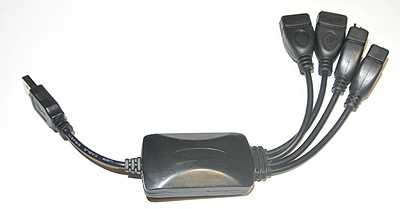
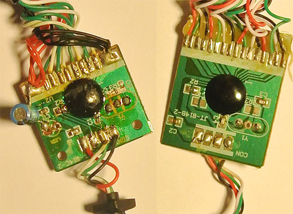
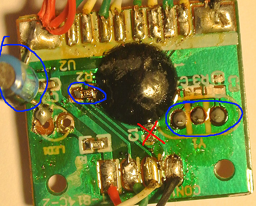
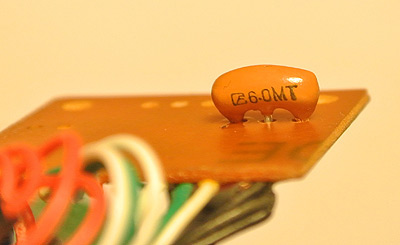
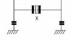

# Ремонт китайского USB Hub

*Статья опубликована на сайте [cxem.net](https://cxem.net/remont/remont63.php)* 

Решил поделиться этой информацией, так как такими хабами сейчас завален [eBay](https://cxem.net/magazines/ebay.php) и [AliExpress](https://cxem.net/magazines/aliexpress.php). Наверняка такая же проблема может быть с хабами в другом корпусе.

Первый экземпляр HUB был куплен на PandaWill вместе с Android mini PC, протестирован и отправлен на полку, так как зависал и отваливался каждые 30 секунд.

Обнаружив на AliExpress похожий HUB с заверениями, что он "предоставляет 4 USB 2.0 порта", я заказал этот товар. Через 2 недели, к своему разочарованию, получил точно такое же устройство из дешёвой пластмассы без опознавательных знаков:

Но! В этот раз хаб, по крайней мере, работал. При подключении, Windows радостно сообщал о новом устройстве "USB 2.0 Hub", хотя на самом деле все порты у хаба USB 1.0, скорость которых не превышает 1Мб/сек.

После вскрытия обоих экземпляров обнаружились почти одинаковые платы с чёрной кляксой контроллера. Как я и предполагал, причиной зависания первого хаба было отсутствие керамического резонатора. Очевидно, он (кое-как) работал от RC генератора.

Платы устройств немного отличаются, но нумерация компонентов совпадает.

Собственно ремонт заключается в:

1. впаивании отсутствующего керамического резонатора Y1 на 6МГц;
2. впаивании резистора R2 номиналом 1,5кОм (предполагаю, что он включает использование резонатора);
3. добавлении конденсатора по питанию 47мкФ 6.3В;
4. выпаивании конденсатора C1 (судя по всему - часть RC генератора);
5. впаивании конденсаторов С3 и C4 номиналом 22пФ с ножек резонатора на корпус.

Резонатор можно найти в некоторых моделях мышек:

Конденсаторы C3 и C4 используются в случае двуногих резонаторов:

У меня резонатор трёхногий, поэтому C3 и C4 я не впаивал.

После указанных манипуляций хаб заработал стабильно.
