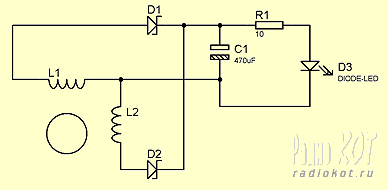
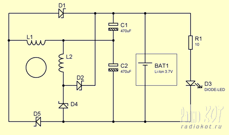
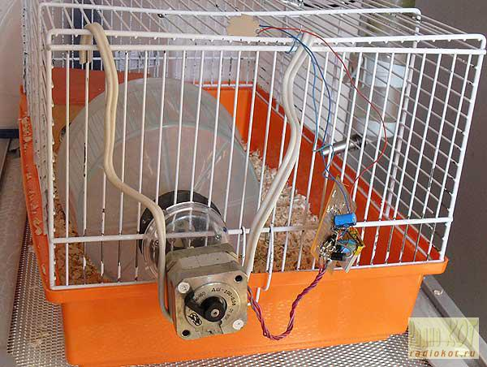

# Биомеханическая энергия мелких грызунов как возобновляемый источник энергии

*Статья опубликована на сайте [radiokot.ru](https://radiokot.ru/lab/hardwork/99/)* 
*Статья - призер конкурса "Поздравь Кота по-человечески 2014!"* 

Рост цен на энергоносители и ограничение ресурсов ископаемого топлива сделали существенным требование для альтернативных решений в области производства электроэнергии во всем мире. В то же время, увеличивается спрос на энергию, особенно в регионах с высоким уровнем промышленного развития. Промышленно развитые страны также стремятся уменьшить свою зависимость от импорта нефти, газа, угля и урана.

Это причины, из-за которых возрастает значимость возобновляемых источников энергии на рынке электроэнергии. Увеличение их использования повышает региональный вклад в значение поколения - аспект, которым не следует пренебрегать. Эти виды энергии вносят значительный вклад в странах с недостаточно развитой инфраструктурой: большие сегменты населения снабжаются энергией, как, например, при электрификации сельских районов.

До недавнего времени по целому ряду причин, прежде всего из-за огромных запасов традиционного энергетического сырья, вопросам развития использования возобновляемых источников энергии в энергетической политике уделялось сравнительно мало внимания. В последние годы ситуация стала заметно меняться. Необходимость борьбы за лучшую экологию, новые возможности повышения качества жизни людей, участие в мировом развитии прогрессивных технологий, стремление повысить энергоэффективность экономического развития, логика международного сотрудничества – эти и другие соображения способствовали активизации национальных усилий по созданию более зеленой энергетики, движению к низкоуглеродной экономике.

Однако, наряду с ветроэнергетикой, солнечной энергетикой и другими широкоизвестными альтернативными технологиями, несправедливо мало внимания уделяется колоссальным запасам энергии, которая валяется или буквально бегает под ногами - биомеханической энергии мелких грузынов.

Среди широкого разнообразия подотряда мышеобразных стоит выделить такого представителя, как хомяк домашний.

В литературе встречается информация, что в природе хомяк может пробегать до 12 км в сутки (методика измерения нам неизвестна, к сожалению). В домашних условиях можно замерить, сколько километров хомяк пробегает в колесе. Люди с техническим складом ума легко делают приспособление, фиксирующее количество оборотов колеса. Результаты для сирийского хомяка: 6-10 км за ночь, скорость – от 2 до 3,6 км в час.

[Видео: Хомяк в колесе](https://www.youtube.com/watch?v=DhIVtGS3-dk)

При использовании двух и более подопытных, можно получить практически безостановочный источник вращательного момента:

[Видео: Два хомяка в колесе](https://www.youtube.com/watch?v=YyDMEYzFUeQ)

Бег является неотъемлемой частью жизни хомяка, потому наличие колеса или диска в клетке, можно сказать, является необходимостью.

Хотя в недавнее время стали известны исследования по преобразованию сокращательных движений мышц в электрическую энергию с использованием пьезоэлектрических нанотрубок[1], по сравнению с традицонным преобразованием механической энергии большая часть мощности остаётся неиспользованной:

[Видео: Пьезоэлектрические нанотрубки](https://www.youtube.com/watch?v=P9x1myxGzVQ)

Поэтому в качестве генератора всё же стоит рассматривать классические электрические машины, придав особое внимание снижению потерь на трение, чего можно добиться, использовав хорошие подшипники, например, из тахометров производства СССР.

В качестве миниатюрных генераторов могут служить генераторы из самозарядных фонарей, двигатели постоянного тока из игрушек, выпускаемых промышленностью КНР, или самостоятельно изготовленные генераторы на основе неодимовых магнитов. С сожалению, эти приборы требуют высокой скорости вращения вала, и поэтому работают неудовлетворительно.

С самой лучшей стороны в данном приложении себя показывают биполярные шаговые двигатели, которые вырабатывают большое количество энергии даже при слабом вращении вала. Предпочтение следует отдавать двигателям с наименьшим сопротивлением вращению, поскольку животное весом меньше 200г неспособно обеспечить высокий крутящий момент.

Переменное напряжение, снятое с обмоток биполярного двигателя, необходимо выпрямить и подать на нагрузку, которой может служить 1Вт белый светодиод:

В качестве выпрямительных диодов лучше использовать диоды Шоттки с низким падением напряжения.

Для получения максимального КПД можно построить двухполупериодный выпрямитель:

В качестве элемента, запасающего электрическую энергию, может выступать Li-Ion батарея небольшой мощности от радиоуправляемого вертолёта или мобильного телефона, но обязательно с платой защиты от перезаряда и переразряда.

Несколько оборотов колеса обеспечивают непрерывное свечение светодиода на протяжении 30 секунд.

*Общий вид установки, собранной для демонстрации подрастающему поколению принципов генерации электрической энергии*

Видео работы:

[Видео: Демонстрация работы установки](https://www.youtube.com/watch?v=Z7I_TOyNfIY)

**Всех начинающих радиолюбителей с 1 апреля!**

## Литература

1. Converting Biomechanical Energy into Electricity by a Muscle-Movement-Driven Nanogenerator
   [https://pubs.acs.org/doi/abs/10.1021/nl803904b](https://pubs.acs.org/doi/abs/10.1021/nl803904b)

2. Yandex - реферат
   [https://vesna.yandex.ru/](https://vesna.yandex.ru/)

3. Другие источники в интернете.
