# Интерактивная подсветка телевизора + Mood lamp + Beat detector

*Статья опубликована на сайте [cxem.net](https://cxem.net/sound/light/light94.php)* 

Представляю свой вариант интерактивной подсветки телевизора на RGB ленте.

Собственно, заинтересовался этой идеей давно, но не делал законченное устройство из-за того, что для работы требовалось использовать ноутбук. Но недавно появилось ПО для Android, которое заработало на медиаплеере Freelander AP10 даже лучше, чем на PC.

## Введение


Вкратце для непосвящённых. Интерактивная подсветка монитора или телевизора подсвечивает стену за телевизором в соответствии с изображением на экране. Такой эффект выглядит красиво и делает просмотр фильма более зрелищным.

В данный момент существуют полностью аппаратные решения с анализом потока HDMI, но это закрытые проекты и сложные в изготовлении устройства.

Поэтому распространение получили устройства с использованием PC в качестве источника изображения, где на PC устанавливается специальное ПО, которое управляет устройством подсветки.

Само устройство в простейшем случае может представлять из себя Arduino Uno с напрямую подключенной светодиодной лентой.

Существует несколько вариантов устройств со своим ПО: [Lightpack](https://github.com/Atarity/Lightpack-docs/blob/master/RUS/%D0%9E_%D0%BF%D1%80%D0%BE%D0%B5%D0%BA%D1%82%D0%B5.md), [Paintpack](http://paintpack.ru), [Adalight](http://www.adafruit.com/products/461), [Boblight](https://code.google.com/p/boblight/), [Ardulight](https://code.google.com/p/ardulight/) и др.

### Видео работы:

[https://youtu.be/WZPNB0-d4Vw](https://youtu.be/WZPNB0-d4Vw)

### Возможности устройства:

- аппаратная совместимость с Lightpack, работа в режиме интерактивной подсветки с управлением от PC или Android медиаплеера (USB);
- включение, выключение, переключение режимов с пульта дистанционного управления (ИК);
- регулировка яркости с ПДУ;
- включение/выключение одной внешней нагрузки (акустической системы) с ПДУ;
- автономный режим "Mood lamp";
- автономный режим "цветомузыка" (звук прослушивается со встроенного микрофона);
- режим, в котором цветомузыка влияет на Mood lamp или интерактивную подсветку.

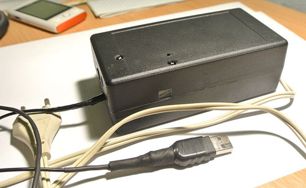

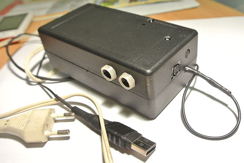

## Выбор RGB ленты

Учитывая большие размеры телевизора, я решил использовать RGB ленту, чтобы обеспечить равномерную подсветку зон вместо чётко различимых круговых пятен от отдельных светодиодов, и одновременно максимально уменьшить длину проводов, висящих за телевизором.

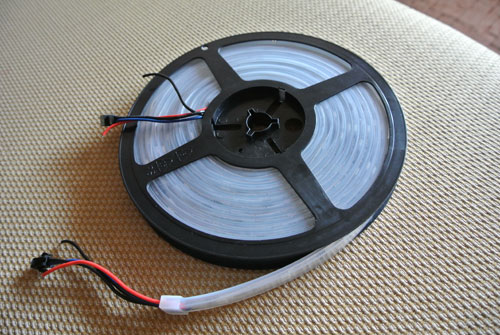

В продаже имеются RGB ленты нескольких видов. Нас интересуют ленты с индивидуально адресуемыми светодиодами (или группами светодиодов по 3), построенные на светодиодах RGB5050. Они отличаются:

1. количеством светодиодов на метр (30 или 60);
2. чипом, на котором построены (WS2801 или WS2811, или аналоги);
3. индивидуально адресуемые, или группами по 3 светодиода;
4. напряжением питания: 12В или 5В;
5. наличием влагоизоляции.

Поскольку разница в цене между 30 и 60 светодиодами - 2 раза, и между чипами ws2801 и ws2811 - ещё 2 раза, на EBay была куплена 5м бобина "12V 5m WS2811IC digital magic RGB 5050 SMD led strip waterproof IP66 in Silicone" за $43 с доставкой, и к ней 12В 2А блок питания.


В этой ленте каждые 3 светодиода подключены последовательно к одному чипу WS2811.

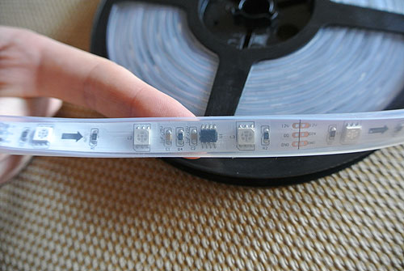

Номинальный ток светодиодов - 20мА на цвет. Итого на 1 метр получаем:

```
20мА * 3 цвета * 30/3 групп = 600мА/метр
```

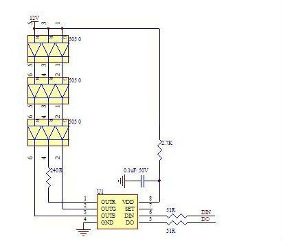

30 светодиодов хватает, чтобы нормально смотреть фильм вечером. Для дневного просмотра лучше брать ленту на 60 светодиодов на метр.

Чип WS2801 управляется по SPI интерфейсу (слушает линии Data и Clock). Программная реализация не составляет труда.

Однако чип WS2811 управляется по однопроводному интерфейсу со строгими временными интервалами. Обрыв посылки приводит к применению частично полученных данных. К счастью, в сети уже доступны процедуры для управления лентами на WS2811. Единственно, что нужно понимать - это то, что во время посылки данных, прерывания должны быть запрещены. На одну группу светодиодов уходит:

```
1.25us * 24bit = 30us
```

Для 27 зон:

```
27 * 30us = 810 us
```

Запрет прерываний на указанный промежуток времени может вызвать некоторые проблемы (об этом позже).

## Выбор ПО

Как известно, главное в интерактивной подсветке - это ПО для хоста. Среди нескольких вариантов я остановился на ПО [Prizmatik for Lightpack](https://github.com/Atarity/Lightpack-docs/blob/master/RUS/%D0%9E_%D0%BF%D1%80%D0%BE%D0%B5%D0%BA%D1%82%D0%B5.md), так как этот проект имеет внятные планы развития и получил поддержку на KickStarter. Ну и решающим фактором стало обещание выпустить ПО для Android.

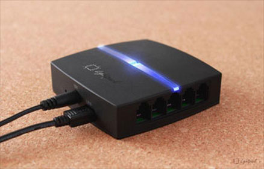

Поэтому "железо" было решено делать аппаратно совместимым с Lightpack (то есть USB устройством на AT90USB162), поскольку интерфейсы AdaLight/Ardulight под Android поддерживать никто не обещал (и в итоге именно так и случилось).

Android медиаплеер Freelander AP10 достаточно производителен, чтобы просматривать 720p фильмы с программным декодером в MX Player (с аппаратным декодером ПО Lightpack не работает).

Один Lightpack поддерживает 10 зон. В моем случае получилось 27 зон, поэтому я решил переделать прошивку так, чтобы моё устройство "прикидывалось" 3-мя Lightpack'ами.

Прошивка была оптимизирована по памяти, и были добавлены ещё 2 HID интерфейса.

Несмотря на это, дополнительные зоны в ПО не появлялись.

После двухдневного поиска ошибок в прошивке оказалось, что в Prizmatik для Windows дополнительные зоны появляются только при запуске со специальным ключиком (`--wizard`), а Prizmatik для Android просто не поддерживает более одного устройства!


В последней прошивке для Lightpack появился запрос серийного номера устройства. Prizmatik for Windows (ПО для Lightpack) нормально определяет несколько подключенных устройств без серийного номера. Мне не удалось выяснить, является ли причиной проблемы отсутствие серийного номера в моём устройстве, так как исходные коды ПО для Android авторы не выкладывали в свободный доступ. Засубмиченый баг пока оставлен без внимания. К сожалению, серийным номер является свойством устройства, а не интерфейса, поэтому принципиально невозможно назначить уникальный серийный номер каждому HID интерфейсу в пределах одного чипа.

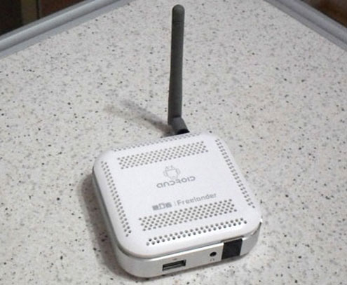

В итоге, поскольку устройство собиралось для использования с Android медиаплеером, я переделал прошивку так, чтобы 10 зон интерполировались в 27 зон ленты, и на этом пока закончил.

## Принципиальная схема

[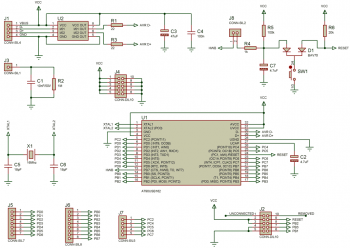](images/11.png)

Устройство собрано на основе моей отладочной платы на AT90USB162, к пинам которой подсоединены дополнительные модули.

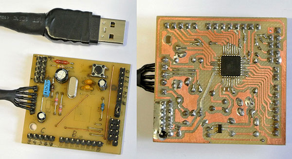

[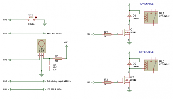](images/13.png)

## Модуль реле

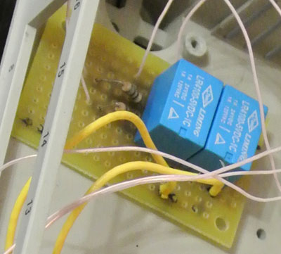

Модуль реле собран на монтажной плате. Оба реле на 5В, коммутируют 220В. Реле RL1 включает 12В блок питания для светодиодной ленты. Реле RL2 подает 220В на внешнюю нагрузку - в моём случае, это акустическая система, не имеющая своего пульта управления.

## Приёмник ИК комманд

Приёмник TSOP4836 приклеен к корпусу возле окошка из оргстекла и подключен к основной плате. R1 и C1 смонтированы навесным монтажом на ножках приёмника.

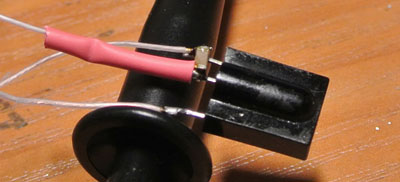

Я использовал пульт от нагревателя.

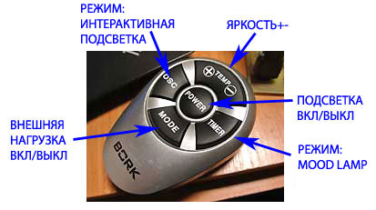

В интернете можно найти множество статей о том, как распознавать команды с ИК пульта. Но в данном изделии нас ждёт засада, которая заключается в том, что для управления RGB лентой на чипах WS2811 нужно запрещать прерывания на время, превышающее длину бита ИК команды. Программное декодирование ИК команд работать не будет.

Поэтому специально для этого устройства я разработал способ аппаратного декодирования команд с помощью UART модуля микроконтроллера.

Кнопка SB1 запускает процедуру обучения кнопок пульта. Лента мигает красным цветом четыре раза. Теперь нужно по два раза нажать кнопки, соответствующие On/Off, External On/Off, Mode: Backlight, Mode: MoodLamp, Brightness+, Brightness-. Когда первая кнопка обучена, зажигается один сегмент ленты и т.д.

Цветомузыка (beat detector) включается/выключается повторным нажатием на кнопки выбора режима.

## Beat Detector

[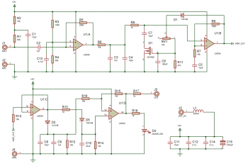](images/17.png)

Схема подсмотрена [здесь](http://tim.cexx.org/?page_id=374). Beat Detector выдаёт "1", когда обнаружен пик сигнала.

В данном приборе реализация должна быть полностью аппаратной, поскольку:
1. в микроконтроллере отсутствует АЦП;
2. прерывания запрещаются на большие периоды.

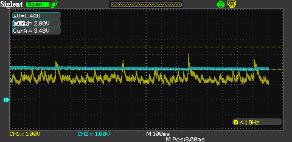

На U1:A и собран предварительный усилитель, на выходе которого фильтром R6C3C4 обрезаются высокие частоты. На U1B и Q1 собран каскад усиления с АРУ. Его выход усиливается каскадом U1:C. Цепочки D2C8C9R12 и D5C10R14 представляют собой два пик-детектора, работающих на разных частотах (см. осциллограмму). Последний каскад U1:D представляет собой компаратор, на выходе которого появляется "1", когда замечен пик сигнала.

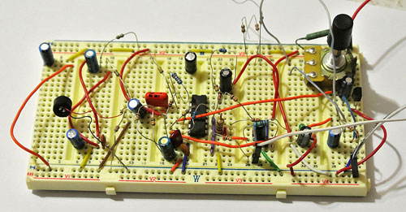

Это наиболее сложная часть схемы. Требует настройки с осциллографом.

Рекомендуется отладить эту часть схемы с питанием от 4-х AA аккумуляторов, так как питание с USB порта содержит большое количество пульсаций и синфазных помех, которые могут полностью перекрывать слабый сигнал с микрофона.

Электретный микрофон должен быть как можно большего размера. Микроскопические микрофоны из телефонный гарнитур показали себя плохо, так как выдавали очень слабый сигнал и плохо реагировали на низкие частоты.

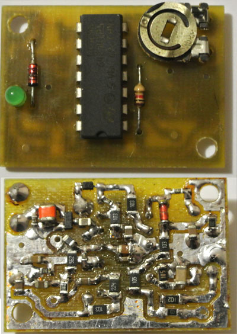

Прошивка добавляет "вспышку" светодиодов на каждый удар, игнорируя возможное дребезжание на выходе детектора. Такой алгоритм не идеален, поскольку детектор может часто пропускать пики. Лучше будет работать "автогенератор", подстраивающийся под частоту детектора. Так, человек продолжает некоторое время считать ритм, даже если прекратились ударные.

Поскольку сейчас сохраняется неопределённая ситуация с ПО Android, то я решил временно сохранить упрощённый алгоритм пока непонятно, сколько оперативной памяти можно выделить под это дело.

## Прошивка

Прошивка представляет собой сильно изменённую прошивку Lightpack.

На данный момент проверены только режим эмуляции 3-х Lightpack и режим интерполяции одного Lightpack на 27 зон.

Макрос `LIGHTPACKS_COUNT` задаёт количество эмулируемых устройств Lightpack.

Макрос `RESAMPLE` включает интерполяцию 10 зон Lightpack на большее число зон RGB ленты.

При этом необходимо указать, как именно интерполировать зоны.

Макросы `LZ_***` задают положение зон Lightpack на раскладке Andromeda.
Макросы `RZ_**` задают положение зон ленты на телевизоре.

В моем случае начало ленты находится в правом нижнем углу. Лента оборачивает 37" телевизор против часовой стрелки, создавая 27 зон (по 3 светодиода в зоне).

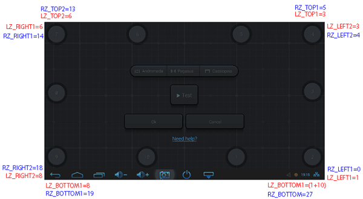

Устройство прошивается аналогично Lightpack, через USB порт. Процесс описан [здесь](https://github.com/Atarity/Lightpack-docs/blob/master/RUS/%D0%9E_%D0%BF%D1%80%D0%BE%D0%B5%D0%BA%D1%82%D0%B5.md).

## Корпус

Устройство собрано в корпусе 130х65х45. Блок питания был разобран и помещён в корпус конструкции, внутрь алюминиевого экрана.

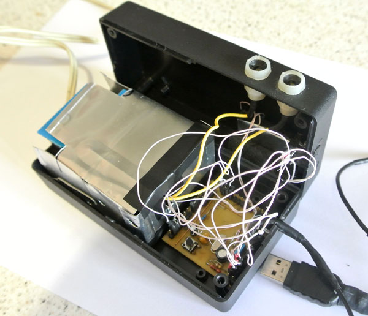

Исходники прошивки, схемы, печатные платы (Proteus) находятся в прикреплённых архивах.

## Материалы

1. [Бесконтактная цветомузыка для RGB-ленты](https://cxem.net/sound/light/light55.php)
2. [Das Blinkenlichten – wearable lighting](http://tim.cexx.org/?page_id=374)
3. [Союз-1 - Цветомузыкальные установки](http://lightportal.at.ua/publ/cvetomuzykalnye_ustanovki/sojuz_1/3-1-0-18)
4. [Simple beat detector](http://engineeringentropy.wordpress.com/2013/05/24/a-simple-beat-detector/)
5. [An ambilight system for WS2811 RGB strips](https://github.com/rosterloh/ambilight)
6. [Driving the WS2811 at 800KHz with a 16MHz AVR](http://bleaklow.com/2012/12/02/driving_the_ws2811_at_800khz_with_a_16mhz_avr.html)
7. [Lightpack - USB-подсветка монитора для усиления эффекта присутствия](https://github.com/Atarity/Lightpack-docs/blob/master/RUS/%D0%9E_%D0%BF%D1%80%D0%BE%D0%B5%D0%BA%D1%82%D0%B5.md)
8. [Lightpack — ambient backlight for your displays (Kickstarter)](https://www.kickstarter.com/projects/woodenshark/lightpack-ambient-backlight-for-your-displays)
9. [Lightpack — content-driven lighting system](http://lightpack.tv/)
10. [Paintpack - Интерактивная подсветка](http://paintpack.ru)
11. [Adalight - DIY Ambient Monitor Lighting Project Pack](http://www.adafruit.com/products/461)
12. [Boblight - Boblight is a collection of tools for driving lights connected to an external controller](https://code.google.com/p/boblight/)
13. [Ardulight - Интерактивная подсветка](https://code.google.com/p/ardulight/)
14. [Распознавание ИК команд с помощью UART на AVR](https://cxem.net/ik/2-21.php)
15. [Das Blinkenlichten – wearable lighting](http://tim.cexx.org/?page_id=374)
16. [WS2811 Datasheet](http://solderingsunday.com/wp-content/uploads/2014/01/ws2811.pdf)
17. [Lightpack bug database](https://code.google.com/p/lightpack/issues/detail?id=355)

## Список радиоэлементов

| Обозначение | Тип | Номинал | Количество | Примечание |
|-------------|-----|---------|------------|------------|
| U1 | МК AVR 8-бит | AT90USB162 | 1 | |
| U2 | Защитный диод | USB6B1 | 1 | |
| R1, R3 | Резистор | 22 Ом | 2 | |
| R2 | Резистор | 1 МОм | 1 | |
| R4 | Резистор | 1 кОм | 1 | |
| R5 | Резистор | 100 кОм | 1 | |
| R6 | Резистор | 20 кОм | 1 | |
| C1 | Конденсатор | 10нФ 50В | 1 | |
| C2, C7 | Конденсатор | 4,7мкФ 6.3В | 2 | |
| C3 | Конденсатор | 47мкФ 6.3В | 1 | |
| C4 | Конденсатор | 100нФ 6.3В | 1 | |
| C5, C6 | Конденсатор | 18 пФ | 2 | |
| D1 | Выпрямительный диод | BAV70 | 1 | |
| X1 | Кварцевый резонатор | 16 МГц | 1 | |
| J1-J7 | Разъем | DIL-40 | 1 | |
| SW1 | Кнопка | | 1 | |

## Прикрепленные файлы

- [LightpackFW_mod.zip](LightpackFW_mod.zip) (2080 Кб)
- [Schematics_proteus.zip](Schematics_proteus.zip) (448 Кб)
- [https://github.com/psieg/Lightpack](https://github.com/psieg/Lightpack)
