# Оцифровка игрушечной железной дороги

*Статья опубликована на сайте [radiokot.ru](https://www.radiokot.ru/konkursCatDay2014/28/)* 
**Статья заняла 1 место в конкурсе статей "Поздравь Кота по-человечески 2014"**

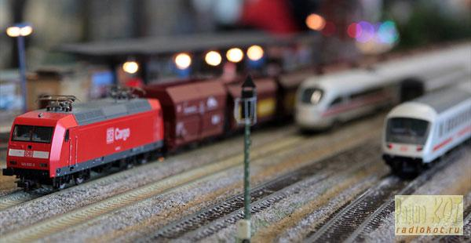

После того, как у ребёнка появились два стартовых набора Piko, а также из гаража был расконсервирован набор моего детства Piko Junior производсва ГДР (такой, наверно, был у всех), управлять тремя локомотивами простой крутилкой вперёд-назад стало не интересно. Захотелось "цифровое управление".

В настоящее время можно приобрести готовые декодеры для локомотивов, бустер, пульт и приводы стрелок для оцифровки железной дороги, вложившись в сумму до $400. Но в результате этого будут получены абсолютно бесполезные знания о совместимости декодеров, протоколов, специальному программному обеспечению, магазинах, как купить и т.д.

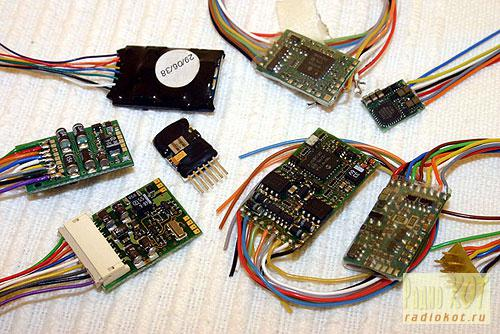

Поэтому была поставлена задача самостоятельно сделать раздельное управление локомотивами и стрелками с Android-планшета, чтобы научиться делать сверхминиатюрные платы и общаться со своими устройствами по Bluetooth.

**Всего предстоит оцифровать:**

Тепловоз из набора Piko Junior ( год производства - ~1985 ):

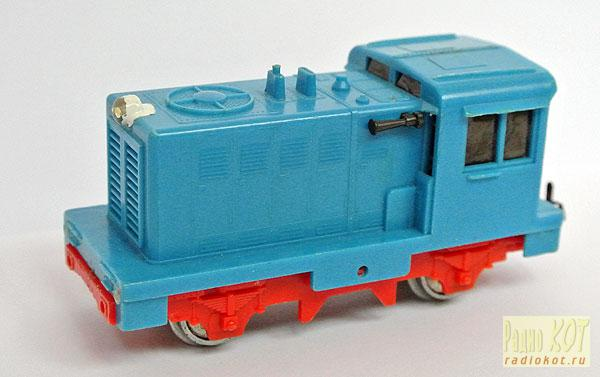

Паровоз из набора Piko Starter Kit 57160:

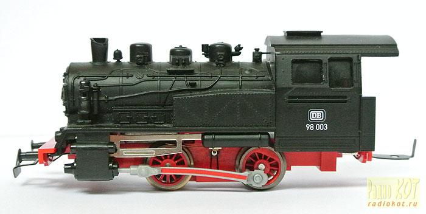

Локомотив из набора Piko Starter Kit 57175:

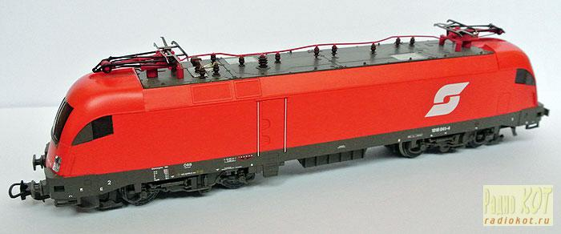

Три стрелки Piko 55221:

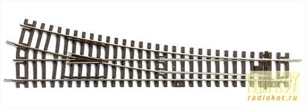

## Как работает раздельное управление локомотивами

Как известно, в обычной железной дороге управление осуществляется простым пультом, который регулирует величину и полярность напряжения, подаваемого на рельсы. Двигатель локомотива через колёсные пары подключается к рельсам.

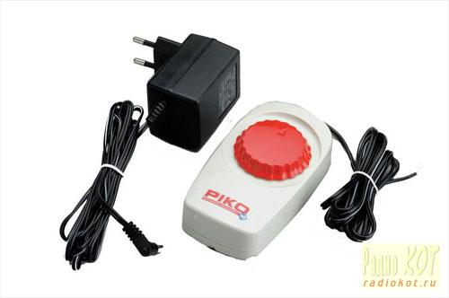

Для раздельного управления, двигатель и фонари локомотива подключаются к рельсам через плату-декодер.

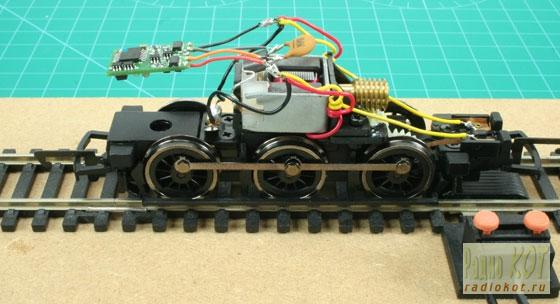

К рельсам подключается пара Control Station - Booster, которые по паре рельс подают на плату декодера питание и сигналы управления одновременно.

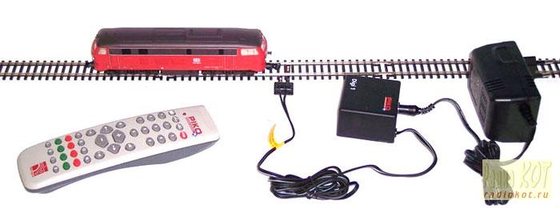

Управление железной дорогой, в простейшем случае, осуществляется ИК-пультом.

Приёмник ИК сигналов расположен на Control Station, которая формирует управляющие сигналы для Booster. Booster формирует на рельсах переменное напряжение, смодулированное управляющими сигналами. Booster и Control Station часто совмещены в одном устройстве.

Декодеры различной степени "навороченности" также могут содержать проигрыватель звуков локомотива, генератор дыма паровоза, контроль скорости локомотива с обратной связью, поддержку плавных стартов/остановок.

Мне предстояло сделать Control Station + Booster с приёмом команд по ИК и Bluetooth, три декодера локомотивов и три декодера стрелок.

## Передача команд по рельсам

В стандартной реализации передача данных осуществляется по протоколу DCC[8]. На рельсы подаётся переменное напряжение, промодулированное цифровым сигналом. Это не синусоида, а переключение полярности постоянного напряжения 12В. Единицы и нули формируются импульсами разной длительности:

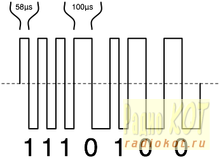

Декодер содержит выпрямительные диоды, которые формируют постоянное напряжение питания для микроконтроллера и двигателя.

Микроконтроллер декодирует поступившие команды и управляет двигателем и фонарями локомотива. Каждый локомотив имеет уникальный номер и обрабатывает команды, посланные только ему.

В сети можно найти программную реализацию протокола DCC[9], а также открытые проекты DCC Control Station[6] с кучей "наворотов". Однако попытки по-быстрому "врубиться" в исходники библиотеки привели к выводу, что быстрее будет сделать упрощённую систему управления на своём простейшем протоколе, а в дальнейшем, при большом желании, написать исходники для работы по стандарту DCC. Нужно ставить себе конечные задачи - иначе ребёнок вместо игры будет наблюдать папу, постоянно копающегося с паяльником. Совместимость со стандартом в задачу не входит.

## Формат пакета данных

В качестве протокола выбран простой формат, похожий на протокол RC5 ИК пультов. В режиме простоя станция передаёт "единицы". Начало пакета обозначают 8 "нулей". Дальше следуют 16 бит данных, и эти же 16 бит в инвертированном виде.

Импульс шириной 100 мкс - "1".  
Импульс шириной 200 мкс = "0".

Тишина:

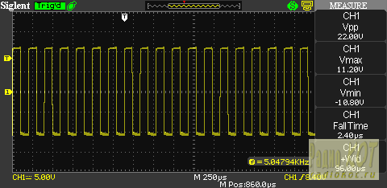

Пакет данных:

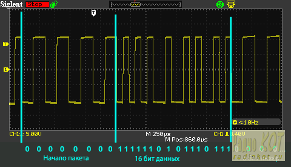

16 бит данных содержат: 5 бит - идентификатор устройства, 5 бит - команда, и 6 бит - данные для команды:

Один модуль декодера содержит:
- 1 канал PWM с переключением полярности ( для мотора );
- 2 PWM канала для фонарей (программный PWM);

В декодере стрелки PWM канал двигателя управляет сервоприводом.

**Таблица. Список команд.**

Прямая установка скважности PWM двигателя не применяется. Вместо этого, в декодере настраиваются "минимальная", "малая" и "большая" скорость, и локомотиву передаются команды установить соответствующую скорость. Это позволяет в будущем реализовать плавный разгон/торможение в самом декодере.

## Control Station и Booster

Блок питания, контрольная станция, бустер, bluetooth модуль и приемник ИК сигналов собраны в небольшом железном корпусе, который одновременно является радиатором для LM7812.

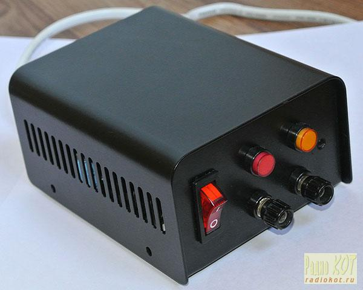

На переднюю панель выведены:
- выключатель питания;
- клеммы;
- индикатор короткого замыкания;
- индикатор соединения Bluetooth;
- датчик ИК сигналов.

Контрольная станция и бустер расположены на отдельных платах. Это дает возможность менять блок питания и бустер для получения бОльшей мощности.

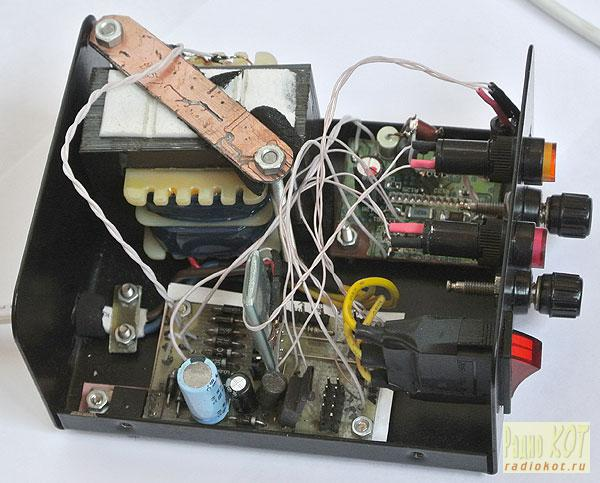

Я использовал трансформатор 14В 1А, что позволяет питать три локомотива со средним током потребления 300ма. Блок питания принципиально выбран классический трансформаторный, а не импульсный, чтобы обеспечить бОльшую безопасность.

Стабилизатор LM7812 устанавливается на корпус через изолирующую прокладку. Гальванической связи между корпусом и схемой нет.

### Контрольная станция

Контрольная станция построена на микроконтроллере Atmega168, к которому подключены датчик ИК сигналов TSOP4836 и готовый Bluetooth модуль BT_BOARD v1.03.

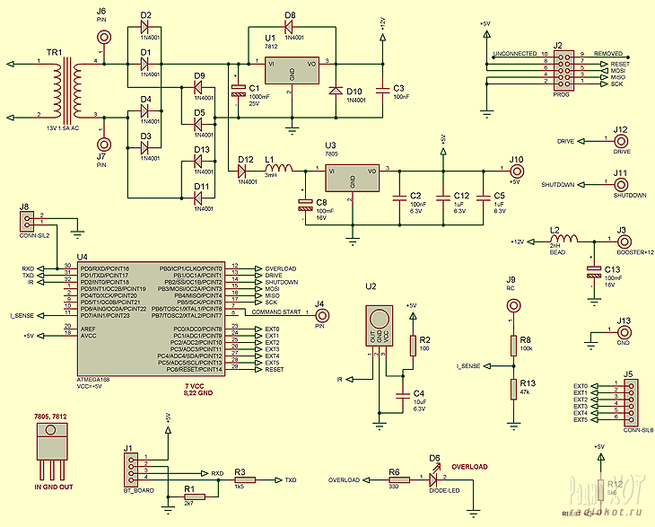

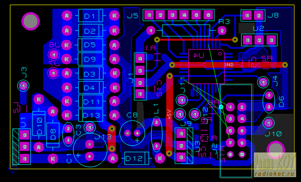

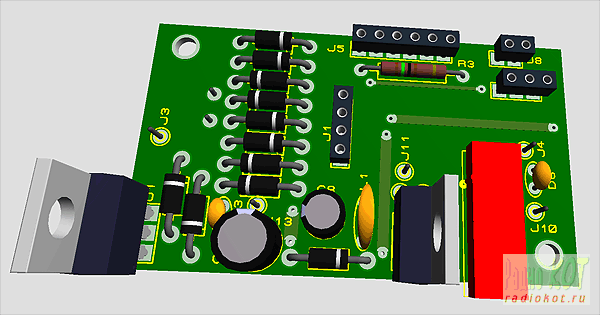

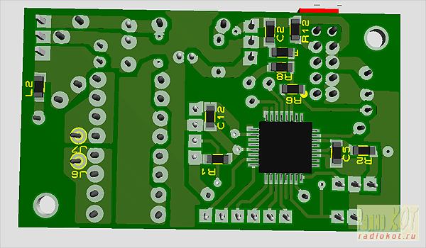

У ATmega осталось несколько свободных ножек, выведенных на разъём J5. Это позволяет при желании подключить датчики положения, чтобы автоматически управлять полноценным макетом железной дороги.

### Booster

Первоначальный вариант бустера был собран на полевых транзисторах и микросхеме IR2153 в нетрадиционном включении.

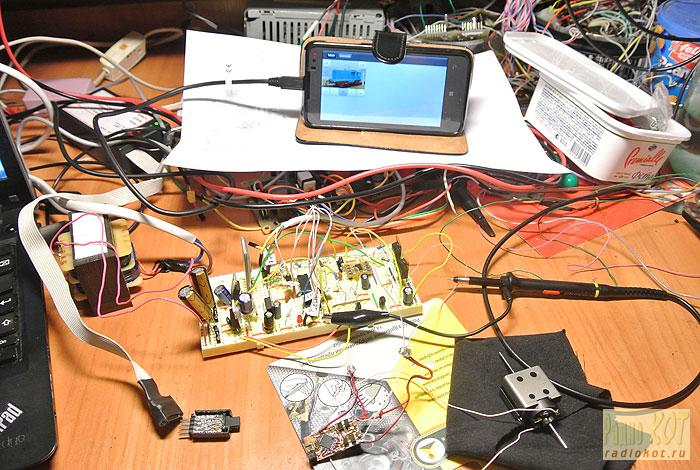

К сожалению, схема плохо показала себя в задачах определения короткого замыкания и перегрузки. Поэтому пришлось еще раз достать ящик со старыми платами и поискать что-нибудь подходящее.

В качестве кандидата была найдена плата от принтера Epson Stylus 440, которая содержит два драйвера биполярных шаговых двигателей LB1845:

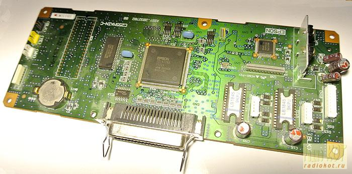

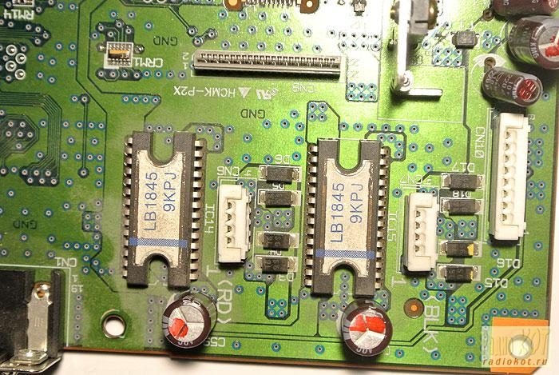

Каждый из драйверов, в свою очередь, содержит два полноценных H-Bridge и схему ограничения тока( обмоток ):

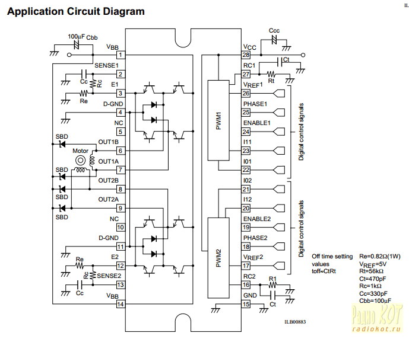

Половина такой микросхемы будет отлично работать в роли бустера, так как умеет переключать полярность, ограничивать максимальный ток и держать КЗ длительное время.

Для облегчения режима работы схемы, контрольная станция умеет определять факт длительного превышения тока и отключать питание от рельс на 10 сек, делая попытки восстановиться, выдерживая паузы. Дело в том, короткое замыкание будет возникать довольно часто - от попадания железных предметов на рельсы, схода локомотива с путей или даже из-за соединения рельс в определенную конфигурацию.

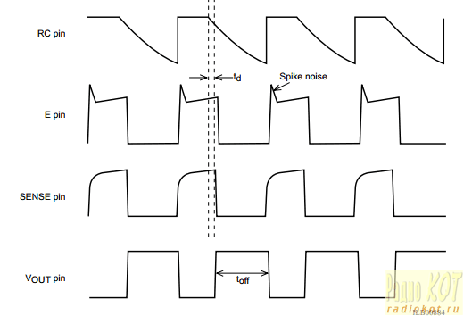

Перегрузка/КЗ определяются по факту начала работы PWM LB1845 для ограничения тока, что намного надёжнее, чем слежение за токовым шунтом. При включении PWM, на выводе RC микросхемы LB1845 появляются импульсы, которые заведены через делитель на вход аналогового компаратора ATMega.

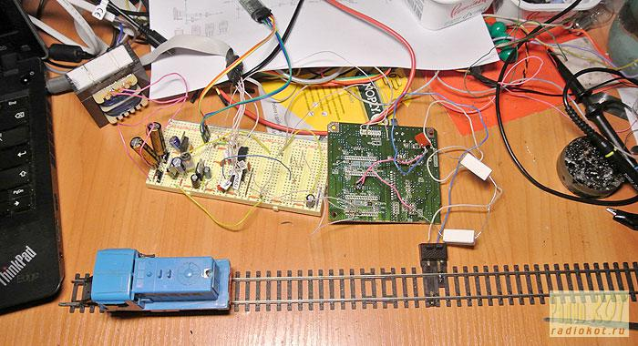

Поскольку вся необходимая "обвязка" драйвера уже присутствовала на (правильно) разведенной плате принтера, было решено просто выпилить ножовкой нужную часть платы и поменять резисторы для установки ограничения тока в 1А.

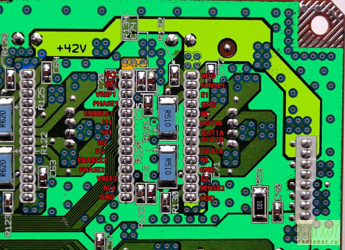

В качестве ИК пульта взят имеющийся пульт от поломанного DVD плейера (приемник TSOP взят от ту да же ). По итогам скажу, что лучше брать пульт с резиновыми кнопками, так как плёночные кнопки часто не срабатывают.

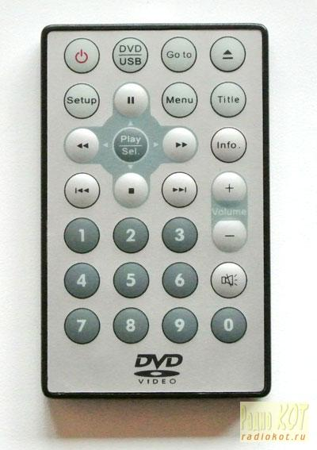

## Декодер локомотива

Общая структура схем декодеров была подсмотрена в различных источниках(см. ссылки в конце статьи). Конкретная схема разрабатывалась исходя из доступных деталей и свободного места в локомотивах.

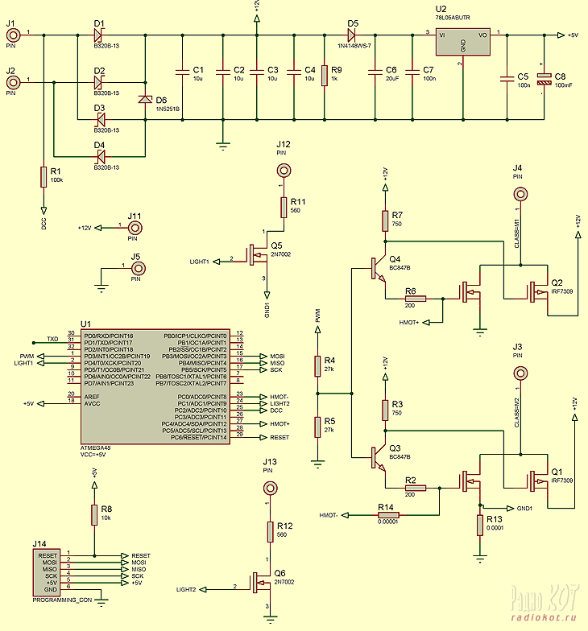

### Оценка доступного места в локомотивах

Размеры платы декодера должны позволять ее установку во все три имеющихся локомотива. Поэтому, в первую очередь, все локомотивы были разобраны и изучены на предмет свободного места под плату декодера.

В локомотиве Junior оказалось меньше всего свободного пространства - 16x32x10мм или 20x32x4мм:

Несмотря на меньшие размеры, в паровозе места оказалось больше - 24x31x4мм:

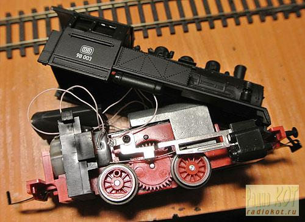

Большой локомотив: в отличие от предыдущих, этот локомотив изначально рассчитан на установку декодера, и даже содержит плату-заглушку. Внутрь поместится плата 25x50мм:

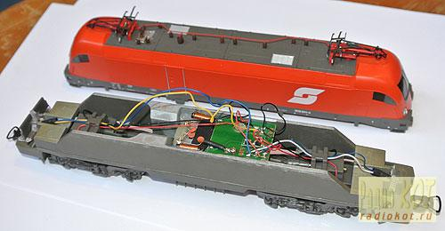

По результатам было принято решение делать плату размером 31x16x4мм.

На этой площади необходимо разместить выпрямляющие диоды,сглаживающие конденсаторы, стабилизатор питания микроконтроллера, сам микроконтроллер, мост управления двигателем и транзисторы управления фонарями.  
Исходя из этого становится очевидным, что все детали должны быть в smd исполнении при плотном двухстороннем монтаже.

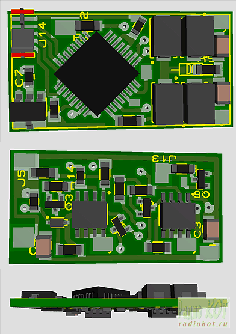

При таких микроскопических размерах даже обычная "гребенка" имеет непозволительно большие размеры в качестве разъема для прошивки.

Поскольку на будущее мне нужен единый стандарт для миниатюрных плат, я решил сделать переходник для программатора по принципу разъема PCI компьютера - в этом случае у меня всегда "будут в наличии" разъемы для новых плат.

Я нашел разъём от гарнитуры неизвестного телефона, распилил и склеил переходник:

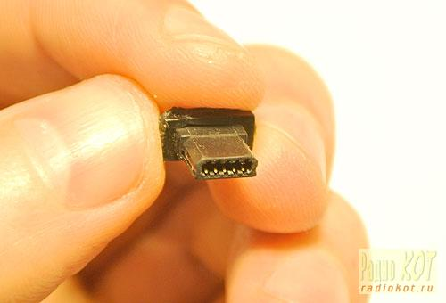

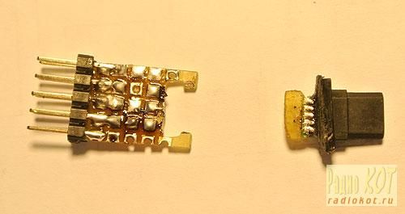

Разъем хорошо надевается на плату из текстолита толщиной 1мм:

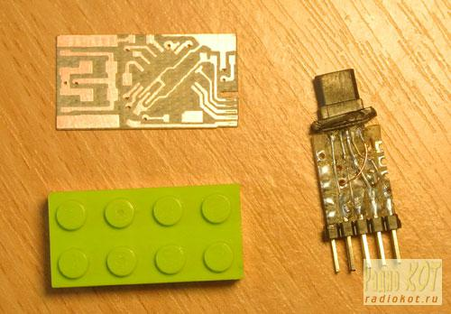

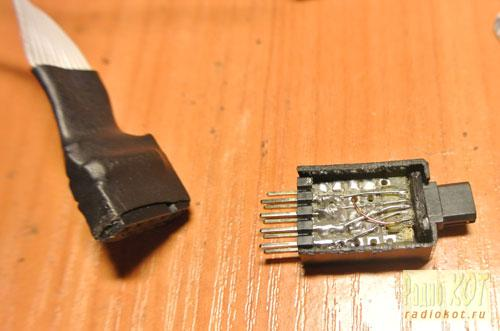

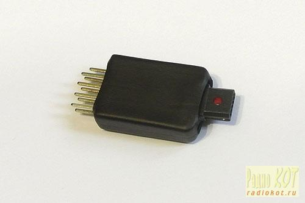

Итоговый размер разъема на плате при этом составляет менее 6x4mm.

### Изготовление плат декодера

Платы декодера - двухслойные на текстолите 1мм. Я делаю платы платы дома на самодельном CNC станке. Это накладывает определённый стиль изготовления:
- расстояние между дорожками не менее 0.3мм
- желательно как можно меньше vias, так как их придётся пропаивать;
- желательно не располагать vias под деталями;
- проще бросить перемычку, чем пропаять 3 vias.

В итоговой плате нужно допаять 4 перемычки:

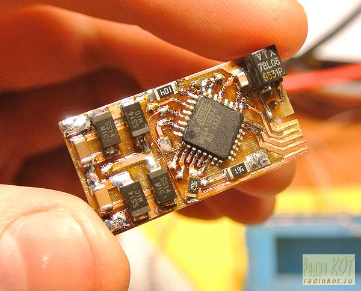

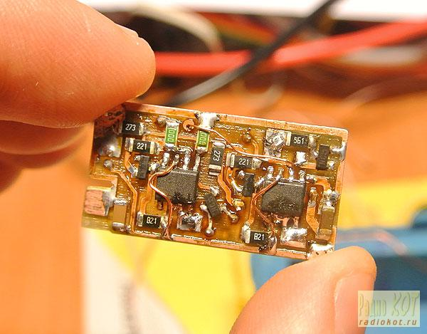

### Установка плат декодера

Декодер умеет управлять фарами локомотива, поэтому в локомотив Junior были добавлены передние и задние фары ( белые светодиоды в smd корпусе 0805 ) и передний фонарь ( обычный белый светодиод ).

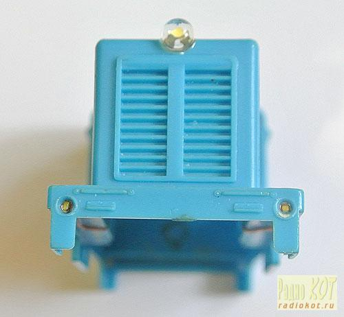

К выводам светодиода 0805 припаиваются медные эмалированные провода и прокладываются по стенке локомотива. В центре фары сверлится отверстие, к внутренней стороне которого приклеивается светодиод. Отверстие фары заливается клеем ПВА, который формирует полупрозрачную плёнку.

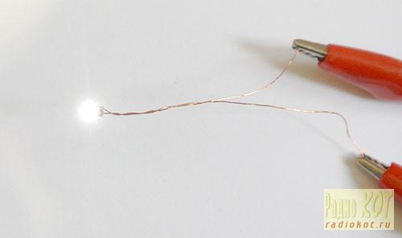

При монтаже соединений удобно сделать "разводочную колодку" на стенке локомотива:

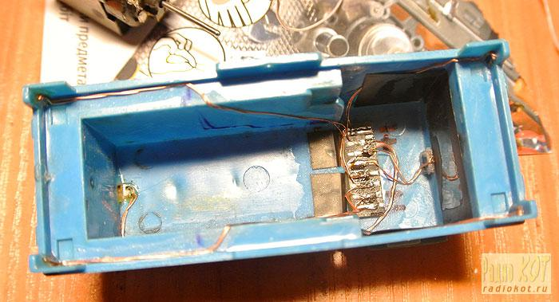

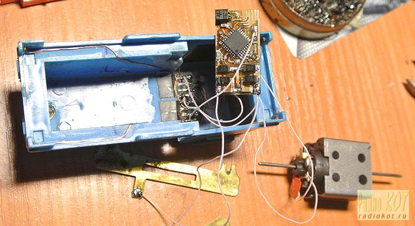

Чтобы платы и провода не торчали наружу, окна локомотива закрываются изнутри черной плёнкой.

В паровозе задние фары не устанавливались ( они там и не предусмотрены ):

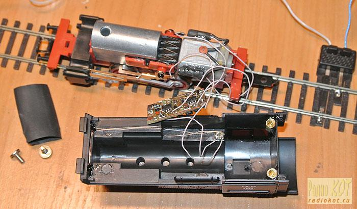

Ранее корпус надевался на основание с помощью защелки. Для освобождения места эта пластмассовая деталь была выброшена полностью, а для крепления корпуса были приклеены стойки M3.

При установке декодера в большой локомотив никаких трудностей не возникло. Поскольку в качестве фар в нём используются лампы накаливания, токоограничивающие резисторы R11R12 на плате декодера необходимо заменить на перемычки:

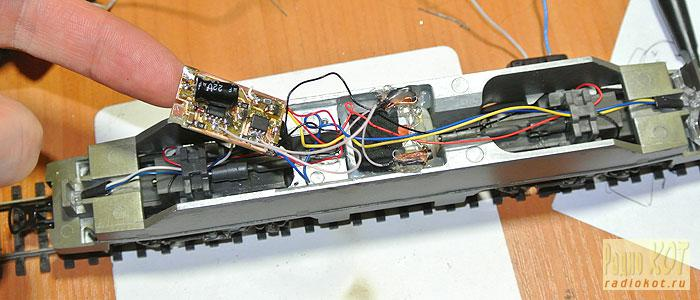

## Декодер стрелки

Фирменные приводы стрелок построены на электромагнитах:

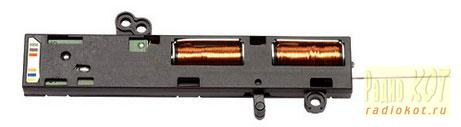

Мои попытки сконструировать надёжно работающие электромагниты провалились. К тому же, для управления электромагнитами требуется импульс большого тока, который получают разрядом электролитических конденсаторов в декодере, что увеличивает размеры декодера стрелки.

Поэтому пришлось закупить доступные серводвигатели Tower Pro SG90, которые отлично справляются с работой.

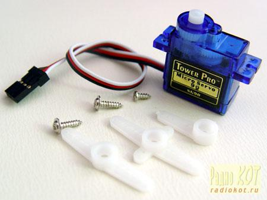

Схема декодера при этом меняется незначительно: H-мост выбрасывается, а PWM сигнал используется для управления положением серводвигателя. Поскольку двигатель питается от 5В, устанавливается стабилизатор в корпусе TO-220:

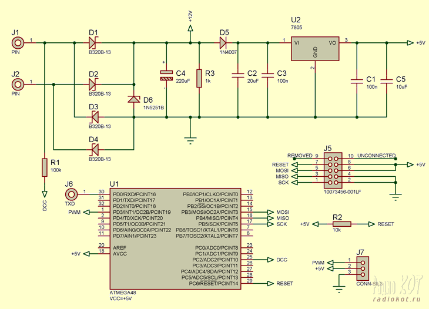

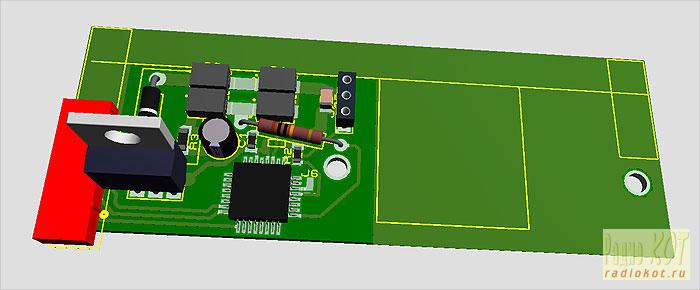

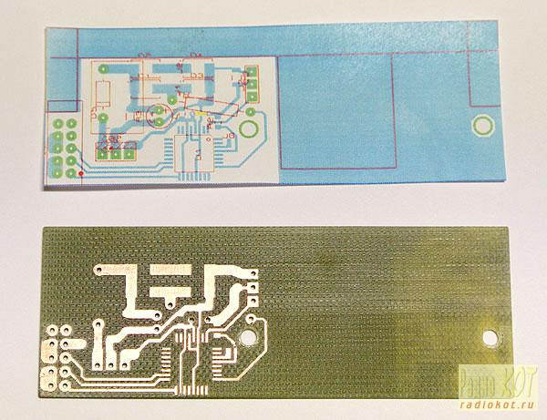

Плата декодера с приклеенным двигателем крепится к стрелке винтами. Вал серводвигателя соединяется со стрелкой пружиной:

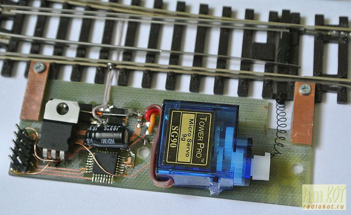

Корпус декодера стрелки был вырезан из текстолита, спаян оловом и покрашен в черный цвет:

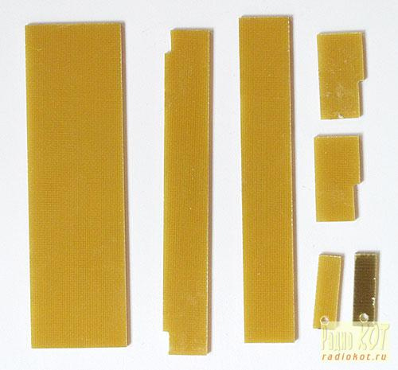

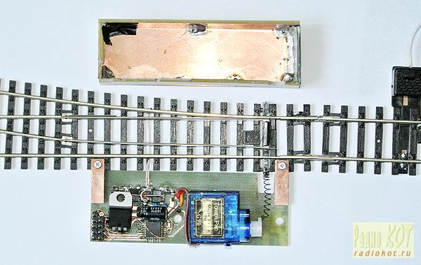

## Прошивка контрольной станции

Прошивка контрольной станции написана в Atmel Studio 6. Фьюзы настраиваются для работы от внутреннего генератора 8MГц.

### Прошивка декодеров

Прошивка декодеров написана в Atmel Studio 6. Фьюзы настраиваются для работы от внутреннего генератора 8MГц. При компиляции прошивки необходимо раскоментировать сроку #define SWITCH в файле common.h, чтобы получить прошивку для стрелки. Её отличие в том, что частота PWM сигнала становится равной 50Гц, что необходимо для управления серводвигателем. При этом PWM отключается через 3 секунды после переключения стрелки, чтобы не нагружать двигатель.

### ПО для Android

Играть с телефоном намного интереснее, так как он воспроизводит звуки локомотивов и железнодорожной станции :)

ПО написано на Flash Builder 4.6. Для общения по bluetooth используется расширение Bluetooth Android ANE[11].

Основной экран приложения показан ниже:

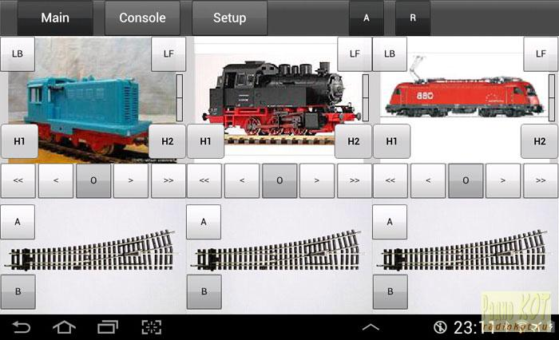

Назначение кнопок на основном экране описано в видео.

Экран консоли позволяет увидеть отладочную информацию с контрольной станции:

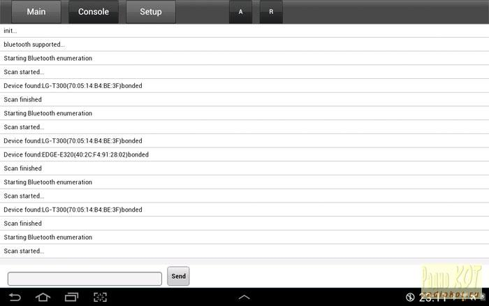

Экран настройки предназначен для настройки декодеров:

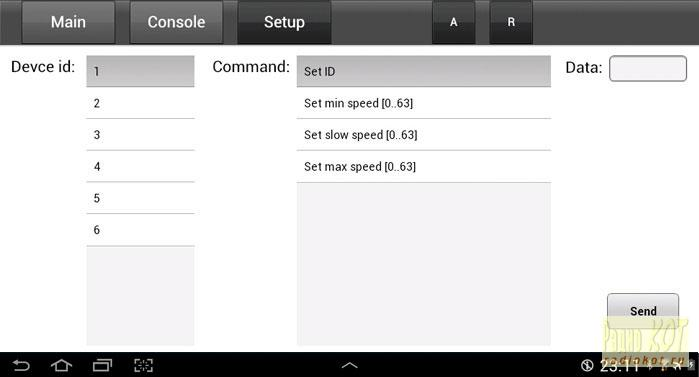

### Настройка ИК пульта

Для настройки ИК пульта необходимо подсоединиться к контрольной станции либо напрямую по UART интерфейсу, либо через bluetooth терминал, либо приложенным ПО для Android. Контрольная станция выводит на терминал распознанные ИК коды кнопок, которые необходимо внести в прошивку: KEX_XXX в IRManager.c.

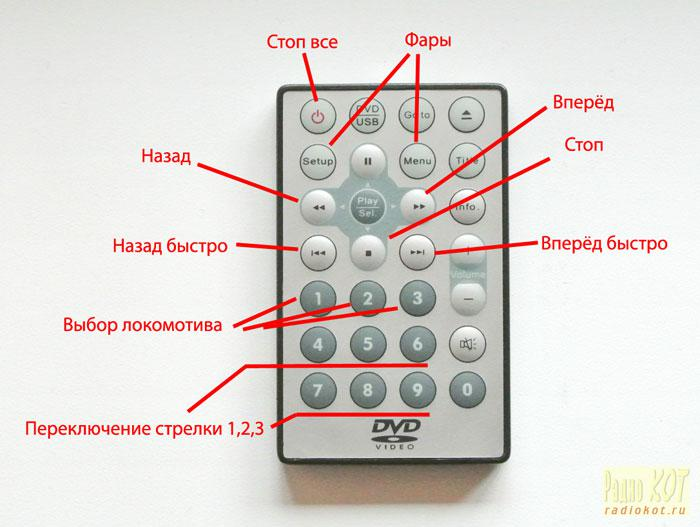

### Настройка декодера локомотива

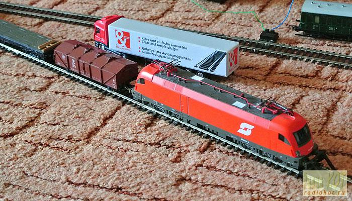

Для настройки декодера необходимо установить локомотив на рельсы и подключить Android ПО к контрольной станции.

1. Присвоение id локомотива [1...3]:
   - указать id в поле "Data";
   - выбрать команду "Set id";
   - нажать кнопку "Send".

Команда смены id воспринимается всеми декодерами,поэтому другие локомотивы и стрелки в момент настройки должны быть отключены.

2. Настройка PWM обычной скорости [0..63]:
   - выбрать id локомотива в списке "Device Id";
   - указать значение PWM в поле "Data";
   - выбрать команду "Set slow speed";
   - нажать кнопку "Send".

3. Настройка PWM быстрой скорости [0..63]:
   - выбрать id локомотива в списке "Device Id";
   - указать значение PWM в поле "Data";
   - выбрать команду "Set max speed";
   - нажать кнопку "Send".

Локомотив готов к работе.

### Настройка декодера стрелки

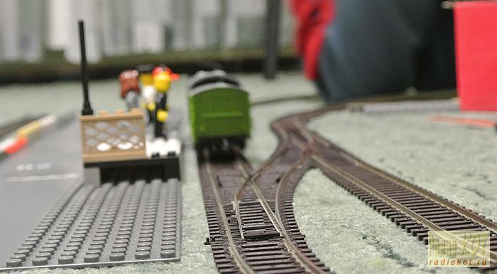

Для настройки декодера необходимо подключить стрелку к контрольной станции и подсоединить Android ПО.

Серводвигатели SG90 могут заклинить при подаче неправильного сигнала, поэтому до настройки безопасных параметров серводвигатель лучше отключить.

1. Настройка id стрелки: [4...6].
   - указать id в поле "Data";
   - выбрать команду "Set ID";
   - нажать кнопку "Send".

Команда смены id воспринимается всеми декодерами,поэтому другие локомотивы и стрелки в момент настройки должны быть отключены.

2. Настройка PWM первого положения стрелки:
   - выбрать id стрелки в списке "Device Id";
   - указать 7 в поле "Data";
   - выбрать команду "Set min speed";
   - и нажать кнопку "Send".

3. Настройка PWM второго положения стрелки:
   - выбрать id стрелки в списке "Device Id";
   - указать 14 в поле "Data";
   - выбрать команду "Set max speed";
   - нажать кнопку "Send".

### Удаление конденсаторов

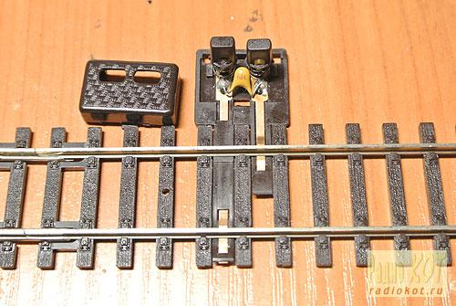

В клеммных рельсах установлен конденсатор, который обязательно нужно удалить. Теперь, при подаче переменного напряжения, он вызывает КЗ. Также крайне желательно аккуратно пролудить контакты между медными пластинами и рельсами.

### Восстановление двигателя тепловоза

Немного офф-топа. Двигатель в тепловозе из набора Junior был полностью изношен. В нём используется достаточно качественный двигатель с угольными щётками, но из-за длительного использования и щётки, и контактная площадка ротора сильно стёрлись.

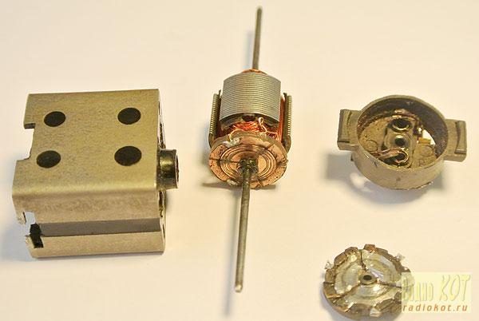

После попыток заменить щётки, полной замены контактной площадки на круг, вырезанный из текстолита, замены прижимных щёток на простые медные щётки, было решено полностью заменить двигатель.

Менее качественные, обычные двигатели из игрушек подходят по размерам. Мне не удалось найти двигатель с длинным двухсторонним валом. Я выдвинул(выбил) вал из ротора, и с другой стороны вставил вал от такого же двигателя.  
На новый двигатель были перенесены дроссели и конденсатор фильтра, и закреплены термоклеем.

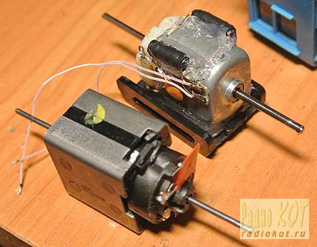

Напряжение питания нового двигателя 3В, а не 12В. Но это не является проблемой, так как декодер позволяет настраивать скважность, соответствующую максимальной скорости локомотива.

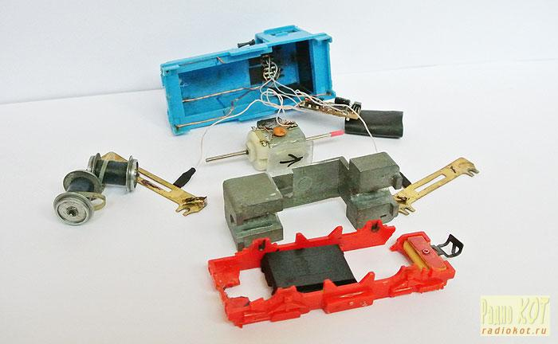

Видео (HD):  
[https://www.youtube.com/watch?v=5xEB9pbQEE0](https://www.youtube.com/watch?v=5xEB9pbQEE0)

Заказчик остался доволен.

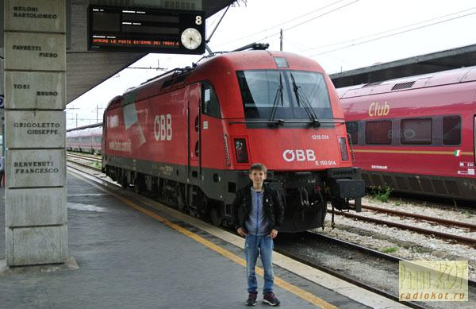

## Материалы

1. Автоматизация детской железной дороги  
   [https://robocraft.ru/blog/379.html](https://robocraft.ru/blog/379.html)

2. Self made decoder for MNRA-DCC  
   [https://groups.yahoo.com/neo/groups/selfmade_decoder/info](https://groups.yahoo.com/neo/groups/selfmade_decoder/info)

3. Декодер на ATTiny15  
   [https://www.g-zi.de/](https://www.g-zi.de/)

4. Библиотека Bluetooth для Flex на Android  
   [https://as3breeze.com/bluetooth-ane/](https://as3breeze.com/bluetooth-ane/)

5. Настройка BT-Board  
   [https://apirola.wordpress.com/2012/09/05/setup-jy-mcu-bt-board-v1-2/](https://apirola.wordpress.com/2012/09/05/setup-jy-mcu-bt-board-v1-2/)

6. OpenDCC  
   [https://www.opendcc.de/](https://www.opendcc.de)

7. Краткий справочник покупателя цифровых систем управления стандарта DCC.  
   [https://www.railwaymodel.com/info/articles/dcc_us.html](https://www.railwaymodel.com/info/articles/dcc_us.html)

8. Digital Command Control  
   [https://en.wikipedia.org/wiki/Digital_Command_Control](https://en.wikipedia.org/wiki/Digital_Command_Control)

9. OpenDCC Project  
   [https://opendcc.sourceforge.net/](https://opendcc.sourceforge.net/)

10. NMRA-DCC Loco Decoder with ATtiny15  
    [https://www.g-zi.de/Decoder/ATtiny15/desc2pinNpwmR_e.html](https://www.g-zi.de/Decoder/ATtiny15/desc2pinNpwmR_e.html)

11. Bluetooth ANE  
    [https://as3breeze.com/bluetooth-ane/](https://as3breeze.com/bluetooth-ane/)

12. Мой персональный сайт в интернете  
    [https://www.deep-shadows.com/hax/](https://www.deep-shadows.com/hax/)

## Прошивки и исходники

**Файлы:**

[Исходники Android ПО](railway_android_src.rar)  
[Исходники прошивки декодера](railway_decoder_firmware_src.rar)  
[Исходники прошивки контрольной станции](railway_controller_firmware_src.rar)  
[Приложение для Android](hxRailRoad_apk.zip)  
