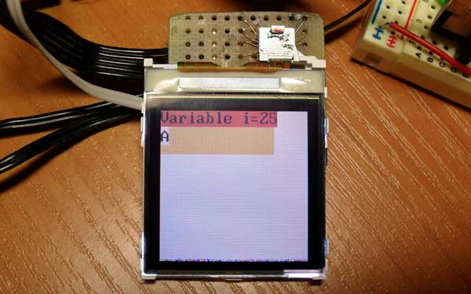
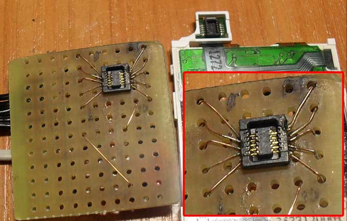
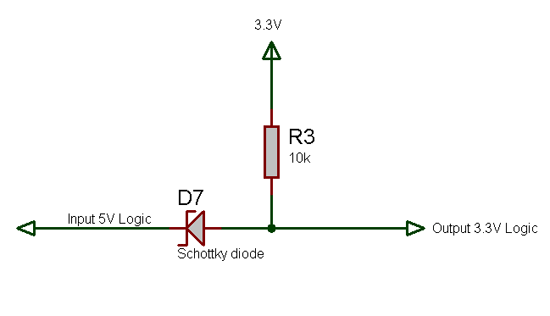
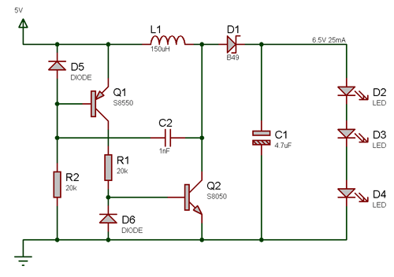
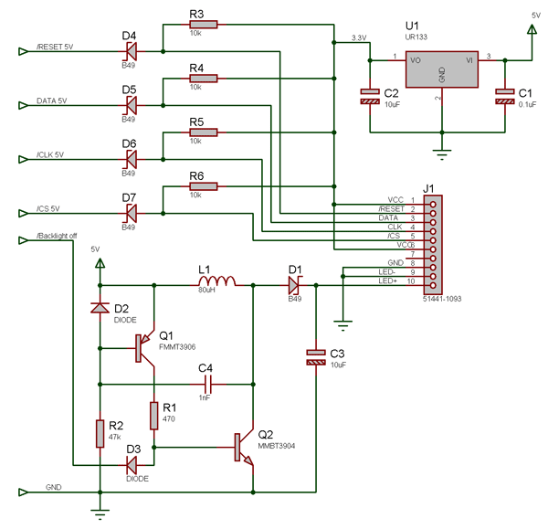
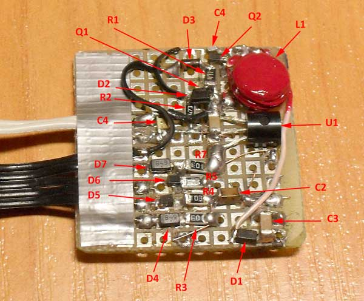

# Connecting Nokia 6100 LCD to AVR

There are many articles in the Internet describing how to use Nokia 6100 LCD with AVR. Unfortunately most of them are using LCD with Breakout board from [Sparkfun Electronics](https://www.sparkfun.com/products/11062). There is a little information how to connect LCD extracted from real phone, which introduces a set of problems.

## Soldering LCD connector

LCD Connector is tiny! Some people was lucky to have large pins on cable there wires can be soldered. In my case I had to unsolder connector from phone board with hot fan and glue it to prototype board. Then I soldered small wires to all pins.

If you do not have female connector from board, the only way to connect everything is to unsolder male connector from cable and [solder directly to cable](http://dangerousprototypes.com/forum/viewtopic.php?t=2707).

## Converting 5V logic to 3.3V

LCD is operating from 3.3V while I usually use 5V for AVR. Levels can be converted with special IC, open collector IC, transistor or simply resistor divider.

One method often overlooked is schottky diode-resistor method. The benefit is stable 3.3V high level and smaller leakage current:

Input is connected to 3.3V when AVR outputs "1" (5V), and is tied to ground through diode when AVR outputs "0". In this schematic diode simulates "open collector". Schottky diode is required to pull voltage down to 0.3V. Generic diode can't achieve that.

UR133 linear voltage converter extracted from mouse is used to provide 3.3V power for LCD controller.

## Powering backlight

LCD Backlight is series of LEDs connected in chains ( 3 in chain ). They require 6.5V 15-50mA. LEDs will not light from voltage lower then ~2.2V/each ( total 6.5V). Sparkfun Breakboard is using mc34063 to boost voltage from 5V to 6.5V. This is overkill. We have to convert from stable input voltage to stable output voltage/current for known load. A simple 2-transistor multi-vibrator will work just fine. It does not need output voltage regulation because load is stable.

I made a quick test with S8050 and S8550 transistors. With parameters on schematic output current is 25mA . It can be increased to 35mA by changing R1 to 10kOhm.

Final board has been soldered using SMD components:

Oscillation frequency is 250kHz, output current is 25mA ( 6.5V). I used components unsoldered from various boards. D1,D4-d7 are unknown diodes marked B49 with 0.3V voltage drop. L1 is inductor wired on ferrite bobbin extracted from video card.

Backlight can be disabled from AVR by grounding base of transistor Q2 through D3 to prevent oscillation ( light turns off when AVR outputs "0" ).

[Schematics and CodeVisianAVR project](NokiaLCD.zip)