# PWM Control of a 12V Fan Using Discrete Components

*Article is publiched on [cxem.net](https://cxem.net/pitanie/5-321.php)*

Here is a simple temperature-dependent speed control circuit for a 12V fan, built from commonly available parts that can always be found in any hobbyist's parts bin.

There are many discrete component circuits available online, but they all implement a linear voltage regulator without a lower activation threshold. This circuit, using just four transistors, implements a switching voltage regulator with a lower activation threshold. When the temperature is below the threshold, the fan is completely off and the circuit draws only ~1mA.

The circuit is based on the "2 Watt Switching Power Supply" [7].

The circuit has been redesigned as a step-down voltage regulator with temperature dependence:

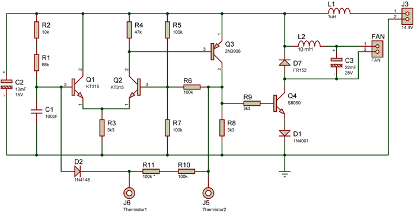

Square wave pulses from the Schmitt trigger oscillator built on transistors Q1Q2Q3 drive the power transistor Q4.

The duration of the positive half-cycle that opens the power transistor is fixed and determined by the timing capacitor C1 and resistors R1R2. The duty cycle is adjusted by varying the duration of the negative half-cycle.

Oscilloscope trace at the base of transistor Q4 (relative to ground) near the activation threshold:

The fan immediately receives ~6V, ensuring a confident start.

And at maximum speed:

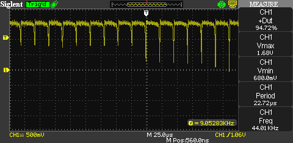

Since the power transistor operates in switching mode, transistors in a TO-92 or even SOT-23 package can be used for fans drawing up to 0.5A — for example, the S8050.
For high-power fans, an N-Ch MOSFET in an SO-8 package can be used.

The lower activation threshold is achieved by the oscillator ceasing to oscillate when the resistance of the discharge path D2R11R10RT, which includes the thermistor (RT), becomes too high.

Not all fans operate properly on pulsating voltage.
The D7L2C3 network is designed to produce a smooth DC voltage from the pulses. For fans drawing up to 0.35A, inductor L2 is wound with 0.1mm wire on a "dumbbell" core with an outer diameter of 5mm, which can be salvaged from a burnt-out CFL ballast:

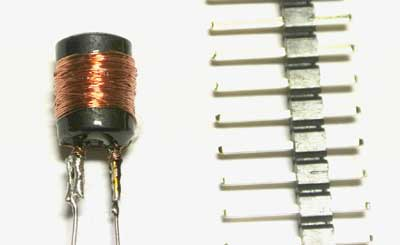

Inductor L1 is a "ferrite bead" from CRT monitors or an SMD inductor:

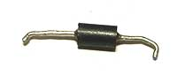

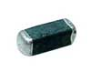

The oscillation frequency of the circuit ranges from 22 to 42 kHz. If the fan tolerates pulsations, it can be soldered in place of diode D7, and L2C3 are omitted.

The circuit operates from an 11.8–14.4V power supply.

All components can be substituted with equivalents having a wide range of parameters, since this is a switching circuit. The activation threshold, initial turn-on voltage, and the point at which maximum speed is reached are set by selecting resistors R1R2 and R10R11.

LTSpice project files are included with the article for experimentation. The fan voltage as a function of temperature can be calculated using the FanControlSweep2.asc file:

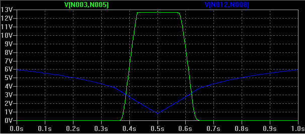

With the specified component values, the fan starts operating at 40°C and reaches maximum speed at 80°C.

An MF58 100K thermistor [8] is used as the temperature sensor:

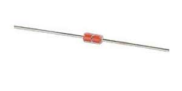

These can be purchased in bulk on [Aliexpress](http://cxem.net/magazines/aliexpress.php) — once and for all occasions.

The PCB is designed for through-hole components (when assembling, verify the collector-emitter-base pinout!!! — do not rely on the transistor outline printed on the board):

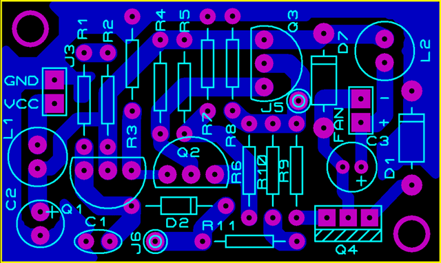

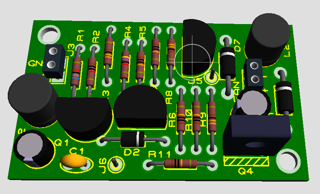

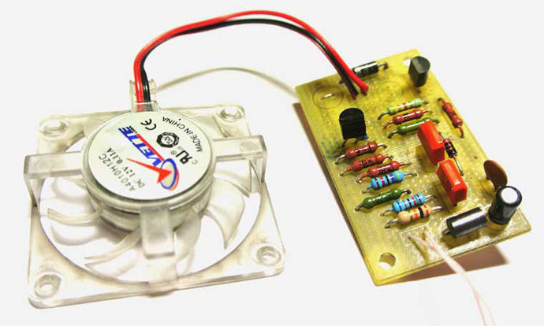

The regulator was used to cool a Porto HT E-150 car inverter, which overheats significantly when a laptop is connected.

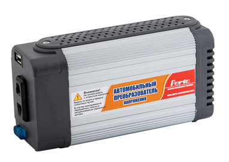

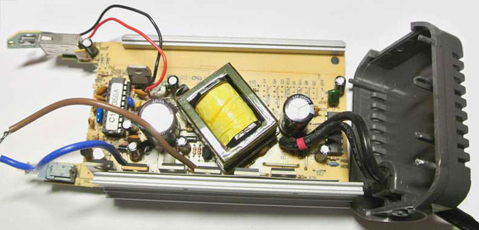

A small fan and the control board were placed on the top cover:

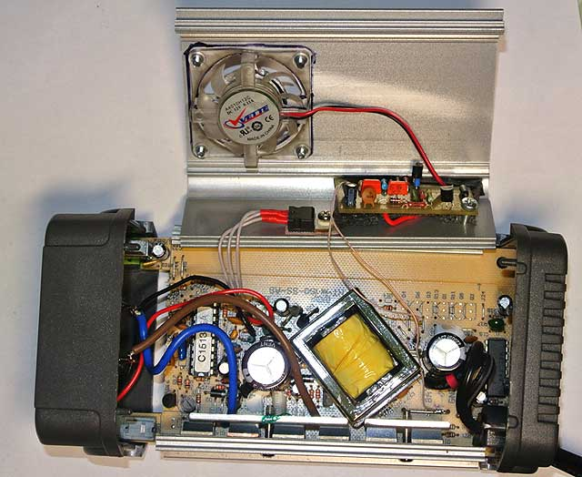

The far side panel was given ventilation holes:

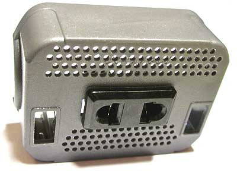

The inverter's microcontroller measures the air temperature inside the enclosure using a thermistor. To keep the thermal protection functional, the thermistor was mounted on the underside of the board where it is not exposed to the airflow.

The 78L05 voltage regulator was desoldered from the board and mounted on a heatsink with a thermal pad. It was clearly unable to deliver 500mA to the USB port without a heatsink:

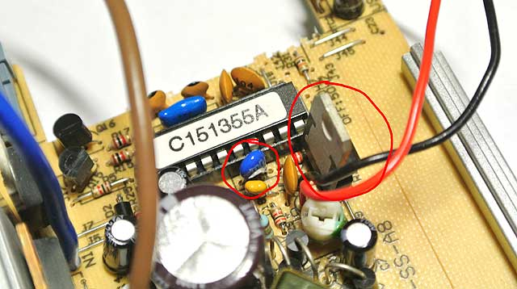

Since the USB current can now reach 1.5A, a 100 Ohm resistor was soldered between Data+ and Data- so that phones would charge at 1A without hesitation [9]:

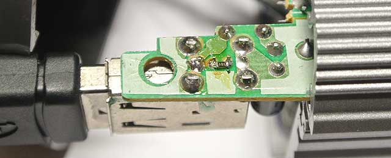

The result:

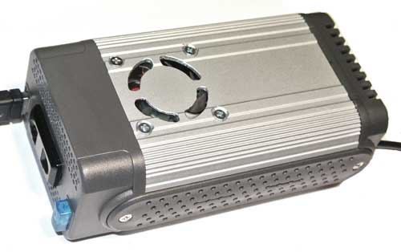

## References

1. Fan control mechanisms [http://1poclimaty.ru/ventilyatory/upravlenie-ventilyatorom.html](http://1poclimaty.ru/ventilyatory/upravlenie-ventilyatorom.html)
2. Fan control device [http://hamlab.net/pitanie/reg_vent.html](http://hamlab.net/pitanie/reg_vent.html)
3. Simple computer cooler control [http://kazus.ru/shemes/showpage/0/1393/1.html](http://kazus.ru/shemes/showpage/0/1393/1.html)
4. Fan control device for power amplifier cooling [http://www.electroclub.info/invest/ventilator.htm](http://www.electroclub.info/invest/ventilator.htm)
5. Build A High Performance Voltage Regulator From Discrete Components [http://www.rason.org/Projects/discreg/discreg.htm](http://www.rason.org/Projects/discreg/discreg.htm)
6. Discrete High Current Switch Mode LED Driver [http://www.simplecircuitdiagram.com/2010/02/13/discrete-high-current-switch-mode-led-driver/](http://www.simplecircuitdiagram.com/2010/02/13/discrete-high-current-switch-mode-led-driver/)
7. 2 Watt Switching Power Supply [http://www.bowdenshobbycircuits.info/page4.htm#ps5.gif](http://www.bowdenshobbycircuits.info/page4.htm#ps5.gif)
8. MF58 Datasheet [http://www.dzsc.com/uploadfile/company/45063/200774125453164.pdf](http://www.dzsc.com/uploadfile/company/45063/200774125453164.pdf)
9. Charging port types [http://rones.su/techno/charging_ports_types.html](http://rones.su/techno/charging_ports_types.html)

## Bill of Materials

| Designator | Type | Value | Qty |
|---|---|---|---|
| Q1, Q2 | Bipolar transistor | КТ315Б | 2 |
| Q3 | Bipolar transistor | 2N3906 | 1 |
| Q4 | Bipolar transistor | S8050 | 1 |
| D1 | Rectifier diode | 1N4001 | 1 |
| D2 | Rectifier diode | 1N4148 | 1 |
| D7 | Rectifier diode | FR152 | 1 |
| C1 | Capacitor | 100 pF | 1 |
| C2 | Electrolytic capacitor | 10µF 16V | 1 |
| C3 | Electrolytic capacitor | 22µF 25V | 1 |
| L1 | Inductor | 1µH | 1 |
| L2 | Inductor | 10mH | 1 |
| R1 | Resistor | 68 kOhm | 1 |
| R2 | Resistor | 10 kOhm | 1 |
| R3, R8, R9 | Resistor | 3.3 kOhm | 3 |
| R4 | Resistor | 47 kOhm | 1 |
| R5, R6, R7, R10, R11 | Resistor | 100 kOhm | 5 |
| J5, J6 | Thermistor | MF58-100 | 1 |
| FAN | Fan | 12V 0.15A | 1 |

## Attached Files

- [FanControl.rar](FanControl.rar) (30 KB)
