# 80W Electronic Active Load

*Article published on [radiokot.ru](https://radiokot.ru/circuit/digital/measure/144/)*
**Article took 1st place in the article contest "Congratulate the Cat in a Human Way 2015!"**


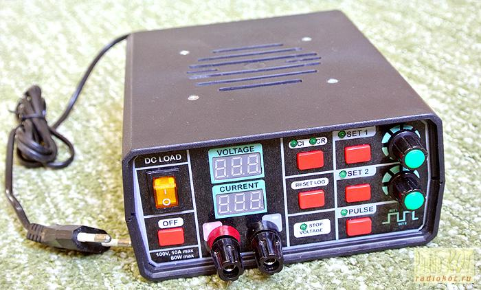

Why would you need such an instrument as an "Active Load"? In fact, in amateur radio practice and small home repair practice, it turns out to be in demand no less than a laboratory power supply.

A digital active load can be used for:

* testing power supplies;
* plotting load characteristics;
* checking stabilization quality (calculating Load regulation);
* measuring actual battery capacity;
* plotting discharge curves;
* measuring battery internal resistance;
* testing regulator response speed (Transient response).

When I got tired of boiling resistors in a jar of water, I decided to develop a digital active load for myself. The result was the device described in this article.

[https://youtu.be/eGki6-2TogI](https://youtu.be/eGki6-2TogI)


## Device Specifications

### General Device Specifications

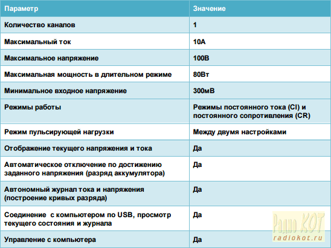

### Extended Device Specifications

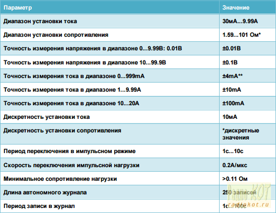

* discrete values, Ohms: 1.59, 1.62, 1.65, 1.67, 1.70, 1.73, 1.76, 1.79, 1.83, 1.86, 1.9, 1.93, 1.97, 2.01, 2.05, 2.09, 2.14, 2.19, 2.23, 2.29, 2.34, 2.39, 2.45, 2.51, 2.58, 2.65, 2.72, 2.79, 2.87, 2.96, 3.05, 3.14, 3.25, 3.35, 3.47, 3.59, 3.73, 3.87, 4.03, 4.19, 4.38, 4.58, 4.79, 5.03, 5.3, 5.59, 5.92, 6.29, 6.71, 7.19, 7.75, 8.39, 9.16, 10.1, 11.2, 12.6, 14.4, 16.8, 20.2, 25.2, 33.6, 50.4, 101.

** minimum measurable current - 30mA

Maximum power is limited by the characteristics of the power transistors and the cooling system.

The device has a minimum resistance determined by the resistance of the current sensor, the resistance of the Source-Drain junction of the power transistor, and the resistance of the relay contacts.

Shutdown upon reaching a specified voltage is used for discharging batteries and plotting battery discharge graphs.

The pulsating load mode allows studying transient processes in a power supply during sudden load changes.

## Device Appearance

The device is assembled in a Z2W enclosure. Manufacturing the instrument involves some amount of mechanical work.

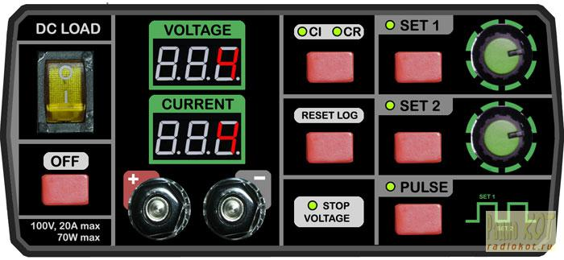

The front panel appearance is shown in the figure.

The panel contains: power switch, voltage and current indicators, terminals, load off button, CI/CR mode switch button, log reset button, setting set selection buttons, pulsating load mode enable button, encoders, CI/CR mode indicator, current setting set indicators, pulsating mode indicator, shutdown upon voltage reaching indicator.

When connecting the load, polarity must be observed. With incorrect connection, the input voltage will be shunted by the internal diodes of the power transistors. The device does not track incorrect connection and has no automatic shutdown. In this mode, the instrument is protected only by a fuse.

## Schematic Diagram

The device is built on an ATMega32 microcontroller. It implements current measurement, voltage measurement, reference voltage generation, logging, heatsink temperature measurement, and fan control. Device control is digital, using encoders.

The power section uses a classic circuit with an operational amplifier and a MOSFET transistor as the load (two MOSFET transistors are used).

Constant R mode is implemented using MCP4011 digital potentiometers.

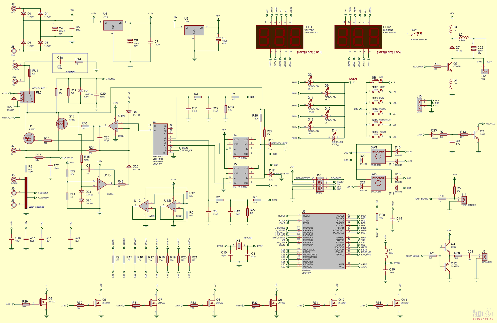

When the device is turned off, relay RL2 opens the load circuit (I don't like the idea of voltage being applied to a turned-off device). Due to a lack of microprocessor pins, a small node on transistor Q3 is assembled, which turns on the relay when there is dynamic indication on the fourth indicator. During overheating, the instrument specifically turns off the indication on this segment to open the circuit.

For the same reason, the buzzer and temperature sensor share one microcontroller pin (PA4).

Power is supplied from a small 12V AC 300mA transformer.

## Printed Circuit Board

The device is assembled on a double-sided printed circuit board, which is mounted behind the front panel.

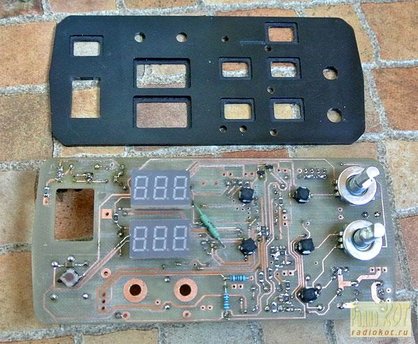

I manufacture boards on a homemade milling machine, so some connections will need to be completed with jumpers (if laying a trace requires several transitions between layers, it's easier to solder a jumper). For the same reason, there is a strange mix of through-hole and SMD components - sometimes it's more convenient to use DIP for transitions between layers.

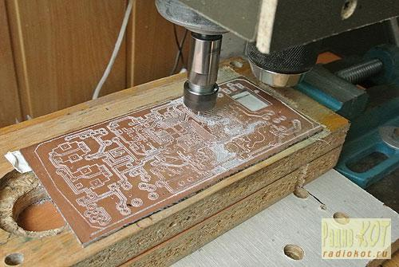

Holes in the front panel are cut exactly according to the drawing. Plastic buttons are inserted between the panel and the printed circuit board (I used buttons from a children's toy). Seven-segment indicators and LEDs need to be soldered at a certain height so they fit into the slots in the front panel.

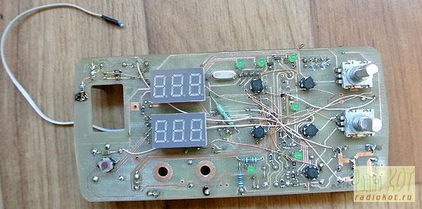

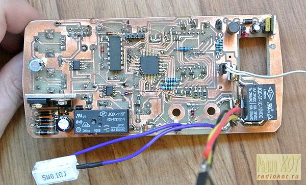

Unfortunately, I don't have a board for the final device schematic, as it underwent a number of serious changes during the creation process. However, the archive contains a board for a preliminary version, in which all key elements are correctly positioned for the front panel.

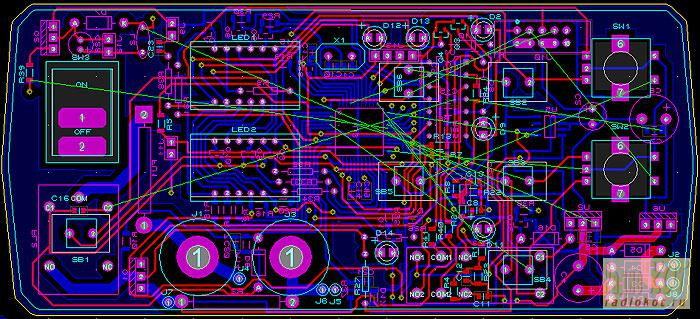


## Cooling System

Since all consumed power is converted into heat, the maximum power of the device directly depends on the efficiency of the cooling system. I decided to use a heatsink and an 80mm fan from an Athlon XP processor cooler.

The maximum heat dissipation of these processors is about 70W, which allows making an active load for long-term use of approximately the same power.

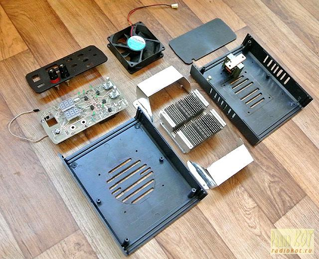

My heatsink and fan specimens didn't fit by height by 2mm, so the upper part of the heatsink was slightly milled. In the lower part of the heatsink, pockets needed to be milled for the transistors, 5 holes made, and M3 threads cut for attaching the transistor to the heatsink and the heatsink to the enclosure (in the corners of the heatsink base).

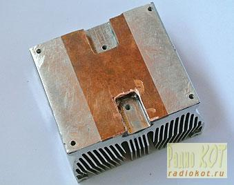

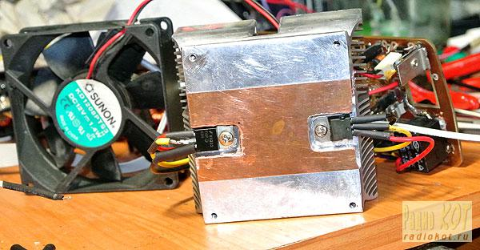

The current sensor (3W ceramic resistor) is placed between the heatsink fins using metal shims.

In the Z2W enclosure, the front stands are not very well positioned - they interfere with the front panel board. In this design, the front stands are completely removed. The top cover is screwed with long screws to the heatsink through the fan mounting holes.

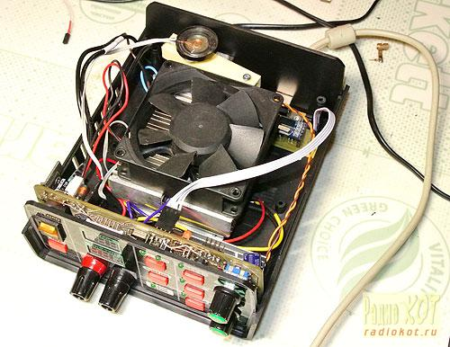

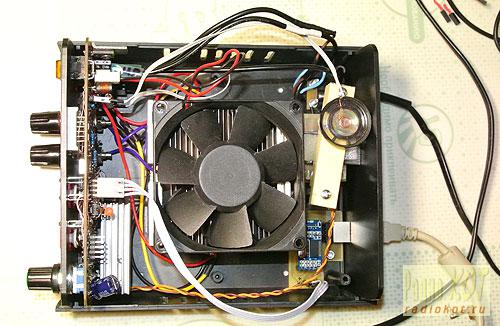

Vertical slots are made in the side walls, into which air is directed using overlays made of thin tin:

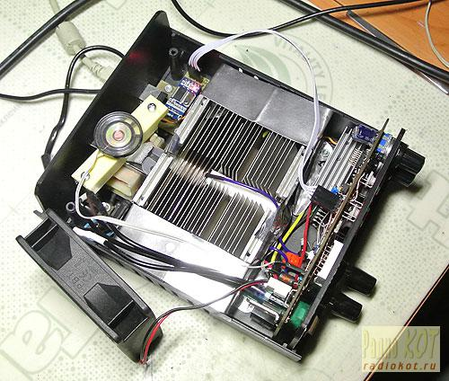

A thermistor from a motherboard is used as the temperature sensor (soldered from under the Socket 462 processor socket):

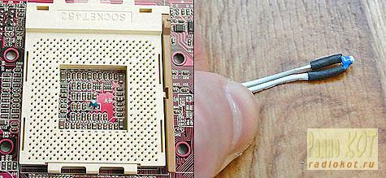

It needs to be secured to the heatsink by inserting it between the fins closer to the heatsink base. The sensor model doesn't matter, as all measurements are calibrated during setup.

## Computer Connection

The device connects to a computer using a USB-UART converter with galvanic isolation on optocouplers. The converter was purchased ready-made on eBay:

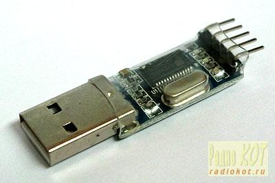

It is inserted into the galvanic isolation board:

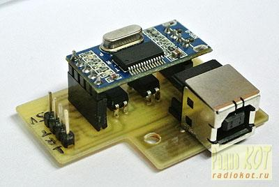

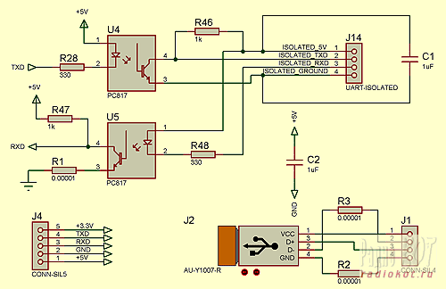

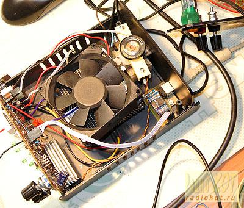

## PC Software (Windows)

PC software is written in Flash Builder 4.6.

### Main Screen

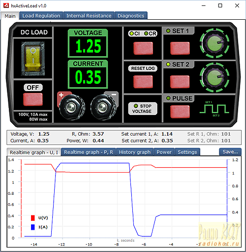

The main screen displays current parameters and graphs of current and voltage changes.

All red buttons work and control the real device. To set current or resistance, you need to click on the indicator.

The Power tab displays power and load resistance graphs.

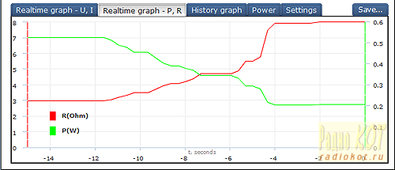

The History tab displays the device operation log over a long period:

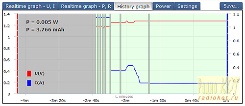

Log entries are added according to the Log Period setting.

The Power tab displays the power consumed by the device during power-on periods:

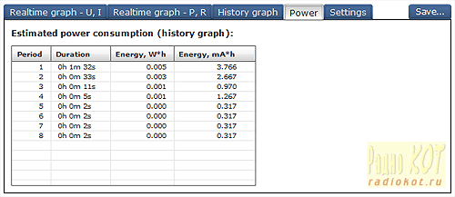

The Settings tab allows setting the main device parameters:

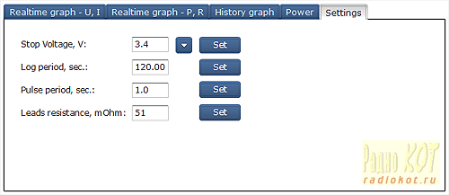

### Diagnostic Screen

The diagnostic screen displays all internal parameters - this is very convenient during calibration.

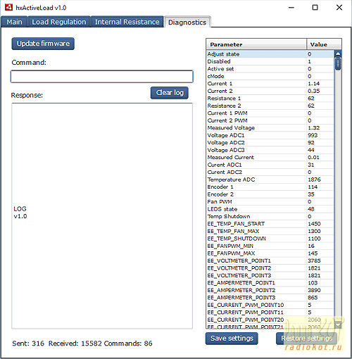

Here you can also save and restore all settings and update the firmware.

### Load Regulation

The second tab allows plotting a U=f(I) graph for a power supply and calculating the Load Regulation value[24a].

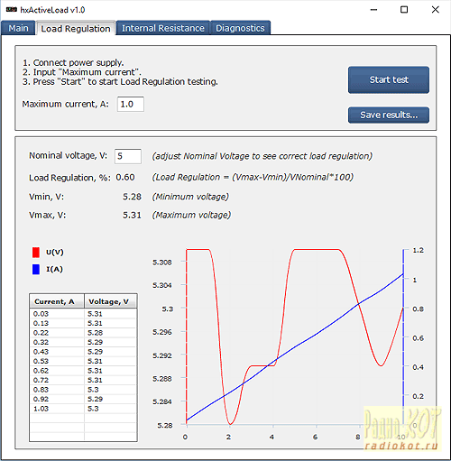

To start testing, you need to connect the power supply to the load terminals and enter the maximum current value. The graph will be plotted at 10 points, from 30mA to the maximum current.

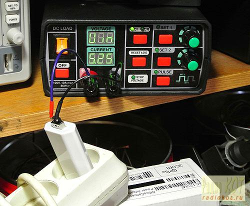

### Determining Battery Internal Resistance

The third tab allows measuring battery internal resistance.

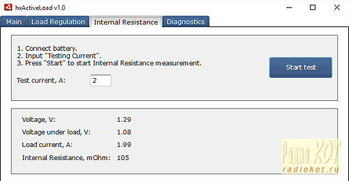

To start testing, you need to connect the battery to the device terminals and specify the current value for testing. Connection should be made with short thick wires.

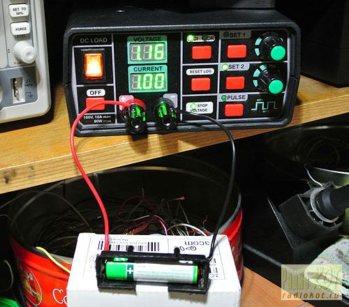

Internal resistance is calculated from the voltage drop across the battery at the specified current.

### Plotting Battery Discharge Graphs, Measuring Capacity

For testing, you need to:

* connect a fully charged battery to the device terminals;
* set Stop Voltage (discharge end voltage);
* set discharge current;
* set minimum Log Period;
* turn on the load.

Battery discharge can take several hours. During this time, there is no need to keep the computer connected. Logging is done on the device, it will be loaded when connected to the computer:

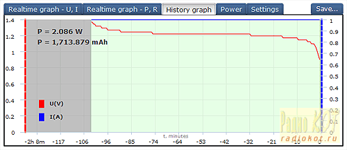

At the same time, Log Period automatically doubles if necessary when the log is full, to accommodate the entire discharge curve.

When Stop Voltage is reached, the load turns off. The indicators display "StP U", which alternates with displaying the battery capacity in Ah.

## Device Operating Modes

Below in parentheses are the values of variables in the specified mode.

### Normal Mode, Load Off
(s_adjustState = STATE_IDLE, s_bDisabled = true)

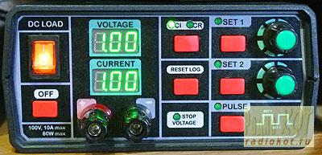

SET1, SET2, and PULSE LEDs are off. Indicators display the current of SET1 and SET2 settings.

Encoder knobs set the current of the corresponding setting.

Load is turned on by SET1, SET2, or PULSE buttons.

When pressing the first encoder button, the device displays the voltage applied to the terminals on the second indicator. The upper indicator displays "Uin" at this time.

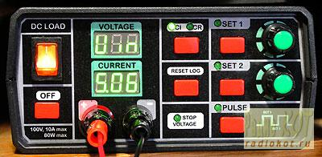

### Normal Mode, Load On
(s_adjustState = STATE_IDLE, s_bDisabled = false)

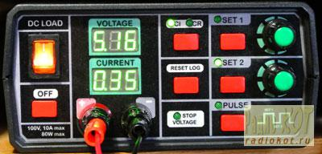

SET1 and SET2 LEDs indicate the active setting set.

Indicators display measured voltage and current.

Encoder knob sets the current of the corresponding setting.

With option DIS = 1, the lower indicator always displays the measured current.

With option DIS = 2, the lower indicator briefly displays the set current, with a dot flashing in the extreme right position.

Pressing the encoder button briefly displays the set current.

The OFF button turns off the load.

The PULSE button turns on/off pulse mode. In pulse mode, SET1 and SET2 LEDs display the active setting set. Pulse mode is turned off by SET1, SET2, or PULSE buttons.

### Shutdown Voltage

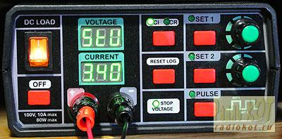

If the load is used for discharging batteries, you need to set the shutdown voltage in the settings menu (StU). A zero value turns off shutdown. If a non-zero value is set, the "Stop Voltage" LED will light up. When the specified voltage is reached, the load will turn off after 30 seconds. The "Stop Voltage" LED will start flashing, and the indicators will display "STP U", which will alternate with displaying the power consumed since the last turn-on, in Ah. To return to normal mode, you need to press the "OFF" button.

### Options Mode

To enter options mode, you need to hold the upper encoder button for 1 second.

The upper encoder and upper encoder button switch options.

The lower encoder changes the current option.

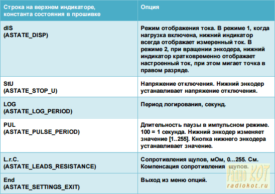

### Calibration Mode

To enter calibration mode, you need to hold the upper encoder button for 5 seconds. Calibration is performed once after assembling the device.

The upper encoder and upper encoder button switch the setting.

The lower encoder adjusts the setting.

The lower encoder button saves the setting.

Indicators contain 3 segments. If the displayed number is greater than 999, the indicator will display first [high part][minus], then [minus][low part], with a 1 second interval, for example, for 4095: [40-] [-95].

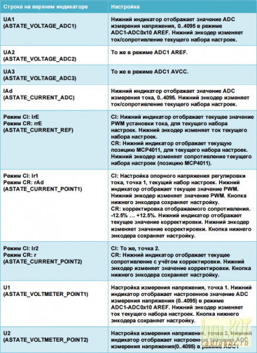

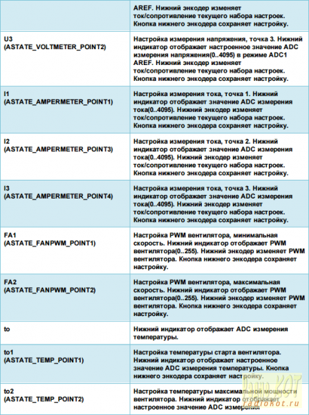

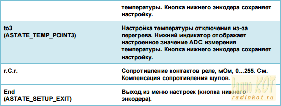

## Calibration

After flashing the device, it must be calibrated. All settings are saved in EEPROM.

All measurements with ADC are performed 16 times with averaging 4 times, which gives values in the range 0..4095.

Calibration is more convenient to perform using PC software.

### Calibration Points

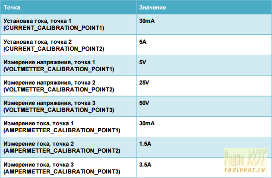

### Voltage Measurement Calibration

Voltage from the device terminals is reduced to an acceptable range using divider R10,R14:

```
Uadc = U * 2.7 / (56 + 2.7) = U * 0.04599
```

which allows measuring voltage up to 108.7V.

To improve accuracy when measuring small values, the device measures voltage with three different ADC settings:

* x10 relative to AREF (2.56V);
* x1 relative to AREF;
* x1 relative to VCC.

Maximum voltage for the first range:

```
2.56V / 10 / 0.04599 = 5.56V
```

Maximum voltage for the second range:

```
2.56V / 0.04599 = 55.6V
```

Maximum voltage for the third range:

```
5V / 0.04599 = 108.7V
```

The firmware uses a more accurate mode if the value from ADC does not exceed 4000.

At high currents, the voltage drop across the relay RL2 contacts becomes significant. The device corrects the voltage value at the terminals using the contact resistance - the "r.C.r." setting.

To calibrate the first range, you need to set the minimum current and apply 5V to the device terminals. The ADC value displayed in the menu item UA1(ASTATE_VOLTAGE_ADC1) must be specified in the menu item U1(ASTATE_VOLTMETER_POINT1).

The same must be done with points 25V and 50V.

### Temperature Calibration

For temperature calibration, you will need a heat gun and a thermocouple (preferably). The value from the temperature sensor is displayed in the "to" item of the calibration menu (but it's much more convenient to use PC software).

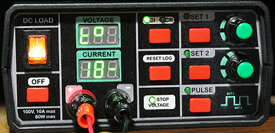

You need to heat the temperature sensor to 40 degrees and enter the sensor readings into the to1 parameter of the calibration menu.

Next, you need to heat the sensor to 50 degrees and enter the readings into the to2 parameter.

The sensor value at 55 degrees is entered into the to3 parameter.

### Fan Speed Calibration

In the FA1 parameter, you need to specify the PWM value at which the fan starts reliably. At the moment of changing the PWM value in the calibration menu, the fan rotates at the specified speed.

In the FA2 parameter, you need to specify the PWM value at which the voltage on the fan equals 12V (measure with a multimeter).

### Maximum Power Calculation

Maximum power is limited by the maximum junction temperature of the power transistor. A description of the method for calculating the thermal mode of transistors can be found in [7a].

From the calculation for maximum power 80W:

For each transistor - ~40W.

For IRF630:

```
Operating Junction and Storage Temperature Range: -55 to +150
Maximum Junction-to-Case (Drain): 1.7
Case-to-Sink, Flat, Greased Surface: 0.5
```

We take the thermal paste resistance as 0.3.

The junction temperature is higher than the heatsink temperature by: 40 * (1.7 + 0.5 + 0.3) = 100 degrees.

The heatsink temperature needs to be kept no more than 150-100 = 50 degrees.

Maximum power can be increased by using transistors with improved thermal resistances and increased operating temperatures, such as IRF540N, IRF640.

## Firmware

The firmware is written in CodevisionAVR 2.05.

The firmware can be written either directly or through a bootloader.

Fuses for writing the firmware directly:

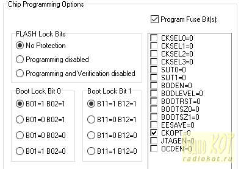

### Bootloader

The bootloader is written in CodevisionAVR 2.05.

Fuses for writing the bootloader:

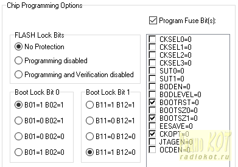

If the bootloader is written to the microcontroller, firmware updates can be performed via USB cable. This is very convenient, as there is no need to open the device enclosure for updates.

The bootloader implements the AVR910 protocol at a port speed of 9600. To enter the bootloader, you need to turn on the device while holding the OFF button, at which time "bootr" is output to the console, and "P" is displayed on the indicators.

Firmware updates can be performed with the supplied software, or any program that works with the AVR910 protocol.

## Parameter Calculation for "Const R" Operating Mode

In the specified resistance mode, current is directly proportional to the voltage at the load terminals. Dividers formed by resistors R26, R27 and chips U4, U5 generate the reference voltage for the operational amplifier. U4,U5 are electronic potentiometers controlled by the microcontroller.

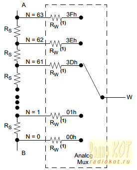

Maximum reference voltage is formed when U4,U5 are set to position 0 (pin W is connected to terminal B), which corresponds to 2.1 kΩ.

At this point, the following is formed on the divider:

```
Uref = U * 2.1 / ( 20 + 2.1 )
```

The current on the current measuring resistor R3 forms a voltage:

```
Ui = 0.15 * I
```

```
U * 2.1 / (20+2.1) = 0.15 * I
U/I = 0.15 / ( 2.1 / (20+2.1) ) = 1.57 Ohm
```

Minimum reference voltage is formed when U4,U5 are set to position 1, which corresponds to 2.1/63 kΩ = 33.3 Ω

At this point, the following is formed on the divider:

```
Uref = U * 33.3 / ( 20000 + 2100 )
U/I = 0.15 / ( 33.3 / (20000+21000) ) = 99.55 Ohm
```

Separate electronic potentiometers for each setting set are used for maximum fast switching in pulse mode, since they are controlled via a relatively slow serial protocol.

## Power Stage Stability Calculation

The device is based on the simplest electronic load circuit:

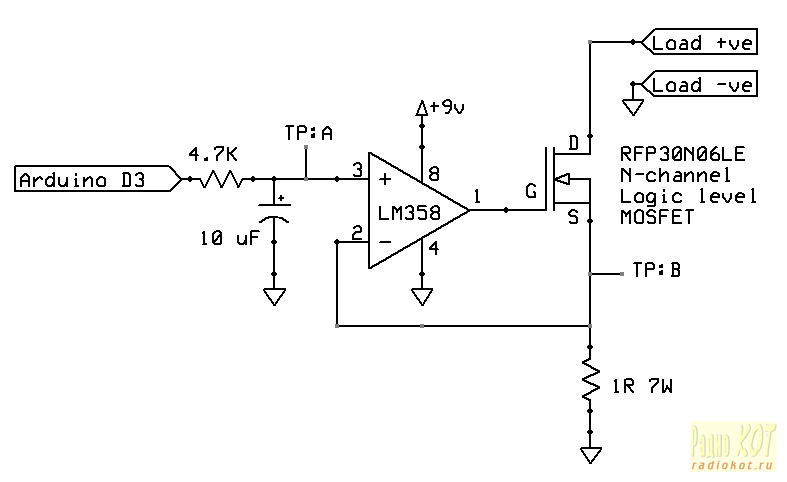

Along with simplicity, this circuit has a number of disadvantages.

In this circuit, it should be taken into account that the operational amplifier works on an inductive load - on a source follower, whose capacitance equals[1]:

```
Cin = Cgd + (1-Gain) * Cgs
```

and is somewhat smaller than the Gate-Source capacitance.

The gate capacitance itself is connected between the output and input of the operational amplifier according to the integrator circuit.

The stability analysis method is described in [2a][3a][4a][5a][6a]. Due to the lack of measuring equipment, analysis is performed in LTSpice, according to the method described in [15b].

In the ideal case, the circuit works stably:

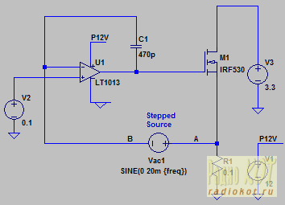

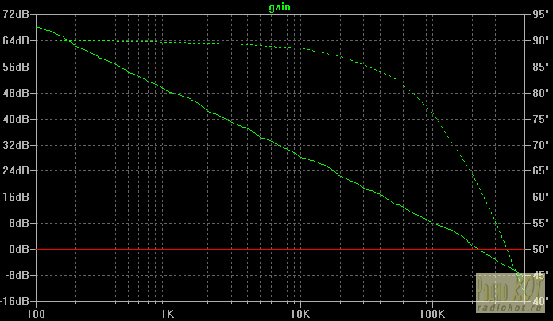

However, once you add resistance and inductance of wires, the circuit becomes unstable:

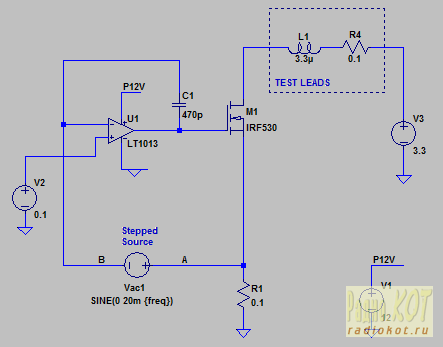

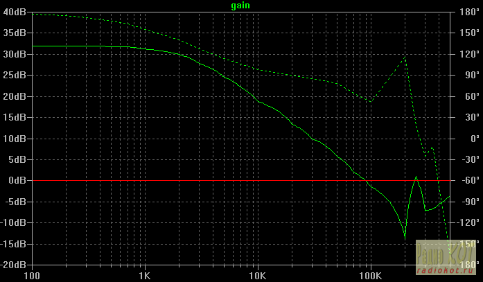

After selecting elements, it was possible to obtain a stable circuit Phase Margin = 50, Gain Margin = 12dB:


Snubber elements C18R44 are installed directly on the terminal contacts.

The second problem of the simplest circuit - if you apply voltage to an already turned-on load, operation starts with a short circuit, since in the absence of voltage on the current sensor, the operational amplifier raises the gate voltage to maximum.

When current starts flowing, the gate voltage decreases relatively slowly: the source follower capacitance and the operational amplifier's slew rate play a role, which in the case of LM324 is 0.4V/μs. For example, to lower the gate potential from 12 to 5V, at least (12-5)/0.4 = 17μs is needed. The transistor is saved from breakdown only by the resistance and inductance of the wires.

To solve the second problem, we use the second amplifier stage as a comparator:


Dynamic characteristics of such a circuit (current step 1A -5A):


are on the order of 1A/μs.

And checking the comparator - operation on a rectified sine wave:


In the real circuit, some values had to be slightly changed.

Unfortunately, I placed all circuit elements on the front panel board. Long wires to the power transistors and terminals resulted, which have some inductance and resistance, and also pick up interference from the digital part.

It would have been more correct to place the operational amplifier U1, multiplexer U7, potentiometers U4, U5, as well as the second part of filters C13R22R8, C12R23R1 on a separate board directly under the power transistors and heatsink.

I didn't want to redo it and accepted more modest characteristics.

Switching 0.5A->2.5A, U=12V:


Switching 2.5A->0.5A, U=12V:


Operation on a "rectified sine wave" (on a transformer power supply with a dried-out capacitor), I=0.5A:


When exiting the minimum, the load tries to turn on several times, but the voltage quickly drops below 300mV.


## Probe Resistance Compensation

When using long wires, a voltage drop is observed in them. We are interested in the voltage at the ends of the probes, not at the device terminals. In professional devices, four-wire connection to the load is used.

To simplify working with the device, the measured voltage value is simply recalculated based on the wire resistance and measured current.

To compensate for probe resistance, you need to specify their resistance in the device settings (see menu item "L.r.C.").


To determine the probe resistance, you need to connect the load to a power supply and turn on the 1A current stabilization mode. After that, you need to measure the voltage with a reference voltmeter at the ends of the probes and at the device terminals. The voltage difference in mV will equal the probe resistance in mΩ. This value needs to be specified in the device settings.

After specifying the correct resistance, the device voltage indicator will display the voltage value at the ends of the probes (corrected based on probe resistance and current measured current).

The device also compensates for relay contact resistance. See menu item "r.C.r." in the calibration menu. To determine the relay contact resistance, you need to measure the voltage drop across the relay contacts when the load is operating in 1A current stabilization mode.

Full firmware sources and software are attached to the article.

Schematic, board (Proteus), firmware (CodevisionAVR), PC software (Flash Builder 4.6):

[ActiveLoad.rar](ActiveLoad.rar)

## Materials

1a. Some questions on the application of field-effect transistors
[https://www.cqham.ru/forum/attachment.php?attachmentid=61770&d=1283148514](https://www.cqham.ru/forum/attachment.php?attachmentid=61770&d=1283148514)

2a. Biricha Digital. Foundations (Part 1.A) - Understanding Bode Plots and Stability of Power Supplies
[https://www.biricha.com/articles/view/bode_plot_analysis_of_smps](https://www.biricha.com/articles/view/bode_plot_analysis_of_smps)

3a. Biricha Digital. Foundations (Part 1.B) - Frequency Response Measurement of the Plant, Compensator and Loop of our Switch Mode Power Supply
[https://www.biricha.com/articles/view/frequency_response_measurement](https://www.biricha.com/articles/view/frequency_response_measurement)

4a. Biricha Digital. Foundations (Part 1.C) - Understanding and Using Transfer Functions
[https://www.biricha.com/articles/view/transfer_functions_poles_zeros](https://www.biricha.com/articles/view/transfer_functions_poles_zeros)

5a. H4621852 - Bode Plot Example and Interpretation
[https://www.youtube.com/watch?v=__WpViE9LKE](https://www.youtube.com/watch?v=__WpViE9LKE)

6a. Stability 101 Whiteboard Series by Analog Devices, Inc.
Stability 101: Loop Gain in Operational Amplifiers
Stability 101: Bode Plots and Operational Amplifiers
Stability 101: Decompensated Operational Amplifiers
Stability 101: Driving a Capacitive Load (Operational Amplifiers)
Stability 101: Parasitic Capacitance in Operational Amplifiers
[https://www.youtube.com/playlist?list=PLiwaj4qabLWwAenk99ONF2_JUjopeAXo4](https://www.youtube.com/playlist?list=PLiwaj4qabLWwAenk99ONF2_JUjopeAXo4)

7a. Heatsinks and Cooling
[https://radiokot.ru/articles/02/](https://radiokot.ru/articles/02/)

8a. How to Measure the Slew Rate of a DC Electronic Load
[https://www.youtube.com/watch?v=4WqzFtAEg58](https://www.youtube.com/watch?v=4WqzFtAEg58)

9a. EEVblog #393 - LiPo Battery Discharge Testing
[https://www.youtube.com/watch?v=ln8Mlz4NsW8](https://www.youtube.com/watch?v=ln8Mlz4NsW8)

10a. Lio-ion batteries discharge curves
[https://www.candlepowerforums.com/vb/showthread.php?308451](https://www.candlepowerforums.com/vb/showthread.php?308451)

11a. Microchip AN884.Driving Capacitive Loads With Op Amps
[https://ww1.microchip.com/downloads/en/appnotes/00884a.pdf](https://ww1.microchip.com/downloads/en/appnotes/00884a.pdf)

12a. #172: Basics of Op Amp Gain Bandwidth Product and Slew Rate Limit
[https://www.youtube.com/watch?v=UooUGC7tNRg](https://www.youtube.com/watch?v=UooUGC7tNRg)

13a. EEVblog #479 - Opamp Input Bias Current
[https://www.youtube.com/watch?v=TxBJb-Z0XFI](https://www.youtube.com/watch?v=TxBJb-Z0XFI)

14a. 42 Op-Amp Compensation, Slew Rate and Some Problems
[https://www.youtube.com/watch?v=YQMP-FLHvwk](https://www.youtube.com/watch?v=YQMP-FLHvwk)

15a. 41 - Op-Amp offsets, Compensations & Slew Rate
[https://www.youtube.com/watch?v=pqVjNZ74vaw](https://www.youtube.com/watch?v=pqVjNZ74vaw)

16a. Application and operation of sealed lead-acid batteries
[https://www.solarhome.ru/biblio/accu/plumbum.htm](https://www.solarhome.ru/biblio/accu/plumbum.htm)

17a. Battery and cell testing methodology
[https://fcenter.ru/online/hardarticles/tower/23077](https://fcenter.ru/online/hardarticles/tower/23077)

18a. Windows ANE tutorial: The native DLL project
[https://easynativeextensions.com/windows-tutorial-the-native-dll-project/](https://easynativeextensions.com/windows-tutorial-the-native-dll-project/)

19a. Air-HID-USB
[https://code.google.com/p/air-hid-usb/](https://code.google.com/p/air-hid-usb/)
[https://air-hid-usb.googlecode.com/svn-history/r2/trunk/hidapi/hidapi_native/windows/readme.txt](https://air-hid-usb.googlecode.com/svn-history/r2/trunk/hidapi/hidapi_native/windows/readme.txt)

20. Developing Native Extensions for ADOBE® AIR®
[https://help.adobe.com/en_US/air/extensions/air_extensions.pdf](https://help.adobe.com/en_US/air/extensions/air_extensions.pdf)

21a. Measuring battery internal resistance
[https://electrotransport.ru/ussr/index.php?topic=17873.0](https://electrotransport.ru/ussr/index.php?topic=17873.0)

22a. Understanding Op Amp parameters
[https://www.ti.com/lit/ml/sloa083/sloa083.pdf](https://www.ti.com/lit/ml/sloa083/sloa083.pdf)

23a. Some tips on stabilizing operational amplifiers
[https://www.jensen-transformers.com/wp-content/uploads/2014/08/an001.pdf](https://www.jensen-transformers.com/wp-content/uploads/2014/08/an001.pdf)

24a. Understanding the terms and Definitions of LDO Voltage regulators
[https://www.ti.com/lit/an/slva079/slva079.pdf](https://www.ti.com/lit/an/slva079/slva079.pdf)

25a. Understanding Operational Amplifier Specifications
[https://people.seas.harvard.edu/~jones/es154/pdf/op_amp.pdf](https://people.seas.harvard.edu/~jones/es154/pdf/op_amp.pdf)

## Load Circuits

1b. Electronic load
[https://radiokot.ru/konkursCatDay2014/40/](https://radiokot.ru/konkursCatDay2014/40/)

2b. Universal load equivalent on TL494 from 0.01A to 20 A with smooth adjustment
[https://radiokot.ru/circuit/analog/measure/26/](https://radiokot.ru/circuit/analog/measure/26/)

3b. EEVblog #102 - DIY Constant Current Dummy Load for Power Supply and Battery Testing
[https://www.youtube.com/watch?v=8xX2SVcItOA](https://www.youtube.com/watch?v=8xX2SVcItOA)

4b. DC / Constant Current Load - Ec-Projects
[https://www.youtube.com/watch?v=Ld18Y1HbHME](https://www.youtube.com/watch?v=Ld18Y1HbHME)
[https://www.youtube.com/watch?v=VALwHsPadl0&index=14&list=PLjNFgjzaazXlxwteNmpG2Eioi6u3rLScY](https://www.youtube.com/watch?v=VALwHsPadl0&index=14&list=PLjNFgjzaazXlxwteNmpG2Eioi6u3rLScY)
[https://www.youtube.com/watch?v=qgU7By8zAL0&list=PLjNFgjzaazXlxwteNmpG2Eioi6u3rLScY&index=13](https://www.youtube.com/watch?v=qgU7By8zAL0&list=PLjNFgjzaazXlxwteNmpG2Eioi6u3rLScY&index=13)

5b. Electronic rheostat provides decades of load resistance
[https://www.eetimes.com/document.asp?doc_id=1272278](https://www.eetimes.com/document.asp?doc_id=1272278)

6b. Fuel-cell battery tester
[https://circuit-diagram.hqew.net/Fuel-cell-battery-tester_17258.html](https://circuit-diagram.hqew.net/Fuel-cell-battery-tester_17258.html)

7b. Jasper's Electric Load
[https://jasper.sikken.nl/electronicload/index.html](https://jasper.sikken.nl/electronicload/index.html)

8b. Small electronic load
[https://publications.lib.chalmers.se/records/fulltext/169764/169764.pdf](https://publications.lib.chalmers.se/records/fulltext/169764/169764.pdf)

9b. A Closed-Loop, Wideband, 100A Active Load
[https://cds.linear.com/docs/en/application-note/an133f.pdf](https://cds.linear.com/docs/en/application-note/an133f.pdf)

10b. Electronic load
[https://vprl.ru/publ/istochniki_pitanija/bloki_pitanija/ehlektronnaja_nagruzka/11-1-0-74](https://vprl.ru/publ/istochniki_pitanija/bloki_pitanija/ehlektronnaja_nagruzka/11-1-0-74)

11b. Electronic Load 300 W (discussion on cxem.net forum)
[https://forum.cxem.net/index.php?showtopic=81786](https://forum.cxem.net/index.php?showtopic=81786)

12b. Electronic load (Radiokot forum)
[https://radiokot.ru/forum/viewtopic.php?p=1628355#p1628355](https://radiokot.ru/forum/viewtopic.php?p=1628355#p1628355)

13b. Electronic load (Radiokot forum)
[https://radiokot.ru/forum/viewtopic.php?f=11&t=110868&sid=94846d0bacd837fbc537841d1c730152](https://radiokot.ru/forum/viewtopic.php?f=11&t=110868&sid=94846d0bacd837fbc537841d1c730152)

14b. Electronic load (Radiokot forum)
[https://www.radiokot.ru/forum/viewtopic.php?f=25&t=108283](https://www.radiokot.ru/forum/viewtopic.php?f=25&t=108283)

15b. Dynamic Electronic Load Project (EEVBlog)
[https://www.eevblog.com/forum/projects/dynamic-electronic-load-project/](https://www.eevblog.com/forum/projects/dynamic-electronic-load-project/)

16b. Battery capacity and internal resistance meter
[https://radiokot.ru/circuit/digital/measure/89/](https://radiokot.ru/circuit/digital/measure/89/)

17b. Li-ion, Li-Pol, Ni-MH, Ni-Cd battery tester
[https://radiokot.ru/circuit/power/charger/20/](https://radiokot.ru/circuit/power/charger/20/)

18b. Lithium Battery Capacity Tester
[https://www.vwlowen.co.uk/arduino/battery-tester/battery-tester.htm](https://www.vwlowen.co.uk/arduino/battery-tester/battery-tester.htm)

19b. Power supply inside out or electronic load control board
[https://mysku.ru/blog/aliexpress/33092.html](https://mysku.ru/blog/aliexpress/33092.html)

20b. Agilent Technologies Model 6060B and 6063B
[https://literature.cdn.keysight.com/litweb/pdf/5951-2828.pdf](https://literature.cdn.keysight.com/litweb/pdf/5951-2828.pdf)
