# Двухканальный управляемый лабораторный блок питания

*Статья опубликована на сайте [radiokot.ru](https://radiokot.ru/circuit/power/supply/55/)* 
**Статья заняла 1 место в конкурсе статей "Поздравь Кота по-человечески 2016!"**

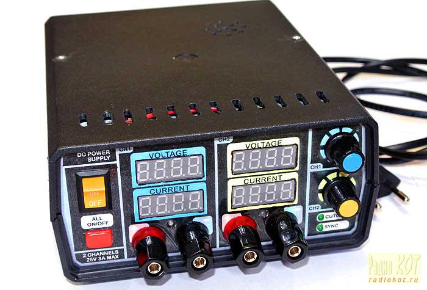

## Краткие характеристики

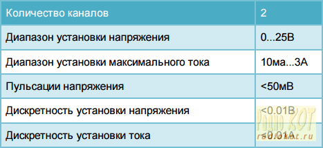

Для питания своих устройств длительное время пользовался зарядкой от ноутбука, зарядками для телефонов и простейшим регулируемым блоком питания, переделанным из "дежурки" ATX.

Потребность в хорошем лабораторном блоке питания ощущалась всегда, при этом хотелось сделать его самостоятельно.

В конце концов, вооружившись схемами лабораторных блоков питания из интернета, мне удалось разработать схему, прошивку и собрать блок питания, который служит безотказно вот уже более года. Результат полностью удовлетворил мои нужды.

Далее попытаюсь вжать в статью то, что делалось почти два года с перерывами.

## Постановка задачи

Итак, разработка началась с постановки задачи, все пункты которой в итоге оказались выполнены на 100%:

- двухканальный блок питания. Каналы независимые. Можно соединять последовательно для получения двухполярного или повышенного напряжения. Есть режим синхронизации установки параметров;
- диапазон регулировки напряжения: 0 - 25В;
- диапазон регулировки тока: 10мА - 3А. Нижний предел в 10мА желателен для проверки светодиодов, стабилитронов;
- режимы отсечки и ограничения тока. При КЗ в режиме ограничения тока напряжение должно опускаться до нуля. Ограничение тока должно отрабатывать в пределах 1мс;
- уровень пульсаций напряжения меньше 50мВ;
- точность установки напряжения - до 100мВ;
- точность установки тока - до 10мА;
- отображение текущего измеренного напряжения и тока ( 4 разряда ) на 7-ми сегментных светодиодных индикаторах. Эти индикаторы отлично читаются при любом освещении и угле зрения;
- малогабаритный пластмассовый корпус Z2W 70x150x180;
- управление каналом одним энкодером
- общая кнопка включения/отключения питания;
- автоматическая регулировка скорости вентилятора и аварийное отключение при превышении температуры;
- высокий КПД и низкое тепловыделение, желательна работа без принудительного обдува;
- первичный источник должен иметь достаточный запас по мощности, чтобы выдавать ток 3А на всём диапазоне регулировки напряжений;
- по максимуму использовать имеющиеся детали от компьютерных блоков питания, материнских плат, энергосберегающих ламп, радиоуправляемых игрушек;
- схема может использовать большее количество деталей, чем необходимо, если они есть в наличии или очень дёшевы;
- баланс в сторону простоты схемы, а не получения экстраординарных характеристик.

В качестве вдохновения выступал блок питания от ноутбука, который при своих габаритах и полном отсутствии охлаждения способен выдавать 200Вт!

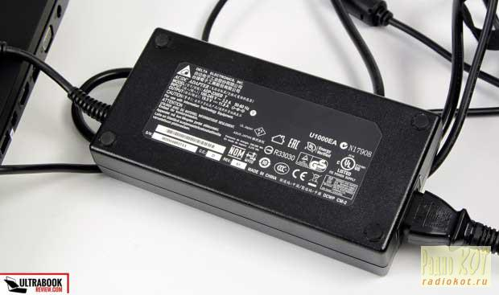

## Обзор модулей блока питания

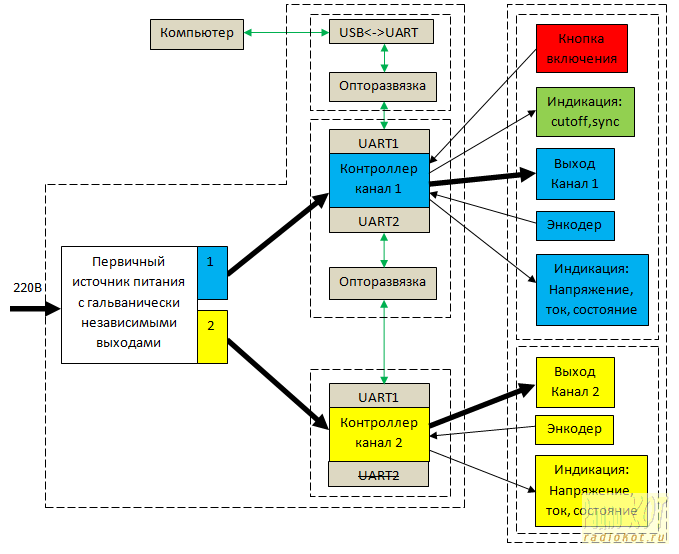

Общий вид БП показан на диаграмме. Первичный источник питания с двумя гальванически развязанными выходами подаёт питание на два идентичных контроллера каналов. Контроллеры подключаются к блоку индикации, каждый к своему. Оба блока индикации находятся на лицевой плате, но они не связаны гальванически. Общая кнопка включения присоединяется к первому каналу.

## Гальваническая развязка каналов

Гальваническая развязка измерительных модулей сама по себе является непростой задачей. Для упрощения схемы был выбран другой путь: каналы управляются полностью одинаковыми модулями, каждый на своём отдельном микроконтроллере. Связь между модулями осуществляется через UART интерфейс, развязанный с помощью оптопар. Оба канала - равноправные, осуществляют двухстроннюю коммуникацию для синхронизации параметров и для аварийного отключения.

Далее рассмотрим все модули подробней.

## Первичный источник питания

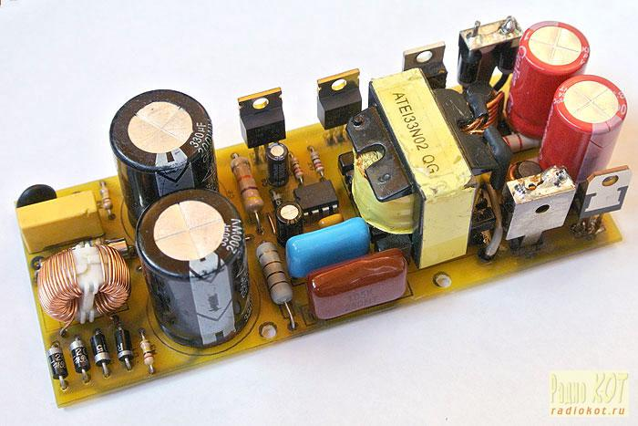

В качестве первичного источника питания используется нерегулируемый импульсный источник питания 2x38В.  
Вариант с трансформаторным источником сразу отпал по нескольким причинам. Во-первых, в рамках поставленной задачи для такого трансформатора попросту нет места. Во-вторых, готового трансформатора у меня не было, а стоят они дорого. Зато у меня есть целая куча неисправных ATX блоков питания, из деталей которых можно изготовить миниатюрный мощный первичный источник.

Схема на микросхеме IR2153 была выбрана из-за своей простоты. Кроме того, в ней используется готовый трансформатор из БП ATX, которые я пока не научился правильно рассчитывать и мотать.

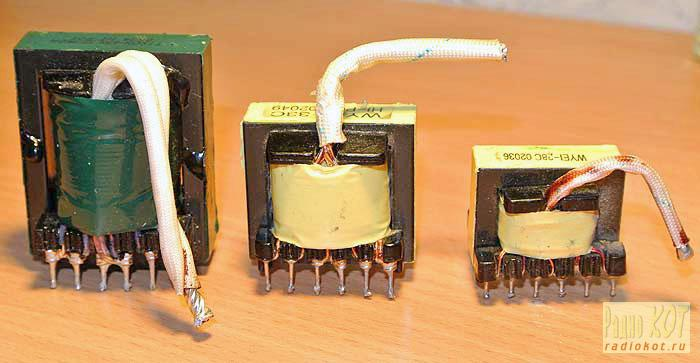

Однако, схемы на IR2153, которых полно в интернете, слишком упрощены. Схема со всеми "лишними" деталями показана ниже:

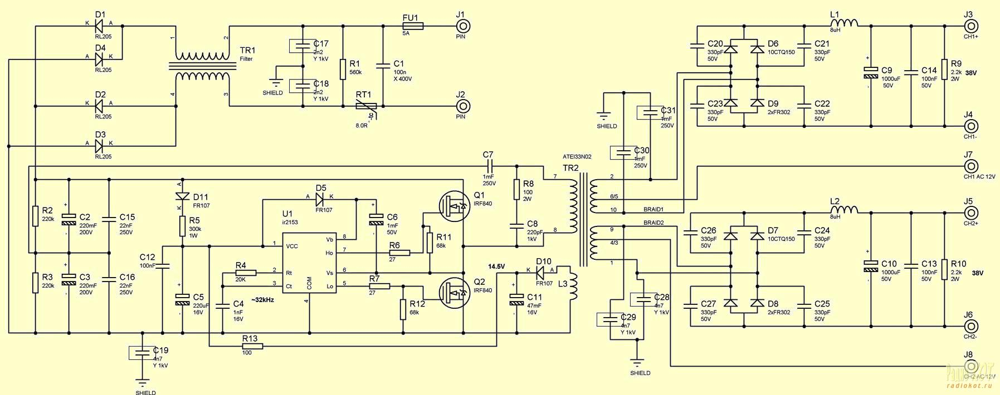

Рассмотрим схему подробно.

Все детали для входной части схемы ( X-конденсатор, позистор, дроссель, диоды, силовые конденсаторы) выпаиваются из любого ATX БП.  
Далее идет контроллер IR2153, который управляет двумя силовыми ключами IRF840, образуя прямоходовой преобразователь, работающий на частоте ~32 кГц.  
Обмотка L3 служит для питания контроллера в рабочем режиме. В упрощенных схемах контроллер питается через резистор R5, но в этом случае на нём выделяется ~2Вт тепла, что в нашем корпусе неприемлемо. В этой схеме R5 наоборот максимально увеличен, запуск блока происходит через ~3 секунды после включения из-за ожидания заряда C5, но зато потом ничего не греется.  
Силовой трансформатор TR2 - из БП ATX на 200Вт, с доработкой.

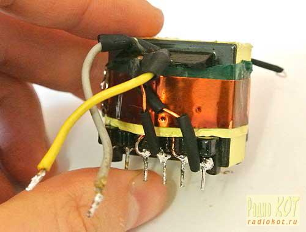

Для получения 38В, необходимо распустить "косу" и соединить последовательно 3 обмотки 5В и обмотки 12В, получив 2 независимые обмотки на 38В. Типичная схема соединений в трансформаторе ATX БП показана ниже:

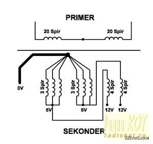

Главное - не перепутать направление намотки!  
Далее, сверху наматывается обмотка питания проводом МГТФ минимального диаметра:

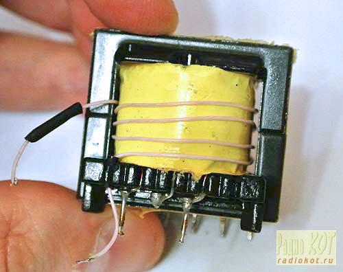

Далее трансформатор изолируется, а сверху делается короткозамкнутый виток из медной фольги, как показано выше.

Выходная часть схемы представляет собой 2 независимых полномостовых выпрямителя.  
Диоды подойдут FR302 из ATX БП. Дроссели тоже:

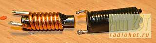

Конденсаторы на 50V придётся докупить.

Отводы 12В планировались для питания микроконтроллеров каналов, но в финале пришлось от них отказаться, так как под выпрямительные диоды и конденсаторы просто не хватило места. Зато схема контроллера стала более универсальной - требует только 38...40В.

Как видно, в схеме нет обратной связи. По сути, она представляет собой электронный трансформатор. Выходное напряжение будет снижаться при увеличении нагрузки, с 38В до 28В при 3А на канал.

## Порядок настройки первичного источника на IR2153

1. От внешнего источника питания подаем 12В на ножки 1(+) и 4(-) микросхемы (к сети не подключаем!) Убеждаемся, что на затворах обоих транзисторов присутствуют прямоугольные импульсы ~32кГц. Подбираем R4C4, чтобы получить эту частоту.
2. Вместо резистора R5 впаиваем резистор 47кОм 2Вт. Выпаиваем резистор R13 (отключаем самопитание). Включаем источник в сеть через лампу 100Вт. Нагрузка не должна быть подключена. Лампа должна вспыхнуть на секунду и погаснуть. Через 5 секунд отключаем от сети и убеждаемся, что никакие детали не нагрелись.  
   Если лампа горит - где-то к.з. Если лампа мигает - проверить цепь питания микросхемы ( ножки 1,4), проверить на замыкание выходной выпрямитель.
3. Включаем в сеть и аккуратно замеряем напряжение на ножках 1,4. Оно должно быть в пределах 10-15.6В.
4. Нагружаем выход выпрямителя обмотки самопитания резистором 1.2кОм. Включаем и замеряем напряжение. Выключаем и доматываем витки для получения 16.5-17.5В.
5. Резистор R5 заменяем на 300кОм, впаиваем резистор R13. Проверяем работу схемы с самопитанием.
6. Убираем лампу и проверяем работу схемы под нагрузкой в длительном режиме.

## Борьба с высокочастотными помехами в первичном источнике питания

Отдельно нужно рассмотреть вопрос подавления помех, или "зачем нужны все эти лишние детали".  
В любом импульсном блоке питания присутствуют высокочастотные пульсации. Для того, чтобы пульсации не шли в сеть и не вызывали радиоизлучение, на входе установлен фильтр TR1C1.

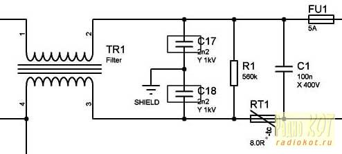

В любом трансформаторе присутствует паразитная емкость между обмотками. Существуют приемы намотки трансформатора для её уменьшения, но она всё равно всегда есть. Импульсы в первичной обмотке попадают во вторичную цепь, в результате чего потенциал вторичной цепи "взлетает" относительно нейтрали на сотни вольт. Во вторичной цепи возникают наводки. Это синфазные помехи - они идут как бы одновременно по двум проводам, их не могут отфильтровать сглаживающие фильтры L1C9, L2C10.  
Для борьбы с синфазными помехами внутри блока питания применяют так называемые Y-конденсаторы. Обычно устанавливается один конденсатор между минусами "горячей" и "холодной" частей, на котором замыкаются высокочастотные помехи. При этом на низкой частоте конденсатор остаётся изолятором.

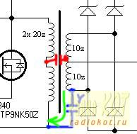

Особенность конструкции Y-конденсатора гарантирует, что при выходе из строя он не уйдёт в пробой, и сетевое напряжение не попадёт во вторичную цепь. Поэтому нужно применять только конденсаторы с обозначением "Y", а не просто высоковольтные.

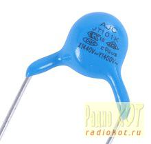

В нашем случае всё несколько сложнее: мы планируем соединять выходы последовательно в разные конфигурации. Поэтому в схеме установлены несколько Y конденсаторов, соединяющихся в некой виртуальной точке, к которой также подключается металлический экран (жестяной корпус).

Короткозамкнутый виток трансформатора (медный экран) подключается к "-" горячей части! (исток Q2).

Подробнее о синфазных помехах можно узнать в статье [3.7] [3.10].

На "холодной" стороне для сглаживания пульсаций и фильтрации помех применяются простой LC-фильтр, шунтирование диодов керамическими конденсаторами и шунтирование электролитов танталовыми конденсаторами. Далее у нас будут ферритовые кольца - но об этом позже.

## Окончательная сборка первичного источника

К сожалению, знания добывались в процессе, поэтому плата не финальная.

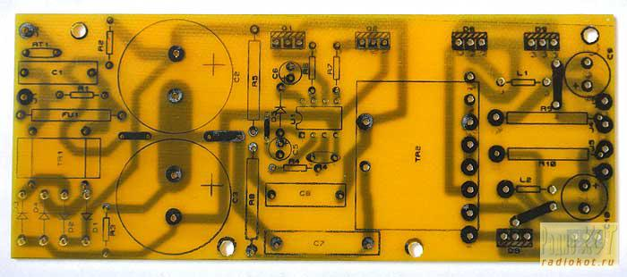
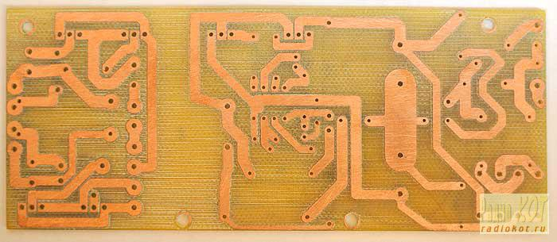

Изменения делались навесным монтажом, в частности - добавление обмотки питания контроллера и допаивание Y-конденсаторов.

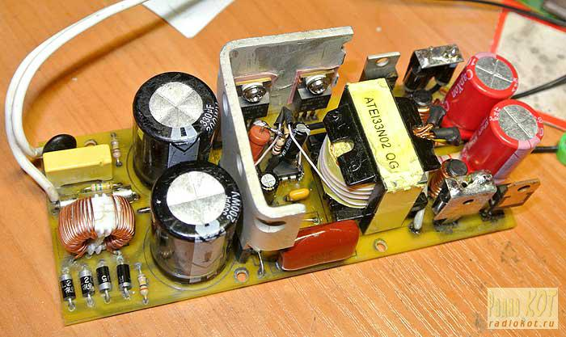

Как допаивались Y-конденсаторы - вообще страшно показывать :)

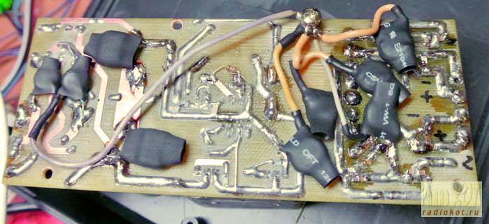

Алюминиевые радиаторы в виде пластин толщиной 3мм прикручиваются к силовым ключам и диодным сборкам через изолирующие прокладки (взятые из тех же ATX БП).  
После тестирования, блок помещается в жестяной корпус, выпиленный из корпусов ATX БП и CD-ROM.

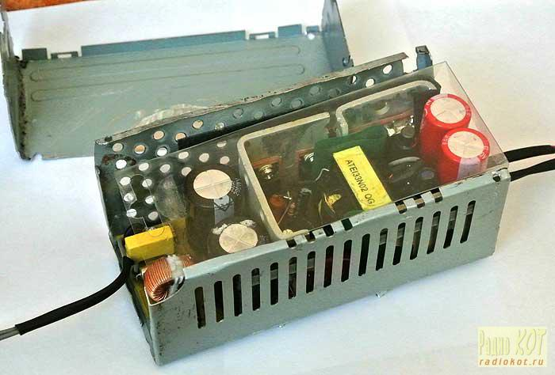

Важно обеспечить большое количество вентиляционных отверстий. К сожалению, трансформатор от ATX БП рассчитан с учетом принудительного охлаждения, поэтому ощутимо нагревается даже в холостом режиме. Также будут нагреваться выходные диоды под нагрузкой.

## Контроллер канала

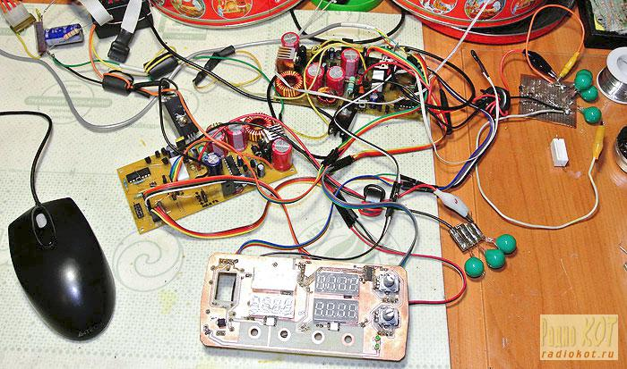

Для достижения всех поставленных целей (высокий КПД, низкий нагрев, быстрая реакция на ограничение тока ) применяется линейный регулятор с импульсным предрегулятором.

Отдельно взятый линейный регулятор потребовал бы огромного радиатора, так как все излишки мощности выше выставленного напряжения должны рассеиваться на регулирующем транзисторе, а она может достигать 150Вт.

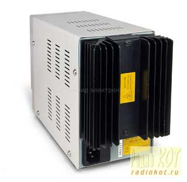

Отдельно взятый импульсный стабилизатор, напротив, не может обеспечить быструю реакцию на ограничение тока, так как частью выходного фильтра является конденсатор большой емкости.

Используя предрегулятор, выдающий напряжение на 1.2В выше требуемого, мы не рассеиваем энергию в тепло, а на транзисторе линейного регулятора выделяется так мало энергии, что он может работать с минимальным радиатором даже на 3А.

За основу схемы линейного регулятора взята часть схемы блока питания под авторством Koyodza. Все её преимущества описаны в статье [2.12]. Мне она понравилась за простоту и стабильность работы при ограничении тока.

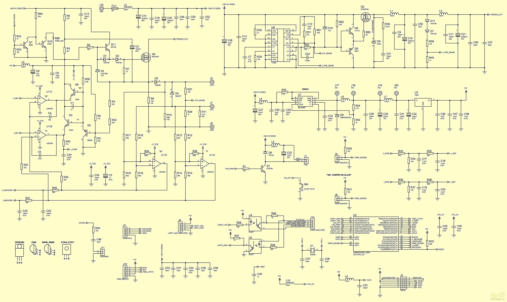

Рассмотрим элементы схемы подробно.

Импульсный предрегулятор построен на контроллере TL494 - "сердце" большинства ATX БП. Выходное напряжение предрегулятора задается сигналом OUT_SENSE - напряжением на выходе БП. Оно сравнивается с сигналом PRE_SENSE - напряжением на выходе предрегулятора, заниженным на ~1.2В за счёт падения на диодах D7, D11 (оба сигнала уменьшены в ~10 раз резистивными делителями). Таким образом, напряжение на выходе предрегулятора поддерживается примерно на 1.2В выше, чем на выходе БП.

*На этом этапе разработка сильно затормозилась, почти до полного отчаяния - не удавалось побороть осцилляцию БП. Пришлось изучать довольно обширную тему стабильности обратной связи, моделировать в LTSpice! [3.11 - 3.17].*

Напряжение на предрегулятор подаётся с первичного источника через дроссель на плате фильтрации и проходит через импровизированный предохранитель FU1, который представляет собой перемычку проводом ~0.05 прямо между дорожками платы.  
Дроссель L1 мотается на кольце от дросселя групповой стабилизации из ATX БП проводом диаметром 1мм до заполнения.

Дроссель L3 - готовый дроссель с линии 12В из ATX БП.

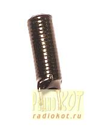

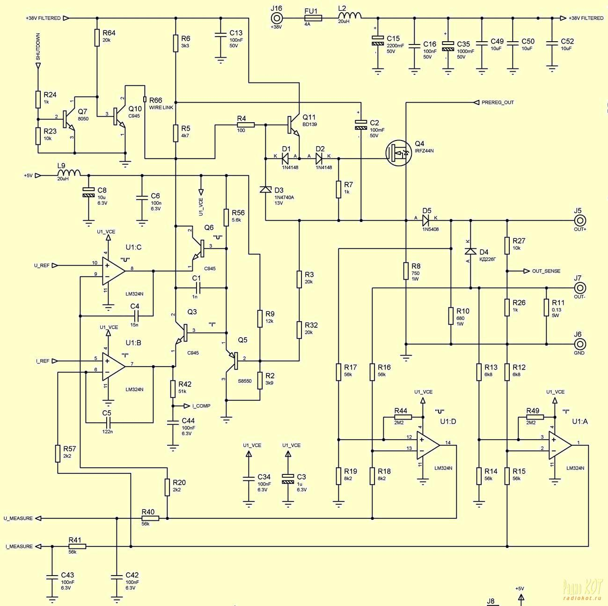

Линейный регулятор взят у Koyodza почти без изменений. Поправлены номиналы компонентов для улучшения стабильности после моделирования схемы в LTSpice. Добавлен диод D5, не позволяющий аккумулятору, подключенному к БП, питать БП после выключения. Изменены коэффициенты усиления, чтобы привести сигналы на выходах U1D U1A и входах U1B, U1C к диапазону 0...3.6В, соответствующие характеристикам БП 25В/3А (3.6В - максимальное выходное напряжение LM324 при питании от 5В)..

Цифровая часть контроллера канала построена на микроконтроллере ATMega328p.

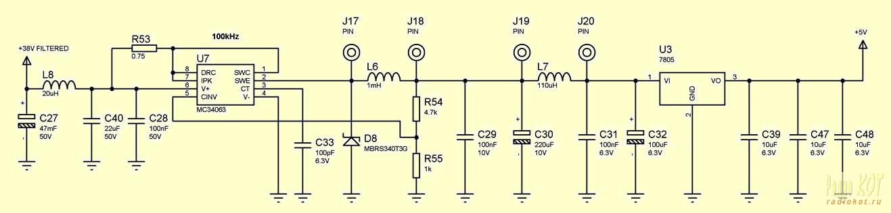

Питание 5В для микроконтроллера получается тоже связкой импульсный предрегулятор + линейный регулятор, так как LM7805 не выдерживает ни 38В входного напряжения, ни падения 33В при 0.1А.

Импульсный предрегулятор построен на микросхеме MC34063. Он опускает напряжение до 7В, а дальше работает LM7805.  
LM7805 бывают разные, с tolerance от 0.5 до 5%. Так как от стабильности питания микроконтроллера, который задает опорные напряжения, зависит точность всего БП, лучше взять стабилизатор поточнее, например LM7805CV.  
Уже в процессе наладки сделал для себя открытие, что MC34063 - не ШИМ, а релейный регулятор. Если ключ открылся - компаратор напряжения уже не может его закрыть до конца импульса. Из-за этого при большом перепаде напряжений (38->5В) на выходе получаются большие пульсации, которые можно немного уменьшить только увеличением частоты до предела - 100КГц(таким образом уменьшив длину импульса). Выход предрегулятора приходится фильтровать дополнительным дросселем L7. О том, как еще уменьшить высокочастотные пульсации в данной связке, можно послушать здесь[3.3].

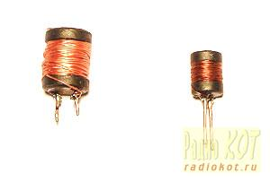

Гантельки для дросселей L6 и L7 добываются от балластов КЛЛ.

Микроконтроллер формирует опорные напряжения с помощью ШИМ. Сигналы сглаживаются двухкаскадными фильтрами R33R34C17R35C18 и R36R37C19R38C20. Применяется ШИМ на 4096 отсчетов, что теоретически позволяет устанавливать напряжение и ток с дискретностью 25/4096=0,0061В, 3/4096=0,0007А.

Для измерения напряжения и тока применяется встроенный АЦП, что позволяет измерять напряжение и ток с точностью 25/4096/3.6*5=0,0084В и 3/4096/3.6*5=0,001А если повезёт(применяется оверсамплинг до 4096 -16 измерений с усреднением на 4), где 3.6 - максимальное напряжение на выходе LM324, 5 - опорное напряжение АЦП.

Обычно я делаю много изменений в процессе разработки, как результат у меня обычно нет финальной печатной платы. Но в данном случае, плата была переработана под второй контроллер и она содержится в архиве.

Плата первой версии в процессе разработки:

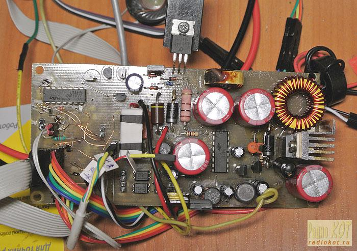
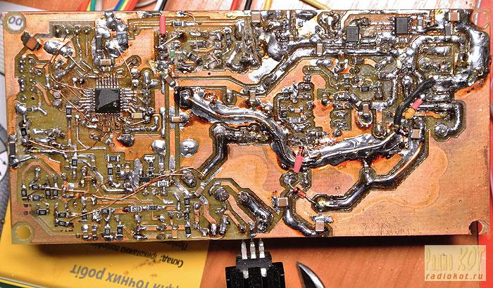
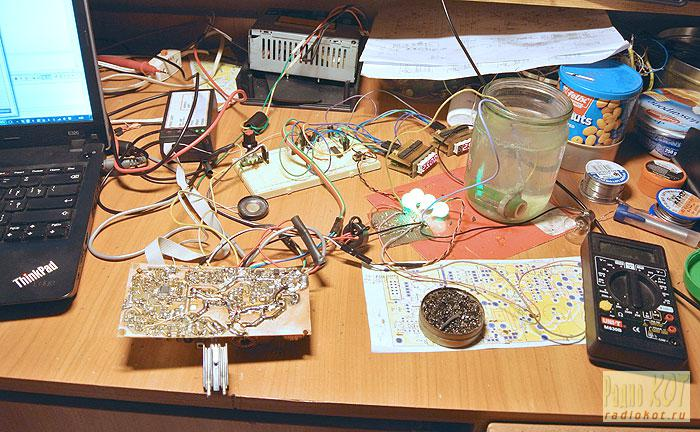

Как видно, некоторые проводники нужно усилить медным проводом 1mm^2 для улучшения общей точности и стабильности БП.

## Стабильность

На этапе настройки контроллера разработка сильно затормозилась почти до полного отчаяния - не удавалось побороть осцилляцию БП. Пришлось изучать довольно обширную тему стабильности обратной связи, моделировать в LTSpice [3.11 - 3.18].

Расчет стабильности осуществляется по методике, описанной в [3.18].

Стабильность линейного стабилизатора в режиме стабилизации напряжения:

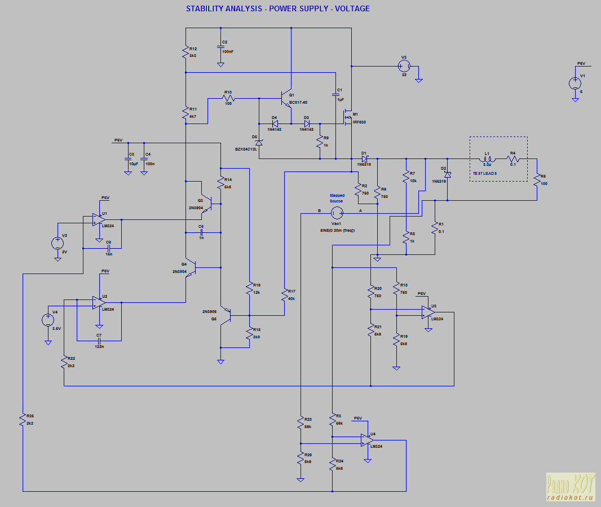

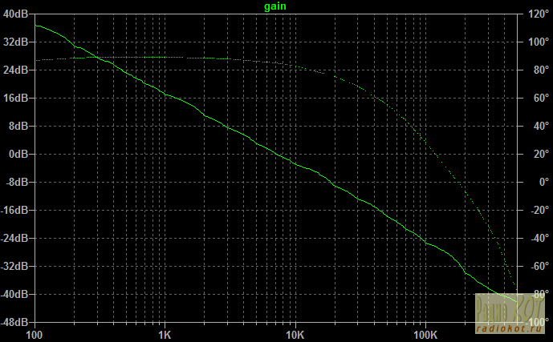

Crossover frequency = 7kHz  
Phase margin = 84°  
Gain Margin = 26dB  
Очень хорошие показатели.

Стабильность линейного стабилизатора в режиме ограничения тока:

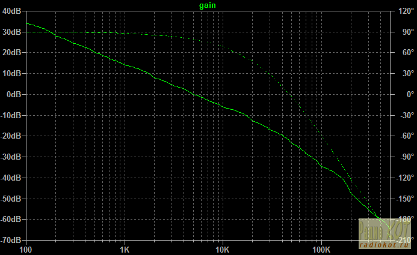

Crossover frequency = 5kHz  
Phase margin = 79°  
Gain Margin = 22dB

Стабильность связки пререгулятор + линейный стабилизатор, режим стабилизации напряжения:

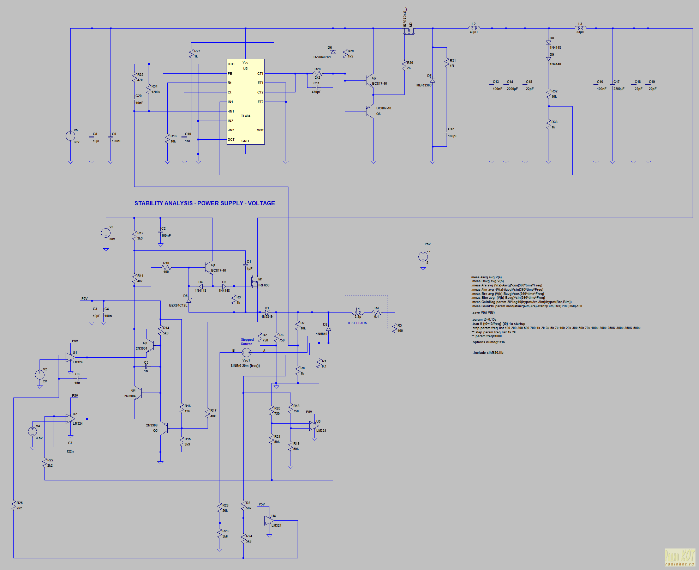
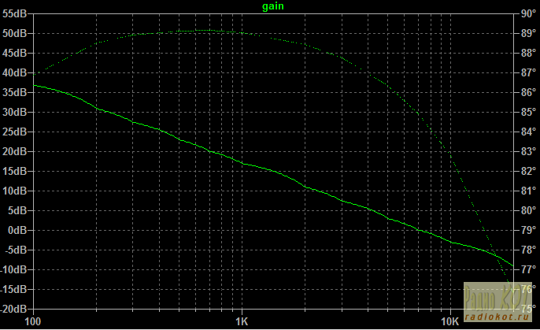

Crossover frequency = 7kHz  
Phase margin = 85°

## Блок индикации

Плата блока индикации прикручивается к передней панели корпуса Z2W. Передние стойки нужно удалить.

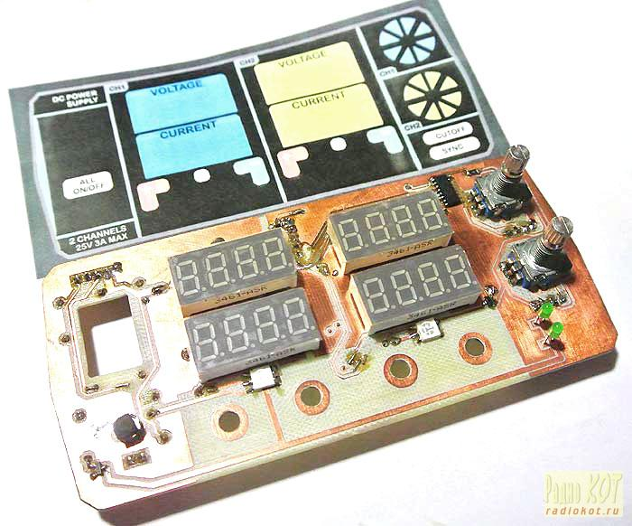
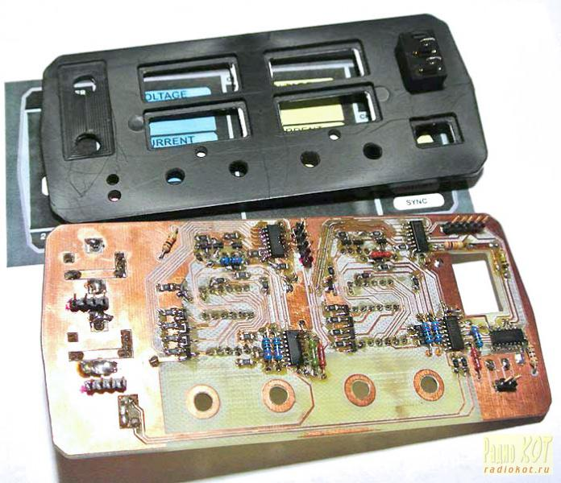

Блок индикации содержит две независимые схемы для каждого канала, в составе:

- семисегментные индикаторы, RGB светодиоды состояния, светодиоды SYNC, CUTOFF, подключенные к сдвиговым регистрам 74HC595. Управляются по трём проводам;
- энкодер;
- клеммы
- кнопка включения
- переключатель включения 220B.

Кнопка включения и светодиоды SYNC, CUTOFF подключены к первому каналу.

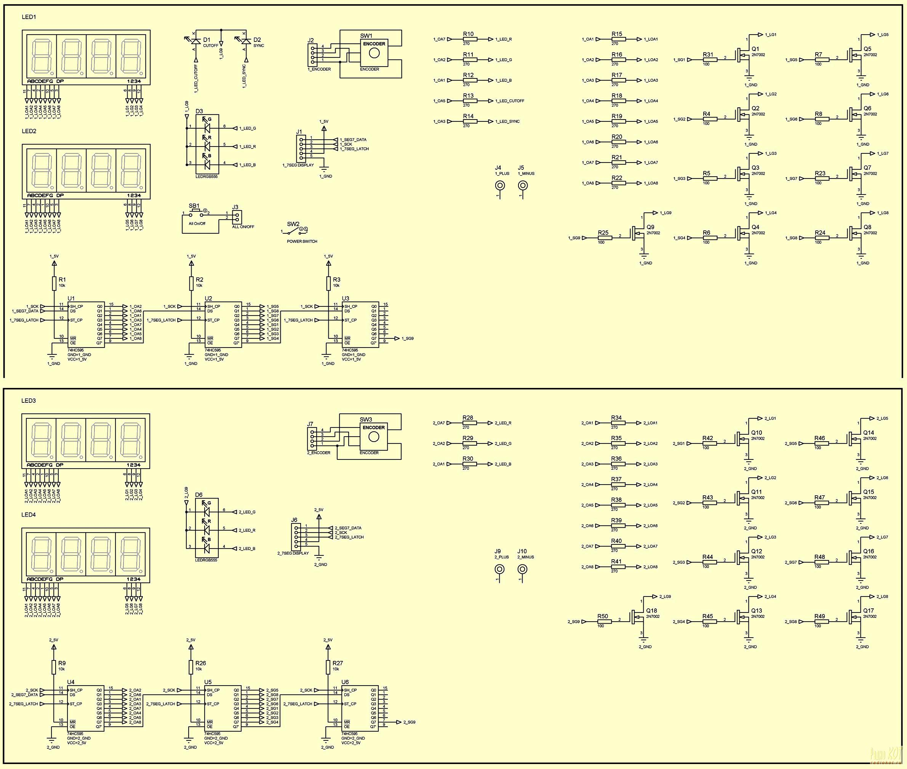

Светодиод состояния - SMD 5050 из светодиодной ленты. Под него выпиливается "обманка" из оргстекла, чтобы он выглядел как обычный светодиод.

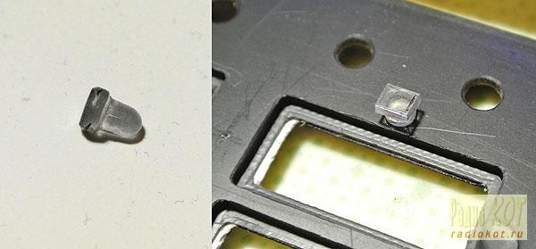

Качественных клемм красного цвета не нашёл - подкрасил лаком для ногтей.

## Плата фильтрации

Значительного снижения шумов в импульсном блоке питания можно добиться используя ферритовые бусинки [3.8] и синфазные фильтры ( Common mode Choke ) [3.5,3.9].

Все индукторы величиной 20uH в схеме контроллера - это SMD Ferrite beads:

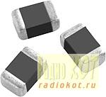

Детали черного цвета, выпаиваются в огромном количестве из материнских плат и видеокарт, имеют нулевое сопротивление. Правила использования ferrite beads просты: не хотим, чтобы микроконтроллер зашумлял шину питания - питаем через ferrite bead! Не хотим, чтобы шум с шины питания попадал на операционник - питаем через ferrite bead! Не хотим, чтобы высокочастотные помехи попадали на затвор - ставим ferrite bead! Ну и ставим блокировочные конденсаторы по питанию с обеих сторон, естественно.

Для борьбы с синфазными помехами применяются Common Mode Choke:

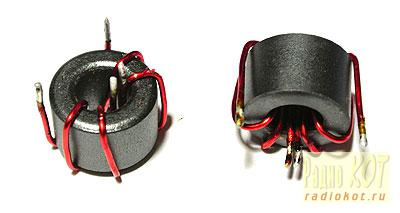

Благодаря особой намотке [3.5], мы можем подавить синфазные помехи на выходе БП прямо перед клеммами.  
Кольца для таких дросселей добываются из старых CRT мониторов и принтеров - это те самые утолщения на проводах:

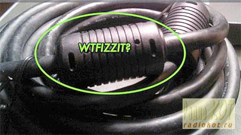

Мне лень было травить отдельную плату - фрезернул вручную:

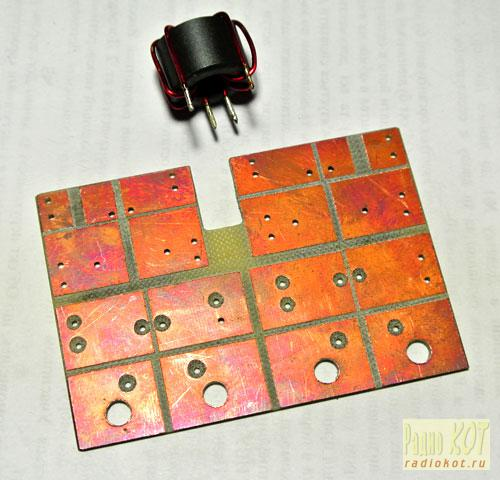

Плата крепится бутербродом к лицевой панели, прямо на клеммы. Верхние индукторы подключаются между первичным источником и контроллерами - больше для них просто не нашлось места.

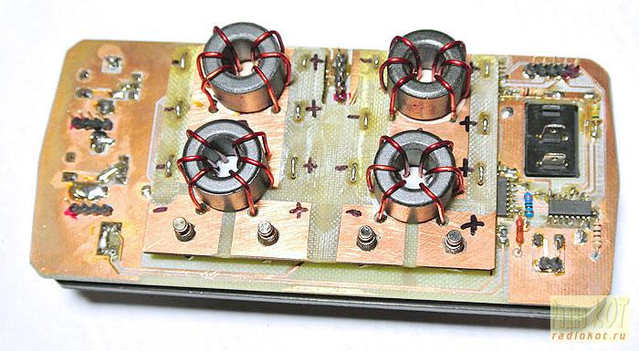

## Связь с компьютером

Блок питания подключается к компьютеру через USB интерфейс. Конвертор USB<->UART встроен в прибор. БП и компьютер гальванически развязаны.  
Общение с компьютером осуществляет мастер, он имеет два UART интерфейса. На подчиненном второй UART не распаивается. Компьютер осуществляет общение с подчиненным через мастера.  
Реализован простой текстовый протокол (удобный для отладки), защищенный контрольными суммами.  
Второй UART в мастере реализован программно.  
Скорость работы: UART1 - 9600, UART2 - 4800.

## Модуль связи с компьютером
_____________________________________________________

Модуль связи представляет собой готовый конвертер USB->UART и плату опторазвязки.

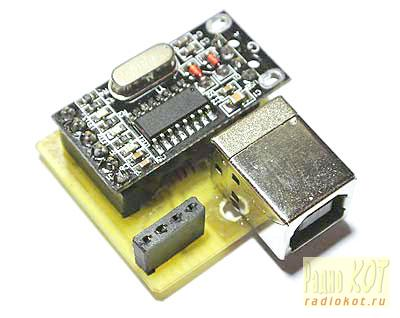

Я использую готовые модули на микросхеме CH340G, так как они дёшевы, для них есть драйвера под все версии Windows, и нет шанса нарваться на заблокированную подделку.

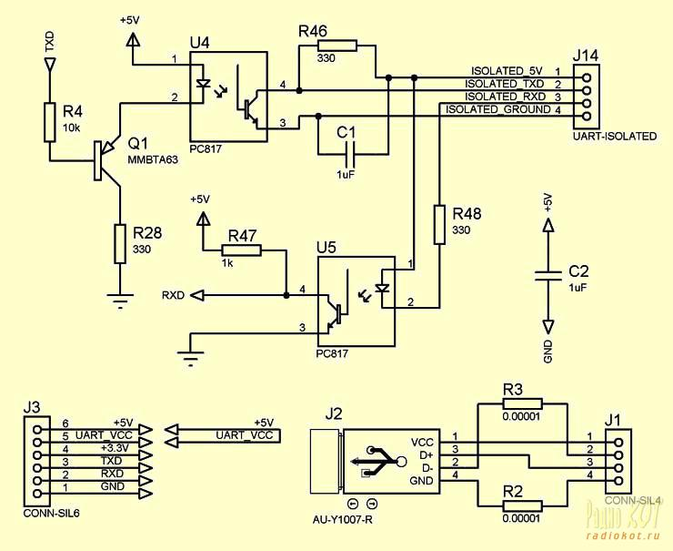

Из модуля необходимо выпаять USB разъем и заменить его на "гребёнку". Модуль вставляется сверху в плату опторазвязки.

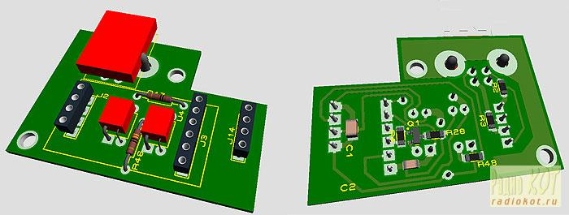

Опторазвязка, построенная на оптронах PC817, позволяет общаться на скорости до 19200 бод.

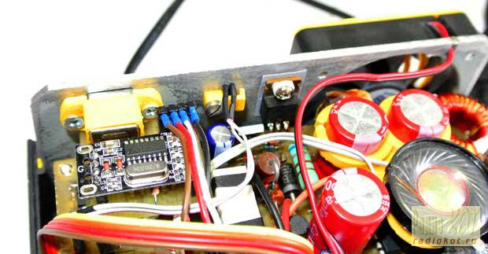

Модуль устанавливается на задней стенке прибора с помощью крепления, распечатанного на 3D принтере.

## Упаковка в корпус

Недостаток плотного монтажа - при любой поломке придется долго добираться до нужной платы. К счастью - у меня поломка случилась всего один раз - ушел в к.з. блокировочный конденсатор, перегорел предохранитель.

Заднюю крышку выпилял из алюминия толщиной 3мм - она служит радиатором для транзисторов линейных регуляторов. Крепятся к нему через изолирующие прокладки.  
Вентилятору внутри места не нашлось - немного торчит сзади.

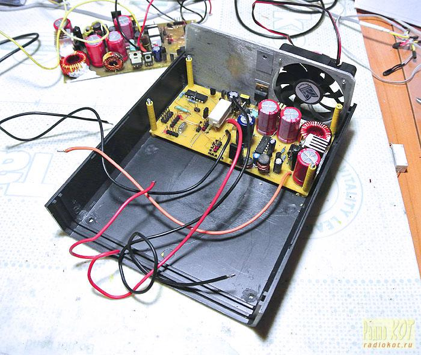

Платы контроллеров каналов устанавливаются на стойках друг на другом.

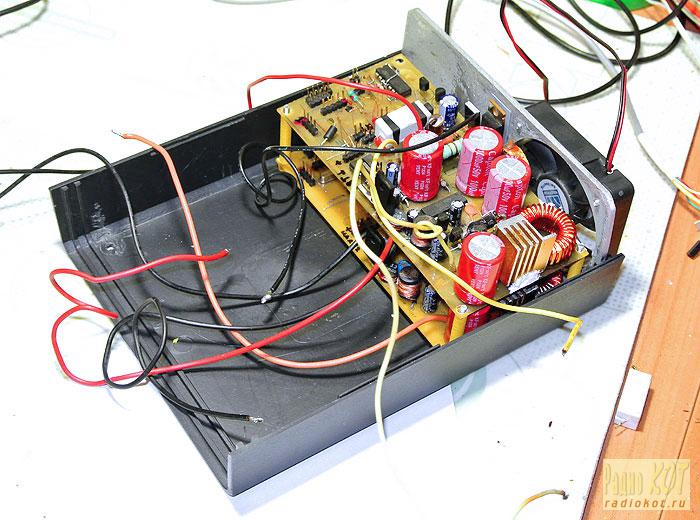

Для силового транзистора предрегулятора нужно изготовить небольшой алюминиевый радиатор, отпилив часть радиатора от видеокарты. Также нужен небольшой ( пластинка 1см^2 ) радиатор на транзистор драйвера вентилятора. Радиаторы и дроссели слегка фиксируются герметиком к плате.

Первичный источник располагается посередине, все провода идут под ним.

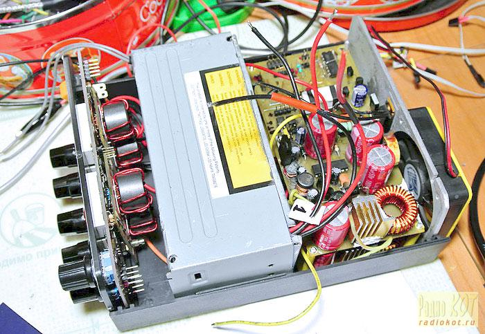

Один датчик температуры проталкивается внутрь первичного источника, второй - прижимается к задней стенке поближе к транзисторам. Оба датчика подсоединяется к мастеру. К подчинённому датчики не подсоединяются, вместо сенсора TEMP1 устанавливается перемычка, чтобы контроллер работал в режиме подчиненного.

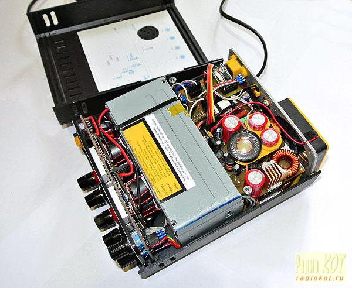

В качестве датчиков, кстати, работают какие-то германиевые диоды, Д9В, кажется:

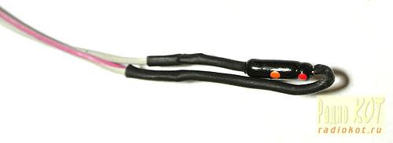

В передней части корпуса, по бокам и сверху нужно сделать продольные вентиляционные отверстия длиной 2см - воздух должен проходить сквозь первичный источник, контроллеры и выходить сзади.  
Модуль USB-UART прикручивается к задней стенке. Стойки, крепление модуля USB-UART, крепление динамика, крепление датчика температуры на радиатор и решётку вентилятора печатал на 3D принтере.

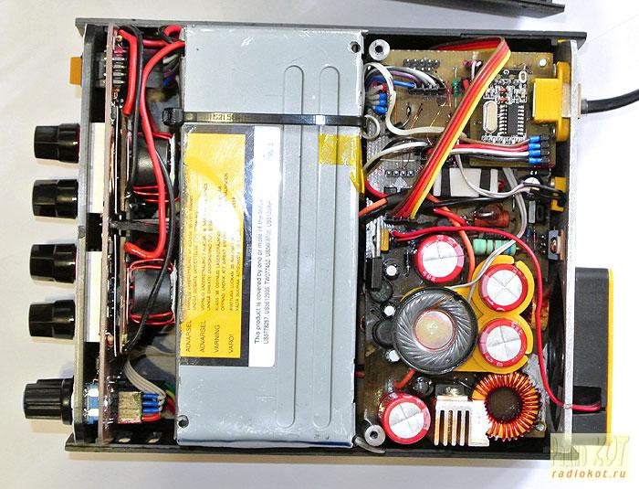

Верхняя часть корпуса прикручивается двумя винтами М3 к алюминиевым стойкам с нарезанной резьбой.

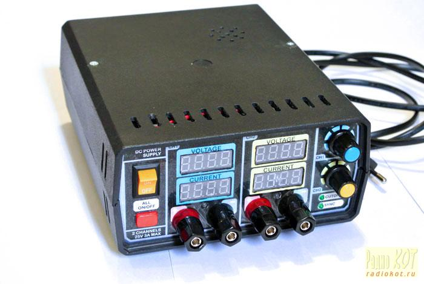
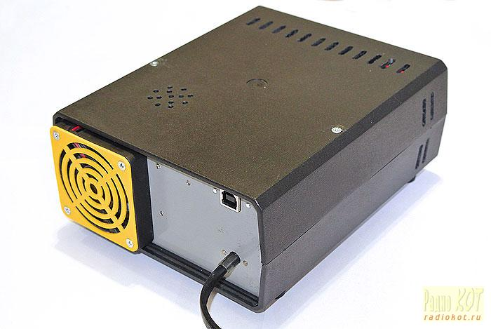

## Прошивка

Прошивка написана на CodeVisionAVR 2.05.  
В оба контроллера заливается одна и та же прошивка. Контроллер начинает работать как подчиненный, если вместо первого датчика температуры установлена перемычка.

Прошивку можно заливать через ISP разъем, но гораздо удобнее это делать через ПО на PC.  
Для этого в контроллеры записывается Bootloader, который реализует протокол программатора AVR910, на скорости 9600 для мастера и 4800 для подчиненного. Bootloader выбирает скорость в зависимости от наличия перемычки вместо датчика температуры.  
Для ручного перевода контроллера в режим бутлоадера, нужно зажать кнопку энкодера при включении устройства. Контроллер будет отображать букву P на верхнем индикаторе. Это может понадобиться для первой заливки прошивки в БП. В дальнейшем ПО для PC умеет автоматически переводить контроллеры в режим программирования, прошивка обоих контроллеров осуществляется через USB, не нужно разбирать устройство.  
Мастер осуществляет туннелирование пакетов для обеспечения коммуникации PC с подчиненным, включая заливку прошивки. Реализация такой системы с минимальными затратами памяти - самая сложная часть прошивки. Подпрограммы коммуникации используют меньше 256 байт RAM, остальная память используется системой логирования.

БП умеет вести лог работы автономно. Лог можно посмотреть, запустив ПО для PC. Можно просматривать зарядные кривые аккумуляторов. Лог содержит 200 записей. Период логирования задается в настройках. При заполнении лога, период автоматически удваивается, лог ужимается, логирование продолжается.

## Программное обеспечение для PC

Программное обеспечение написано в среде Flash Builder 4.6.

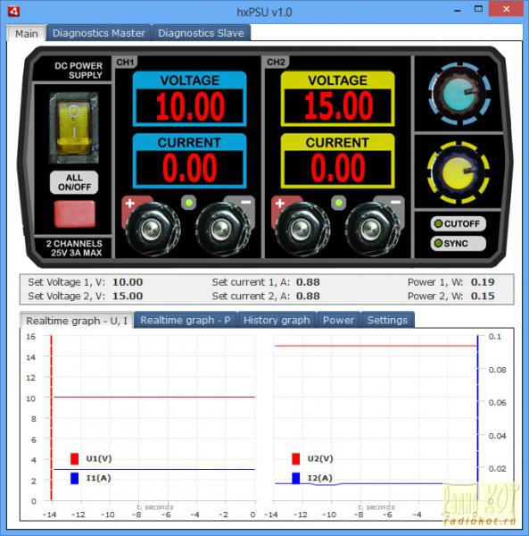

ПО позволяет увидеть индикаторы передней панели, задавать напряжения и токи, включать/выключать устройство.  
Основное применение ПО - обновление прошивки и настройка. Всё это можно делать и без ПО, но так намного удобнее.

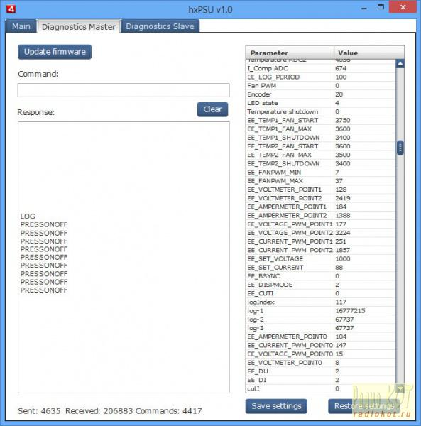

## Описание элементов управления

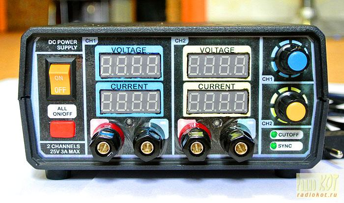

Общее состояние блока питания отображают RGB светодиоды, расположенные над клеммами.  
**В выключенном состоянии** светодиод светит синим цветом.  
Верхний индикатор отображает установленное напряжение, нижний - установленное ограничение тока.  
Каждый энкодер управляет своим каналом. Для изменения напряжения необходимо нажать на кнопку энкода, при этом загорится точка в крайнем правом разряде на индикаторе напряжения. Ручка энкодера изменяет настройку.  
Для изменения тока нужно нажать кнопку энкодера ещё раз. При этом загорается точка в крайнем правом разряде индикатора тока.

Светодиод "Sync" сигнализирует о включенном режиме синхронизации настроек. При этом изменение заданных напряжения или тока на одном канале сразу передается на другой канал.

Светодиод "Cutoff" сигнализирует о включенном режиме отсечки по превышению максимального тока.

Для включения блока питания нужно нажать кнопку "All On/Off". Оба канала включаются и выключаются одновременно. Нет возможности отдельно управлять включением каналов. При срабатывании отсечки на любом канале отключаются оба канала одновременно.

**Во включенном состоянии** RGB светодиод светится зеленым цветом. Если сработало ограничение тока - красным цветом.

Верхний и нижний индикаторы отображают реальные измеренные значения напряжения и тока на клеммах.

Изменение настроек напряжения и тока осуществляется аналогично, но настроенные значения будут отображаться кратковременно во время изменения, при этом будет мигать точка в крайней правой позиции. После изменения настроек БП возвращается к показу измеренных значений.

## Меню опций

Для входа в меню опций необходимо удерживать кнопку энкодера в течении 1 секунды.  
Переключение между пунктами меню - короткое нажатие на кнопку энкодера.  
Поворот ручки энкодера изменяет настройку.

**Таблица. Меню опций**

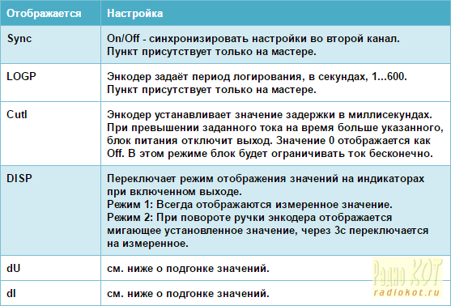

В связи с тем, что это программируемый БП, измеренные значения могут отличаться от установленных на несколько младших разрядов вследствие малой точности встроенного АЦП, шунта, наволок, температурного дрейфа. Например, БП сформирует опорные напряжения для установки 5В на выходе, но измерительный модуль вследствие плохой калибровки или общей неточности БП будет отображать 4.98. Чтобы избежать такого "некрасивого" поведения, добавлены настройки dU и dI, которые задают максимальную разницу между выставленными и измеренными значениями, при которой применяется корректировка. Например, 5.00-4.98 => 2, при dU >= 2 измеренное напряжение будет отображаться как 5.00, при dU < 2 - как 4.98.

Для выхода из меню опций необходимо удерживать кнопку энкодера в течении 1 секунды.

## Калибровка блока питания

После прошивки, установка и измерение напряжения и тока работают неточно. Блок питания необходимо откалибровать.  
Каналы калибруются независимо.

**Таблица. Точки калибровки**

## Меню калибровки

Для входа в режим калибровки нужно удерживать кнопку энкодера в течении 5 сек.

Настройки сохраняются в EEPROM.

Кнопка On/Off включает или выключает оба канала.

Для выхода из режима калибровки нужно удерживать кнопку энкодера в течении 5 сек.

Калибровку удобнее проводить, используя ПО для PC, так как все параметры отображаются на экране.

Таблица. Меню калибровки.

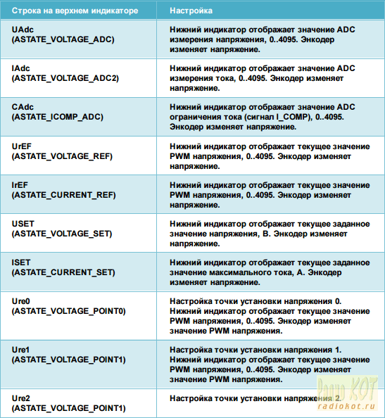
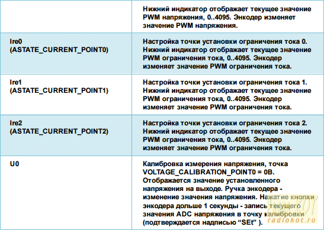
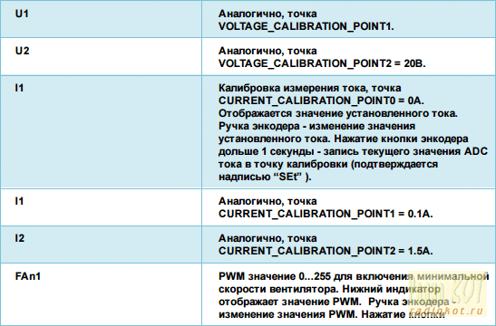
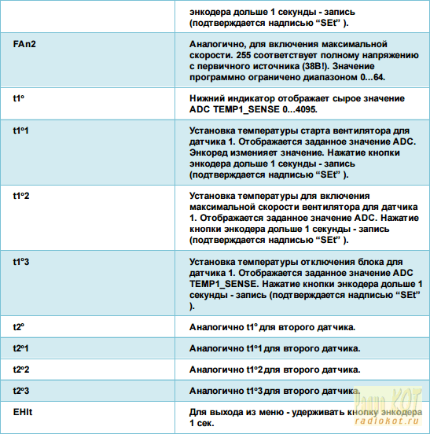

**Калибровка установки напряжения:**

1. установить ограничение тока на максимум;
2. в пункте меню "Ure0" изменить значение PWM, чтобы на выходе блока питания было 0В; нажать кнопку энкодера в течении 1 сек;
3. в пункте меню "Ure1" изменить значение PWM, чтобы на выходе блока питания был 1В;нажать кнопку энкодера в течении 1 сек;
4. в пункте меню "Ure2" изменить значение PWM, чтобы на выходе блока питания было 20В; нажать кнопку энкодера в течении 1 сек.

**Калибровка установки ограничения тока:**

1. подключить к блоку питания амперметр и нагрузку сопротивлением 10...200 Ом;
2. задать такое выходное напряжение, чтобы ток был равен 110...200мА;
3. в пункте меню "Ire0" указать значение PWM, при котором блок питания ограничивает ток до 10мА; нажать кнопку энкодера в течении 1 сек;
4. в пункте меню "Ire1" указать значение PWM, при котором блок питания ограничивает ток до 100мА; нажать кнопку энкодера в течении 1 сек;
5. подключить к блоку питания амперметр и нагрузку сопротивлением 1...10 Ом;
6. задать такое выходное напряжение, чтобы ток был равен 1.6...2А;
7. в пункте меню "Ire2" указать значение PWM, при котором блок питания ограничивает ток до 1.5А; нажать кнопку энкодера в течении 1 сек.

**Калибровка измерения напряжения:**

1. в пункте меню "U0" выставить выходное напряжение в 0В; нажать кнопку энкодера в течении 1 сек;
2. в пункте меню "U1" выставить выходное напряжение в 1В; нажать кнопку энкодера в течении 1 сек;
3. в пункте меню "U2" выставить выходное напряжение в 20В;нажать кнопку энкодера в течении 1 сек.

**Калибровка измерения тока:**

1. подключить нагрузку 1...10 Ом;
2. в пункте меню "I0" выставить ограничение тока на 10мА; нажать кнопку энкодера в течении 1 сек;
3. в пункте меню "I1" выставить ограничение тока на 100мА; нажать кнопку энкодера в течении 1 сек;
4. в пункте меню "I2" выставить ограничение тока на 1.5А; нажать кнопку энкодера в течении 1 сек.

**Калибровка температуры:**

К сожалению, реализовать полностью пассивное охлаждение не удалось. Вентилятор должен вращаться всегда, на минимальной скорости, чтобы создавать хоть какой-то воздушный поток. К счастью, на минимальной скорости вентилятора вообще не слышно даже в полной тишине.

1. В пункте Fan1 настраиваем минимальную скорость вентилятора. Это та скорость, на которой вентилятор уверенно стартует.
2. В пункте Fan2 настраиваем максимальную скорость вентилятора (на вентилятор должно подаваться 12В)
3. В пункте t1°1 указываем значение ADC с датчика, оставленного при температуре 20°
4. В пункте t1°2 указываем значение ADC с датчика, нагретого феном до 70°
5. В пункте t1°3 указываем значение ADC с датчика, нагретого до 80°
6. Тоже самое проделываем для t2

## Осциллограммы

В заключение приведу несколько осциллограмм.

12В, без нагрузки, нарастание напряжения при включении:

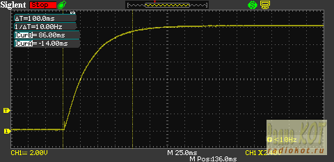

12В, нагрузка 1А, нарастание напряжения при включении:

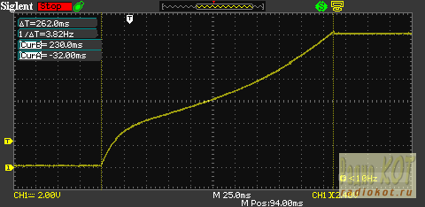

12В, без нагрузки, спад напряжения при выключении:

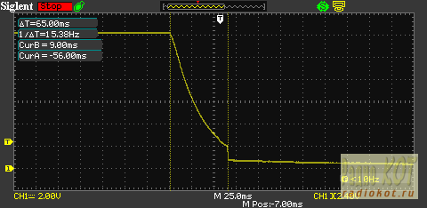

12В, нагрузка 1А, спад напряжения при выключении:

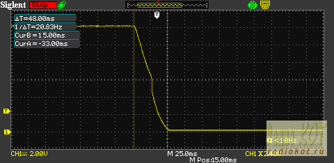

5В, нагрузка 0.7А, уровень шума:

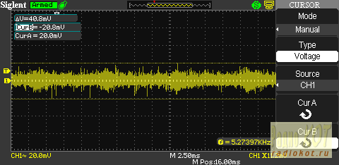

12В, нагрузка 1А, уровень шума:

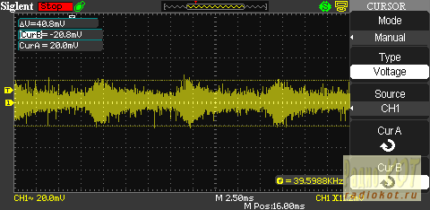

25В, нагрузка 1.5А, уровень шума:

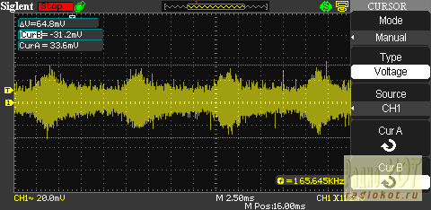

12В, ограничение тока 1А, короткое замыкание:

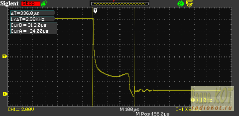

## Дальнейшее развитие

- Добавить режимы заряда аккумуляторов. Я не уверен насчёт Li-Ion, но быстрый заряд SLA батарей можно реализовать точно.
- Измерение малых токов. В схеме применяется шунт на 0.13Ом, так как он не должен греться на максимальном токе. Но на малых токах (меньше 50мА) напряжение на шунте слишком маленькое ~6мВ, чтобы его мог воспринять операционный усилитель LM324, у которого Offset Voltage составляет 5мВ. Мы немного улучшаем ситуацию, пробиасив усилитель с помощью R49, что позволяет отображать токи от 10, 20, 30, 40, 50мА, но все равно не дает возможность различать токи в несколько миллиампер. Да и сигнал с шунта, дойдя до усилителя, оказывается слишком зашумлен. Есть идея найти специализированный усилитель токового шунта и смонтировать его навесным монтажом прямо на шунте, подключив выход к свободной ноге - ADC7.

Видео с демонстрацией работы устройства:  
[https://youtu.be/EF3L979mCus](https://youtu.be/EF3L979mCus)

Схемы, печатки (Proteus), прошивка (CVAVR 2.05), ПО (Flash Builder 4.6):  
[hxpsu.rar](hxpsu.rar)
	
## Материалы

**Первичные источники:**

1.1. ИИП для новичков  
[https://radiokot.ru/forum/viewtopic.php?f=11&t=85106](https://radiokot.ru/forum/viewtopic.php?f=11&t=85106)

1.2. Собираем импульсный БП. Блок питания на микросхеме KA2S0880 (как вариант вместо IR2153)  
[https://radiokot.ru/circuit/power/supply/03/](https://radiokot.ru/circuit/power/supply/03/)

1.3. Импульсный блок питания (60Вт) (обратноходовый на UC3842)  
[https://radiokot.ru/circuit/power/supply/04/](https://radiokot.ru/circuit/power/supply/04/)

1.4. Импульсный блок питания мощностью 200 Вт для УМЗЧ (UC3825AN)  
[https://radiokot.ru/circuit/power/supply/33/](https://radiokot.ru/circuit/power/supply/33/)

**Лабораторные источники:**

2.1. Лабораторный БП ( ATMega8, ОУ, TIP 121, не программируемый)  
[https://radiokot.ru/circuit/power/supply/14/](https://radiokot.ru/circuit/power/supply/14/)

2.2. БП с микроконтроллерным управлением и регулировкой параметров при помощи энкодера (sonata)  
[https://radiokot.ru/circuit/power/supply/19/](https://radiokot.ru/circuit/power/supply/19/)

2.3. Лабораторный с ОУ ( IRL530N, ОУ, монтажное И)  
[https://radiokot.ru/circuit/power/supply/21/](https://radiokot.ru/circuit/power/supply/21/)

2.4. Цифровое управление лабораторным источником (stm32f100c4)  
[https://radiokot.ru/circuit/power/supply/22/](https://radiokot.ru/circuit/power/supply/22/)

2.5. Встраиваемая универсальная плата управления лабораторными блоками питания ( КТ819 x 2 + KT817, КР572ПВ2 )  
[https://radiokot.ru/circuit/power/supply/24/](https://radiokot.ru/circuit/power/supply/24/)

2.6. Блок питания 2x35V ( КТ818 x 2 + KT816, КР572ПВ2 )  
[https://radiokot.ru/circuit/power/supply/25/](https://radiokot.ru/circuit/power/supply/25/)

2.6. Модуль индикации, защиты и управления для лабораторного блока питания (PIC)  
[https://radiokot.ru/circuit/power/supply/32/](https://radiokot.ru/circuit/power/supply/32/)

2.7. Надёжный,как автомат Калашникова ( Tip122, ATMega16, не программируемый )  
[https://radiokot.ru/circuit/power/supply/34/](https://radiokot.ru/circuit/power/supply/34/)

2.8. Лабораторный Блок Питания на ATmega16 ( Atmega16, Tip 142, переключение обмоток )  
[https://radiokot.ru/circuit/power/supply/37/](https://radiokot.ru/circuit/power/supply/37/)

2.9. Простой И Доступный Бп 0...50В ( 2N3055+BD140, невозможно сделать программируемым)  
[https://forum.cxem.net/index.php?showtopic=76820](https://forum.cxem.net/index.php?showtopic=76820)

2.10. Лабораторный блок питания на STM32F100  
[https://radiokot.ru/forum/viewtopic.php?f=11&t=90037](https://radiokot.ru/forum/viewtopic.php?f=11&t=90037)

2.11. Необычный блок питания на микроконтроллере. (ATMega16, LM2596)  
[https://forum.easyelectronics.ru/viewtopic.php?f=16&t=4853](https://forum.easyelectronics.ru/viewtopic.php?f=16&t=4853)

2.12. Лабораторный блок питания (koyodza)  
[https://koyodza.embedders.org/powers.html](https://koyodza.embedders.org/powers.html)  
[https://caxapa.ru/190584.html](https://caxapa.ru/190584.html)  
[https://caxapa.ru/191294.html](https://caxapa.ru/191294.html)  
[https://caxapa.ru/342843.html](https://caxapa.ru/342843.html)  
[https://caxapa.ru/194433.html](https://caxapa.ru/194433.html)  
[https://caxapa.ru/277725.html](https://caxapa.ru/277725.html)

2.13. Лабораторный блок питания PSA2 (koyodza)  
[https://radiokot.ru/forum/viewtopic.php?f=11&t=92885](https://radiokot.ru/forum/viewtopic.php?f=11&t=92885)

2.14. Лабораторный БП PSL-3604(Леонид Иванович)  
[https://radiokot.ru/forum/viewtopic.php?f=11&t=59168](https://radiokot.ru/forum/viewtopic.php?f=11&t=59168)

2.15. Home Built Bench Power Supply V1 - Schematic  
[https://www.youtube.com/watch?v=x0fjSleInEw](https://www.youtube.com/watch?v=x0fjSleInEw)

2.16. Лабораторный источник питания на IGBT транзисторе  
[https://cxem.net/pitanie/5-273.php](https://cxem.net/pitanie/5-273.php)

2.17. 0-50V 2A Bench power supply  
[https://www.electronics-lab.com/projects/power/003/index.html](https://www.electronics-lab.com/projects/power/003/index.html)  
[https://radiokot.ru/forum/viewtopic.php?f=11&t=2587](https://radiokot.ru/forum/viewtopic.php?f=11&t=2587)

2.18. Fan noise level, poor quality  
[https://www.youtube.com/watch?v=-lq1YGAgJ0c](https://www.youtube.com/watch?v=-lq1YGAgJ0c)

2.19. Китайский лабораторный источник питания DAZHENG PS-1502DD  
[https://microsin.ru/content/view/1126/43/](https://microsin.ru/content/view/1126/43/)  
[https://radiokot.ru/forum/viewtopic.php?f=11&t=11898](https://radiokot.ru/forum/viewtopic.php?f=11&t=11898)

2.20. Цифровой лабораторный блок питания с управлением через ПК  
[https://mysku.ru/blog/russia-stores/34623.html](https://mysku.ru/blog/russia-stores/34623.html)

2.21. Sorensen DLM600 DC Power Supply Product Demo  
[https://www.youtube.com/watch?v=Ur-prMeM6NY](https://www.youtube.com/watch?v=Ur-prMeM6NY)

2.22. ЛАБОРАТОРНЫЙ БП С ИНДИКАЦИЕЙ НА МИКРОКОНТРОЛЛЕРЕ  
[https://elwo.ru/publ/skhemy_blokov_pitanija/laboratornyj_bp_s_indikaciej_na_mikrokontrollere/7-1-0-503](https://elwo.ru/publ/skhemy_blokov_pitanija/laboratornyj_bp_s_indikaciej_na_mikrokontrollere/7-1-0-503)

2.23. Блок питания 13,8 В/10 А  
[https://rudig.ru/categors/open_t/383](https://rudig.ru/categors/open_t/383)

2.24. Лабораторный БП на TL431  
[https://forum.cxem.net/index.php?showtopic=123103&st=0](https://forum.cxem.net/index.php?showtopic=123103&st=0)

2.25. Fully Programmable Modular Bench Power Supply  
[https://gerrysweeney.com/fully-programmable-modular-bench-power-supply-part-14/?wppa-occur=1&wppa-cover=0&wppa-album=7&wppa-photo=108](https://gerrysweeney.com/fully-programmable-modular-bench-power-supply-part-14/?wppa-occur=1&wppa-cover=0&wppa-album=7&wppa-photo=108)

2.26. Обзор Korad KA3005D  
[https://www.youtube.com/watch?v=JMiOATzAT6Q](https://www.youtube.com/watch?v=JMiOATzAT6Q)

**Теория:**

3.1. Power Supplies: What is Slew Rate?  
[https://www.youtube.com/watch?v=WA8Glt4K_bs](https://www.youtube.com/watch?v=WA8Glt4K_bs)

3.2. DIY Bench Power Supply Video series  
[https://www.youtube.com/watch?v=70dsAWBkXIM&list=PLDBuVMDVJaX2wCN84B5sjFMKDsMbsS7jq](https://www.youtube.com/watch?v=70dsAWBkXIM&list=PLDBuVMDVJaX2wCN84B5sjFMKDsMbsS7jq)

3.3. Engineer It - How to test power supplies - Measuring Noise  
[https://www.youtube.com/watch?v=pKXPqApOYfk](https://www.youtube.com/watch?v=pKXPqApOYfk)

3.3. Minimizing Switching Regulator Residue in Linear Regulator  
[https://www.youtube.com/watch?v=WxhjLIu-vPg](https://www.youtube.com/watch?v=WxhjLIu-vPg)

3.4. LM321/LM324 for current sensing  
[https://e2e.ti.com/support/amplifiers/precision_amplifiers/f/14/t/244945](https://e2e.ti.com/support/amplifiers/precision_amplifiers/f/14/t/244945)

3.5. Common mode choke winding  
[https://jeelabs.net/boards/7/topics/1094?r=1355](https://jeelabs.net/boards/7/topics/1094?r=1355)

3.6. Советы по проектированию понижающих преобразователей  
[https://www.compel.ru/lib/ne/2007/8/7-sovetyi-po-proektirovaniyu-ponizhayushhih-preobrazovateley/#rlcje](https://www.compel.ru/lib/ne/2007/8/7-sovetyi-po-proektirovaniyu-ponizhayushhih-preobrazovateley/#rlcje)

3.7. Сетевые фильтры и помехоподавляющие конденсаторы  
[https://bsvi.ru/setevye-filtry-i-pomexopodavlyayushhie-kondensatory/](https://bsvi.ru/setevye-filtry-i-pomexopodavlyayushhie-kondensatory/)

3.8. Ферритовые бусинки  
[https://tqfp.org/parts/ferrite-beads.html](https://tqfp.org/parts/ferrite-beads.html)

3.9. Basics of Ferrite Beads: Filters, EMI Suppression, Parasitic oscillation suppression / Tutorial  
[https://www.youtube.com/watch?v=81C4IfONt3o](https://www.youtube.com/watch?v=81C4IfONt3o)

3.10. Способы борьбы с помехами в импульсных блоках питания  
[https://www.xn--b1agveejs.su/radiotehnika/146-sposoby-borby-s-pomehami-blokah-pitaniya.html](https://www.xn--b1agveejs.su/radiotehnika/146-sposoby-borby-s-pomehami-blokah-pitaniya.html)

3.11. Компенсация обратной связи в импульсных источниках питания часть 1.  
[https://bsvi.ru/kompensaciya-obratnoj-svyazi-v-impulsnyx-istochnikax-pitaniya-chast-1/](https://bsvi.ru/kompensaciya-obratnoj-svyazi-v-impulsnyx-istochnikax-pitaniya-chast-1/)

3.12. Компенсация обратной связи: практический подход  
[https://bsvi.ru/kompensaciya-obratnoj-svyazi-prakticheskij-podxod/](https://bsvi.ru/kompensaciya-obratnoj-svyazi-prakticheskij-podxod/)

3.13. Biricha Digital. Foundations (Part 1.A) - Understanding Bode Plots and Stability of Power Supplies  
[https://www.biricha.com/articles/view/bode_plot_analysis_of_smps](https://www.biricha.com/articles/view/bode_plot_analysis_of_smps)

3.14. Biricha Digital. Foundations (Part 1.B) - Frequency Response Measurement of Plant, Compensator and Loop of our Switch Mode Power Supply  
[https://www.biricha.com/articles/view/frequency_response_measurement](https://www.biricha.com/articles/view/frequency_response_measurement)

3.15. Biricha Digital. Foundations (Part 1.C) - Understanding and Using Transfer Functions  
[https://www.biricha.com/articles/view/transfer_functions_poles_zeros](https://www.biricha.com/articles/view/transfer_functions_poles_zeros)

3.16. H4621852 - Bode Plot Example and Interpretation  
[https://www.youtube.com/watch?v=__WpViE9LKE](https://www.youtube.com/watch?v=__WpViE9LKE)

3.17. Stability 101 Whiteboard Series by Analog Devices, Inc.  
Stability 101: Loop Gain in Operational Amplifiers  
Stability 101: Bode Plots and Operational Amplifiers  
Stability 101: Decompensated Operational Amplifiers  
Stability 101: Driving a Capacitive Load (Operational Amplifiers)  
Stability 101: Parasitic Capacitance in Operational Amplifiers  
[https://www.youtube.com/playlist?list=PLiwaj4qabLWwAenk99ONF2_JUjopeAXo4](https://www.youtube.com/playlist?list=PLiwaj4qabLWwAenk99ONF2_JUjopeAXo4)

3.18. Dynamic Electronic Load Project (EEVBlog)  
[https://www.eevblog.com/forum/projects/dynamic-electronic-load-project](https://www.eevblog.com/forum/projects/dynamic-electronic-load-project)
