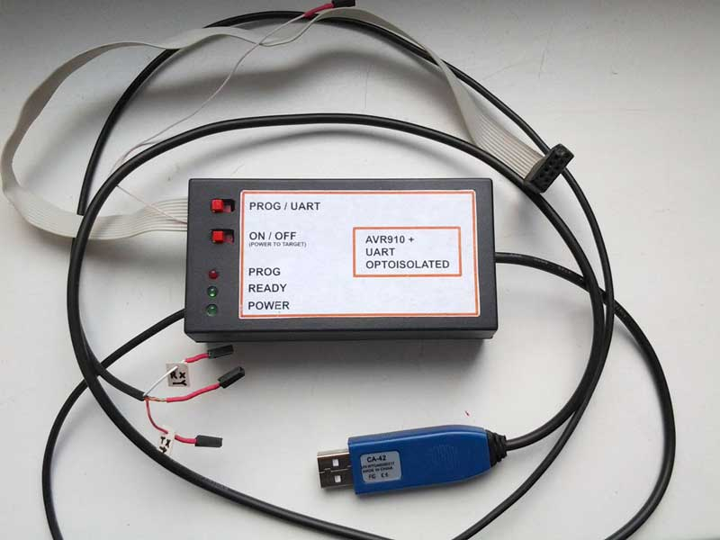
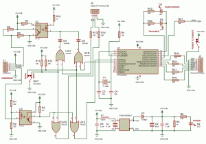
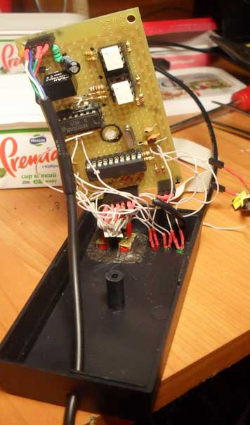

asdf 
## AVR910 optoisolated

AVR programmer is a device to upload firmware into AVR chips.

The first AVR programmer I built was the well‑known 3‑resistor LPT programmer. However, to upload firmware from my notebook I needed a programmer with a USB interface. The second important requirement is optoisolation.

After playing a little with [Prottoss programmer](https://web.archive.org/web/20181021081735/http://prottoss.com/projects/AVR910.usb.prog/avr910_usb_programmer.htm), I found that all software USB solutions for AVR are low‑speed devices, which can handle no more than 800 bytes/second transfers. However, if you are lucky with the USB host chip and its drivers, faster transfers can be achieved (up to 5 KB/sec).

Unfortunately my notebook could not handle fast transfers. Also, adding optoisolation to either the USB or SPI side would be difficult. So I decided to switch to the [USB to RS232 adapter I built earlier](https://web.archive.org/web/20181021081735/http://www.deep-shadows.com/hax/wordpress/?page_id=372), and the [AVR910 programmer with RS232 interface](https://web.archive.org/web/20181021081735/http://www.klaus-leidinger.de/mp/).

The result is a fast (~10 seconds for ATMega8 in CVAVR and <5 seconds in AVRProg) and cheap optoisolated programmer with the ability to power the device from USB and switch to RS‑232 mode to communicate with the AVR device.

Two H11L1 fast optocouplers are used to achieve 115200 BPS speed.

[P10AU-0505ELF](https://web.archive.org/web/20181021081735/http://peak-electronics.de/DATA/PME/P10AU_01_2009.pdf) DC/DC converter is used to power the programmer and AVR device. Please note that this converter does not have a stable 5V output. I had to add a diode to drop output voltage from 5.6V to ~4.8V to prevent damage to AVR chips.

74LS32 was added to support a switch with a single switching pair. You can avoid it if you use a switch with more mechanical contacts or do not need RS232 mode.

The output from PB2 pin is ~1 MHz pulses which can be used to clock the target while programming.

[Firmware and Proteus schematics](https://web.archive.org/web/20181021081735/http://www.deep-shadows.com/hax/downloads/AVR910Optoisolated.zip)

Note: You have to uncomment the right section in firmware depending on oscillator frequency you are using.

Firmware contains a small modification to provide ~1 MHz clock output on PB2.

Based on: [radiokot.ru/circuit/digital/pcmod/46](https://web.archive.org/web/20181021081735/http://radiokot.ru/circuit/digital/pcmod/46/)
