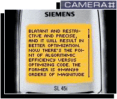
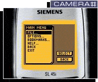
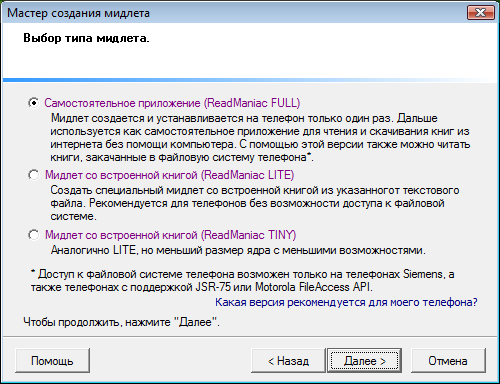
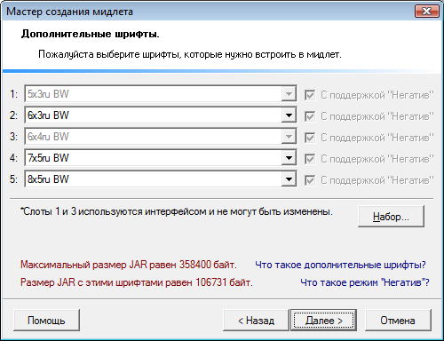

# ReadManiac - Electronic book reader for java-enabled phones

## Overview

**ReadManiac** is bookreader midlet for mobile phones. With ReadManiac, you can search, download and read books using practically any mobile phone with JAVA support.

Midlet comes in two versions: Standalone application (**ReadManiac FULL**) and midlet with embedded book (**ReadManiac LITE**).

**Standalone application (ReadManiac FULL)** is installed to phone once, and than used to search, download from internet and read books without a help of PC. Midlet has dedicated search engine for searching books in several on-line libraries. ReadManiac download these books directly to phone's memory. Once installed, it becomes library in the pocket.

**Midlet with embedded book (ReadManiac LITE)** is built with ReadManiac Building Wizard on PC. Wizard embeds selected book into midlet. Resulting midlet that can be installed to phone and used to read embedded book.

**ReadManiac aims to be Commercial Quality Freeware.**

## Features

- ReadManiac FULL can search and download new books from internet - and this makes it a true library in the pocket;
- Besides standard phone's fonts, ReadManiac can use custom small fonts for comfortable reading on small phone screen, including ability to create and embed user fonts;
- Program has powerful options for text formatting, allowing to use a small phone screen in full;
- Bookmarks and search features are supported;
- On Siemens phones, and phones with JSR-75 or Motorola FileAccess API, ReadManiac FULL has a build-in file browser to access phone's filesystem. Text file size is limited only by available space in FLEX memory or on MMC card;
- TXT, ZIP, PDB, PRC and TCR formats are supported;
- Package comes with easy to use Midlet Building Wizard.

## Screenshots of Midlet

## Screenshots of Wizard application

