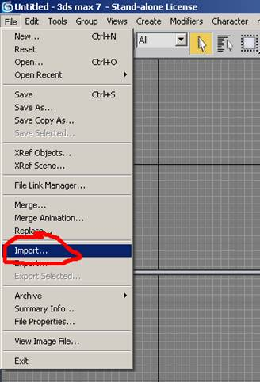
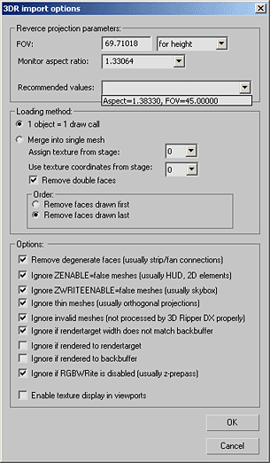
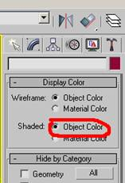
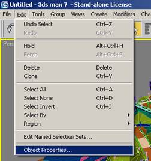
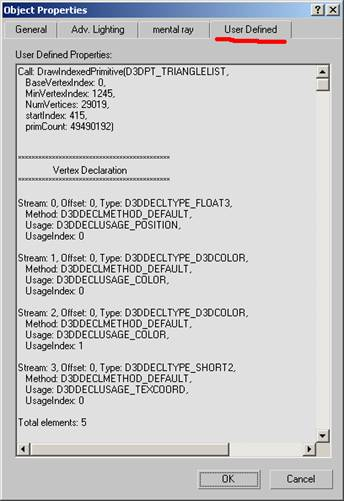
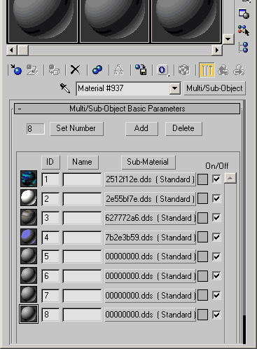
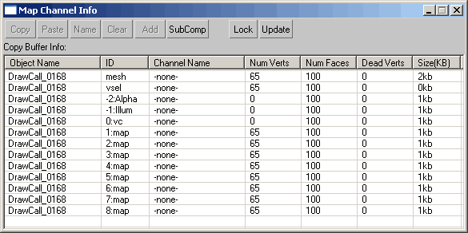
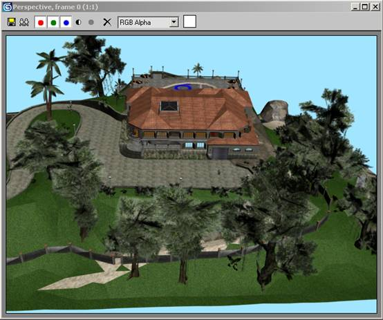
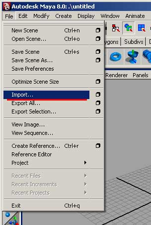

# 3D Ripper DX

## Overview

With 3D Ripper DX you can:

- capture all geometry, textures and shaders, rendered during single frame;
- import captured geometry into 3D Studio Max or Maya;
- see what exactly has been drawn by each individual draw call;
- see renderstate, textures, vertex streams, index stream, vertex declaration, vertex and pixel shaders (including HLSL source code if available) of each individual draw call.

3D Ripper DX supports only DirectX 6.x, 8.x and 9.x applications. OpenGL, older versions of DirectX and software renderers are not supported.

Import plugin should work with 3DS Max versions 5.0-9.0, 2009 and 2011.

See [Quick start guide](#quick-start-guide)


## Quick Start Guide

- Start 3D Ripper DX.


- Select analyzed application executable file and specify command line parameters.

- Select directories for storing captures frames, shaders and textures.

- Press "Launch" button.

If 3D Ripper DX is initialized properly, than "Ready to capture" label will be displayed at the top left corner of the screen. If not, than this is not a DirectX9 application – 3D Ripper DX will not work.


- Capture one or several frames with "F12" key (can be changed in options).
Depending on how efficient game draws frame, it can take from 20 seconds to 20 minutes.


- Exit application.

- Start 3D Studio Max.

- Select "File->Import", 3DR format.



- Select file with captured frame (should be named "frameXXXX.3dr").



You must specify back projection parameters (FOV, Aspect Ratio).
FOV value can be specified for height of screen, or for width of screen.
Aspect ratio is physical aspect ratio of monitor.

Starting from version 1.5, 3D Ripper DX is able to estimate required parameters.
Just click on item in "Recommended parameters" combo box.

Leave all other options default. Plugin will load frame geometry into 3DS Max.

1000 objects (typical draw call count) take a lot of memory, don't even try it with less than 1GB RAM!

- Enter "Display" tab and select "Display objects by color" option to visually see what exactly has been drawn by each individual draw call.




- Select single object, select "Edit->Object properties..", switch to "User defined" tab.



- See renderstate, textures, vertex streams, index stream, vertex declaration, vertex and pixel shaders used with this draw call.



- examine object's material and see what textures have been bent to each stage:



- examine all 8 captured 2D texture coordinate sets:



- Or render scene!




## Maya Import

Maya import is limited by Wavefront .OBJ file format. Only geometry, texture coordinates and maps can be imported.

Make sure you set "Also capture to Wavefront .OBJ" option in 3D Ripper DX launcher.


In Maya, select Import-> .Obj file format. OBJ and MTL files are stored in 3DR output directory.



Objects in Maya will appear distorted. Open OBJ file in notepad, and look at the first few lines:

```
#AR=1.38330, FOV=45.00000(height), Xscale:0.57298, Yscale:0.41421, Zscale:1.0
```

There are non-uniform scale parameters to be applied to the scene.


## Global Monitoring Mode

If 3D Ripper DX is unable to inject itself into application, it can enter global monitoring mode. In this mode, 3D Ripper DX sits in tray and injects itself into every launched application.

In this mode, injector is using undocumented features, and may crash the system. Please save your work before enabling global monitoring mode.

Right-click on 3D Ripper DX icon in tray to exit global monitoring mode.


## Pre- and Post-TnL Cache Efficiency Measurement

Starting from the version 1.4, 3D Ripper DX measures how well vertices are organized for Pre- and Post-TnL vertex cache (reported in "Object properties -> User" in 3DS MAX).

When rendering using the hardware transform-and-lighting (TnL) pipeline or vertex-shaders, the GPU intermittently caches transformed and lit vertices. Storing these post-transform and lighting (post-TnL) vertices avoids recomputing the same values whenever a vertex is shared between multiple triangles and thus saves time. The post-TnL cache increases rendering performance by up to 2x.

More detailed information can be found [here](http://developer.nvidia.com/object/devnews005.html) and [here](http://ati.amd.com/developer/tootle.html).

3D Ripper DX measures vertex cache efficiency for caches of 16, 20, 24 and 32 vertices. Efficiency is cache misses per triangle (less is better). It also calculates possible efficiency by optimizing indices with D3DXOptimizeFaces() and OptmizeFacesLRU().

Source code for OptmizeFacesLRU() routine can be found in "C:\Program Files\3DRipperDX\SRC\VCache.h". This is my implementation of Tom Forsyth algorthm, described [here](http://home.comcast.net/%7Etom_forsyth/papers/fast_vert_cache_opt.html).

Pre-tnl cache efficiency is sum of distances beetween fetched vertices divided by number of cache misses (less is better, ideal is 1.0 - linear access).


## Version History

### Version 1.8.1
```
- increased stability;
- fixed crashes due to out of memory;
- better instancing support;
- minor fixes;
```

### Version 1.8
```
- DirectX 6 support ( beta )
- 3ds Max 2011 [Design] plugins;
- 3ds Max 2009 plugins
- 3ds Max 2010 [Design] 64-bit plugin;
```

### Version 1.7
```
- "Global monitoring mode" now works on Vista/Windows7;
- 3DS Max 2010 Design 32-bit plugin;
- better support for DirectX 8 applications;
- better support for VS3.0 ('whole mesh is planar' fix);
- vertex and pixel shaders disassembly is saved properly for DirectX 8 apps;
- better FOV determination;
- support for Direct3D9Ex;
- better interception (LoadLibraryEx);
- minor fixes;
```

### Version 1.6rc1.3
```
- added DirectX 8.0 suport;
- float renderstates now correctly displayed;
- FOV determination enchanced;
- fixed bug in global monitoring mode shutdown;
- fixed bug in fixed vertices processor;
- fixed bug in QueryInterface();
- added check for DirectX runtime installation;
```

### Version 1.5
```
- automatic FOV and Aspect ratio determination;
- FOV input editbox moved to import plugin interface;
- hooking strategy has been changed. New method is less intrusive and more stable;
- removed dependency from installed DirectX 9.0 update version. Works fine with any version;
- Updated to DirectX 9.0 August 2007 update;
- capture files are named "frame[date]_[time].3dr";
- fixed minor bug in DrawPrimitiveUP() and DrawIndexedPrimitiveUP() capturing;
- fixed: "Ready to capture" label is blinking randomly;
- fixed: "Ready to capture" label does not apper, but 3D Ripper DX actually works;
```

### Version 1.4d
```
- better fixed function support;
- fixed bug: some meshes are wrongly recognized as 2D, and not captured;
- updated to DirectX 9.0c April 2007;
```

### Version 1.4c
```
- fixed bug in MyCreateProcessW();
- fixed bug in SwapChainProxy();
```

### Version 1.4b
```
- DrawPrimitiveUP() and DrawIndexedPrimitiveUP() support;
```

### Version 1.4a
```
- advanced texture capture: now can capture POOL_DEFAULT textures;
- better renderstate verbose;
- new import option: ignore if RGBWRITE is disabled;
- fixed: installer does not retrive 3DS MAX 5.x path correctly;
- fixed: crash when output directory does not exists;
- fixed: crash on pre-transformed vertices;
- fixed: buffer overrun in myWinExec() with long strings;
```

### Version 1.4
```
- full Shader Model 3.0 support;
- instancing support;
- new feature: Pre- and Post-TnL cache efficiency measurement;
- faster capture;
- fixed: low accuracy of Wavefront .OBJ texture coordinates;
- minor fixes and enhacements in verbose code;
- fixed installer: wrong directory for 3DS MAX 9.0 plugin;
- support for apllications, using multiple direct3D devices;
```

### Version 1.3b
```
- fixed Wavefront .OBJ export;
- fixed: does not work if output directory name contains '.';
```

### Version 1.3a
```
- added support for applications using multiple Direct3DDevice() objects;
```

### Version 1.3
```
- optional Wavefront .OBJ export;
- fixed 3DS MAX 5.0 support;
- added 3ds max 9.0 support;
- fixed bug: crash when DIP() is called with numPrimitives=0;
- fixed bug: quartz.dll crash;
- fixed bug: wrong reference counting of some objects;
- fixed bug: wrong command line parameters passed if executable filename contains spaces;
```

### Version 1.2a
```
- minor bugfixes;
```

### Version 1.2
```
- less intrusive, more stable capture;
- much lower memory usage in "1 object = 1 drawcall" mode;
- capturing all 8 texture coordinate sets;
- all 8 texture stages are assigned as sub-mtls in 3DS Max;
- minor enhancements;
```

### Version 1.1
```
- support for applications which use IDirect3DSwapChain->Present();
- remove double faces order added;
```

### Version 1.0
```
- initial release
```

## Links

- [3D Ripper DX Forum](http://www.deep-shadows.com/hax/forum/)
- [GLIntercept - Similar tool for OpenGL](http://glintercept.nutty.org/)
- [OGLE - GLIntercept plugin for capturing geometry from OpenGL applications](http://ogle.eyebeamresearch.org/architecture)
- [3D Ripper - similar tool for DirectX 9.0 applications](http://denull.ucoz.ru/load/1-1-0-40)
- [NVPerfHUD](http://developer.nvidia.com/object/nvperfhud_home.html)
- [PIX for Windows](http://msdn.microsoft.com/library/default.asp?url=/library/en-us/directx9_c/PIX.asp)
- [Microsoft Research Detours Package](http://research.microsoft.com/sn/detours/)
- [Intercept Calls to DirectX with a Proxy DLL](http://www.codeguru.com/cpp/g-m/directx/directx8/article.php/c11453)
- [APIHijack - A Library for Easy DLL Function Hooking](http://www.codeguru.com/Cpp/W-P/dll/hooking/article.php/c127/)
- [Extracting geometry from DirectX application (russian article)](http://www.wasm.ru/article.php?article=d3d8)
- [Improved method of DLL injection (russian article)](http://www.xakep.ru/post/28092/default.asp)
- [DLL-injecting in Delphi (russian article)](http://www.xakep.ru/post/26796/default.asp)
- [DLL injection tutorial](http://www.edgeofnowhere.cc/viewtopic.php?p=2483118)
- [Fluke library](https://github.com/axet/fluke)
- [Linear-Speed Vertex Cache Optimization](http://home.comcast.net/%7Etom_forsyth/papers/fast_vert_cache_opt.html)


