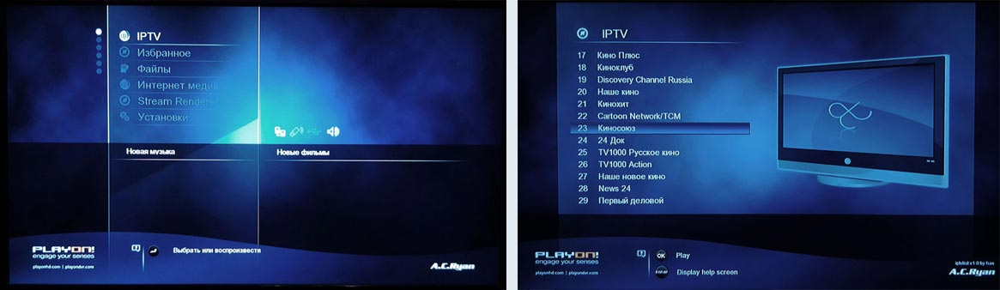
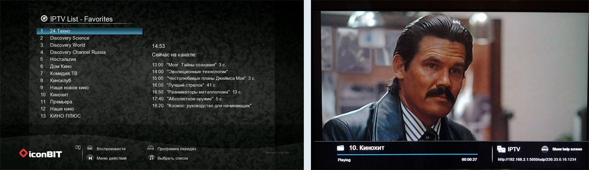
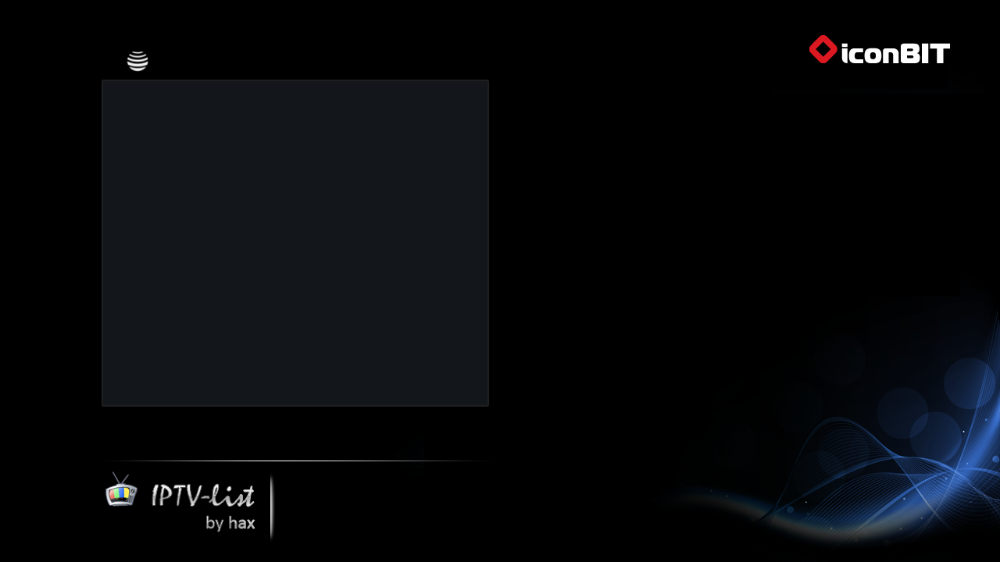

# Модуль IPTVList - удобный просмотр IPTV + запись

**IPTL List**  
**Разработчики:** hax, Pokrass, FarVoice, Chuma

Модуль предназначен для просмотра IPTV и предоставляет привычный интерфейс в виде списка каналов, с переключением между каналами кнопками стрелок.  
Начиная с версии 1.4, для выбранного канала отображается список передач (EPG).

При использовании скинов POHD и Iconbit, ссылку на модуль можно вывести в главное меню плейера, чтобы преобразовать его в простой практичный девайс для просмотра IPTV.

Модуль разрабатывается для плейера Asus O!Play R1 с прошивкой AMP [http://moservices.org/forum/viewtopic.php?f=8&t=1029](http://moservices.org/forum/viewtopic.php?f=8&t=1029) и скином PlayOnHD v7.4.6.r7317, IconBit hds42 или vrt (этот скин рекомендуемый)  
Полная работоспособность гарантируется только на этой конфигурации.

IPTVList можно устанавливать и на другие прошивки/скины, см. ниже "Установка на другие прошивки/скины".

**На прошивках iNeXT модуль <u>не работает</u>.**

Вид главного меню (после применения патча "Home menu replacement for POHD Skin"):
1. Первый пункт в меню - IPTV.
2. Убраны пункты Music, Video и Jukebox.
3. Добавлен пункт Stream Renderer, который сразу запускает Modia Stream Renderer is RSSEx 2.0.

  
*IPTV1*

  
*IPTV2*

## Установка и настройка

### Установка на прошивку AMP со скином POHD, Iconbit или vrt

1. Должны быть установлены:
   - прошивка AMP
   - скин VRT, POHD v7.4.6.r7317 или IconBit hds42

2. Установить модуль IPTVList через web-interface moservices (http://адрес плейера), moservices->modules.

3. Для того, чтобы получить ссылку на IPTVList в главном меню плейера как показано на верхнем скриншоте, нужно также установить патч "Home menu replacement for POHD Skin".  
   Для скина VRT или Iconbit - патч "Home menu replacement for Iconbit gui".  
   Если вы по каким-то причинам не хотите модифицировать главное меню, эти патчи можно не устанавливать. Модуль IPTVList можно запускать из меню moservices.

### Настройка модуля

В web-interface mosrvices выбрать Навигация->IPTVList и указать:
- Default UDP-to-HTTP Proxy address - адрес прокси для воспроизведения UDP ссылок;  
  ([http://moservices.org/forum/viewtopic.php?f=20&t=547](http://moservices.org/forum/viewtopic.php?f=20&t=547));
- Directory for recorded videos - каталог, куда будут складываться записанные программы ( см. ниже "Настройка каталога для записи программ");
- настроить плейлисты (см. ниже "Требования к плейлистам" и "Несколько плейлистов");
- выбрать TimeZone;
- нажать кнопку "Save all"

4. После этого нужно перезагрузить плейер.

**На данный момент при обновлении модуля плейлисты и конфигурация сохраняются, но всё же я рекомендую забакапить все *.m3u и *.conf файлы из каталога из каталога /usr/local/etc/mos/www/modules/iptvlist/ после завершения настройки или перед обновлением.**

### Установка на другие прошивки/скины

Начиная с версии 1.2.3 сам модуль к скину POHD не привязан и может быть установлен на любую прошивку/скин. Начиная с версии 1.4, поддерживается скин Iconbit и VRT.  
"Скин поддерживается" означает, что все функции модуля работают корректно, кнопки пульта реагируют, и модуль правильно отображает их иконки.  
Модуль можно установить через web-interface moservices. Если какие-то кнопки пульта не работают, можно использовать боковое меню функций - вызывается кнопкой >|

Поскольку я не в состоянии поддерживать все конфигурации, я надеюсь, что заинтересованные разработчики будут брать последнюю версию модуля и модифицировать под свой скин. После этого я смогу интегрировать изменения в модуль ( См. ниже "Разработчикам" ).

Известные проблемы с другими скинами и прошивками:

**Скин HD2 на прошивке AMP**  
Не работают многие кнопки, не работает seek при просмотре записей, не работает воспроизведение m3u8 потоков.

**Скин Spring на прошивке AMP**  
Скин не поддерживает отображение больших списков со скролом. Модуль с ним не совместим.

**На прошивках iNeXT модуль <u>не работает</u>.**

### Требования к плейлистам

Ссылки в плейлистах должны быть только http, udp, mms, mmsh, rtmp, rtmpt, rtmpe, rmpte, rmps и rtsp.

Воспроизведение UDP ссылок выполняется через udp-to-http proxy, адрес которого указан в конфигурации модуля.  
Я использую proxy на роутере. Можно использовать прокси на плейере: [viewtopic.php?f=21&t=3258&start=10#p60470](http://moservices.org/forum/viewtopic.php?f=21&t=3258&start=10#p60470)

Чтобы русские названия отображались правильно, везде должна использоваться кодировка UTF-8.

Теоретически, количество каналов в одном списке не ограничено, но оно сильно влияет на скорость работы модуля, особенно на обработку программы телепередач. Я рекомендую выделить все интересующие каналы в список Favorites, а остальные отсортировать по категориям Кино/Новости/Спорт и т.д. так, чтобы количество каналов в списке не превышало 100.

Формат плейлиста должен иметь директивы:
- `#EXTM3U` - заголовок - должна быть первой строкой файла
- `#EXTINF` - дополнительная информация (продолжительность (в секундах), заголовок)

То есть лист должен быть типа:

```
#EXTM3U
#EXTINF:-1,Channel1 name
http://channel1_address

#EXTINF:-1,Channel2 name
http://channel2_address
```

Дополнительные директивы могут привести к неработоспособности плейлиста в модуле.

### Поддержка m3u8 потоков

Некоторые плейлисты содержат ссылки на потоки с расширением m3u8:

```
#EXTM3U
#EXTINF:-1,Viasat History
http://tv.i-ghost.net/stream/asdf/101.m3u8
```

Эти потоки идут в стандарте HTTP Live Streaming ( HLS ). Некоторые современные прошивки этот формат поддерживают, но модуль так же умеет преобразовывать такие потоки в поддерживаемый формат. Если поток передаётся без шифрования - скорее всего он будет работать ( с версии 1.5).

Однако, некоторые m3u8 потоки модуль обработать не сможет и они будут полноценно работать только на прошивках с поддержкой hls. Для 1073/1283 это AMP с GUI VRT(это единственный скин поддерживающий hlsh, для 1185/1186 - это прошивки на новом СДК (например прошивки iNeXT, mede8er и другие).

Если ваша прошивка **не поддерживает** HLS, надо файле **`/usr/local/etc/mos/www/iptvlist/loadlist.php`** строку:

```php
define('local_proxy_enabled', false );
```

на:

```php
define('local_proxy_enabled', true );
```

#### Технические детали

При вещании по стандарту HLS в основном m3u файле вместо ссылок на потоки стоят ссылки на m3u8 файлы(формат - m3u), которые формируются динамически и содержат HTTP ссылки на короткие фрагменты видео. По идее, плейер должен сыграть все фрагменты, запросить новый лист и играть дальше.

```
#EXTM3U
#EXTINF:0,TV 1000 Action
http://50.7.129.202/stream/TEST/100.m3u8
#EXTINF:0,Viasat History
http://50.7.129.202/stream/TEST/101.m3u8
#EXTINF:0,Viasat Sport East
http://50.7.129.202/stream/TEST/102.m3u8
```

Плеер скачивает лист один раз, играет все фрагменты и останавливается, так как он такого стандарта не знает.

Если попробовать скачать m3u8 файл, там будет следующее:

```
#EXTM3U
#EXT-X-VERSION:3
#EXT-X-MEDIA-SEQUENCE:29768
#EXT-X-TARGETDURATION:6
#EXTINF:5.360,
100-29768.ts
#EXTINF:5.040,
TEST/100-29769.ts
#EXTINF:5.440,
100-29770.ts
#EXTINF:5.400,
100-29771.ts
#EXTINF:5.040,
100-29772.ts
#EXTINF:5.680,
100-29773.ts
```

(каждый раз будет отдаваться новый плейлист ).

Мы не можем заставить плейер перечитывать лист заново (будут неприемлемые паузы), но очевидно, что имена файлов ( ссылки на фрагменты ) формируются увеличением номера. Хак состоит в следующем: можно просто скачать m3u8 и добавить в него ещё 1000 ссылок с увеличенными номерами. Тогда плейер будет думать, что это обычный плейлист и будет играть, пока список не закончится ( при фрагментах 5 сек это где-то 1,5 часа просмотра).

Это не соответствует стандарту, потому что последовательность может оборваться в любой момент, и именно так бывает, если провайдер, например, вставляет рекламу. Но это работает.

Модификацией списка занимается скрипт extendm3u8.php. То есть "правильная" ссылка на поток выглядит как:

```
http://127.0.0.1/modules/iptvlist/extendm3u8.php?link=http://50.7.129.202/stream/TEST/100.m3u8
```

Модуль сам добавляет вызов php скрипта, если расширение у ссылки на поток содержит m3u8 - плейлисты провайдера менять не нужно.

## Использование модуля

### Несколько плейлистов

Favorites.m3u используется по умолчанию. Можно добавить другие плейлисты в конфигурации модуля.

Выбор активного плейлиста - кнопка Menu (на ASUS R1 - это кнопка Нота).  
Плейлист Recordings - это список записанных программ.

### Переключение аудиодорожек

К сожалению, в технически невозможно реализовать переключение каналов кнопками < и > одновременно с возможностью выбора аудиодорожек.  
Если нужно сменить дорожку, нужно переключиться в стандартный плеер (кнопка с круговыми стрелками).

### Управление в списке программ

- вверх, вниз - выбор программы
- вправо, влево - листание по страницам
- OK - просмотр выбранной программы
- Play - просмотр с помощью стандартного проигрывателя(позволяет сменить аудио дорожку).

Сортировка списка(только для списков каналов):
- <<, >> - перемещение выбранной программы вверх/вниз
- |<, >| - перемещение выбранной программы на предыдущую/следующую страницу
- кнопка с круговыми стрелками - удаление выбранного канала или видео с подтверждением
- Display - экран помощи
- stop - добавить канал в список Favorites
- Menu (ноты) - выбор плейлиста
- zoom - переименовать видео (только для списка "Recordings")

### Управление в режиме просмотра IPTV

- вправо, влево - переключение каналов
- вверх, вниз, |<, >| - выбор другого канала в мини-листе
- ok - показать/спрятать OSD или переключиться на выбранный канал
- кнопка с круговыми стрелками - переключиться на стандатный плеер.
- Play - пауза/продолжение
- Return - возврат к списку
- Display - экран помощи
- Кнопка с нотами - начать/остановить запись
- zoom - переключение aspect ratio

### Управление в режиме просмотра записанных программ(Recordings)

- вправо, влево - выбор позиции Seek. Ok - подтверждение
- <<, >> - быстрый seek на +1 / -1 минуту
- вверх, вниз - выбор другого видео в мини-листе
- |<, >| - переключение на следующее/предыдущее видео
- ok - показать/спрятать OSD,подтвердить seek или переключиться на выбранный канал
- кнопка с круговыми стрелками - переключиться на стандатный плеер.
- Play - пауза/продолжение
- Return - возврат к списку
- Display - экран помощи
- zoom - переключение aspect ratio

## Программа телепередач (EPG)

### Описание

С версии 1.4 программа телепередач для выбранного канала отображается в правой части экрана.

Сама программа скачивается с сайта vsetv.com, названия каналов на котором могут не соответствовать названию каналов в вашем плейлисте. В этом случае, вместо телепрограммы будет отображаться строка "Телепрограмма недоступна". Модуль не умеет сопоставлять, например, "Discovery Russia" и "Discovery Россия". Это нужно настроить один раз вручную - при нажатии кнопки Display, вместо списка телепрограмм будет отображён список каналов, в котором нужно выбрать соответствие и нажать Ok.

В дальнейшем, при нажатии кнопки Display, будет отображаться окно с полным списком программ на сегодня.

К сожалению, некоторые ваши каналы могут отсутствовать в списке сайта vsetv.com. Если ваш провайдер предоставляет EPG для своего списка каналов, то парсинг телепрограмм можно переписать "под себя" (см. "Разработчикам").

Обработка телепрограммы несколько снижает скорость работы модуля - особенно это видно при первом запуске в день, когда телепрограмма должна быть скачана и обработана ( дальше список кэшируется на весь оставшийся день).  
Отображение телепрограммы в списке каналов можно отключить, выбрав соответствующий пункт в боковом меню (>|). При этом по-прежнему остаётся возможность просмотреть полную программу телепередач, нажав кнопку Display.

Если время телепередачи отображается неправильно, нужно настроить часы в плейере и выбрать другой Time zone в настройках модуля (Навигация--IPTVList).

### Как добавить канал/сменить набор каналов

Чтобы вручную добавить отдельный канал или поменять/добавить набор каналов,

1. Зайдите на сайт [http://vsetv.com](http://vsetv.com), найдите интересующий нужный канал или набор, скопируйте ссылку.
2. Зайдите веб-интерфейс плеера, кликните по IPTVList v1.5 r10 и в выпадающем меню выберите настройки.
3. В открывшейся странице вы увидите поле для ввода текта. Добавляем ссылку, но немного в урезанном варианте:
   - **http://www.vsetv.com/schedule_channel_894**_day_2016-11-18.html
   - или **http://www.vsetv.com/schedule_package_uabase**_day_2016-01-01.html
   
   добавляем только то, что выделено **жирным** шрифтом, окончание отбрасываем.
4. Аналогично добавьте необходимые каналы/наборы, и перегрузите плеер.

## Запись программ

### Запись программ

С версии 1.1 можно записывать телепрограмму во время просмотра. Запись включается во время просмотра канала кнопкой с нотами.  
Видео складывается в каталог, указанный в конфигурации модуля и получает имя имя_канала_дата_время.mpg или имя_программы_дата_время.mpg ( если имя программы доступно ).  
При возврате в меню или переключении на другой канал запись автоматически прекращается.

Тут нужно понимать, что всё ограничивается скоростью процессора плейера.  
По моему опыту, программы, идущие в HD качестве, плейер записывать не может.  
Тут ничего не исправишь!

- Запись на подключенный USB HDD идёт нормально для программ в среднем и низком качестве.
- Запись на флешку идёт нормально только для программ в низком качестве.
- Запись на в отшаренную паку на NAS/роутере/компе по сети идёт нормально только для программ в низком качестве и может приводить к зависанию роутера.

Я рекомендовал бы использовать подключенный USB или SATA HDD.

p.s. Запись с m3u8 потоков на данный момент не работает.

### Настройка каталога для записи программ

```
/tmp/usbmounts/sda1/
  - записывать в корень подключенной флешки/винта

/tmp/usbmounts/sda1/TVREC
  - в каталог TVREC на подключенной флешке/винте

/tmp/ramfs/volumes/all_downloads/TV
  - в отшаренный каталог на сетевом диске (см. ниже)
```

### Настройка записи на в отшаренный каталог на NAS/компе

Многие пользователи не подключают никаких устройств к плейеру, и воспроизводят фильмы по сети с диска, подключенного к роутеру или другому устройству.

Чтобы настроить запись в отшаренный каталог, нужно примаунтить шару к каталогу /tmp/ramfs/volumes/любое_имя и указать этот каталог:
- Установить модуль mounts;
- создать mount, например:
  ```
  /tmp/ramfs/volumes/all_downloads
  \\192.168.2.1\all_downloads\
  cifs
  username=guest,iocharset=utf8
  ```
- в settings.conf указать /tmp/ramfs/volumes/all_downloads

Обсуждение модуля mounts: [viewtopic.php?f=5&t=302](http://moservices.org/forum/viewtopic.php?f=5&t=302)

Следует понимать, что при этом на успешность записи будет влиять ещё и скорость сети.

## Разработчикам

### Поддержка других скинов

Я буду интегрировать сторонние изменения в основную версию, чтобы улучшить совместимость с другими прошивками, но только со строгим условием: имеющаяся функциональность на скинах POHD и Iconbit не должна изменяться.

Это значит, что если вы русифицировали модуль или поменяли координаты текстов (из-за того, что текст в rss на вашей конфигурации рендерится с другими отступами), такие изменения включены не будут и с выходом новой версии их придётся вносить заново.

В направлении совместимости уже сделаны следующие шаги: модуль отвязан от файлов POHD скина, добавлено боковое меню, строки языка вынесены в отдельный файл, всё переписано на php.

Чтобы сохранить имеющуюся функциональность, скрипт должен определять установленный скин, например, по наличию уникального файла, и запустить отельный codepath конкретно под этот скин.  
Пример можно увидеть в файле rss_iptv.php: detectFirmware().

### Загрузка EPG

В данный момент список телепередач скачивается с сайта vsetv.com. Этим занимается скрипт parse_epg.php. Если вы хотите реализовать загрузку телепрограммы с другого сайта - скрипт можно заменить. Подробное описание, что именно должен делать скрипт, находится в комментариях внутри файла.

## Дополнительная информация

### Что не удалось реализовать

- нормальное переключение аудиодорожек
- zoom по вертикали ( к сожалению, zoom позволяет растягивать картинку только по горизонтали. Убрать чёрные полосы сверху и снизу технически невозможно).

### Известные глюки

- иконка idle иногда изображается в pink цвете при переходе между экранами.
- записанные программы иногда не воспроизводятся на плейере, при этом нормально воспроизводятся на компьютере.
- успешность записи, правильность каталога записи, доступность свободного места при записи не проверяется;
- при возврате в главное меню в момент перехода отображается испорченное изображение;
- если воспроизвести канал или записанное видео не удается, плейер иногда переходит в главное меню после сообщения об ошибке воспроизведения;
- mms и rtmp ссылки долго стартуют и воспроизводятся нестабильно;
- при воспроизведении HD каналов интерфейс "томозит";
- запись m3u8 потоков не работает.

## FAQ

**Какую прошивку поставить?**  
[http://moservices.org/forum/viewtopic.php?f=21&t=3258#p60438](http://moservices.org/forum/viewtopic.php?f=21&t=3258#p60438)

**Какой скин лучше использовать - POHD, Iconbit или VRT?**  
Это решать вам для себя лично. Скин POHD работает немного медленнее в больших разрешенияx, Iconbit более продуманный, однако тоже далек от идеала. Самый шумтрый, стабильный, продуманный и единственный развивающийся скин - VRT. Остальные скины в основном старые и не столь функциональны.

**Как сделать, чтобы списком по умолчанию был не Favorites.m3u, а другой список?**  
Никак. Favorites.m3u и есть список по умолчанию - добавьте в него интересующие каналы.

**Можно ли редактировать m3u файлы напрямую, а не через web-interface?**  
Да, файлы находятся в каталоге /usr/local/etc/mos/www/modules/iptvlist/,включая Favorites.m3u.

**Где взять плейлист?**  
m3u плейлист нужно просить у вашего провайдера, который предоставляет вам услугу IPTV. Протокол UDP, в котором обычно вещается IPTV, предполагает работу внутри сети провайдера или сегмента сети провайдера. Плейлисты других провайдеров со сcылками вида udp:// у вас работать не будут. Некоторые сайты и телеканалы вещают по протоколам http, mms, mmsh, rtmp, rtmpt, rtmpe, rmpte, rmps и rtsp. Несколько таких каналов содержится в списке Favorites.m3u, который устанавливается вместе с модулем изначально. Дополнительные ссылки можно поискать в Google "iptv плейлист". Нормально работающие бесплатные листы найти невозможно, рано или поздно они либо умирают, либо становятся платными. С версии 1.5 поддерживаются плейлисты с [i-ghost.net](http://i-ghost.net/ref/id/67167).

**Можно ли доделать "картинку в картинке"?**  
В рамках модуля это невозможно.

**Изображение не на весь экран, а как бы в окне по центру. Можно ли как-то это исправить?**  
Через боковое меню можно изменить Aspect ratio или же с помощью зума, если таковое поддерживается прошивкой (скином).

**После нескольких часов использования, интерфейс начинает "тормозить". Как это исправить?**  
Эта проблема относится к плейеру в целом, а не только к модулю. Необходимо отключить DLNA DMR в настройках плейера.

**Что то жутко тормозит при просмотре HD каналов (поток от 10 мбит) пульт перестаёт отзываться практически совсем! Если переключить на стандартный плеер, то всё хорошо.**  
К сожалению, исправить невозможно.

**Как изменить язык интерфейса?**  
Переключите язык интерфейса moservises, с помощью web interface moservices.

**Как переключить аудиодорожку?**  
К сожалению, невозможно реализовать одновременно переключение каналов стрелками и переключение аудиодорожек, если это не реализовано в прошивке. Переключитесь на стандартный плеер, в нём можно переключать.

**Какой код в irfake прописать что бы кнопку "нота" задействовать? Не могу плейлисты выбирать?**  
кнопка "нота" есть только на плеерах ASUS. В прошивках AMP кнопка "нота" - это кнопка Menu. Если вы используете другую прошивку и кнопка не работает или в вашем плеере нет этой кнопки - можете ее назначить на любую удобную вам.

Для этого irfake нужно прописать (или изменить, если кнопка ноты уже прописана):

```
2,"e916686c","menu",   Note -> Menu
```

Только код кнопки Ваш подставьте  
Так же можно назначить какую-то из кнопок option_green и будет работать запись

**Возможно ли сделать, чтобы при старте модуля, плейлист подхватывался с сайта провайдера?**  
С версии 1.5 в веб-интерфейсе можно указать url, с которого нужно обновлять список ("Update from URL:"). Или можно положить рядом с плейлистом на плейере файл имя_прейлиста.m3u.url, в котором должна быть одна строчка со ссылкой (http, ftp). Файл должен быть доступен для всех без паролей и cookies. Обновление плейлиста происходит при старте модуля или при переключении на этот плейлист.

**чем ограничена невозможность растягивать картинку по вертикали (т.е. сделать полноценное масштабирование) и возможно ли это реализовать в будущем?**  
Модуль - это rss скрипт для основной программы плейера - DVDPlayer. DVDPlayer включает в себя интерпретатор rss для показа User interface и сам плейер видео. Так вот, полноценное масштабирование должно поддерживаться DvdPlayer на уровне прошивки. Скины VRT и Iconbit это умеют.

**При переключении канала (каждый раз) по прошествии 5 секунд - сама нажимается пауза и затем плей - это так надо или глюк у меня?**  
Есть такая неприятная особенность - часто при старте воспроизведения нету звука. Помогает нажать пауза/стоп. Модуль делает это автоматически.  
Если не нужно, поменяйте ENABLE_SOUND_FIX = 1 на 0 в /usr/local/etc/mos/www/modules/iptvlist/rss_iptvplay.php

**При просмотре IPTV всё хорошо, а вот запись не получается ! Записывает ровно 13 сек. и "вылетает" в список каналов !**  
А плейлист, случайно не shura? Он просто не любит, когда с одного IP тянет 2 потока (1-просмотр и 1-запись). А первые секунды пишет - пока воспроизводится буфер.

**Имеется egreat r6s. На какую кнопку нажать на пульте для возможности выбора плейлистов? На R1 я нажимал кнопку "ноты",а здесь такой нет.**  
На r6s Вам поможет желтая кнопка.

**Как увеличить размер шрифта в списке программ и программе передач ТВ**  
Модуль такой возможности не поддерживает, но вы можете самостоятельно поменять теги fontSize=11 в rss_iptv.php и rss_epg.php ( при обновлении модуля изменения будут потеряны! )

## История версий

### 1.5
- добавлена поддержка воспроизведения m3u8 потоков, в частности с сайта [i-ghost.net](http://i-ghost.net/ref/id/67167);
  (работает только на AMP r10 со скином pohd или iconbit)
- добавлена поддержка обновления плейлиста с url (настраивается в web-интерфейсе);
- часовой пояс для EPG настраивается в web-интерфейсе;
- мелкие исправления.

### 1.4
- поддержка скина Iconbit;
- множественные исправления и доработки;

### 1.3
- добавлено отображение программы телепередач

### 1.2.3
- добавлено боковое меню по кнопке 1.2.3
- модуль разбит на два отдельных модуля "IPTV List" и "Home menu replacement for POHD skin"
- модули добавлены в репозиторий moservices

### 1.2.2
- модуль отвязан от скина POHD
- исправлен веб-интерфейс и парсинг листов ("в веб-интерфейсе лист видно, на телевизоре -нет")

### 1.2.1
- исправлен веб-интерфейс и парсинг листов ("в веб-интерфейсе лист видно, на телевизоре -нет")

### 1.2
- добавлена поддержка нескольких плейлистов
- добавлен плейлист записанных программ
- исправлено: не отображается номер перед последним каналом в списке
- добавлена поддержка mms://, mmsh://, rtsp:// ссылок
- добавлена поддержка rtmp://, rtmpt://, rtmpe://, rtmpte://, rtmps:// ( thanks to pyro1000 )
- добавлена поддержка записи mms, mmsh, rtmp, rtmpt, rtmpe, rtmpte, rtmps, rtsp ссылок
- OSD держится на экране до начала воспроизведения
- добавлен лимит буферизации для медленных потоков.
  Медленные потоки начинают воспроизводиться с меньшей паузой при старте.
- удаление/перемешение каналов оптимизированно для большого числа каналов
- добавлено изменение aspect ratio по кнопке zoom
- добавлена настройка default udp-to-http proxy (udp:// ссылки в плейлистах теперь можно не преобразовывать)
- добавлено переименование записанных программ
- добавлено удаление записанных программ
- добавлено переименование записанных программ
- добавлен seek при воспроизведении записанных программ
- добавлено "Add to favorites"
- добавлен web интерфейс для конфигурирования
- при записи программы к имени файла теперь не добавляется номер канала спереди
- исправлено листание в экране просмотра при малом количестве каналов

## Background Images for Iconbit Skin

Created by user Neiro:




*Asus O!play R1, amp_r10_icon*  
*Last edited: 31 Oct 2012*
