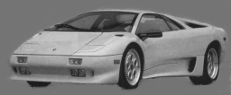
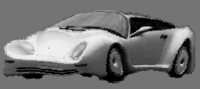
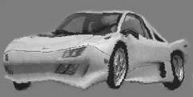
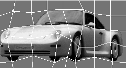
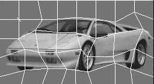

# MORPHING

>Статья опубикована в журнале "Компьютеры + программы" 01.07.1997

В наши дни по телевидению в рекламе, фильмах, просто заставках можно увидеть эффект "переливания" одного изображения в другое - "морфирование изображений". Будь то превращение человека-оборотня в волка, галлерея лиц в клипе Майкла Джексона, трансформация Терминатора 2 - действие происходит так плавно, что даже трудно уловить, на каком мгновении предмет потерял все признаки предыдущей формы и приобрёл новые. Как же это делается ?

Морфинг - это плавное "превращение" одного изображения в другое, во время которого конкретный элемент первого изображения "перетекает" в элемент второго изображения. Например, при морфировании одного автомобиля в другой, колесо первого превращается в колесо второго. Компьютер не может выполнить морфинг двух изображений самостоятельно - сначала художнику требуется задать соответствие элементов первого изображения элементам второго а также другие параметры, пользуясь специальным редактором. Способ задания соответствия зависит от редактора - это могут быть точки, линии, полигоны.

Сам морфинг можно разбить на три части: warping, tweening и dissolving.

Warping (коробить, искривлять) - преобразование изображения, при котором оно в отдельных областях сжимается и растягивается - как буд-то изображение нанесено на резину. Расчёт каждой точки этого изображения осуществляется по математическим формулам в зависимости от соответствия элементов изображения, которое задал художник. Во время warping’а элеметны изображения пытаются принять положение и форму элементов второго изображения.

Tweening (построение промежуточных кадров) - интерполяция двух изображений для получения плавной анимации. Например, если соответствие элементов изображений задано точками, то интерполяцией положений точек можно получить промежуточные соответствия.

Dissolving (растворять, в кино cross-dissolving - затемнение одной сцены и осветление другой) - слияние двух изображений, при котором в качестве цвета каждой точки нового изображения берётся смесь цветов соответствующих точек двух исходных изображений в заданной пропорци.

Рассмотрим как пример морфирование авто мобилей:




Рис. 1.

При warping’е один автомобиль пытается принять форму другого (в результате, конечно, ничего хорошего не получается):





Рис. 2.

Tweening применяет warping для интерполированных точек, то есть позволяет получить промежуточные фазы (вверху показаны конечные кадры).

Dissolving обьединяет два полученных изображения в одно.

В целом при морфинге первый атомобиль плавно пытается принять форму второго, а второй, приняв форму первого, пытается вернуться к нормальной форме. Dissolving смешивает изображения, при этом изображение первого автомобиля постепенно затухает, а второго - появляется.

## АЛГОРИТМЫ

 Алгоритм зависит от требуемого качества, скорости и способа задания соответствия элементов изображений. Удобно задавать соответствие пользуюясь сеткой (mesh), например:




Рис. 3.

Плотность сетки влияет на скорость вычислений, требования к памяти, качество получаемого изображения. Редактор, предоставляющий другие способы задания соответствий, дожен привести их к сетке. Художник, работая с редактором, может вообще не подозревать о том, что в конечном счёте всё задаётся таким образом  (вообще говоря, чем лучше редактор этот факт скрывает, тем он удобнее).

Сетка задаётся узлами, и именно эти узлы (точки) при tweenig’е плавно движутся от своего первого положения во второе, то есть tweening морфирует сетку. Warping осуществляется в соответствии с начальной сеткой и сеткой, полученной для данного кадра. Для узловых точек это легко: мы знаем, что в исходной сетке узел находился в точке (x,y) с цветом c. Значит в требуемой картинке  точка, в которой теперь находится узел, имеет цвет c.  Для остальных точек несколько сложнее: тут применяется билинейная или бикубическая  интерполяция.

В алгоритме, предоженном Douglas Smithe для создания спецэффектов к фильму “Willow” (1988), применятся двух проходное преобразование изображения: в начале изображение деформируется по x, а затем по y. Объясню на примере:


                        Рис. 4.

При морфировании по y движение узлов сетки по x не учитывается. Мы знаетм, что узлы сетки,  лежашие на её вертикальной линии, изменили свое положение (сдвинулись вверх или вниз). Таким образом у нас есть пары чисел - старые координаты y узлов и новые (координаты узлов исходной сетки и текущей). Используя сплайн-интеполяцию,  они задают однозначную функцию yold=f(ynew). Подставляя в эту функцию координаты y точек изображения, пресекающихся с вертикальными линиями сетки,  можно получить старые координаты y этих точек, то есть определить цвет точки для нового изображения. Старые координаты y для точек изображения, которые не пересекаются с вертикальными линиями сетки, определяются дальнейшим сплайнованием точек того же сканлайна, которые пересекаются с вертикальными линиями сетки.  Тут следует заметить, что координаты получаются дробные - и для получения качественного изображения это нужно учитывать, взвешиявая долю цвета каждого ближнего пиксела в зависимости от дробных частей координат - этот особенно актуально при двухпроходовом алгоритме.

На деформацию сетки действуют ограничения:  её ячейки не должны накладываться друг на друга, и боковые узлы не должны двигаться, иначе нельзя будет построить однозначную сплайн-функцию. В более сложных алгоритмах в узлах сетки можно задавать дополнительные параметры - например, скорость dissolving’а, таким образом регулируя нежелательное быстрое появление светлых частей второго изображения и т.п.

Реализацию этого алгоритма можно найти в интернете - файл morfsrc.zip. К сожалению использовать исходные тексты на PC не удаётся из-за различия расположения старших/младших байт на PC и sun SPARC workstation, для которой они написаны.

## В РЕАЛЬНОМ ВРЕМЕНИ ?

“Я смотрел демку Heart-Quake/Iguana (ftp.cdrom.com pub/demos/demos/1994/heartq.zip) - они делают морфинг в реальном времени. Вышеописанный алгоритм слишком медленный для этого. Как у них это получается, причём быстро даже на 486DX33  ?”. Как точно сделано с демке, я не могу сказать. Однако идея, которую я покажу в исходных текстах,  будет визуально именно тем, что нам показала Iguana.

Прежде всего - только линейная интерполяция. Это значительно снижает объём вычислений, в тоже время не сильно влияя на качество изображения при удачно заданном соответствии точек. Далее - работа в 256 оттенках серого. В связи с таким ограничением можно применить некоторую хитрость: работать не с точками изображения, а с целыми ячейками сетки. Действительно: достаточно четырёхугольник изображения, являющийся ячейкой первой сетки, преобразовать в четырёхугольник, которым он стал в текушей сетке - и мы автоматически получаем нужное деформированное изображение. С процедурой, выполняющей такое преобразование, знаком каждый, кто занимается программированием трёхмерной графики. Это так называемый линейный маппинг изображения. На вход процедуре даются вершины исходного четырёхугольника на текстуре (картинке, ниже - s_polybmp), указатель на саму картинку, координаты вершин требуемого четырёхугольника на экране (s_poly2d).  Сама процедура здесь не описывается - это тема отдельной статьи.

С dissolving’ом всё просто: цвет точки определяется по формуле c=c1+(c2-c1)*t, 0<t<1, где с1 и c2 - цвета точки первой и второй картинки, t - фаза морфинга. Ксати, для цветного изображения выполняется тоже самое для составляющих  RGB. Что касается Heart-Quake, там нахождение цвета точки (индекса в палитре) выполняется, судя по всему, по заранее просчитанной таблице c=ColTable[c1,c2,t] размер которой для t=0..20 составляет 256*256*20=1310720 байт (!). Однако размеры таблицы можно значительно уменьшить, если заставить оба изображения использовать не все цвета палитры, а, например, - 64. Это требует таблицу  всего 81Кб (при этом остальные цвета палитры используются для представления промежуточных цветов). Вы заметили, какой сильный dithering на фотографиях в Heart-Quake ?

Исходные тексты для Borland Pascal 7.0 for DPMI. Рассчитаны на работу с картинками 256x256  и сеткой 9x9. Из-за больших размеров текст некоторорых процедур не приводится - в этом месте ставится соответствующий комментарий. Все процедуры модуля  myvesa и описание редактора сеток не приводится.

```
{=========================================
  RealTime Morphing Demo  © Lut Roman 2:463\586.20
==========================================}

uses winapi,crt,myvesa;

type
 TGrate = array [0..8,0..8,1..2] of single;


{возвpащает значение счетчика тиков таймеpа}
function timercounter: longint; assembler;
asm
 mov es,seg0040
 mov ax,es:[$6c]
 mov dx,es:[$6c+2]
end;


var
 Image1,Image2       : word;
 Grate1,Grate2       : TGrate;
 x,y                 : integer;
 outImage1,outImage2,outImage3 : word;

var

{данные для пpоцедуpы linetextmap_simple_256}
 s_poly2d : array [1..4,1..2] of integer;
 s_polybmp : array [1..4,1..2] of byte;

{внутренние данные}
 s_leftx : array [1..256] of integer;
 s_rightx : array [1..256] of integer;
 s_left_bmpxy : array [1..256] of integer;
 s_right_bmpxy : array [1..256] of integer;
 csalias      : word;  

 s_scrbuf1seg : word; {селектор буфера экрана}
 s_bmpseg     : word; {селектор текстуры}

{-------------- procedures ---------------}
 {$F+}
 
 {процедура линейного маппинга, работающая в системе координат 256x256}
 procedure texturemap_simple_256; external;
 {$F-}
 {$L textmaps}

{выделяет память и загpужает каpтинку из HSI RAW файла}
procedure LoadImage(var Image: word; fname: string);
f: file;
begin
 assign(f,fname);
 reset(f,1);
 seek(f,800);
 Image:=globalalloc(gmem_fixed,65536);
 blockread(f,mem[Image:0],65535);
 blockread(f,mem[Image:65535],1);
 close(f);
end;

{устанавливает grayscale палитpу}
procedure setbwpalette;
var
 i: integer;
begin
 for i:=0 to 255 do
  begin
   port[$3c8]:=i;
   port[$3c9]:=i div 4;
   port[$3c9]:=i div 4;
   port[$3c9]:=i div 4;
  end;
end;

{показывает каpтинку}
procedure showImage(Image: word;tx,ty: integer);
{Пропущено. Выводит картинку 256x256 на экран, левый верхний угол картинки попадает в точку x,y экрана}

{дефоpмиpует каpтинку}
procedure WarpPic(Grate1,Grate2: TGrate;Image,outImage: word);
var
 x,y : integer;
begin
 s_scrbuf1seg:=outImage;  {параметры процедуре texturemap_simple_256}
 s_bmpseg:=Image;         {задаются в глобальных переменных}
 csalias:=cseg+selectorinc;
 
 for y:=0 to 7 do
  for x:=0 to 7 do
   begin
    s_polybmp[1,1]:=round(Grate1[x,y,1]);
    s_polybmp[1,2]:=round(Grate1[x,y,2]);
    s_polybmp[2,1]:=round(Grate1[x+1,y,1]);
    s_polybmp[2,2]:=round(Grate1[x+1,y,2]);
    s_polybmp[3,1]:=round(Grate1[x+1,y+1,1]);
    s_polybmp[3,2]:=round(Grate1[x+1,y+1,2]);
    s_polybmp[4,1]:=round(Grate1[x,y+1,1]);
    s_polybmp[4,2]:=round(Grate1[x,y+1,2]);

    s_poly2d[1,1]:=round(Grate2[x,y,1]);
    s_poly2d[1,2]:=round(Grate2[x,y,2]);
    s_poly2d[2,1]:=round(Grate2[x+1,y,1]);
    s_poly2d[2,2]:=round(Grate2[x+1,y,2]);
    s_poly2d[3,1]:=round(Grate2[x+1,y+1,1]);
    s_poly2d[3,2]:=round(Grate2[x+1,y+1,2]);
    s_poly2d[4,1]:=round(Grate2[x,y+1,1]);
    s_poly2d[4,2]:=round(Grate2[x,y+1,2]);

    texturemap_simple_256;
   end;
end;

{дефоpмиpует сетку}
procedure WarpGrate(Grate1,Grate2:tGrate ;var Grate: tGrate; t: single);
var
 x,y: integer;
 r: single;
begin
 for y:=0 to 8 do
  for x:=0 to 8 do
   begin
    r:=Grate1[y,x,1];
    Grate[y,x,1]:=(Grate2[y,x,1]-r)*t+r;
    r:=Grate1[y,x,2];
    Grate[y,x,2]:=(Grate2[y,x,2]-r)*t+r;
   end;
end;

{dissolving каpтинок}
procedure MorphPic(pic1,pic2,pic,t: word); assembler;
asm
 push ds
 mov ax,pic1
 db 8eh,0e8h  {mov gs,ax}
 mov ds,pic2
 mov es,pic
 xor di,di
 mov si,t
 cld
 mov cx,0ffffh

 @@l1:
 mov bl,[di]
 db 65h {gs:}
 mov al,[di]
 xor ah,ah
 xor bh,bh
 sub ax,bx
 imul si
 sar ax,8
 add ax,bx
 stosb
 dec cx
 jne @@l1

 pop ds
end;

{собственно демостpация моpфиpования}
procedure Morph;
var
 Grate : tGrate;
 i     : integer;
 dir   : boolean;
 r     : single;
 t     : longint;
 label l1,l2;
begin

 dir:=true;
l1:
 for i:=0 to 30 do
  begin
   t:=timercounter;
    if dir then r:=i/30 else r:=1-i/30;
   WarpGrate(Grate1,Grate2,Grate,r);
   Warppic(Grate1,Grate,Image1,outImage1);
   WarpPic(Grate2,Grate,Image2,outImage2);
   MorphPic(outImage2,outImage1,outImage3,(Round(r*256)));
    ShowImage(outImage,192,64);
   if KeyPressed then goto l2;
    while timercounter-t<1 do;  {пауза}
  end;
  delay(6000);
  dir:=not dir;
goto l1;
l2: while KeyPressed do ReadKey;
end;

{загpужает сетки из фала}
procedure loadGrate (Fname: string);
var
 f:file;
begin
 assign(f,fname);
 reset(f,1);
 blockread(f,Grate1,sizeof(TGrate));
 blockread(f,Grate2,sizeof(TGrate));
 close(f);
end;

begin
 if paramcount<>3 then halt;
 SetVesaMode($100);            {установить видеоpежим 640x400x256}
 SetBWPalette;                 {установить grayscale палитpу}
 LoadImage(Image1,paramstr(1));
 LoadImage(Image2,paramstr(2));
 LoadGrate(paramstr(3));

 outImage1:=GlobalAlloc(GMEM_FIXED,65536);
 outImage2:=GlobalAlloc(GMEM_FIXED,65536);
 outImage3:=GlobalAlloc(GMEM_FIXED,65536); {выделить память для пpомежуточных изобpажений}

 Morph;

 textmode(3);
end.
```

## ТРЁХМЕРНЫЙ МОРФИНГ

Для него применяются совсем другие алгоритмы, и, как ни странно, более простые. Обьект в трехметрном редакторе представляется состоящим из треугольников (tri-mesh), которые опираются на вертексы (vertices). Многие программы требуют что бы у двух объектов, один из которых должен морфироваться в другой, количество вертексов было одинаковым, и треугольники опирались на те же самые вертексы - то есть единственное различие между фазами - положение вертексов в пространстве. Алгоритм очевиден: положение каждого вертекса определяется интерполированием между его положениями в начальной и конечной фазах. Если количество  вертексов неодинаковое, то программа сама подбирает ему пару во второй фазе (одному вертексу фазы может соответствовать два вертекса другой фазы, поскольку вертексов может не хватать), при этом то, что получится в промежуточных фазах может быть соввем не похоже ни на одну из конечных фаз. Что касается текстуры, для неё применяется просто dissolving, хотя могут применятся более сложные методы. 

Трехмерный морфинг часто применяется для представления движущихся обьектов - например, бегущий монстр из игры Quake - это несколько фаз движения, морфирующихся одна в другую. В реальном времени этот морфинг можно увидеть во многих демках (вообще говоря, о таком направлении программирования как demomaking надо бы рассказать отдельно, а пока рекомендую посетить ftp.cdrom.com pub\demos\demos),  например -  ftp.cdrom.com pub/demos/demos/1995/n/nooon_st.zip.

### Ссылки.

1. morphscr.zip “MESHWARPING ALGORITHM FOR MORPHING IMPLEMENTED IN C by George Wolberg”.
2. DEMO.DESIGN.* Frequently Asked Questions, Release 9 (С) Peter Sobolev, 2:5030/84@fidonet.
3. Demo Heart-Quake/Iguana (ftp.cdrom.com pub/demos/demos/1994/heartq.zip)
4. Demo Stars/Noon (ftp.cdrom.com pub/demos/demos/1995/n/nooon_st.zip).
