# Изготавливаем графический планшет из вебкамеры своими руками

Статья опубликована на сайте [Hardware Portal](https://web.archive.org/web/20171215200516/http://www.hwp.ru/Handmade/Vtablet/index.html) 20.10.2005. Призёр конкурса “Своими руками”.

## Предисловие

Причем тут веб-камера к планшету, скажете вы ? А вот и нет - ведь планшет-то у нас будет виртуальный!

Как-то раз, прочитав о Eye toy от Sony [1], я думал о необычных способах ввода данных в компьютер. В этот момент пришла идея попробовать самостоятельно собрать что-то подобное - благо веб-камера была под рукой.

Итак, давайте подумаем – что можно отслеживать, имея одну камеру? Во-первых - положение какого-либо объекта, отличающегося от фона. При этом он должен двигаться только в какой-то плоскости - поскольку для отслеживания координат в пространстве потребуется две камеры. Во-вторых - мы может отслеживать изменение цвета и формы объекта. К сожалению, распознавания формы потребует изучения серьезных алгоритмов распознавания образов, и потому от этого лучше отказаться. Но даже простого отслеживания положения в пространстве уже достаточно, чтобы собрать виртуальный планшет, если позаботиться о датчике нажатия.

## Виртуальный планшет

Итак, принцип работы. Располагаем в поле зрения камеры белый лист бумаги. Наклеиваем на кончик ручки цветной маркер. Если перемещать ручку по листу бумаги, то, распознавая цвет маркера на картинке, можно получить координаты ручки в плоскости листа. Если эти координаты превращать в движение курсора на экране, мы получим простейший виртуальный планшет.

## Ручка с цветным маркером

Для стабильного распознавания необходимо, чтобы отслеживаемый цвет значительно отличался от фона картинки. Кроме того, этот цвет должен быть насыщенным. Наилучшее, что нашлось под рукой – стикеры, используемые для наклеивания цен на товары. Ярко зеленый цвет отлично контрастирует с фоном картинки.

Берём обычную шариковую ручку.

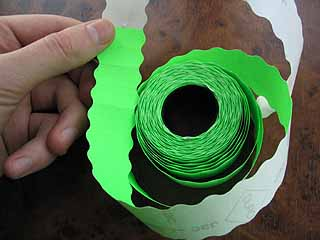

Берем один стикер, и отрезаем тонкую полоску.

Полоску наматываем на стержень ручки.

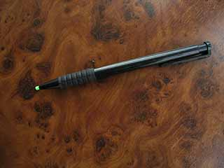

Наш «стайлус» готов ! На картинке видно, что насыщенный цвет буквально «горит», и потому будет стабильно распознаваться нашей программой. Наша ручка не имеет датчика нажатия, поэтому пользователь должен будет использовать какую-либо клавишу клавиатуры, например – левый Ctrl.

## Программное обеспечение

Собственно, «аппаратная» часть уже закончена. Мы жестко закрепили камеру так, чтобы лист бумаги занимал как можно большую часть картинки, и сделали «стилус». С помощью программного обеспечения камеры мы можем видеть, что когда мы рисуем на листе бумаги, то на картинке с камеры отчетливо виден цветной маркер. Нам нужно написать программное обеспечение, которое будет отслеживать положение маркера на листе бумаги, и переводить его движение в движение курсора мыши на экране компьютера. Сразу скажу, что читатель, незнакомый с программированием, может пропустить два следующих раздела и сразу перейти к испытаниям, т.к. готовое программное обеспечение прилагается к статье.

В качестве языка программирования возьмем Delphi, т.к. для него легко найти готовые компоненты для работы с веб-камерой и ком-портом (об этом дальше), и легко делать пользовательский интерфейс. Но, прежде чем запускать редактор, обсудим алгоритмы.

## Распознавание цвета

С камеры мы получаем картинку в формате RGB (красный, зеленый, синий). Имея эти данные, мы должны распознать положение (координаты) маркера на картинке. У меня не было желания разбираться со сложными алгоритмами распознавания образов, и поэтому я взял простейший алгоритм: в цикле пройтись по всем пикселам картинки, выбрать из них те, цвет которых похож на цвет маркера, и найти средние координаты этих точек (X,Y).

Сравнивать цвета лучше в пространстве YUV (Y - яркость, UV – цвет), игнорируя яркость (Y). Это для того, чтобы условия освещения не влияли на стабильность распознавания.

Координаты всех точек, похожих на цвет маркера, нужно сложить и поделить на их количество. Таким образом, получим средние координаты, которые и будут положением нашего маркера на картинке.

, где n - количество похожих точек.

## Математические выкладки

Итак, первая версия нашего «драйвера» уже умеет определять координаты маркера на картинке. Однако, координаты на картинке - это еще не координаты на листе бумаги, т.к. лист занимает не всю площадь картинки. Во-вторых, лист расположен под наклоном к плоскости изображения.

Для перевода координат маркера на картинке в координаты на листе бумаги, нам необходимо знать координаты углов листа бумаги на картинке. Для этого просто попросим пользователя «откалибровать» наш виртуальный планшет – кликнуть в углах листа бумаги.

После «калибровки» мы получаем четыре пары координат (x1,y1, x2,y2, x3,y3, x4,y4) на картинке, которые соответствуют углам листа бумаги. Теперь нужно вывести соотношение, которое позволит нам переводить координаты на картинке (x,y) в координаты на листе бумаги (X,Y). По началу, я долго не мог придумать, как это сделать, но потом все же удалось найти решение.

Лист бумаги представляет собой плоскость в пространстве. Положим, что координаты углов картинки в трехмерном пространстве равны:

Поскольку нас не интересуют реальные размеры в пространстве, а только относительные координаты на листе бумаги, мы можем принять любые координаты, лежащие в трехмерной плоскости. Я выбрал указанные, чтобы получать на выходе координаты X и Y в диапазоне [0..1].

Из курса трехмерной графики мы знаем, что для создания двумерного изображения из трехмерной модели, координаты трехмерных точек умножаются на локальную матрицу объекта и на матрицу камеры:

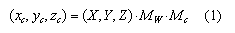

Полученные трехмерные координаты в пространстве камеры проецируются на плоскость экрана. Обычно для этого используется матрица проецирования, но в случае перспективной проекции этот же процесс можно описать простыми формулами:

, где f – фокусное расстояние.

Подставляем (1) в (2), и расписываем умножение матрицы на вектор:

, где  - элементы суммарной матрицы 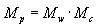.gif

Опять же, поскольку нас интересуют только соотношения, фокусное расстояние можно опустить и считать, что оно включено в элементы матрицы , находящиеся в числителе.

Перемножим и распишем (3):

Выразим X,Y (координаты на листе бумаги):

Имея формулы (4), мы может получать координаты на листе бумаги (X,Y) из координат на картинке (x,y). Координаты на листе бумаги будут в диапазоне [0..1] , и останется просто помножить их на разрешение экрана, чтобы получить требуемое положение курсора.

Как найти элементы матрицы  для формулы (4)? Нам известны трехмерные координаты углов бумаги (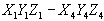 - приняты ранее) и их координаты на картинке (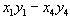 - получены при калибровке). Нужно подставить их в формулы (4) и решить полученную систему уравнений.

Мы получаем систему линейных уравнений, которую можно расписать в матричном виде как:

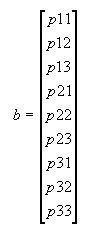

Я дополнил матрицу A нулями снизу, чтобы она получилась квадратной.

Мы получили 8 уравнений и 9 неизвестных. Для нахождения 9 неизвестных недостаточно 8 уравнений. Но мы знаем, что точки (X,Y,Z) лежат в плоскости, и потому линейно зависимы. То есть на самом деле уравнений больше, чем неизвестных, и значит, система имеет решение. Просто скажу, что такие системы уравнений решаются с помощью сингулярного разложения матрицы, которое рассматривать здесь не буду, т.к. наверняка уже и так утомил :).

## Усложняем аппаратную часть

Итак, мы уже можем рисовать с помощью нашего планшета! Однако, стабильность распознавания сильно зависит от условий освещения, да и пользоваться клавишей Ctrl для нажатия не очень удобно. Давайте соберем "продвинутый стилус" для нашего планшета.

Чтобы повысить стабильность, я решил поместить на кончик ручки зеленый светодиод. Теперь стабильность распознавания практически не зависит от освещения. В качестве датчика нажатия я взял микропереключатель из старой мышки.

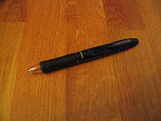

Берем старую шариковую ручку диаметром 1см.

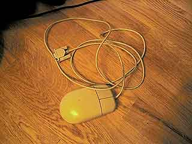

Берем старую COM-мышку.

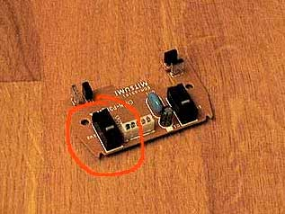

Из мышки нам понадобится провод с разъемом и микропереключатель.

Микропереключатель вставляем в ручку так, чтобы при надавливании, стержень ручки его включал.

Берем зеленый светодиод. Я немного подпилил его с краев, чтобы сделать меньше.

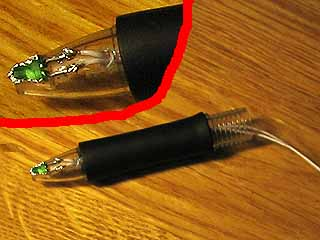

Приклеиваем светодиод на кончик ручки. Я обернул светодиод фольгой с боков. Теперь в темноте вокруг светодиода не создается ореол, и стабильность распознавания улучшается.

Паяем все по приведенной схеме. Смысл состоит в следующем: светодиод запитывается от сигнальных линий СОМ-порта и постоянно горит. Микропереключатель замыкает цепь приема-передачи, и, таким образом, в нажатом состоянии программа получает "эхо" от посланных данных. Это можно проверить, запустив HyperTerminal и набрав несколько символов на консоли. Когда выключатель отжат - символы не отображаются. Когда нажат - введенные символы передаются терминалом, принимаются обратно и отображаются на консоли.

После сборки у вас должно получиться что-то подобное.

## О настройке программного обеспечения

Я постарался сделать ПО с максимально понятным интерфейсом в форме Мастера.

Сразу после запуска, ПО пытается соединиться с веб-камерой и требует калибровки. Остановлюсь отдельно на некоторых страницах Мастера.

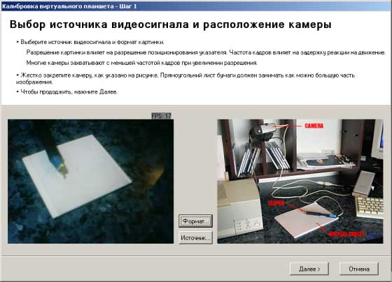

На экране выбора веб-камеры необходимо выбрать камеру (Кнопка "Источник…") и формат изображения ("Формат…"). Если у вас в системе два устройства видеоввода, например - на видеокарте есть видеовход, то нужно правильно выбрать источник. В настройках формата необходимо выбрать один из следующих форматов: I420, IYUV, UYVY. С другими форматами ПО не работает. Здесь следует также отметить, что при более высоком разрешении веб-камеры часто дают в 2-3 раза ниже FPS, так что, возможно, придется пожертвовать разрешением в пользу скорости реакции. При правильной настройке, в левое окно должно поступать изображение с камеры.

На экране настройки цвета слежения необходимо подобрать параметры "Разброс", "Чувствительность" и цвет слежения такие, чтобы в левой картинке за кончиком ручки четко следовал красный крестик.

Нужно начать с параметра "Чувствительность". Установите его таким, чтобы в правом окне отчетливо выделятся цветом наш маркер. Кликните курсором мыши на изображении маркера в правом или левом окне. Программа запомнила требуемый цвет, и начинает собирать похожие точки. Количество похожих точек отображается под меткой "Samples count:". В левом окне похожие точки помечаются розовым цветом. Необходимо подобрать параметр "Разброс" таким образом, чтобы количество похожих точек примерно равнялось пятидесяти. Возможно, придется отрегулировать размер цветного маркера на кончике ручки и убрать посторонние предметы из поля зрения камеры.

Надеюсь, что остальные экраны Мастера не вызовут вопросов. После завершения Мастера, наш "драйвер" сидит в трее. Включать/выключать планшет также можно клавишей "Scroll lock" клавиатуры.

## Заключение

Думаю, что если у вас когда-нибудь возникало желание купить себе какой-нибудь дешевенький планшет "для поиграться", то для этих целей вам вполне хватит виртуального. Ведь все, что нужно - это закрепить камеру, наклеить маркер на кончик ручки, установить ПО - и планшет готов.

Как вариант, можно рисовать лазерной указкой (или брелком) на стене. Веб-камеру также можно заменить цифровым фотоаппаратом, подключенным к видеовходу видеокарты. Лично я пробовал с Canon A70 + видеовход на GeForce 4 TI4200, а также фотоаппарат Agfa CL20 в режиме веб-камеры.

Я не зря назвал этот планшет "игрушкой". Ему никогда не сравниться с профессиональными планшетами типа Wacom из-за низкого разрешения (а оно примерно на 50% меньше разрешения веб-камеры), а также задержки, возникающей из-за задержки видеосигнала при оцифровке. Для сравнения скажу, что планшет Wacom Intuos работает в разрешении не меньше 1024x768, распознает 512 степеней нажатия и наклон ручки. Кроме того, многие камеры меняют баланс белого при изменении условий освещения, из-за чего цвет слежения изменяется и вызывает проблемы со стабильностью распознавания.

## Материалы по теме

- Программное обеспечение для виртуального планшета http://www.deep-shadows.com/hax/vtablet.htm
- Sony Eyetoy http://www.us.playstation.com/Content/OGS/SCUS-97319/Site/
- Flight of Fantasy http://gaijin.ru/projects/flight.htm
- VISUAL INPUT FOR PEN-BASED COMPUTERS http://www.vision.caltech.edu/mariomu/research/pentrack/long.html
- YUV at Wiki pedia http://en.wikipedia.org/wiki/YUV
- Com port library for Delphi http://sourceforge.net/projects/comport/
- tscap32 for Delphi http://tscap32.sourceforge.net/
- DKLang translation package, DK Software, http://www.dk-soft.org/
- Hax's personal page http://www.deep-shadows.com/hax/

*Лут Р.М.  
20/10.2005*
