# Nuances of Exporting from 3DS MAX

*Article published on [gamedev.ru](http://www.gamedev.ru/community/toolcorner/articles/?id=722) on April 21, 2006*

*This article won first place in the "Exporting from 3DS MAX" contest on gamedev.ru on April 21, 2006*

### **Introduction**

Since this article originated from a comment on the article "Notes on Developing a Geometry Export Plugin and a Bit More" by Glorg, please start by reading the original article [1], and I'll skip the introduction 🙂

In brief, this article will cover the nuances that you (whether you like it or not) will inevitably encounter when writing an export plugin for 3DS MAX.

### **Coordinate System**

Pay attention to how the coordinate system axes are oriented in 3DS MAX, and compare it with the system used in DirectX.

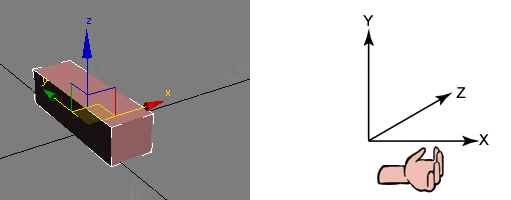

*Figure 1. 3DS MAX and DirectX coordinate systems.*

Not only is the Z axis pointing up instead of Y, but 3DS MAX also uses a right-handed coordinate system instead of a left-handed one, as in DirectX.

If you don't account for this, the exported character will be lying on the floor in the game.

Since the systems have different handedness, there is no rotation that can transform one system into the other. You also need to apply a reflection relative to one of the coordinate planes.

To avoid confusion, the simplest approach during export is to swap the Y and Z axes. Thus, if a character should run along the Z axis in the game, the animator in 3DS MAX should animate them along the Y axis – a very simple rule.

To swap the axes, you simply need to swap the Y and Z components in vertex positions and normals. However, when exporting animation, each 3DS MAX matrix must be multiplied in front and behind by the axis-swapping matrix (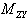) to transform the position back to the 3DS MAX coordinate system for animation, and then back to our coordinate system.

The axis-swapping matrix looks as follows:


When inverted, the matrix remains unchanged.

The complete formula looks like this:


### **Object and Node Matrices**

The 3DS MAX documentation has a section called "Must Read Sections by Plug-In Type". Well, you really need to read it! In particular, it explains what node and object matrices are.

The entire 3DS MAX scene is represented as a hierarchy of nodes. When we create a box, we create a node (INode) and an object (IObject) that this node references.

The pivot point of the object's local coordinate system, which we see in the 3DS MAX interface, is a visual representation of the node matrix. The node matrix can be obtained using the INode->GetNodeTM() method.

Additionally, an object can be offset relative to the node using the object matrix. By default, the object matrix is an identity matrix, but it can be changed by moving the pivot.

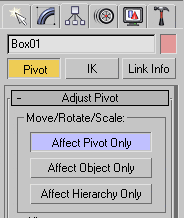

*Figure 2. Enabling pivot transformation mode.*

When we move the pivot, 3DS MAX simultaneously changes both the node matrix and the object matrix so that the geometry visually remains in the same place.

The complete formula for transforming geometry to world space looks like this:

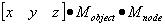

It's impossible to directly obtain the object matrix. You can get the transformation matrix from geometry to world space (INode->GetObjectTM()), and multiply it on the right by the inverted node matrix.


### **Non-uniform scale**

Non-uniform scale (scaling with different coefficients along axes, NUS) is evil. It's such a great evil that in early versions of 3DS MAX, a warning would pop up when enabling this mode. But in recent versions of 3DS MAX, it was removed (probably because artists never read it anyway :).

NUS creates the following two problems:

**1.** To transform normals, you must use the inverse transpose matrix.

Typically, in games, the same matrix is used to transform normals as for transforming positions, just with zero translation. With NUS, this doesn't work:

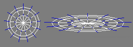

*Figure 3. If the same matrix is used to transform normals as for positions, the normals are no longer perpendicular to the surface.*

If matrix M is used to transform positions, then 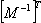 must be used to transform normals. However, you can simply calculate normals after transforming positions.

Usually, the NUS problem can be solved by extracting the scaling from matrices and applying it to vertex coordinates (thus eliminating scaling altogether). Unfortunately, this doesn't eliminate the second, fundamental problem.

**2.** If NUS is applied to a bone, it squashes when rotating.

Actually, before the model reached the export stage, problems should have already arisen for animators, and they should have sent the model back to the modeler :).

Since the node matrix contains non-uniform scaling, when rotating, the bone describes an ellipse rather than a circle. Since bone animation in games is stored only as position and rotation (quaternions), the animation in the game won't match the animation in 3DS MAX.

In other words, NUS is evil, and your artists should ensure that node matrices don't contain it. If non-uniform compression is needed, it should be applied to geometry vertices (vertices sub-object), not to the node.

Matrices can also contain axis skewing (transition to a non-orthogonal coordinate system). Fortunately, achieving this through standard 3DS MAX methods is very difficult, so such cases are rare (use the Matrix3->Orthogonalize() method).


### **Negative Scaling**

3DS MAX allows specifying negative scaling.

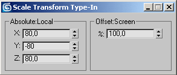

*Figure 4. Negative scaling.*

Effectively, this is scaling plus reflection along one of the axes. If an object is mirrored or scaled with a negative coefficient, you need to reverse the vertex order in the triangle (flip the normal). You can check this by analyzing the matrix:

```cpp
bool RF2_Export_FaceNeedFlip(INode *Node, float time)
{
  Matrix3 m = (Node->GetObjectTM (time));
  return (DotProd(CrossProd(m.GetRow(0),m.GetRow(1)),m.GetRow(2))<0.0)?1:0;
};
```


### **Hidden Objects**

Sometimes problems arise from not knowing the 3DS MAX interface. Actually, you're a programmer, and you're not required to know 3DS MAX, but still...

3DS MAX allows hiding objects. This is a very useful feature, and artists use it often. To avoid problems when the exported scene contains some mysterious objects that seemingly don't exist in 3DS MAX, you need to know that 3DS MAX allows hiding objects in three different ways.

**1.** Hide selected objects using the context menu:


*Figure 5. Context menu (invoked by right-clicking).*

To show all objects in the scene hidden this way, you need to select "Unhide all" from the same menu.

**2.** Using layers:

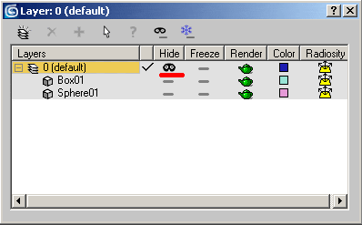

*Figure 6. Layer Manager window (accessed via Tools->Layer Manager).*

**3.** Using the Display panel:

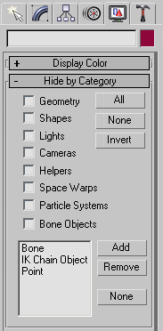

*Figure 7. Display options panel.*

An object hidden by any method won't be displayed in ViewPort windows or in the object list. The plugin itself doesn't distinguish the hiding method; you can use the unified INode->IsHidden() method.


### **Hidden Triangles**

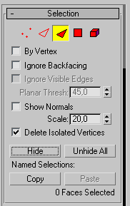

*Figure 8. Face sub-object panel.*

Besides entire objects, 3DS MAX allows hiding individual triangles. The plugin can query the triangle's status using the Face->Hidden() method.


### **Material Export**

First of all, be prepared that one fine day an artist will add a space at the beginning or end of a material name, and you'll spend two fascinating hours searching for the bug 🙂 Therefore, it's better to automatically remove spaces at the beginning and end of material and object names.


*Figure 9. Although not visible, a space has actually been added before the word "citywall".*

The same applies to visually similar Russian and English letters ("a", "p", "e", "o", etc.). The simplest approach is to prohibit the use of Russian letters in names, and then the plugin can issue error messages about such errors during export.


### **Multi/sub-object material**

Since 3DS MAX uses a "one object – one material" architecture, a special Multi/Sub-object material is used to apply different textures to selected triangles of an object. This material, in turn, contains references to the actual materials applied to the triangles. The Multi/Sub-object material associates a unique ID with each child material.

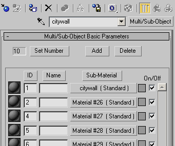

*Figure 10. Multi/Sub-object material.*

Each triangle is assigned the ID of the child material accordingly.

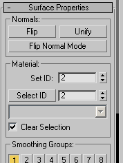

*Figure 11. Face sub-object panel.*

Regarding child material IDs, you need to know the following:

- in the 3DS MAX interface, ID numbering starts from one. At the same time, the Mtl->GetSubMtl(i) method assumes numbering from zero;
- IDs can have gaps (1,2,3,5,6,7) and may not start from 1. Be prepared that the Mtl->GetSubMtl() method may return NULL;
- a triangle may be assigned the ID of a non-existent child material. In the viewport window, the triangle will be displayed in black. This is an artist's error, but you should still ensure that the plugin doesn't crash in such cases;
- a triangle may be assigned an ID greater than the maximum child material ID. Unlike the previous case, this situation is considered normal in 3DS MAX. In this case, you need to take the remainder of dividing the ID by the maximum ID.

Overall, material processing looks like this:

```cpp
Mtl* mat = Node->GetMtl();
if (mat==NULL) return; // do not export objects without materials applied
DWORD numSubMat = mat->NumSubMtls();
Face* MFace = NodeMesh->faces;
for (DWORD f=0; f<NodeMesh->numFaces; f++, MFace++)
  {
   Mtl* faceMat = NULL;
   if (NumSubMtls==0)
     {
      faceMat = mat;
     }
      else
     {
      DWORD matID = MFace->getMatID();  //this is SubMatID-1
      matID = matID % NumSubMtls;
      faceMat = mat->GetSubMtl(matId);
     }
   //use faceMat (can be NULL)
   //...
  }
```

But that's not all. As we know, artists are careless people and may repeat identical materials in the child list. Make sure this is handled and doesn't lead to extra batches (batch, drawcall).


### **Sub-region tiling**

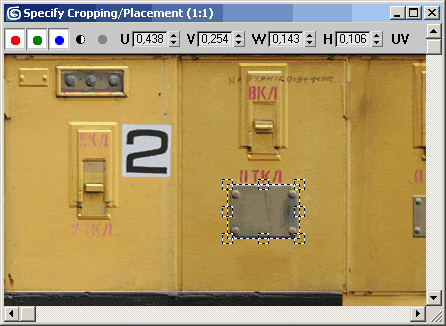

*Figure 12. 3DS MAX allows using part of an image as a texture.*

When creating a material, 3DS MAX allows specifying which part of the image to use as a texture.

If without tiling this problem can be solved during export by modifying UV coordinates, then when using tiling, nothing can be done, since your engine is unlikely to support such functionality.

It's best to simply prohibit the use of this feature. Since we're exporting from a package with extensive capabilities to a format with limited capabilities, in the general case, even before starting modeling, the artist should read your document, which in addition to limitations on the number of triangles and textures, also specifies such nuances.


## **Exporting Vertex Binding**

### **Dummy Hierarchy**

The Skin and Physique modifiers are used to bind vertices to bones in 3DS MAX. I'll describe Physique, since I haven't dealt with Skin yet.

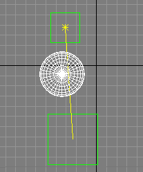

*Figure 13. All sphere vertices are bound to the link between two dummies. In 3DS MAX, the sphere will move when animating both parent and child dummies; in the game – only the parent.*

First of all, you should know that Physique moves vertices together with the link connecting the child and parent objects. Therefore, vertices can be animated by moving either the parent or the child. However, in game engines, vertices respond exclusively to the parent object.

As long as the animator uses Biped and Bones, everything works fine, since a Bone actually represents a parent-child linkage, and moving the child automatically causes the parent to rotate.

But since in 3DS MAX any object can be a bone (really only an INode is needed), artists often use dummies. You should immediately inform them that moving dummies at the end of the hierarchy is not allowed. Fortunately, Physique can be switched to a mode corresponding to the game's behavior. Here's Discreet support's response on this topic:

```
============= cut ============
Title Problems exporting Rigid data from Character Studio 3.X
Version 3.1 & 4.0
Keywords Rigid Links Translation


Question

I have character hooked up with dummy objects, which are being translated. Physique shows the deformation but the Character Studio SDK does not show these dummys effecting any vertices

Answer

This is a result of the new algorithm for Rigid blending in Physique 3.0 It allows child objects to have their translation as part of the deformation. In previous versions of Character Studio, a translated link would have no effect, only the parent object would have an influence. This causes confusion, as a common technique for artists was to turn on Rigid from the SKin Update, in the Physique rollout, so that they could see how the animation would run when exported. This however is no longer the case, as the SDK will not provide access to these node.

A solution to this is to use an INI switch provided in the latest version of Physique.

Edit the physique.ini file to add the following

USE_2.2_RIGID_DEFORMATIONS=YES

This forces physique to use the old algorithm which will match SDK and game access to the deformer. THis will also mean that your exisiting tools will work as expected.

============= cut ============
```

Ideally, your plugin should enable this option automatically and prompt to restart 3DS MAX.


### **Spline Links**

Additionally, note that by default Physique uses spline links. For vertex animation to match the game, BEFORE BINDING VERTICES you need to select all links and disable the Continuity parameter.

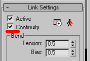

*Figure 14. Link configuration panel.*

This is an important point – if this wasn't done, you'll either have to accept animation discrepancies or completely rebind the model.


### **Vertex Types**


*Figure 15. Vertex binding panel.*

Physique uses three types of vertices: deformable (red), rigid (green), and root (blue). RED VERTICES MUST NOT BE USED. During blending, for red vertices, Physique changes the link's influence on the vertex depending on the vertex's distance from the link. In games, naturally, such algorithms are not applied. Thus, the farther a vertex is from the link, the less similar the vertex animation in 3DS MAX will be to the animation in the game. Inform your artists about this, otherwise the model will have to be rebound.

It's also worth mentioning that all joint settings (Tendons) won't work in the game either.


### **Manual Weight Assignment**

Physique allows manually assigning each vertex's binding to a bone. I don't know why, but some modelers prefer to struggle for weeks with the Physique binding panel (which works non-trivially) instead of reading the manual once and not suffering. As a result, interesting situations arise when a vertex is bound to the same bone 3-4 times with different coefficients. Honestly, I don't even know how to achieve this, but it really happens.

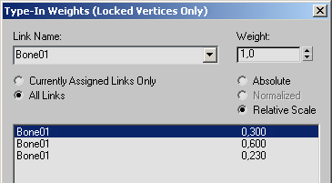

*Figure 16. Incorrect binding.*

It's advisable to handle this situation, otherwise instead of blending across 3 bones, you'll get blending across one, and other important bones will be discarded due to exceeding the limit (usually max 3 bones per vertex).


### **Deleted Bones**

Sometimes a situation occurs where one of the bones to which vertices are bound is deleted from the scene. Actually, the model's vertices would fly off to infinity, but this may not happen if this bone has a small weight. Therefore, you need to be prepared that when requesting the bone to which a vertex is bound, PhysiqueInterface may return NULL.


## **Hierarchy**

### **Link Constraint**

Besides using the standard hierarchy, 3DS MAX has several alternative ways to link objects so they move as if using a hierarchy. Particularly popular is the Link Constraint controller. Unlike regular linking, it allows reassigning the parent during animation. For example, initially a pistol is in a holster (parent – torso), and then the character takes it in their hands (parent – palm).

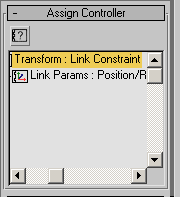

*Figure 17. Link Constraint controller.*

In this case, the INode->GetParent() method still returns the parent according to regular linking (i.e., Scene Root), while the game requires a specific bone hierarchy. To solve this and similar problems, you need to add the ability to change the hierarchy during export, for example, by specifying the "PARENTBONE=xxxx" parameter in the object's user-defined properties.


### **Biped**

Biped somewhat "stands out" from the 3DS MAX architecture. Tools work strangely on it, it ignores scaling and hierarchy. In connection with this, situations are possible where an artist accidentally unlinks parts of the Biped or relinks them in a different order. Although this has absolutely no effect on Biped's behavior in 3DS MAX, an incorrect hierarchy is exported to the game.

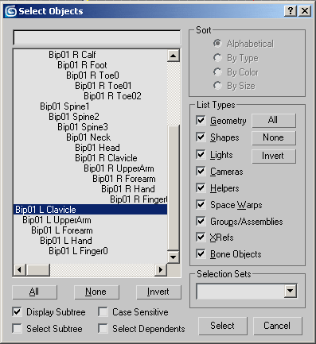

*Figure 18. Biped arms are unlinked.*

Of course, you could build special code into the plugin to check hierarchy correctness, but in this case, it's sufficient to simply know that such a situation is possible (forewarned is forearmed).


### **Exporting Normals**

When creating an export plugin, it's desirable to maximize the similarity between what the artist sees in the 3DS MAX viewport and the result obtained in the game.

3DS MAX provides access to vertex positions and triangles, but not to vertex normals. Therefore, normals have to be calculated manually. The normal calculation algorithm is provided in the "Computing face and vertex normals" topic in the 3DS MAX SDK documentation. The nuance here involves two points. First, 3DS MAX uses angle-weighted normal averaging, so you need to use this method when calculating normals.

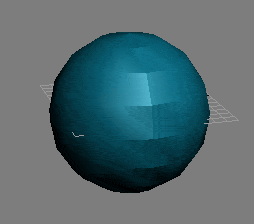

*Figure 19. All triangles belong to smoothing group 1, but some edges are not smoothed because adjacent vertices are not "welded".*

Second, when smoothing vertices, 3DS MAX compares not vertex positions but their IDs. If you select a vertex and perform a "break" operation, this vertex will be split into several vertices – one for each adjacent triangle. In this case, the edge won't be smoothed.

On the other hand, if you calculate normal maps, say, using ATI Normal Mapper, then normals and tangent space vectors need to be calculated exactly as it's done there (this is one of the reasons why ATI Normal Mapper comes with source code). If tangent space vectors are calculated differently, visible seams in lighting may appear when applying the resulting normal maps.

### **References**

1. [Notes on Developing a Geometry Export Plugin and a Bit More](http://www.gamedev.ru/community/toolcorner/articles/3d_export_stuff)

2. [ATI Normal Mapper](http://www.ati.com/developer/tools.html)

3. [Getting Data from 3ds Max](http://www.gamedev.ru/community/delphinarium/articles/getmax)

4. [Creating an Export Plugin for 3D Studio MAX](http://www.codenet.ru/progr/video/3D-Studio-Max-Export-Plugin.php)

