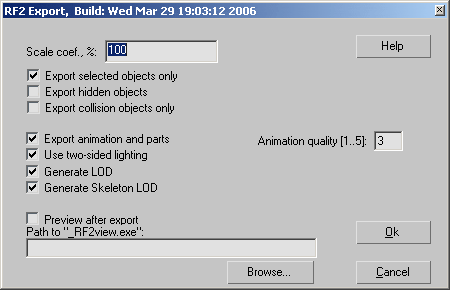
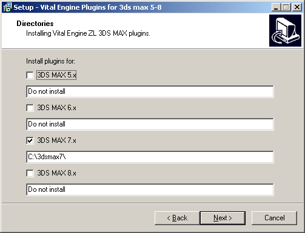

# Советы по архитектуре плагина экспорта геометрии

*Статья опубликована на сайте [gamedev.ru](http://www.gamedev.ru/community/toolcorner/articles/?id=723)*

## Введение

Если вы являетесь tool-программистом, вам неизбежно придется работать с художниками. Этот набор советов поможет сэкономить время, используя правильный подход к решению проблем. На практике, эти советы помогают сэкономить времени не меньше, чем знание всех секретов 3DS MAX.

Да – эта статья *не* обсуждает программную архитектуру плагина.

## Обработка ошибок

Если вы думаете, что сэкономили время, опустив обработку ошибок и исключительных ситуаций – то сильно ошибаетесь. Всякий раз, когда плагин "вылетает" у художника – будут звать вас. Помножьте это на количество пользователей плагина и количество раз, когда они вызывают экспорт – и вы получите full-time job по поддержке пользователей.

Плагин *никогда* не должен "вылетать", независимо от того, соблюдены требования к сцене 3DS MAX, или нет.

Также имейте в виду, что ошибка в плагине ведет к "вылету" 3DS MAX, а художник мог и не сохраниться до экспорта….

## "Правильные" сообщения об ошибках

Сообщение об ошибке "Failed !", мало чем поможет для решения проблемы, описанной выше. "Правильное" сообщение об ошибке должно содержать:

1. Описание ошибочной ситуации.
2. Причины, включая возможные, которые привели к возникновению этой ситуации.
3. Способ разрешить ошибочную ситуацию.

Многие программисты ограничиваются пунктом 1, считая, что все остальное – само собой разумеется. На самом деле, пункт 3 является наиболее важным. Не бойтесь давать длинные описания. Как известно, у художников другое мышление, и вещи, очевидные для программиста, не являются таковыми для художника.

Сообщение "Ошибка: Нод PORT_GUN не имеет родителя" – непонятно художнику, и в результате он придет к вам с претензией "У меня там плагин какую-то ошибку выдает". Открытым текстом напишите, что объект PORT_GUN должен быть прилинкован к ладони персонажа. Если это возможно, укажите главу в руководстве, в которой описано, что такое PORT_GUN, и какие к нему требования. И еще: пишите сообщения на русском языке!

## Масштабирование

Сколько бы вы не говорили, кто-нибудь обязательно сделает модель в других единицах (units), чем требуется. По этой причине в параметрах экспорта обязательно нужно сделать возможность масштабировать модель при экспорте. Это поможет сэкономить время на переделке сцены, т.к. отскейлить привязанный Biped в 3DS MAX *очень* сложно.

## Что экспортить

Сделайте возможность экспортить только часть сцены. Например, мы используем опции: "Export selected only" и "Export hidden". Кроме этого объекты, название которых начинается с "NOEXPORT_" – не экспортятся никогда. Аниматоры будут добавлять в сцену различные вспомогательные объекты, например – скамейки, столы. Заставлять их удалять эти объекты перед каждым экспортом – неразумно.

## Запоминание параметров экспорта

*Рисунок 1. Параметры экспорта автоматически выставляются в последние использованные значения.*

Если при экспорте модели нужно указывать какие-либо параметры, запоминайте последние использованные значения в user-defined свойствах max-файла (Interface->FindProperty()). При следующем экспорте все элементы управления в диалоге параметров должны содержать значения, использованные в прошлый раз. Например, через неделю вы уже можете и не вспомнить, с каким параметром Scale была отэкспорчена модель.

В идеале, нужно также выставлять и имя файла в диалоге экспорта в последнее использованное. К сожалению, 3DS MAX не предоставляет для этого стандартной функциональности, но, как обычно, желаемого можно добиться, применив знание WinAPI.

## Build number

Где-нибудь в диалоге экспорта отображайте build number, или build date/time. Это поможет сэкономить время на проверки в ситуациях, когда у художника на самом деле просто старая версия плагина.

## Installer

*Рисунок 2. Инсталлятор сам находит каталоги 3DS MAX и выставляет чекбоксы.*

Может показаться, что взять плагин из репозитория и скопировать в каталог "C:\3dsmax\plugins" – это просто. На самом деле оказывается, что художники не всегда являются грамотными пользователями.

Желательно, чтобы плагин лежал в репозитории в виде инсталлятора, который сам находит каталог 3DS MAX и устанавливает плагин. Сделать его можно, например, с помощью InnoSetup[1], с помощью встроенных паскаль-скриптов.

## Лог

После экспорта выводите диалог с логом, или хотя бы используйте OutputDebugString() во время экспорта. В лог нужно выводить сообщения о принятых решениях, например "Кость Bip 01 Finger1 пропущена – нет привязанных вершин", "Объект gun01 пропущен – нет UV координат" и т.д. Другими словами, максимизируйте свои шансы "не отходя от кассы" указать причину, почему что-то происходит не так, как задумано. Иначе вам придется просить художника переписать вам max-файл, запускать у себя под отладчиком – что займет на порядок больше времени.

Строки, выводимые OutputDebugString(), можно смотреть с помощью утилиты DbWin32 [3].

## Проверка на соответствие спецификации

Если ваш движёк накладывает определённые требования к моделям, введите возможность проверять их еще на стадии экспорта. Например, если персонаж обязательно должен содержать объекты PORT_FIRE и TAG_FRAMECENTER – это и есть спецификация для данного типа модели. Тип модели выбирается в диалоге параметров экспорта. Без этой системы неправильная модель попадает к программисту AI, который потратит время на ее проверку и возврат назад к моделеру.

Спецификация также может автоматически выставлять правильные параметры экспорта.

## Поворот сцены

Кроме единиц измерения, моделеры иногда путают ориентацию модели. Когда персонаж уже сделан, отекстурирован, привязан и анимирован, вдруг оказывается, что он должен быть направлен лицом вдоль оси Z, а не X. С большой долей вероятности вас попросят доделать поворот сцены при экспорте, потому что повернуть сцену в 3DS MAX не получается. Сопротивляйтесь! Ладно – мастшабирование, но усложнять интерфейс плагина до бесконечности – тоже плохо, так как чем больше параметров – тем больше вероятность, что они будут выставлены неправильно.

Я лучше расскажу, как поворачивать сцену в 3DS MAX. Я сам некоторое время считал, что повернуть отанимированного Biped'а невозможно. На самом деле, для этого нужно создать dummy в центре координат, прилинковать к нему все объекты, являющиеся корнями иерархий (включая Biped), и повернуть этот dummy. После поворота его можно удалить. Важным моментом является то, что к этому dummy нельзя привязывать объекты с модификатором Physique, объекты с контроллером Link Constraint, сплайны и т.д.- другими словами объекты, которые двигаются косвенно, в результате сдвига контролирующих объектов (кости, target контроллера, контрольные точки сплайна). Мой плагин SceneMainTool [2] создает такой dummy одним кликом.

## Заключение

Этот список не претендует на полноту – я бы хотел услышать подобные советы в обсуждении статьи.

## Ссылки

1. InnoSetup
   [http://www.jrsoftware.org/isinfo.php](http://www.jrsoftware.org/isinfo.php)

2. SceneMainTool plugin
   [SceneMainTool.zip](SceneMainTool.zip)

3. DbWin32
   [http://grantschenck.tripod.com/dbwinv2.htm](http://grantschenck.tripod.com/dbwinv2.htm)
