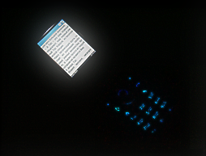

# Управление подсветкой экрана из мидлета

*Статья была опубликована на сайте dev.juga.ru, 17.05.2006*

### Введение



Думаю, что вопрос управления подсветкой интересует каждого, кто когда-либо писал мидлеты. Несмотря на это, поиск в google никаких результатов не дает. Поскольку мне пришлось подробно разбираться с этим вопросом, я хочу «пролить свет» на эту проблему в данной статье.

### Проблема стандартов

К сожалению, ни стандарт MIDP1.0, ни стандарт MIDP2.0 не регламентируют классы для управления подсветкой. Не знаю, почему консорциум проигнорировал этот вопрос, но это приводит к тому, что для управления подсветкой приходится использовать API производителей.

А это значит, что придется либо распространять разные версии мидлетов для разных моделей телефонов, либо написать универсальный класс, который будет определять наличие определенного API автоматически.

О создании такого класса и пойдет речь в этой статье.

## API производителей

### Nokia UI API

Управление подсветкой на телефонах Nokia осуществляется с помощью методов класса DeviceControl:

```java
import com.nokia.mid.ui.DeviceControl;

DeviceControl.setLights(0,100); //регион (0-экран), яркость (0..100)
DeviceControl.setLights(0,0);
```

Этот метод позволяет регулировать яркость подсветки в диапазоне от 0 до 100, если телефон поддерживает такую возможность. Здесь следует заметить, что при включении средней яркости, экраны некоторых телефонов (например, 3200) начинают неприятно мигать (около 40 Гц). Nokia UI API содержится не только в телефонах Nokia, но и в некоторых моделях других производителей, например SonyErricsson (хотя это часто недокументированно).

### Siemens Game API

Контроль подсветки на телефонах Siemens осуществляется методами:

```java
import com.siemens.mp.game.Light;

Light.setLightOn();
Light.setLightOff();
```

Этот класс присутствует во всех телефонах Siemens, включая последнюю 75 серию (хотя это и не документировано).

### Motorola Backlight и FunLights API

Во всех телефонах Motorola (кроме A760/A780) есть BackLight API:

```java
import com.motorola.multimedia.Lighting;

com.motorola.multimedia.Lighting.backlightOn();
com.motorola.multimedia.Lighting.backlightOff();
```

Кроме этого, в некоторых моделях присутствует Funlights API, который кроме подсветки экрана, позволяет управлять и другими индикаторами (об этом позже):

```java
import com.motorola.funlight.*;

FunLight.getRegion(1).setColor(c); //цвет RGB
```

Причем в телефоне могут присутствовать одновременно и Backlight API, и FunLights API, и MIDP2.0 Display API. Как ведет себя подсветка при одновременном использовании всех этих API – вопрос малоизученный 🙂 Я рекомендую использовать один из них, в следующем порядке приоритетов: FunLight, Backlight, MIDP2.0.

### Samsung LCDLight API

На телефонах Samsung необходимо использовать LCDLight API:

```java
import com.samsung.util.LCDLight;

com.samsung.util.LCDLight.on(0x0fffffff); //время в мс
com.samsung.util.LCDLight.off();
```

### LG Backlight API

Телефоны LG содержат LG Backlight API:

```java
import mmpp.media.BackLight;

mmpp.media.BackLight.on(0x0fffffff); //время в мс
mmpp.media.BackLight.off();
```

Этот API также позволяет регулировать цвет подсветки (точнее устанавливать один из набора цветов, и только если это поддерживается телефоном).

### MIDP2.0 Display API

Стандарт MIDP2.0 регламентирует метод flashBacklight:

```java
import javax.microedition.lcdui.Display;

javax.microedition.lcdui.Display.getDisplay(midlet).flashBacklight(0x7fffffff); //время в мс
javax.microedition.lcdui.Display.getDisplay(midlet).flashBacklight(0);
```

К сожалению, он расплывчато описывается как «создать визуальный эффект», что можно понять как «включить подсветку на указанный промежуток времени» и «мигать подсветкой в течение указанного периода времени».

Соответственно, поведение этого метода на разных моделях телефонов отличается, причем может отличаться в эмуляторе и на реальном телефоне. Как показывает практика, идея создать поток и периодически вызывать из него flashBacklight(), чтобы избежать мигания – не работает.

Это наименее надежный способ управлять подсветкой, поэтому его нужно использовать в самую последнюю очередь – если нет других API. Причем в таком случае управление подсветкой обязательно должно быть отключаемым в меню мидлета (иначе вместо подсветки можно получить постоянно мигающий экран).

### API других производителей

Насколько мне известно, Vodaphone и Sharp тоже предоставляют свои API. К сожалению, мне не удалось достать их SDK.

### Взаимодействие с прошивкой телефона

Следует заметить, что не на всех телефонах мидлет управляет подсветкой эксклюзивно. Например, на телефонах Siemens, даже при выключении подсветки из мидлета, прошивка все равно включает подсветку при нажатии кнопок телефона, если такая опция установлена в его настройках.

## Управление индикаторами


Некоторые модели телефонов Motorola позволяют отдельно управлять подсветкой клавиатуры и области джойстика с помощью FunLight API:

```java
FunLight.getRegion(n).setColor(c); //регион n, цвет RGB
```

Номера регионов различны для разных моделей. Я рекомендую выключать регионы 2 и 3, так как 1 – это всегда подсветка экрана. Некоторые модели телефонов позволяют управлять боковыми индикаторами телефонов: 1) Motorola FinLight API;

```java
FunLight.getRegion(n).setColor(c); //регион n, цвет RGB
```

2) Siemens M55:

```java
com.siemens.mp.m55.Ledcontrol.switchOn();
com.siemens.mp.m55.Ledcontrol.switchOff();
```

3) LG LED API:

```java
mmpp.media.LED.setColor(c); //цвет RGB
```

4) Nokia UI API тоже принимает номер региона, но мне не известен ни один телефон, который это поддерживает. Имеет смысл выключать подсветку клавиатуры и все индикаторы, чтобы уменьшить разряд батареи и убрать отвлекающий свет.

### Универсальный класс для управления подсветкой.

Просуммировав все API, я пришел к выводу, что класс TLightController должен иметь следующие методы:

1. запрос о возможности управления подсветкой в целом;
2. запрос о возможности управления яркостью;
3. метод установки яркости подсветки (0 – выключение подсветки);

Если на данной модели телефона невозможно управлять подсветкой или ее яркостью, то соответствующий пункт меню в мидлета должен отсутствовать.

Наличие каждого API определяется автоматически с помощью вызова class.ForName().

С методом Display.flashBacklight() несколько сложнее. Класс Display есть и в MIDP1.0, и в MIDP2.0, но в MIDP1.0 этот метод класса отсутствует. Есть несколько способов проверить:

1. просто попытаться вызвать метод и перехватить исключение "No such method". К сожалению, это редко работает, так как такое исключение обычно приводит к закрытию мидлета, либо вообще к отказу установки мидлета;

2. анализировать строку getAppProperty("microedition.profiles"). Некоторые телефоны могут возвращать null, конфигурацию, указанную в атрибуте "MicroEdition-Profile: MIDP-1.0" в JAD файле, или даже строку в неизвестном формате.

Метод 2 является более безопасным, и поэтому именно он используется в классе. С другой стороны, если вы поставляете мидлет в отдельных версиях для MIDP1.0 и MIDP2.0 телефонов, лучше включать/отключать метод Display.flashBacklight() в разных версиях с помощью препроцессора (я использую препроцессор JEnable [2])

Для повышения надежности для управления подсветкой создается отдельный поток. Это нужно потому, что некоторые телефоны все равно гасят подсветку через некоторое время, если не вызывать методы включения.

Для отключения подсветки клавиатуры на Motorola наоборот нужно периодически (каждые 100 мс) вызывать метод выключения. Полный исходный код класса приведен ниже.

```java
//*******************************************************************************
//*******************************************************************************
// Universal backlight control class
// Copyright © 2006 by Roman Lut
// Free for any use. Please mention me in "About" box 
//*******************************************************************************
//*******************************************************************************

/*
Singleton. Reference with TLightController.GetInstance()
Default state is ENABLE.

Query TLightController.GetInstance(midlet).CanControl() to see whether class is able to control backlight.
Query TLightController.GetInstance(midlet).CanControlBrightness() to see whether class is able to control brightness.
Use TLightController.GetInstance(midlet).SetBrightness(brightness) to control backlight brightness.
brightness is 0 (minimum) to 255 (maximum);
*/

import javax.microedition.midlet.*;
import com.siemens.mp.game.Light;
import com.nokia.mid.ui.DeviceControl;
import com.motorola.multimedia.Lighting;
import com.motorola.funlight.*;
import javax.microedition.lcdui.Display;
import java.util.Timer;
import java.util.TimerTask;
import com.samsung.util.LCDLight;
import mmpp.media.BackLight;

//=============================================
// TLightController
//=============================================
public class TLightController extends TimerTask
{
  //light control method
  private static final byte LIGHT_NONE       = 0;
  private static final byte LIGHT_SIEMENS    = 1;
  private static final byte LIGHT_NOKIA      = 2;
  private static final byte LIGHT_MOTOROLA_LIGHT = 3;
  private static final byte LIGHT_MOTOROLA_FUNLIGHT = 4;
  private static final byte LIGHT_SAMSUNG    = 5;
  private static final byte LIGHT_LG         = 6;
  private static final byte LIGHT_MIDP20     = 7;

  private byte method;
  private static TLightController inst = null;

  private Region r1,r2,r3;
  Timer funLightsTimer;

  //---- for timertask -----
  private static MIDlet midlet;
  private static int curBrightness;
  //------------------------

  //============================
  // void ApplyState()
  //============================
  private final void ApplyState()
  {
    switch (method)
    {
      case LIGHT_SIEMENS:
      {
        if (curBrightness>0)
        {
          Light.setLightOn();
        }
        else
        {
          Light.setLightOff();
        }
      }
      break;

      case LIGHT_NOKIA:
      {
        DeviceControl.setLights(0,curBrightness*100/255);
      }
      break;

      case LIGHT_MOTOROLA_LIGHT:
        if (curBrightness>0)
        {
          com.motorola.multimedia.Lighting.backlightOn();
        }
        else
        {
          com.motorola.multimedia.Lighting.backlightOff();
        }
      break;

      case LIGHT_MOTOROLA_FUNLIGHT:
        int c = curBrightness + (curBrightness << 8) + (curBrightness << 16);
        FunLight.getRegion(1).setColor(c);
        r1.setColor(0);
        r2.setColor(0);
        r3.setColor(0);
      break;

      case LIGHT_SAMSUNG:
        if (curBrightness>0)
        {
          com.samsung.util.LCDLight.on(0x0fffffff); // max 60 seconds ?
        }
        else
        {
          com.samsung.util.LCDLight.off();
        }
      break;

      case LIGHT_LG:
        if (curBrightness>0)
        {
          mmpp.media.BackLight.on(0x0fffffff);
        }
        else
        {
          mmpp.media.BackLight.off();
        }
      break;
//#MIDP20{
      case LIGHT_MIDP20:
        if (curBrightness>0)
        {
          javax.microedition.lcdui.Display.getDisplay(midlet).flashBacklight(0x7fffffff);
        }
        else
        {
          javax.microedition.lcdui.Display.getDisplay(midlet).flashBacklight(0);
        }
      break;
//#MIDP20}
    }
  }

  //============================
  // run() (timer task)
  //============================
  public final void run()
  {
    ApplyState();
  }

  //=============================================
  // public TLightController()
  //=============================================
  private TLightController(MIDlet midlet)
  {
    curBrightness=(byte)255;
    this.midlet=midlet;

//#DEBUG{
//#DEBUG:  System.out.println("Initializing light controller");
//#DEBUG}

    method = LIGHT_NONE;

    try
    {
      Class.forName("com.siemens.mp.game.Light");
//#DEBUG{
//#DEBUG:   System.out.println("Using com.siemens.mp.game.Light");
//#DEBUG}
      method = LIGHT_SIEMENS;
    }
    catch (Exception e)
    {

    try
    {
      Class.forName("com.nokia.mid.ui.DeviceControl");
//#DEBUG{
//#DEBUG:   System.out.println("Using com.nokia.mid.ui.DeviceControl");
//#DEBUG}
      method = LIGHT_NOKIA;
    }
    catch (Exception e3)
    {

    try
    {
      Class.forName("com.motorola.funlight.FunLight");
//#DEBUG{
//#DEBUG:   System.out.println("Using com.motorola.multimedia.FunLight");
//#DEBUG}
      method = LIGHT_MOTOROLA_FUNLIGHT;
    }

    catch (Exception e1)
    {

    try
    {
      Class.forName("com.motorola.multimedia.Lighting");
//#DEBUG{
//#DEBUG:   System.out.println("Using com.motorola.multimedia.Lighting");
//#DEBUG}
      method = LIGHT_MOTOROLA_LIGHT;
    }
    catch (Exception e2)
    {

    try
    {
      Class.forName("com.samsung.util.LCDLight");

      if (LCDLight.isSupported()==false)
      {

//#DEBUG{
//#DEBUG:   System.out.println("LCDLight present, but not supported");
//#DEBUG}
        throw new Exception();
      }
//#DEBUG{
//#DEBUG:   System.out.println("Using com.samsung.LCDLight");
//#DEBUG}

      method = LIGHT_SAMSUNG;
    }
    catch (Exception e4)
    {

    try
    {
      Class.forName("mmpp.media.BackLight");

//#DEBUG{
//#DEBUG:   System.out.println("mmpp.media.BackLight");
//#DEBUG}

      method = LIGHT_LG;
    }
    catch (Exception e5)
    {

//#MIDP20{

      if (System.getProperty("microedition.profiles").indexOf("2.0")>0)
      {
//#DEBUG{
//#DEBUG:   System.out.println("javax.microedition.lcdui.Display");
//#DEBUG}
        method = LIGHT_MIDP20;
      }
//#MIDP20}

    }
    }
    }
    }
    }
    }

    if (method == LIGHT_MOTOROLA_FUNLIGHT)
    {
      FunLight.getControl();
      r1 = FunLight.getRegion(2);
      r2 = FunLight.getRegion(3);
      r3 = FunLight.getRegion(4);

      funLightsTimer = new Timer();
      funLightsTimer.scheduleAtFixedRate(this,0,100);
    }
    else
    {
      funLightsTimer = new Timer();
      funLightsTimer.scheduleAtFixedRate(this,0,3000);
    }
    ApplyState();
  }

  //=============================================
  //GetInstance()
  //=============================================
  public static TLightController GetInstance(MIDlet midlet)
  {
    if (inst==null) inst = new TLightController(midlet);
    return inst;
  }

  //=============================================
  //public boolean CanControl()
  //=============================================
  public boolean CanControl()
  {
    return method!=LIGHT_NONE;
  }

  //=============================================
  //public boolean CanControlBrightness()
  //=============================================
  public boolean CanControlBrightness()
  {
    return (method==LIGHT_NOKIA) || (method==LIGHT_MOTOROLA_FUNLIGHT);
  }

  //=============================================
  //public void SetBrightness()
  //=============================================
  public void SetBrightness(int brightness)
  {
    if (curBrightness == brightness) return;
    curBrightness = brightness;
    ApplyState();
  }
}
```

### Что нужно для компиляции класса

Для компиляции этого класса вам потребуются API-классы от всех производителей, которые необходимо распаковать из библиотек SDK и положить в отдельный LightAPIs.jar, который нужно указать в classpath.

1) Nokia UI API:

Вам понадобятся файлы:

```
com\nokia\mid\ui\DeviceControl$VibraTimerClient.class
com\nokia\mid\ui\DeviceControl$LightTimerClient.class
com\nokia\mid\ui\DeviceControl.class
```

Которые можно найти, например, в файле lib\classes.zip из Nokia 3300 SDK (или в любом другом SDK Nokia) [3]. 2) Siemens Game API Файл:

```
com\siemens\mp\game\Light.class
```

можно найти в файле lib\api.jar в любом эмуляторе телефона 55 серии, или C60 [4]. 3) Motorola Backlight и Funlights APIs Файлы:

```
com\motorola\funlight\Factory.class
com\motorola\funlight\FunLight.class
com\motorola\funlight\FunLightException.class
com\motorola\funlight\Region.class
com\motorola\funlight\Region_Blank.class
com\motorola\funlight\Region_Impl.class
com\motorola\mutimedia\lighting.class
```

находятся в файле "\emulator A.1\lib\javaextensions.jar" из Motorola SDK 5.2.1 [5]. 4) Samsung LCDLights API Файл:

```
com\samsung\util\LCDLight.class
```

находится в архиве lib\midpapi.zip из пакета Samsung WTK 2.0 [6]. 5) LG BackLight API Файл:

```
mmpp\media\BackLight.class
```

находится в архиве

classes.zip

из LG Java Station SDK [7].

ПОЖАЛУЙСТА не просите меня выслать эти классы, т.к. это является нарушением лицензионных соглашений к SDK.

Если у вас нет желания скачивать все SDK, можно взять откомпилированный TLightControler в виде готового .class файла из мидлета-примера[1].

### Где это не работает

К сожалению, реализация такого класса принципиально невозможно на телефонах, на которых не работает class.forName().

Некоторые телефоны анализируют классы мидлета во время установки, и если мидлет подключает (import) библиотеки, которых нет в телефоне, мидлет не устанавливается. Это не соответствует стандарту, но является реальностью, в частности для моделей Motorola C370/C450/C550, Samsung C100, и, возможно, для других моделей, которые я не знаю.

### Ссылки

1. Исходный код класса TLightController, пример, бинарные файлы
   [http://www.deep-shadows.com/hax/downloads/BacklightControl.zip](https://web.archive.org/web/20180303115709/http://www.deep-shadows.com/hax/downloads/BacklightControl.zip)
2. Препроцессор JEnable
   [http://www.sosnoski.com/opensrc/jenable/](https://web.archive.org/web/20180303115709/http://www.sosnoski.com/opensrc/jenable/)
3. Forum Nokia
   [http://forum.nokia.com/](https://web.archive.org/web/20180303115709/http://forum.nokia.com/)

4. BenQ Mobile developer section (Siemens Developer Portal)
   [http://www.benqmobile.com/developer](https://web.archive.org/web/20180303115709/http://www.benqmobile.com/developer)

5. Motocoder.com
   [http://developer.motorola.com/](https://web.archive.org/web/20180303115709/http://developer.motorola.com/)

6. Samsung Developers Club
   [http://developer.samsungmobile.com/](https://web.archive.org/web/20180303115709/http://developer.samsungmobile.com/)

7. LG Developer portal
   [http://java.ez-i.co.kr/wire/list.asp?code=java_mqa&skey=&sel_key=&page=5](https://web.archive.org/web/20180303115709/http://java.ez-i.co.kr/wire/list.asp?code=java_mqa&skey=&sel_key=&page=5)
   Сайт на корейском языке, придется регистрироваться методом проб и ошибок.
   Проще скачать по другим ссылкам:
   [http://lgfiles.net/portal/modules/files/showfile.php?lid=17](https://web.archive.org/web/20180303115709/http://lgfiles.net/portal/modules/files/showfile.php?lid=17)
   [http://www.mobilelab.co.kr/programming/up/data_j2me/lgtjavastationsdk101_2.zip](https://web.archive.org/web/20180303115709/http://www.mobilelab.co.kr/programming/up/data_j2me/lgtjavastationsdk101_2.zip)
