# То, что вам никто не говорил о многозадачности в Windows.

*Статья опубликована на сайте [dtf.ru](https://web.archive.org/web/20071021090052/http://dtf.ru/articles/read.php?id=39888) 17.05.2006*

## **Многозадачность – это просто?**

Когда я только начинал разрабатывать многопоточные приложения, мои мысли были просты и прямолинейны: нужно просто создать второй поток, и выполнять в нем какую-либо работу. Потоки будут выполняться одновременно, все сложности на себя берет операционная система, мне только остается воспользоваться несколькими функциями WinAPI.

К сожалению, реально дела обстоят не так просто, и особенно когда это касается real-time приложений (которыми являются компьютерные игры). Чтобы это понять, мне пришлось пройти долгий путь от недоумения (почему все работает нет так, как должно?) к более-и-менее ясному представлению о том, как на самом деле реализована многозадачность в Windows.

В этой статье я готов поделиться добытой информацией, разоблачить некоторые распространенные заблуждения, наглядно показать изложенные принципы и, в тоже время, не претендуя на полную достоверность, услышать другие мнения.

Основная цель исследования фокусируется на возможности использования многопоточности в играх, и, в частности, в DirectX приложениях. Второй поток предполагается использовать для фоновой загрузки уровней с диска, но забирая не более 10% процессорного времени у основного потока (при запуске фоновых задач FPS не должен значительно падать).

### **О чем НЕ будет идти речь в этой статье**

Я не буду рассказывать, почему важна синхронизация между потоками. Я не буду описывать функции и объекты WinAPI, используемые в многопоточных программах. Я даже не буду описывать, какие алгоритмы и шаблоны следует применять в многопоточных приложениях. На эти темы есть масса статей, а я хочу дать ответы на те вопросы, на которые найти ответ очень трудно – нюансы, которые часто сводят на нет всю архитектуру приложения.

***Примечание.*** *Термины. Поток – thread. Многопоточность – multithreading. Многозадачность – multitasking.*

## **Часть первая. Принципы работы многозадачности.**

### **Начнем с заблуждений. Заблуждение первое – потоки выполняются одновременно.**

Если вы хоть чуть-чуть знакомы с аппаратной частью и языком ассемблера, то знаете, что процессор изначально рассчитан на исполнение только одного потока команд. У него есть только один регистр-указатель выборки команд и один набор регистров общего назначения.

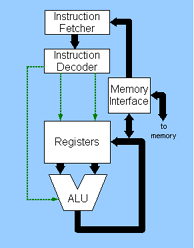

*Рисунок 1. Упрощенная схема процессора.*

Процессор не может физически выполнять несколько потоков одновременно (о HyperThreading и DualCore мы поговорим в третьей части статьи. Начнем с простого – с обычного процессора). На самом деле, иллюзию одновременного исполнения для нас создает операционная система.

Есть два основных способа организовать многозадачную ОС:

**1.** Приложения строятся на основе потока сообщений окна. Каждое приложение обязано в цикле вызывать функцию операционной системы PeekMessage(). Операционная система делает возврат из функции – выдает сообщение (в том числе idle-сообщения) – последовательно всем приложениям по очереди.

Пока приложение не завершит обработку сообщения и не вызовет PeekMessage(), ни операционная система, ни другие приложения не выполняются. Таким образом, «переключение» между потоками реально осуществляется функцией PeekMessage() операционной системы.

Очевидным недостатком является то, что операционной системой никак не контролируется количество процессорного времени, использованного приложением. Как только одно из приложений «зависает» и не вызывает функцию PeekMessage(), перестают работать все остальные приложения, включая операционную систему. Остается только сделать Reset. Понятно, что о «одновременном исполнении потоков» здесь говорить не приходится.

Несмотря на существенные недостатки, благодаря простоте реализации такая система часто применяется в операционных системах для портативных устройств, например – PalmOS.

**2.** В серьезных ОС используется так называемая «вытесняющая многозадачность».

При инициализации, ядро операционной системы настраивает таймер для вызова аппаратного прерывания через определенные промежутки времени (quantum). В обработчике аппаратного прерывания ОС может сохранить полное состояние процессора (регистры), восстановить состояние для другого потока, и передать ему управление. Поток не обязан вызывать какие-либо функции, и даже может исполнять бесконечный цикл – операционная система все равно прервет исполнение, и выделит другому потоку некоторое количество процессорного времени (называемое "time slice").

Налицо преимущества: зависание одного потока не приводит к зависанию других потоков и операционной системы. Операционная система даже может в любой момент уничтожить поток, который посчитает «зависшим».

Нюансом здесь является период времени вызова аппаратного прерывания (quantum) и количество времени, выделяемого каждому потоку (time slice). Этой информации вы не найдете ни в одной документации, и тому есть причина: Microsoft Windows не претендует на звание "Real-time OS". Просто гарантируется, что все будет нормально работать для обычных (читай: офисных) приложений.

Эти временные промежутки отличаются в разных версиях Windows, и для Windows XP составляют quantum=10ms, time slice = 130ms (!). Здесь разработчик игр уже должен насторожиться, т.к. при 50 FPS длина кадра составляет 20ms.

***Примечание.*** *Вопреки распространенному заблуждению, Windows 95/98 построены именно по второй схеме. Просто в этих системах есть масса объектов, требующих эксклюзивного доступа (наследие ДОС), и если поток «зависает», захватив и не освободив один такой объект, то никакая вытесняющая многозадачность не поможет предотвратить зависание других потоков и всей системы в целом.*

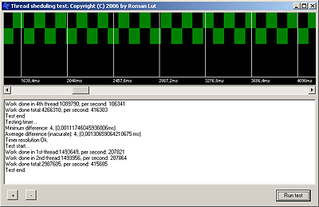

*Рисунок 2. Приложение ThreadTest.*

Для экспериментов я написал специальное приложение (исходные коды прилагаются к статье). Оно содержит набор тестов, иллюстрирующих приведенные утверждения.

Завершите все лишние приложения, и запустите Тест №1.

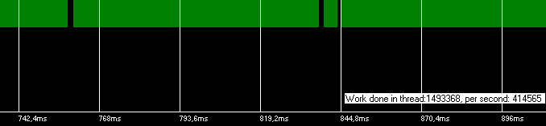

*Рисунок 3. Тест №1. Один поток (основной поток приложения) в цикле вычисляет обратную матрицу 4×4, при этом в специальный массив записывая отсчеты времени (но не чаще 10 микросекунд). Выводя отсчеты на timeline, мы можем отчетливо видеть, когда поток выполнялся, а когда простаивал, прерванный операционной системой. В результате также выводится общее количество вычисленных обратных матриц, и скорость матриц/сек (нас интересует именно последнее).*

У вас должно получиться, как показано на рисунке. Поток выполнялся практически непрерывно, изредка прерываясь операционной системой на выполнение служебных задач и других потоков (здесь мы также можем заметить, что промежутки между перерывами равны примерно 10ms, то есть quantum).

***Примечание.*** *Для выполнения тестов следует использовать компьютер с одним процессором, без технологии HT, или выключить HT в BIOS.*

Здесь у неопытного программиста сразу может возникнуть вопрос: но ведь наш поток – не единственный, в системе их множество. Судя по графику, наш поток выполнялся практически непрерывно. Получается, остальные потоки не работают?

Дело в том, что у остальных потоков нет работы, и они, быстро проверив несколько флагов, отдают свое процессорное время, используя функции Sleep(), WaitForObject() и т.д. Соответственно, перебрав все потоки, ОС переключается обратно на наш поток. Этим и объясняются небольшие пробелы в выполнении нашего потока. Эта концепция является основополагающей в Windows, что позволяет запускать большое количество фоновых потоков без видимого влияния на производительность приложений.

Для сравнения, запустите архиватор WinRar запаковывать большой файл, и повторите Тест №1.

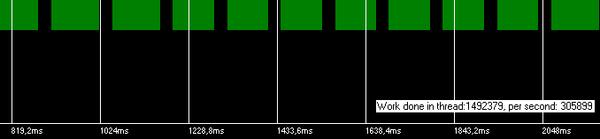

*Рисунок 4. Работа потока, если на фоне запущен WinRar.*

На этот раз мы можем наблюдать значительные пробелы в работе потока. Он периодически прерывается на 130ms (time slice) – очевидно, свое процессорное время использует WinRar. Соответственно, наше приложение снизило скорость выполнения «полезной» работы (вычисление матриц) на 25%.

Наше приложение получает в 3 раза больше времени, т.к. его окно является активным. Если запустить тест, и быстро переключиться на WinRar, картина меняется на противоположную:

*Рисунок 5. Работа потока фонового приложения.*

Теперь очевидна потребность закрывать другие приложения при запуске 3D игр – многие из них могут быть не настолько любезны, и могут не всегда быстро отдавать свое процессорное время (как известно – ICQ – враг плавного FPS).

Мы можем наглядно увидеть работу потоков, запустив тесты 2 (два потока с нормальным приоритетом) и 3(4 потока с нормальным приоритетом).

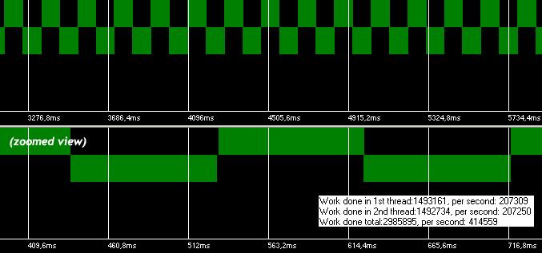

*Рисунок 6. Тест №2. Два потока с нормальным приоритетом.*

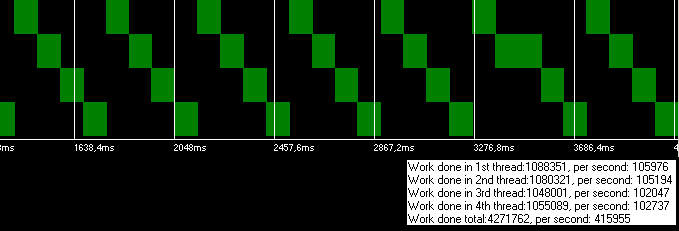

*Рисунок 7. Тест №3. Четыре потока с нормальным приоритетом.*

Здесь следует отметить, что сумма скоростей выполнения «полезной» работы равна скорости работы одного потока. Тут все понятно – как ни крути – процессор то у нас один!

### **Заблуждение второе. Приоритет потока влияет на длину timeslice.**

Из теста №2 можно сделать вывод, что, запустив второй поток, выполняющий какую-либо работу, мы тем самым снижаем производительность основного потока приложения ровно вдвое. Это значит, что, открыв второй поток, мы наполовину снизим FPS. А нам хотелось бы, чтобы второй поток не спеша выполнял какую-то фоновую задачу (например, фоновую загрузку уровня), забирая не больше 10% производительности.

Казалось бы, очевидное решение – установить второму потоку приоритет ниже, чем у основного. Хорошо – давайте выполним тест №4.

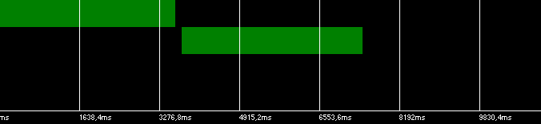

*Рисунок 8. Тест №4. Основной поток с нормальным приоритетом, второй – ниже нормального.*

Что же мы видим? Приоритет не влияет на длину time slice. Он даже не влияет на то, насколько часто второй поток получает time slice (как многие думают). На самом деле, WINDOWS НЕ БУДЕТ ВЫПОЛНЯТЬ ПОТОК С НИЗКИМ ПРИОРИТЕТОМ, ПОКА ЕСТЬ ГОТОВЫЕ К ВЫПОЛНЕНИЮ ПОТОКИ С БОЛЕЕ ВЫСОКИМ ПРИОРИТЕТОМ. Второй поток вообще не получил процессорного времени, пока первый поток не вышел из цикла.

Все становится на свои места, если четко понимать, как работает планировщик потоков (scheduler) Microsoft Windows.

Планировщик потоков содержит очереди потоков, готовых к выполнению. Для каждого приоритета – своя очередь. Когда поток готов к выполнению (ready for execution) – то есть не находится внутри Sleep() или WaitForObject() – система помещает его в очередь потоков соответствующего приоритета. Планировщик просматривает все очереди, начиная с самого высокого приоритета. Как только находит непустую очередь, он выдает один time slice первому потоку, перемещает его в конец очереди, и начинает просмотр сначала. Планировщик даже не будет просматривать очереди с меньшим приоритетом, пока есть непустые очереди с большим приоритетом.

Такое поведение планировщика приводит к тому, что при "зависании" потока с высоким (HIGH) приоритетом система "замораживается", с большим трудом реагируя на CTRL+ALT+DEL. Для решения подобных проблем есть сторонние программы [10], понижающие приоритет агрессивных процессов.

### **Заблуждение третье. Sleep(1) всегда занимает 1 ms.**

Ну не получилось. Но мы не сдаемся! Мы лезем в MSDN и находим замечательную функцию Sleep(). По идее, вызывая Sleep(1) между кадрами, мы сможем запускать второй поток на 1ms, т.к. текущий поток перестает быть ready for execution, исчезает из очереди, и планировщик может перейти к очереди с более низким приоритетом.

Но, поскольку мы уже знаем, как работает вытесняющая многозадачность, становится понятно, что, запустив второй поток, планировщик не вернет управление в основной поток, пока не возникнет аппаратное прерывание. А оно возникает, как мы уже видели, каждые 10 ms. Это значит, что Sleep(1) может занять 1ms, а может и 10 – как повезет [4]. При времени кадра 20ms, это вовсе не 10%, а 1% – 50%. В результате мы получим крайне нестабильный FPS.

***Примечание.*** *Планировщик может получить управление не только в результате аппаратного прерывания, но и при вызове выполняемым потоком функций Sleep(), WaitForObject().*

***Примечание.*** *Если ваше приложение в системе – не единственное активное, может пройти очень много времени, пока управление вернется в вызвавший поток после истечения периода Sleep(). Да, система поставит поток в очередь, по крайней мере, через 10 ms, но она поставит его в конец очереди. На самом деле система гарантирует, что Sleep(1) займет НЕ МЕНЬШЕ 1ms, а верхний предел не лимитируется.*

Функция Sleep() позволяет передавать 0 (ноль), и при этом ее поведение описывается как «отдать остаток time slice" другим процессам. Для интереса посмотрим, можем ли мы отдать остаток time slice потоку с меньшим приоритетом.

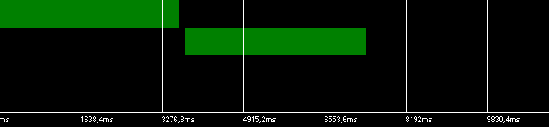

*Рисунок 9. Тест №5. Основной поток с нормальным приоритетом, второй поток – ниже нормального. Основной поток вызывает Sleep(0).*

Нет, картина не изменилась. Второй поток не выполняется, пока основной находится в цикле. Это объясняется следующим: Sleep(0) готов отдать остаток времени, но, поскольку эта функция не убирает поток из очереди, он (единственный) там все еще находится, и Sleep(0) немедленно возвращает управление в тот же поток.

Согласно утверждению, с помощью Sleep(0) можно отдать time slice только потоку с таким же приоритетом, что и подтверждает тест №6.

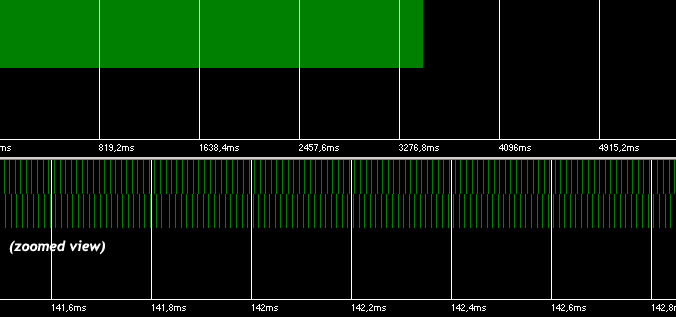

*Рисунок 10. Тест №6. Два потока с нормальным приоритетом, оба вызывают Sleep(0).*

В результате мы видим мнимое параллельное выполнение (на самом деле очень быстрое переключение). Только вот скорость выполнения «полезной» работы снизилась – из-за того, что процессор 50% времени занимается переключением потоков.

Здесь следует оговориться, что через некоторое время, когда система поймет, что поток с низким приоритетом совсем не получает процессорное время из-за того, что есть агрессивные потоки с высоким приоритетом(CPU time starvation detection), планировщик все же будет чуть-чуть выделять время этому потоку. Чтобы он начал это делать, должен пройти некоторый период времени, который равен примерно 5 сек.

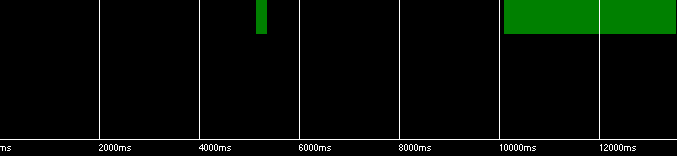

*Рисунок 11. Тест №7. Основной поток с нормальным приоритетом, второй поток – ниже нормального (на графике показан только второй поток). Через 5 сек второй поток получил time slice. Второй поток начал нормально выполняться после завершения основного (через 10 секунд).*

Этим объясняется тот факт, что открыв второй поток с idle приоритетом в DirectX приложении, не засыпающем ни на миллисекунду в попытках выдать наибольший FPS, второй поток вроде бы работает, но о-о-очень медленно.

Но мы отклонились от темы – нам необходимо выполнять второй поток, используя примерно 10% процессорного времени. Исходя из описанных правил, получается, что такое можно устроить, только создав два потока с одинаковым приоритетом, причем второй поток должен самостоятельно контролировать количество своего процессорного времени, периодически вызывая Sleep(n).

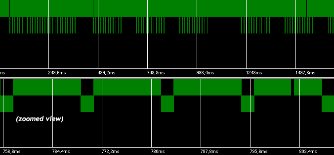

*Рисунок 12. Тест №8. Два потока с нормальным приоритетом. Второй поток работает 2 ms, и вызывает Sleep(10).*

Мы вроде бы добились, чего хотели – второй поток занимает примерно 10% процессорного времени. Но для того, чтобы вызывать Sleep(10) во втором потоке, в этом потоке должен выполнятся специально измененный для этого алгоритм, контролирующий процессорное время, а нам нужно выполнять обычные задачи. И вообще – если бы мы могли изменить алгоритм указанным образом, то могли бы обойтись вообще без потоков, просто вызывая 2ms функции между кадрами.

Нам принципиально мешает большой quantum – можно ли его уменьшить?

### **Поверье четвертое. timeBeginPeriod() предназначена для изменения разрешения таймеров.**

Если прочитать описание функции timeBeginPeriod() в MSDN, то ни за что не догадаться, что на самом деле она изменяет quantum.

Функция timeBeginPeriod(1) призвана повысить разрешение multimedia и waitable timers до 1ms. На самом деле, таймеры обрабатываются планировщиком, и их события не могут возникнуть чаще, чем планировщик получает управление. Понижая quantum до 1ms, мы позволяем планировщику более точно вызывать события таймера.

***Примечание.*** *Если вы прилежно выполняли предыдущие тесты, но у вас получались другие результаты – то либо у вас включен HT, либо запущено другое приложение, которое вызвало timeBeginPeriod(1).*

Ну что же, пора ставить эксперимент.

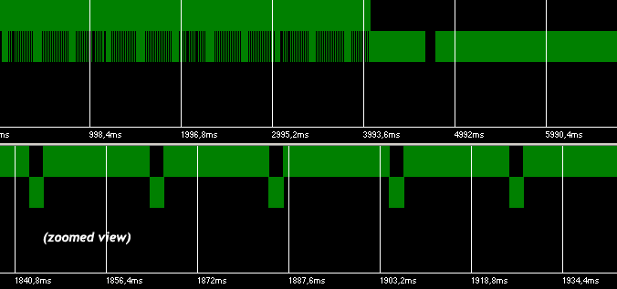

*Рисунок 13. Тест №9. Основной поток с нормальным приоритетом, второй поток – ниже нормального. Основной поток вызывает Sleep(2) каждые 20ms, чтобы выполнять второй поток. Используется timeBeginPeriod(1).*

Наконец-то мы добились, чего требовалось – во втором потоке выполняется не модифицированный алгоритм, и он забирает не больше 10% процессорного времени.

### **Результат**

Собственно, к примерно такой архитектуре мы и пришли при создании игры «Xenus: Точка кипения». К сожалению, задача не решена до конца. При выполнении реальной работы во втором потоке, мы сбрасываем кеш процессора, вызываем перераспределение страниц памяти, захватываем объекты, требуемые первому потоку, и, что еще хуже, вызываем свопинг. Это приводит к тому, что при фоновой загрузке уровня FPS становится нестабильным, с непрогнозируемыми задержками на 1-10 мс, что значительно снижает комфорт игры.

Также необходимо понимать тот факт, что, поскольку поток использует всего 10% процессорного времени, то реальная работа в нем выполняется в 10 раз медленнее. Это значит, что если в основном потоке уровень загружается 1 сек, то во втором это же займет 10 сек.

С многозадачностью в Windows есть еще много нюансов, включающих повышение приоритета потока (priority boost) при его создании или с целью наискорейшего освобождения объекта синхронизации, задержку при создании нового потока (thread creation timeout, примерно 100ms), тайминги восстановления работы потока при освобождении ожидаемого объекта синхронизации, сценарий поведения при борьбе за захват объектов синхронизации (race conditions) и т.д. Обо всем этом можно почитать в статьях, ссылки на которые прилагаются.

Вторая часть статьи: [Многопоточность в DirectX приложениях](http://localhost:8080/?page_id=622)

### **Примечания.**

В качестве однопроцессорной системы в статье была использована:

AMD Athlon XP 2.5GHz
nVidia nForce2 chipset
1,5GB RAM 400MHz
Radeon 9600 PRO

В качестве системы с HyperThreading была использована:

Intel Pentium 2,8 GHz
ABIT AA8XE
ATI X1600
1GB RAM DDR II

В качестве двуядерной системы была использована:

Intel Pentium D Smithfield 2.67GHz
Asus P5LD2-VM
Intel GMA
1GB RAM DDR 533MHz

### **Ссылки**

1. [Multitasking Discussion](http://www.wideman-one.com/gw/tech/dataacq/multitasking.htm)

2. [Timers tutorial](http://www.codeproject.com/system/timers_intro.asp)

3. [Time is the Simplest Thing…](http://www.codeproject.com/system/simpletime.asp)

4. [Quantifying The Accuracy Of Sleep](http://www.codeproject.com/system/sleepstudy.asp) (похвальное усердие при тестировании, но автор не читал данную статью)

5. [Threading Articles](http://www.devx.com/Intel/Door/29081)

6. [GDC 2004: Multithreading in Games](http://www.extremetech.com/article2/0,1697,1554193,00.asp)

7. [Threading Basics for Games](http://www.devx.com/Intel/Link/28614)

8. [Применение многопоточности в играх](http://www.gamedev.ru/articles/?id=70119) (пример увеличения производительности за счет использования потоков, приведенный в статье, некорректен)

9. [Технология Hyper-Threading и компьютерные игры](http://www.dtf.ru/articles/read.php?id=113)

10. [ProcessTamer](http://www.donationcoder.com/Software/Mouser/proctamer/)

11. [Managing Concurrency: Latent Futures, Parallel Lives](http://www.gamearchitect.net/Articles/ManagingConcurrency1.html)

12. [The Free Lunch Is Over: A Fundamental Turn Toward Concurrency in Software](http://www.gotw.ca/publications/concurrency-ddj.htm)

13. [Приложение ThreadTest с исходными кодами](threadtest.zip)
