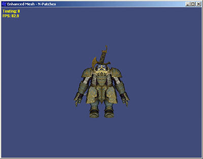
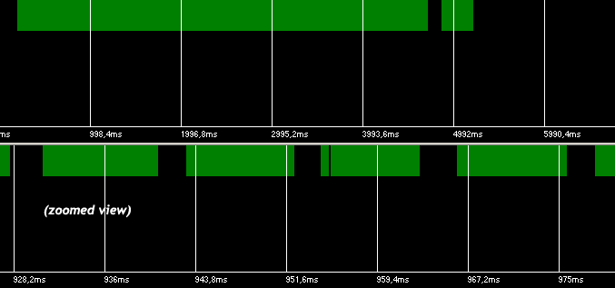
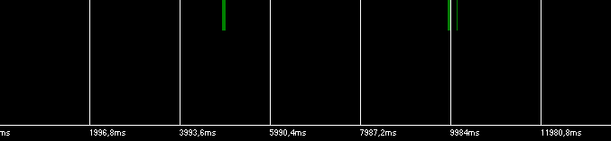
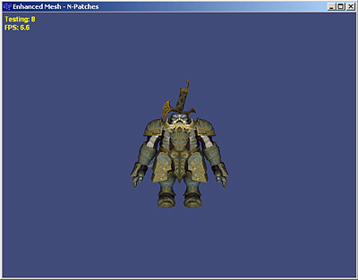
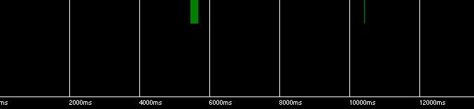
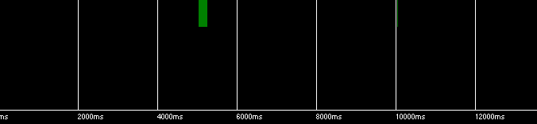
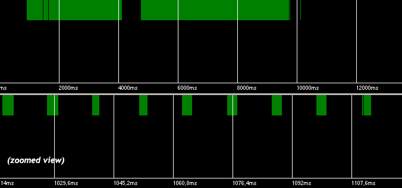

# Multithreading in DirectX Applications

*Article published on [dtf.ru](https://web.archive.org/web/20080208042404/http://dtf.ru/articles/read.php?id=39888) on May 17, 2006*

It is recommended to read [the first part of the article](/filesystem/Publications/2006-05_M1_What_No_One_Told_You_About_Multitasking_in_Windows\What_No_One_Told_You_About_Multitasking_in_Windows_(translated_to_english).md).

## Part 2. Multithreading in DirectX Applications


In the first part, we found a way to execute a background thread using 10% of CPU time. Now we would like to apply this system in practice: we will load levels, create textures, and fill vertex buffers with data in the second thread.

### Thread Safety

When working with a third-party library, you should immediately inquire whether it is thread-safe, that is, whether it allows access from different threads.

When creating IDirect3dDevice9, you can specify the D3DCREATE_MULTITHREADED flag. According to the documentation, in this case the library becomes thread-safe. This seemingly solves our problem.

Unfortunately, thread safety does not automatically mean efficient work with the library from different threads. What actually happens?

When we specify the D3DCREATE_MULTITHREADED flag, DirectX begins using a global critical section when calling all methods. For us, this means that when calling the UpdateTexture() method in the second thread, which takes 3ms, the system will not be able to continue execution of the first thread that wants to call DrawIndexedPrimitive(), because the second thread has captured the global critical section for the duration of the UpdateTexture() method execution. This again leads to a loss of control over the amount of CPU time allocated to the second thread, and, in turn, to unstable FPS.

In addition, the very use of a global critical section on every call leads to a performance decrease that can reach 10%.

In fact, DirectX does not prohibit calling its methods from different threads. Only unsynchronized method calls are prohibited. You can avoid specifying the D3DCREATE_MULTITHREADED flag and instead use your own critical section to protect entire blocks of calls, for example VertexBuffer->Lock(), memcpy(), VertexBuffer->Unlock(). The debug version of DirectX will issue warnings, but they can simply be ignored.

**Note.** *The D3DX library is not thread-safe. You must protect calls to D3DXxxxx functions with your own critical section.*

From this we can conclude: do not use the D3DCREATE_MULTITHREADED flag. Access DirectX only from one thread. Prepare data as much as possible in the second thread and put it in a queue. The first thread will process all queue entries (for example, write vertices to a vertex buffer) between frames, controlling the execution time of operations.

### Can We Save Time by Reducing Idle Periods?

Until now, we have been talking about intentionally giving CPU time to the second thread, which essentially provides no overall gain in useful work. It is natural to assume that since DirectX communicates with hardware (the video card), there must inevitably be pauses waiting for a response from the GPU, or a pause waiting for vertical retrace when flipping frames. Can we use the CPU time lost in pauses to perform useful work in the second thread?

For this to happen, DirectX and the driver would need to use some synchronization objects during waiting, for example WaitForMultipleObjects() or Sleep(). Does this happen?

I will not present the sequence of experiments that demonstrate the logic of DirectX and driver behavior, and will give the answer immediately.

The driver NEVER uses synchronization objects when waiting; instead, a so-called busy wait is used everywhere, that is, something like:

```cpp
while (flag==false) { UpdateFlag();};
```

Perhaps in some specially modified drivers for laptops to reduce power consumption it works differently, but on desktop systems it is exactly like this in both ATI Catalyst and nVidia Forceware. This is understandable – video card manufacturers are primarily concerned with high FPS, and relying on the system's thread scheduler is quite risky.

As for DirectX, it calls Sleep(n), n=0..10 in the IDirect3DDevice->Present() method if vertical retrace waiting mode is enabled, and only in windowed applications. This is understandable – in windowed mode, DirectX tries to behave like a well-mannered Windows application, giving some CPU time to other tasks.

In all other cases, no synchronization objects are used.



*Figure 15. Test #10. A slightly modified Enhanced Mesh example from DirectX 9.0 SDK. The application renders a simple model with FPS close to the screen refresh rate (85 Hz), since vertical retrace waiting mode is enabled.*



*Figure 16. Test #11. Windowed mode, vertical retrace synchronization (VSYNC) enabled. The second thread has idle priority (only it is shown on the graph). The thread receives a large amount of CPU time (the 3-second delay at the beginning is due to waiting for loading and rendering to start).*



*Figure 17. The same test, but with vertical retrace waiting disabled. High FPS, but the second thread receives no CPU time at all. Small periods of activity are explained by CPU time starvation detection.*

Since the scene is not complex, there are no GPU delays. This time let's load the GPU by increasing the triangle count 10 times.



*Figure 18. Test #12. GPU is overloaded, low (5-6) FPS. Enabling VSYNC has no effect on FPS (it is significantly less than the vertical refresh rate). If your FPS is above 60, find a weaker video card 🙂*



*Figure 19. Test #13. GPU is overloaded, low (5-6) FPS. VSYNC disabled. The second thread with idle priority receives no CPU time at all, even though the CPU is heavily idle waiting for the GPU. This test proves that the driver never uses Windows synchronization objects when waiting. Small periods of activity are explained by CPU time starvation detection.*



*Figure 20. Test #14 shows that when switching to fullscreen mode, DirectX stops calling Sleep() in the Present() method, and this is no longer affected by enabling VSYNC.*

Conclusion: Gains from reducing idle periods can be obtained in practice only in windowed applications with VSYNC enabled. But since this is not documented anywhere, there are no guarantees that this will always work. If we want our background thread to work, we must allocate CPU time to it ourselves.

### Creating a Background Thread

We still need to verify whether our previously developed dual-threaded application scheme works with DirectX.



*Figure 21. Test #15. Main thread with normal priority, background thread with idle priority. The main thread calls Sleep(2) on each frame to allocate CPU time to the second thread. As can be seen, the second thread almost consistently receives its 2ms on each frame – our scheme works (the graph shows the second thread).*

It should be added here that DirectX independently calls timeBeginPeriod(1), and we do not need to do this. In a real application, it is necessary to change the Sleep() argument depending on the average FPS, since the share of CPU time for the second thread depends on the frame length. For example, at low FPS (test #16), the second thread receives too little time.

**Note**. *The debug version of DirectX calls Sleep() in the Present() method even in fullscreen mode.*

### Conclusions

From everything described, the following conclusions can be drawn:

**1.** On single-processor systems, there is no point in using multithreaded applications. This does not lead to increased performance, but on the contrary, complicates the system due to the need to perform thread synchronization.

Instead, pay attention to CPU-GPU parallelism. Submit all triangles at the beginning of the frame, then calculate AI and physics, then Present().

```cpp
while (bExit==false)
{
  DrawAll();
  CalcAI_Physics()
  Device->Present()
}
```

The CPU will calculate physics, occasionally being interrupted (hardware interrupt) to send the next batch of triangles to the GPU.

This works because DrawIndexedPrimitive() is not executed when called, but is written to a queue. All other commands are also written there, including SetRenderTarget(), StretchRect(), and even IVertexBuffer->Lock(), IVertexBuffer->Unlock() for DYNAMIC buffers (the driver uses buffer renaming).

Under heavy load, DirectX and the driver can (and will, if not specifically combated) buffer up to 3 frames ahead.

**2.** Call DirectX methods only from one thread. Do not use the D3DCREATE_MULTITHREADED flag.

**3.** To avoid using multithreading, break algorithms into a set of small (1-2ms) tasks. Execute tasks between frames, before Present(), controlling the time spent.

**4.** Do not create more than one active thread! Use your own task manager executing tasks in the second thread.

**5.** If multithreading is really necessary (due to the impossibility of breaking down the background algorithm into small tasks), use the scheme proposed in this article.

**6.** The second thread receives little CPU time. Do not waste it on waiting for loading! The OS provides asynchronous disk reading functions with a callback function upon completion (IO completion callback routine). Use these functions to load a file into a buffer, and only then parse it in the second thread. These same functions may help to avoid multithreading altogether.

**7.** If the second thread has no active tasks, there is no need to call Sleep() between frames.

### When Using a Second Thread on a Single-Processor System is Actually Justified

In real-time strategy games, a large number of units are often used. Calculating unit AI and strategic AI can take a lot of time. Because of this, a situation is possible when the game simply cannot provide acceptable FPS, since calculating AI on the map takes, say, 60ms. The obvious solution is to calculate only part of the strategy on each frame. Unfortunately, this is not always possible, since interrupting the algorithm may require saving partially calculated data structures of large size.

As is known, the perceived speed of a program depends more on the response time to user actions (feedback) than on actual performance. In the case described above, it makes sense to separate AI calculation into a background thread, while in the main thread only calculate animation based on the latest data received from the AI engine. Visually, the user will have high FPS and fast user interface response time, although units may appear to be "slow-thinking".

### Other Methods of Performing Background Tasks

WinApi also provides several types of timers that can be used for "background" execution [2].

The regular timer (WM_TIMER message), due to implementation specifics, is not suitable for real-time applications. The fact is that the WM_TIMER message (like WM_IDLE) is not a regular message that enters the window message queue. Instead, in the PeekMessage() procedure, the system checks whether the window message queue is empty, and if it is empty and the timer period has expired, it sends a WM_TIMER message. Thus, if the window receives WM_MOUSEMOVE messages, it stops receiving WM_TIMER.

Multimedia timers allow assigning callback functions for periodic calling. The callback launch is performed by the thread scheduler, so the timer accuracy cannot be higher than the quantum. To get 1 ms resolution, you need to call timeBeginPeriod(1).

Waitable timers allow assigning completion routines. Completion routines are executed in the context of the same thread when it stops as a result of calling SleepEx() or WaitForObject() functions. If the thread does not call these functions, the completion routine will never be called.

In all cases of using timers, the callback function must terminate independently, taking the specified amount of CPU time. Until the function terminates, thread execution does not continue. Therefore, I see no advantage in using them over simply calling functions between frames.

Third part of the article: [HyperThreading Technology](http://localhost:8080/?page_id=636)

### References

1. Multitasking Discussion
   [http://www.wideman-one.com/gw/tech/dataacq/multitasking.htm](http://www.wideman-one.com/gw/tech/dataacq/multitasking.htm)

2. Timers tutorial
   [http://www.codeproject.com/system/timers_intro.asp](http://www.codeproject.com/system/timers_intro.asp)

3. Time is the Simplest Thing…
   [http://www.codeproject.com/system/simpletime.asp](http://www.codeproject.com/system/simpletime.asp)

4. Quantifying The Accuracy Of Sleep
   [http://www.codeproject.com/system/sleepstudy.asp](http://www.codeproject.com/system/sleepstudy.asp)
   (commendable diligence in testing, but the author did not read this article)

5. Threading Articles
   [http://www.devx.com/Intel/Door/29081](http://www.devx.com/Intel/Door/29081)

6. GDC 2004: Multithreading in Games
   [http://www.extremetech.com/article2/0,1697,1554193,00.asp](http://www.extremetech.com/article2/0,1697,1554193,00.asp)

7. Threading Basics for Games
   [http://www.devx.com/Intel/Link/28614](http://www.devx.com/Intel/Link/28614)

8. Application of Multithreading in Games
   [http://www.gamedev.ru/articles/?id=70119](http://www.gamedev.ru/articles/?id=70119)
   (the example of performance increase through using threads presented in the article is incorrect)

9. Hyper-Threading Technology and Computer Games
   [http://www.dtf.ru/articles/read.php?id=113](http://www.dtf.ru/articles/read.php?id=113)

10. ProcessTamer
    [http://www.donationcoder.com/Software/Mouser/proctamer/](http://www.donationcoder.com/Software/Mouser/proctamer/)

11. Managing Concurrency: Latent Futures, Parallel Lives
    [http://www.gamearchitect.net/Articles/ManagingConcurrency1.html](http://www.gamearchitect.net/Articles/ManagingConcurrency1.html)

12. The Free Lunch Is Over: A Fundamental Turn Toward Concurrency in Software
    [http://www.gotw.ca/publications/concurrency-ddj.htm](http://www.gotw.ca/publications/concurrency-ddj.htm)

13. ThreadTest Application with Source Code
    [threadtest.zip](/filesystem/Publications/2006-05_M1_What_No_One_Told_You_About_Multitasking_in_Windows/threadtest.zip)
