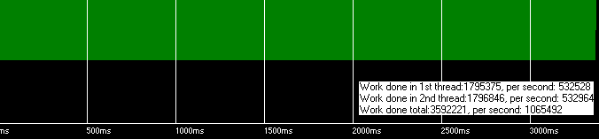
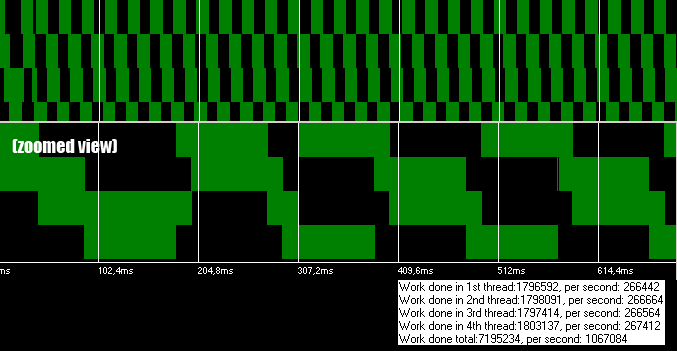
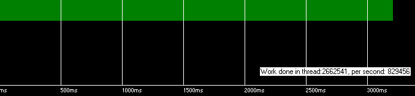

# Технология HyperThreading

*Статья опубликована на сайте [dtf.ru](https://web.archive.org/web/20080208042404/http://dtf.ru/articles/read.php?id=39888) 17.05.2006*

Рекомендуется начать с [первой части статьи](http://localhost:8080/?page_id=597)

## Часть 3. Технология HyperThreading

Эта часть статьи будет более простой, т.к. в данном случае мы имеем дело с процессором, который на аппаратном уровне может выполнять два потока одновременно – нам придется меньше лезть в дебри ОС.

Давайте подойдем критически и проверим, как работают потоки на этих процессорах, и какой реальный прирост производительности можно получить. Эта статья будет полезна как "статья о HyperThreading – не перепечатка презентаций от Intel" 🙂

### Оцениваем преимущества HT

*Рисунок 23. Тест №2 наглядно показывает, что потоки выполняются действительно параллельно. Windows воспринимает систему как двухпроцессорную.*

*Рисунок 24. Тест №3. При запуске 4-х потоков, система распределяет по два на каждый "процессор".*

Как я и сказал в начале, здесь все будет значительно проще: открываем второй поток, и он работает параллельно. Нам не нужно заботиться о выделении процессорного времени. Задача о выполнении фонового алгоритма без замедления основного потока более чем на 10% процентов решена. Или нет?

*Рисунок 25. Тест №1. Один поток с нормальным приоритетом.*

Сравним результаты тестов №1 и №2. Скорость выполнения "полезной" работы в первом потоке снизилась на 36% при открытии второго потока (532528/829456 = 0.64). Это значит, что при  запуске фоновой задачи, FPS будет падать с 50 до 32.

Хуже всего то, что в данной ситуации не существует никаких методов регулировать долю процессорного времени, выделяемого второму потоку. Оба виртуальных процессора являются равноправными. Мы либо отдаем 36% производительности, чтобы получить второй поток, выполняющийся с такой же скоростью, либо должны модифицировать алгоритм, выполняющийся во втором потоке, чтобы тот регулярно "засыпал".

Вывод: поставленная нами задача на HT системах при соблюдении всех поставленных условий не решаема.

Отсюда также выплывает, что приводимые примеры типа "Технология HyperThreading позволила нам считать сложную систему частиц за счет дополнительного потока, что было невозможно на обычных процессорах" [6] являются не совсем корректными. Практически, игра пожертвовала 36% FPS на получение системы частиц, которая всего в  ~1,3 раза сложнее системы, которую можно было с теми же потерями FPS рассчитать на обычном процессоре.

### Как реально получить выигрыш в производительности, используя HT

Суммарная скорость выполнения «полезной» работы увеличилась на 28% (1065492/829456 = 1.28). Я ни в коей мере не отрицаю преимущества технологии HT, но хочу обратить внимание на то, что для получения реального выигрыша, необходимо тщательно спланировать архитектуру ПО. Второй поток не является "бесплатным", и если уж решено его использовать, то он должен выполнять основную задачу наравне с первым, а не просчитывать дополнительные "фичи". При увеличении суммарной производительности на 28% это не так уж и просто сделать.

Приведу пример. Пусть рендеринг кадра занимает 12мс, расчет физики – 4мс, полное время кадра – 16мс. Запускаем приложение, получаем 1000/16 ~ 62,5 FPS.

| Поток 1                     |       |
|-----------------------------|-------|
| Ренедринг кадра n           | 12 ms |
| Расчет физика кадра n+1     | 4 ms  |
| Present()                   |       |
| **Всего**                   | **16ms** |

Теперь "оптимизируем" приложение для HT: переносим расчет физики во второй поток. Первый поток рендерит кадр на основе последней информации от физического движка, физический движок на фоне в цикле пересчитывает состояние мира.

| Поток 1                     |              | Поток 2                     |              |
|-----------------------------|--------------|-----------------------------|--------------|
| Ренедринг кадра n = m       | 12 ms * 1.56 | Расчет физики кадра m+1     | 4 ms * 1.56  |
|                             |              | Расчет физики кадра m+2     | 4 ms * 1.56  |
|                             |              | Расчет физики кадра m+3     | 4 ms * 1.56  |
| Present()                   |              |                             |              |
| **Всего**                   | **12 ms * 1.56  ~ 18.72 мс** |              |              |

(1.56 ~ 1/0.64 – корректировка на снижение скорости выполнения потока)

Запускаем, получаем 1000/12*0.64 ~ 53.3 FPS (0.64 – поток стал выполняться на 36% медленнее), то есть снижение FPS на (53.3/62.5) => 15%! И это еще без учета затрат на синхронизацию.

Самое смешное, что запустив этот вариант двухпоточного приложения на обычном процессоре и получив 1000/(12+12) ~ 41,66 FPS, программист может с радостью отрапортовать о (50/41.66) => 17% увеличении FPS за счет использования технологии HT!

Во-первых, теперь у нас изменилась логика работы программы: физика пересчитывается в 3 раза чаще, чем было в начале (12/4=3). Ошибка кроется в предположении, что второй поток "бесплатен", и позволяет выполнять 100% дополнительных задач. Мы уже знаем, что это не так – исправим ошибку. Редеринг кадра и расчет физики будут начинаться синхронно в разных потоках. При завершении расчета/рендеринга кадра потоки должны синхронизироваться, путем остановки потока до возникновения события от другого потока (WaitForObject()). В нашем случае физический движок будет 8мс ожидать завершения рендеринга кадра.

| Поток 1                     |              | Поток 2                     |              |
|-----------------------------|--------------|-----------------------------|--------------|
| Рендеринг кадра n           | 4*1.56+ 8 ~  | Расчет физики кадра n+1     | 4 ms * 1.56  |
|                             | 14,24 ms     | Ожидание                    | 8 ms         |
| Present()                   |              |                             |              |
| **Всего**                   | **14,24 ms** |                             |              |

При такой архитектуре FPS составит 1000/14.64 ~ 70.2, то есть 20.2/62.5 ~ 11.2% повышение производительности. Это далеко от расчетных 28%, и обусловлено слабой балансировкой задач на потоках. Практически, мы пользовались 28% ускорением только на (4*1.56)/14.24 ~ 44% процентах времени, остальные 8 ms система работала в однопоточном режиме.

К сожалению, задача балансировки задач по потокам значительно усложняет архитектуру ПО, и часто не решаема на все 100%. Нам придется разделить программу на короткие независимые 2-3 мс задачи, которые можно разбрасывать по свободным потокам. Такое кардинальное изменение архитектуры может потребовать больших вложений времени и, возможно, отказ от уже отлаженного готового кода, и нужно сразу подумать, готовы ли вы заплатить эту цену за 10-25% прирост производительности в вашей игре.

### Выводы и заметки

**1.** Второй поток в HT процессорах не "бесплатен". Если принимается решение использовать его для повышения производительности, он должен работать над основной задачей наравне с первым, а не просчитывать дополнительные "фичи".

**2.** Для получения реального выигрыша производительности необходима хорошая балансировка задач по потокам, что в свою очередь требует наличия продуманной архитектуры приложения.

**3.** Для достижения теоретического 40% ускорения необходимо, чтобы потоки загружали разные блоки процессора. Реальное ускорение будет меньше.

**4.** Если оба потока содержат мало вычислений и активно обращаются к памяти, из-за единого интерфейса к памяти выполнение потоков превращается практически в последовательное (невозможно ускорить операцию memcpy(), разделив ее на потоки).

**5.** Если в своей программе вы используете второй поток – придется отказаться от OpenMP, так как ему уже негде разместить свой скрытый поток.

**6.** Только вы знаете о внутренней логике вашей программы. Помогите ОС – назначьте поток на конкретный процессор с помощью SetThreadAfinityMask().

Четвёртая часть статьи: [Dual-core процессоры](http://localhost:8080/?page_id=644)

### Ссылки

1. Multitasking Discussion
   [http://www.wideman-one.com/gw/tech/dataacq/multitasking.htm](http://www.wideman-one.com/gw/tech/dataacq/multitasking.htm)

2. Timers tutorial
   [http://www.codeproject.com/system/timers_intro.asp](http://www.codeproject.com/system/timers_intro.asp)

3. Time is the Simplest Thing…
   [http://www.codeproject.com/system/simpletime.asp](http://www.codeproject.com/system/simpletime.asp)

4. Quantifying The Accuracy Of Sleep
   [http://www.codeproject.com/system/sleepstudy.asp](http://www.codeproject.com/system/sleepstudy.asp)
   (похвальное усердие при тестировании, но автор не читал данную статью)

5. Threading Articles
   [http://www.devx.com/Intel/Door/29081](http://www.devx.com/Intel/Door/29081)

6. GDC 2004: Multithreading in Games
   [http://www.extremetech.com/article2/0,1697,1554193,00.asp](http://www.extremetech.com/article2/0,1697,1554193,00.asp)

7. Threading Basics for Games
   [http://www.devx.com/Intel/Link/28614](http://www.devx.com/Intel/Link/28614)

8. Применение многопоточности в играх
   [http://www.gamedev.ru/articles/?id=70119](http://www.gamedev.ru/articles/?id=70119)
   (пример увеличения производительности за счет использования потоков, приведенный в статье, некорректен)

9. Технология Hyper-Threading и компьютерные игры
   [http://www.dtf.ru/articles/read.php?id=113](http://www.dtf.ru/articles/read.php?id=113)

10. ProcessTamer
    [http://www.donationcoder.com/Software/Mouser/proctamer/](http://www.donationcoder.com/Software/Mouser/proctamer/)

11. Managing Concurrency: Latent Futures, Parallel Lives
    [http://www.gamearchitect.net/Articles/ManagingConcurrency1.html](http://www.gamearchitect.net/Articles/ManagingConcurrency1.html)

12. The Free Lunch Is Over: A Fundamental Turn Toward Concurrency in Software
    [http://www.gotw.ca/publications/concurrency-ddj.htm](http://www.gotw.ca/publications/concurrency-ddj.htm)

13. Приложение ThreadTest с исходными кодами
    [threadtest.zip](/filesystem/Publications/2006-05_M1_What_No_One_Told_You_About_Multitasking_in_Windows/threadtest.zip)
