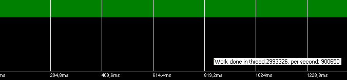
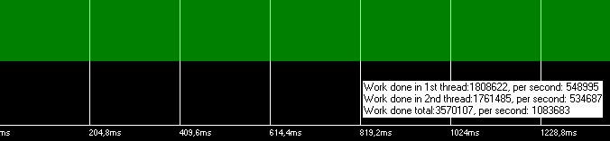
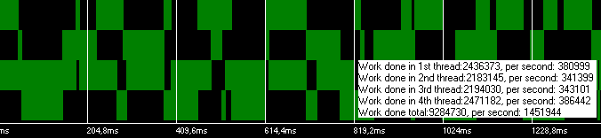
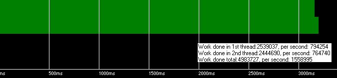

# Dual-core процессоры

*Статья опубликована на сайте [dtf.ru](https://web.archive.org/web/20070512233426/http://dtf.ru/articles/read.php?id=39888) 17.05.2006*

Рекомендуется начать с [первой части статьи](../2006-05_M1_Multitasking_Windows/article.md)

## Часть 4. Dual-core процессоры

Хардварная пресса уже не раз писала, что производители процессоров почти исчерпали возможности простого наращивания мегагерцев. Поэтому следующим шагом развития является увеличение количества ядер – практически, нескольких процессоров в одном корпусе. Эти процессы в ближайшее время должны значительно повлиять на всю индустрию программного обеспечения [12].

Теперь вернемся к нашим баранам. К счастью, такая архитектура процессора практически снимает все проблемы решения нашей задачи (загрузки на фоне), что делает ее решение даже неинтересным :)

Итак, вооружившись программой ThreadTest, я запустил ее на 2-х ядерном Pentium D, ожидая вполне очевидный результат – полностью независимое исполнение потоков. Но что же я увидел?



*Рисунок 27. Тест №1. Один поток с нормальным приоритетом на процессоре Pentium D. Загружена ровно «половина» процессора.*



*Рисунок 28. Тест №2. Два потока с нормальным приоритетом на процессоре Pentium D.*

Судя по тесту 2, два потока выполняются одновременно. Но обратите внимание на количество выполненной «полезной» работы! Оно увеличилось всего на ~10%!

Честно говоря, такие результаты повергли меня в ступор. Первое, что я предположил – это ошибка в программе тестирования или каких-то настройках BIOS. Самое удивительное, что 4 потока действительно показывали почти 2-х кратное увеличение производительности:



*Рисунок 29. Тест №3. Четыре потока с нормальным приоритетом на процессоре Pentium D. Надо заметить, что task sheduller просто сходит с ума.*

Но ни с настройками, ни с программой проблем не было.

Немного поэкспериментировав, я наконец выяснил, что наткнулся на распространенную проблему архитектур с распределенной памятью (shared memory architectures): одновременный доступ двух процессоров к близким участкам памяти заставляет внутренний контроллер сбрасывать кэш памяти (false sharing).

После того, как я разнес структуры данных потоков на 256 байт путем добавления небольшого массива:

```
TMyThreadData data;
BYTE guard[256];
TMyThreadData data2;
```

Все стало на свои места:



*Рисунок 30. Тест №18. Два потока с нормальным приоритетом. Локальные данные потоков разнесены в памяти.*

Мы получаем примерно ~73 дополнительных процента производительности, что очень близко к двукратному увеличению. При полной загрузке, каждый поток выполняется примерно с 88% скорости относительно единственного работающего потока, что почти удовлетворяет условиям нашей задачи (тормозить первый поток не больше, чем на 10%).

Мы не видим 100% ускорения потому, что узким местом является единый интерфейс к памяти, но и эта проблема уже решается в новых материнских платах.

Из произошедшего "инцидента" можно сделать вывод, что обрабатывать четные элементы массива на одном ядре, а нечетные – на другом, является плохой идеей. Массив нужно делить пополам. Странно, но эта проблема не проявилась на HT-процессоре.

Но в целом, по двуядерным процессорам можно сделать вывод: это круто, чувак! Осталось только подождать, когда они у всех будут.

То есть вопрос не в том – стоит ли задумываться о переводе движка на многопоточность, а в том – когда начать это делать. Производители процессоров все еще выпускают одноядерные решения, и я думаю, что не скоро прекратят. Скоро ли у пользователей появятся несколько ядер, и произойдет ли это вообще? Возможно, придется писать две версии движка, как сейчас – с SSE/без SSE, чтобы просто не отстать от конкурентов, выдающих в 1.5 – 1.8 раза большую производительность. Пока с этим не все ясно.

На этом позвольте завершить. Теперь я предлагаю вернуться к [первому абзацу статьи](../2006-05_M1_Multitasking_Windows/article.md), и оценить, насколько наивными были наши представления о многозадачности в Windows :)

**Примечание.** *Все приведенные в статье рассуждения являются личным мнением автора. Есть шанс его изменить, участвуя в обсуждении статьи :)*

## Ссылки

1. Multitasking Discussion
   [http://www.wideman-one.com/gw/tech/dataacq/multitasking.htm](http://www.wideman-one.com/gw/tech/dataacq/multitasking.htm)

2. Timers tutorial
   [http://www.codeproject.com/system/timers_intro.asp](http://www.codeproject.com/system/timers_intro.asp)

3. Time is the Simplest Thing...
   [http://www.codeproject.com/system/simpletime.asp](http://www.codeproject.com/system/simpletime.asp)

4. Quantifying The Accuracy Of Sleep
   [http://www.codeproject.com/system/sleepstudy.asp](http://www.codeproject.com/system/sleepstudy.asp)
   (похвальное усердие при тестировании, но автор не читал данную статью)

5. Threading Articles
   [http://www.devx.com/Intel/Door/29081](http://www.devx.com/Intel/Door/29081)

6. GDC 2004: Multithreading in Games
   [http://www.extremetech.com/article2/0,1697,1554193,00.asp](http://www.extremetech.com/article2/0,1697,1554193,00.asp)

7. Threading Basics for Games
   [http://www.devx.com/Intel/Link/28614](http://www.devx.com/Intel/Link/28614)

8. Применение многопоточности в играх
   [http://www.gamedev.ru/articles/?id=70119](http://www.gamedev.ru/articles/?id=70119)
   (пример увеличения производительности за счет использования потоков, приведенный в статье, некорректен)

9. Технология Hyper-Threading и компьютерные игры
   [http://www.dtf.ru/articles/read.php?id=113](http://www.dtf.ru/articles/read.php?id=113)

10. ProcessTamer
    [http://www.donationcoder.com/Software/Mouser/proctamer/](http://www.donationcoder.com/Software/Mouser/proctamer/)

11. Managing Concurrency: Latent Futures, Parallel Lives
    [http://www.gamearchitect.net/Articles/ManagingConcurrency1.html](http://www.gamearchitect.net/Articles/ManagingConcurrency1.html)

12. The Free Lunch Is Over: A Fundamental Turn Toward Concurrency in Software
    [http://www.gotw.ca/publications/concurrency-ddj.htm](http://www.gotw.ca/publications/concurrency-ddj.htm)

13. Приложение ThreadTest с исходными кодами
    [threadtest.zip](/filesystem/Publications/2006-05_M1_What_No_One_Told_You_About_Multitasking_in_Windows/threadtest.zip)
