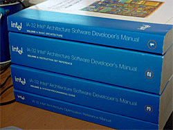
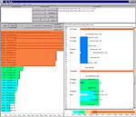
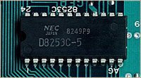
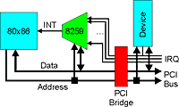
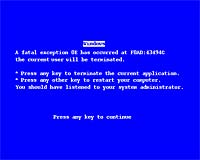
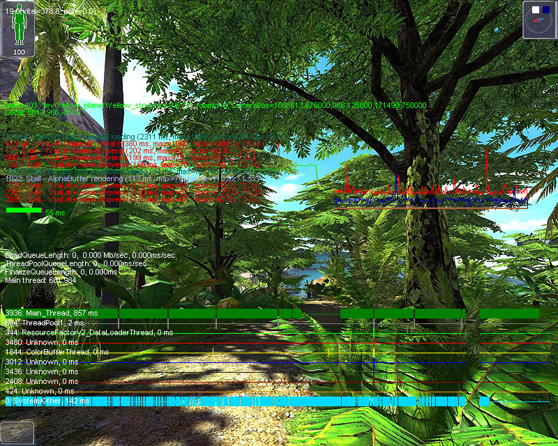

# Мониторинг исполнения потоков в приложениях Windows XP/2000

*Статья опубликована на сайте [dtf.ru](https://web.archive.org/web/20070703031540/http://dtf.ru/articles/read.php?id=40520)*

*В данной статье автор описывает библиотеку, позволяющую наглядно отобразить исполнение потоков (threads) на графике (timeline), а также измерять процессорное время, полученное каждым потоком, с точностью до микросекунд.*

**Предисловие**



Предполагается, что читатель знаком с архитектурой Windows, Windows API, языком ассемблера x86 и архитектурой IA-32. Конечно, хотелось бы объяснить как можно доступнее, но изложение всего указанного материала достойно целой книги. Я постараюсь добавить ссылки на материалы, в которых можно прочитать подробнее.

Следует заметить, что тема несколько отклонилась от разработки игр :), поэтому если вас не интересует внутреннее устройство библиотеки, можно сразу перейти к разделу 3 «Использование».

## Введение


Думаю, все согласятся, что средства мониторинга и отладки приложений существенно облегчают жизнь программистов, и помогают сделать приложения лучше. Практически ни один серьезный IDE на сегодняшний день не обходится без мощного отладчика. Важную роль играют и утилиты мониторинга, встроенные в сами приложения – консоль, замеры скорости выполнения функций, лог.

В статье «То, что вам никто не говорил о многозадачности в Windows"[[1](../2006-05_M1_Multitasking_Windows/article.md)] я привел основные правила исполнения потоков. К ней прилагается специальное приложение, которое наглядно показывает, как Windows распределяет процессорное время. Наличие такого же монитора исполнения в собственном приложении значительно облегчило бы поиск причин неправильного распределения ресурсов процессора. Даже зная все правила, порой довольно сложно однозначно сказать, что все работает так, как задумано, не имея возможности в этом убедиться.

К сожалению, принцип работы примера основан на том, что алгоритмы, исполняемые в тестовых потоках, должны периодически записывать отсчеты времени в специальный буфер. Понятно, что применение такого подхода в реальном приложении невозможно. Необходимо найти другое решение.

## Поможет ли нам операционная система?


Самым очевидным решением было бы получение обратных вызовов (callback) от операционной системы в момент переключения потоков.

В Windows 98 есть калбек Call_When_Thread_Switched, но в системах Windows XP/2000 он больше не поддерживается. Единственную информацию, которую можно получить через WinAPI – это количество процессорного времени, выделенное потоку – функция GetThreadTimes(). Информацию от счетчиков производительности (загрузка процессора, количество переключений контекста), доступную через WMI, я не считаю полезной.

Это не поможет нам отобразить график. К тому же, функция GetThreadTimes() подсчитывает время только тогда, когда поток полностью использовал свой Quantum, и произошло насильственное вытеснение. Quantum составляет 10-15мс. Если поток вышел из объекта ожидания, выполнил работу за 9мс и опять «заснул», что является довольно распространенным сценарием, функция GetThreadTimes() не засчитает потоку никакого времени[2].

## Часть 1. Пассивный профайлер



Для определения наиболее критичных участков кода применяют профайлеры. С некоторыми изменениями профайлер можно применить для мониторинга выполнения потоков.

Пассивный профайлер работает по принципу «вы работайте, а я посмотрю». Ключевыми моментами для создания пассивного профайлера являются:

1) возможность получать периодические асинхронные события с достаточно высокой частотой, например – 1мс;

2) в обработчике события иметь возможность получать информацию о прогрессе выполнения исследуемого приложения.

Мы уже знаем, что планировщик Windows не рассчитан на real-time задачи, и поэтому не существует способа получать периодические события таймера с точностью 1 мс. Единственные события, которые могут происходить регулярно – это аппаратные прерывания.

## Аппаратные прерывания



Сегодняшний компьютер на платформе IA-32[3] содержит целых три аппаратных таймера, способных вызывать прерывания (IRQ).

1) микросхема 8253 (или 8254)[4], сохранившаяся c самых древних IBM PC XT (хотя сейчас она находится внутри чипсета). Содержит 3 таймера, выход канала 0 завязан на IRQ0;

2) Real Time Clock (RTC)[5] – те самые часики, что тикают постоянно от батарейки на системной плате. Завязаны на IRQ8;

3) Таймер в Local APIC. APIC (Advanced interrupt controller)[3] появился в процессорах Pentium Pro для увеличения количества доступных IRQ и поддержки мультипроцессорных систем. В мультипроцессорной системе каждый процессор (включая HT и DualCore) содержит свой Local APIC. Поскольку Local APIC находится внутри процессора, таймер Local APIC не завязан на IRQ, а вызывает любое прерывание, вектор которого настраивается.

Windows использует IRQ8 (RTC) для работы планировщика потоков (то самое аппаратное прерывание, о котором говорилось в прошлой статье). Нам остаются доступными таймер 8254 и Local APIC.

Можно написать драйвер, который настроит аппаратный таймер на вызов прерываний с достаточно высокой точностью (например, 1КHz). Настройка таймера сводится к выводу 4-5 байт в порты ввода-вывода. Драйвер будет обрабатывать указанное прерывание.

По идеологии драйверов Windows, драйвер должен предоставить процедуру обработки прерывания (InterruptService routine – ISR) [25]. Когда происходит аппаратное прерывание, управление получает Windows. Система начинает вызывать по очереди все ISR, которые обрабатывают указанное прерывание (на одном IRQ могут «висеть» несколько устройств).

К сожалению, получив управление внутри ISR, мы никак не сможем узнать, в каком месте прервалось выполнение программы. Функции GetCurrentThreadId() и GetCurrentProcessId() в обработчике прерывания недоступны (как и почти все другие функции), поскольку прерывание не выполняется в контексте потока. Сохраненный указатель выборки команд процессора (EIP) находится где-то в стеке, но мы не знаем его структуру. Чтобы получать значение регистра EIP, нужно обрабатывать прерывание напрямую.

Когда процессор входит в обработчик прерывания, в стеке сохраняются регистры SS,ESP,flags,CS,EIP. Регистры стека сохраняются только тогда, когда на момент прерывания процессор находится в user mode (ring 3). Ему необходимо перейти в kernel mode (ring 0) и установить новый стек.

Структура стека, если произошел переход Ring 3 – Ring0:

```
[ESP] eip
[ESP+0x04] cs
[ESP+0x08] flags
[ESP+0x0c] esp
[ESP+0x10] ss
```

Структура стека, если процессор находился в Ring 0:

```
[ESP] eip
[ESP+0x04] cs
[ESP+0x08] flags
```

Зная структуру стека, в обработчике прерывания можно получить EIP,CS, флаги процессора и регистр FS, который в user mode адресует Thread Information Block (TIB)[6].

Для прямой обработки прерывания придется выполнить работу, которую обычно выполняет система.

**1.** Настроить контроллер прерываний.



Во времена ДОС аппаратные прерывания обрабатывались двумя микросхемами 8259[7]. В сегодняшних компьютерах они тоже есть (хотя и не как отдельные микросхемы), но Windows их отключает и использует Advanced Interrupt Controller (APIC)[8]. Архитектура APIC предоставляет собой связку Local APIC (находящегося внутри процессора) и одного или нескольких IO APIC (находящихся внутри чипсета). Линии IRQ подключены к IO APIC. Программируя IO APIC, можно назначить IRQ на любой номер прерывания. Обычно, на материнской плате один IO ACPIC, обрабатывающий 16 или 24 IRQ.

**2.** Найти неиспользуемый номер прерывания путем анализа таблицы прерываний (IDT)[9].

**3.** Настроить IDT на вызов своей процедуры[10].

Оценив все сложности (программирование таймера, контроллера прерываний, анализ IDT), я решил, что проще будет просто «повеситься» на IRQ8 и вызвать timeBeginPeriod(1) (это заставит систему запрограммировать таймер на 1KHz). После завершения анализа EIP/CS/FS, новый обработчик будет передавать управление оригинальному обработчику системы.

## Обработчик прерывания


Неоценимую помощь в написании драйвера оказал исходный код статьи [10]. Код обработчика прерывания выглядит так:

```cpp
__declspec( naked ) void Handler()
{
  __asm
  {
  //ess         //esp+60
  //esp         //esp+56  ___ only in case of r3-r0 transition
  //flags       //esp+52
  //cs          //esp+48
  //eip         //esp+44
  push eax   //esp+40
  push ebx   //esp+36
  push ecx   //esp+32
  push edx   //esp+28
  push esi   //esp+24
  push edi   //esp+20
  push ebp   //esp+16
  push ds    //esp+12
  push es    //esp+8
  push fs    //esp+4
  push gs    //esp+0

  //Eflags bit 17 is VM bit, if VM = 1, it shows that the caller is from V86 mode,
  test dword ptr [esp+52],0x20000
  je l4

  //V86 mode
  push 0
  push 0
  jmp l2

  l4:
  //are we in kernel mode?  (kernel cs = 0x8)
  cmp DWORD PTR [esp+48],0x8
  je l1

  //user mode
  //fs is pointing Thread Environment Block (TEB)
  mov eax,fs:[0x24]  //current thread Id
  push eax
  mov eax,fs:[0x20]  //curent process Id
  push eax
  jmp l2

  l1:
  //kernel mode
  push 0
  push 0

  l2:
  mov ebx,0x30  //kernel processor control region (KPCR)
  mov eax,0x23  //kernel selector for data in Windows
  mov fs,bx
  mov ds,ax
  mov es,ax
  CALL ProcessData
  pop gs
  pop fs
  pop es
  pop ds
  pop ebp
  pop edi
  pop esi
  pop edx
  pop ecx
  pop ebx
  pop eax
  JMP DWORD PTR [pOriginalHandlerProc]
  };
}
```

Функция ProcessData() записывает ProcessId, ThreadId и отсчеты таймера (RDTSC[13]) в циклический буфер.

Прерывание может возникнуть в любой момент. В этот момент процессор может находиться в 4-х режимах:

1) user mode, выполнение приложений

2) kernel mode, внутри кода ядра системы или драйвера

3) kernel mode, внутри обработчика другого прерывания

4) V86 mode, режим эмуляции ДОС.

В момент вызова прерывания, флаги процессора сохраняются в стеке. Анализируя бит 17 можно узнать, находится ли процессор в V86 режиме. Я не знаю, как получить ProcessId и ThreadId в этом режиме, поэтому драйвер относит этот сампл к system thread (ProcessId:0, ThreadId:0).

В kernel mode регистр CS содержит селектор 0x08 [11]. Несмотря на то, что в этом режиме можно определить Id процесса и потока, анализируя структуру Thread Environment Block (TEB) [12], которая адресуется селектором 0x38, так делать нельзя. Прерывание может возникнуть в любой момент, включая контекст системного потока, который не содержит TEB, или в момент старта нового потока, когда TEB еще не настроен. Поскольку время потока в kernel mode обычно находится в пределах 10-15%, драйвер просто относит этот сампл к system thread.

В пользовательском режиме есть 100% гарантия, что все структуры настроены правильно, поэтому драйвер может спокойно прочитать ProcessId и ThreadId из структуры TEB, которая адресуется селектором в регистре FS.

## Oб RDTSC, HT и DualCore


В обработчике прерывания нельзя использовать функции операционной системы, поэтому в качестве отсчетов таймера используется значение Time stamp counter [13].

```cpp
unsigned __int64 RDTSC()
{
 unsigned __int64 cycles;
 __asm
 {
  _emit 0x0f
  _emit 0x31
   mov DWORD PTR cycles, eax
   mov DWORD PTR [cycles + 4], edx
 }
 return cycles;
}
```

TSC отсчитывает такты процессора с начала запуска ядра (reset). Тут нужно заметить, что некоторые процессоры могут снижать частоту для сокращения потребления энергии, поэтому в приложении необходимо пересчитывать скорость TSC каждую секунду, синхронизируясь с часами.

Для того, чтобы семплировать выполнение потоков на многоядерных системах, необходимо перехватывать прерывание на каждом процессоре по отдельности, иначе увидим только потоки, выполняющиеся на первом ядре.

Нужно иметь в виду, что значение TSC на разных ядрах может не совпадать. Это, кстати, приводит к проблемам в старых играх, которые используют RDTSC в качестве таймера. При мигрировании потока с ядра на ядро, игра может получать отрицательные дельты времени. Чтобы избежать этой проблемы, в новых процессорах Intel и Athlon X2 TSC считает постоянно, даже когда ядро остановлено.

Чтобы не заморачиваться с синхронизацией TSC, я решил пожертвовать точностью и на втором ядре использовать отсчеты певого ядра:

```cpp
__int64 tick;
DWORD CPUIndex = GetCPUIndex();
if (CPUIndex==0)
  {
   tick = RDTSC();
   AtomicCopy64(currentTickCPU0,tick);
  }
   else
  {
   AtomicCopy(tick,currentTickCPU0);
  }
```

Номер ядра, на котором исполняется поток, можно узнать с помощью команды CPUID:

```cpp
DWORD GetCPUIndex()
{
 DWORD result;
 __asm
 {
  mov eax,1
  cpuid
  shr ebx,24
  and ebx,0xf
  mov result,ebx
 }
 return result;
}
```

Я написал тестовое приложение, которое используется драйвер для отображения выполнения потоков. Исходные коды прилагаются к статье [14]


*Рисунок 1. Приложение ThreadsTest2 использует перехват IRQ8 для отображения исполнения потоков.*

Несмотря на относительно низкую скорость самплинга, монитору даже удается отображать исполнение потока 5, который работает очень быстро.

## Часть 2. Перехват функции SwapContext()


*Рисунок 2. Суслик есть, но он не документирован.*

Совершенно понятно, что функция переключения контекста есть, и она находится в коде ядра операционной системы(ntoskrnl.exe). Как же все-таки до нее добраться?

Обычно, документацию на недокументированные вещи можно достать на различных хакерских сайтах и сайтах, посвященных компьютерной безопасности. Кстати определить, посвящен такой сайт написанию вирусов, или методам борьбы с ними, часто так же сложно, как разделить эротику и порнографию :).


Нескончаемая борьба между авторами вирусов и антивирусов идет уже много лет. В частности, первые пытаются скрыть процессы (process) от пользователя, а вторые – найти их и уничтожить.

Фронт уже давно перешел на уровень ядра (kernel mode), и авторы руткитов(rootkit) [15] настолько хорошо преуспели в разработке, что уже доходит до чтения списков планировщика потоков [16].

Вкратце, руткит для Windows– это библиотека, позволяющая перехватывать вызовы функций ядра системы. Сегодня за руткитами закрепился негативный смысл, поэтому авторы антивирусов избегают применения этого понятия к своим продуктам, хотя используют точно те же методы, только для противоположных целей[17][18].

Я нашел нужную мне информацию на сайте с незамысловатым названием [www.rootkit.com](http://www.rootkit.com/) :)

В Windows можно безболезненно скрыть процесс путем исключения его из двусвязного списка процессов системы. Такой процесс не будет отображаться в Task Manager и других подобных программах. При этом нельзя исключать потоки этого процесса из списков планировщика, т.к. они попросту не будут выполняться. Просматривая потоки, можно найти скрытые процессы, поэтому авторы различных антивирусных программ уделили много внимания изучению очередей планировщика потоков(sheduler) и функции SwapContext().

Структуры планировщика слишком сильно различаются в разных версиях Windows, поэтому я решил остановиться на перехвате функции SwapContext(). К тому же, kimmo написал отличную статью на эту тему, с понятным исходным кодом[20].

## Протоколирование переключений контекста с помощью самодельного руткита

Функция SwapContext() находится в ядре (ntoskrnl.exe) и осуществляет переключение контекстов потоков. На момент вызова регистр EDI указывает на структуру ETHREAD[21] потока, который останавливается, а регистр ESI – на структуру ETHREAD потока, который получает управление.

Для того, чтобы установить ловушку(hook) на вызов этой функции, необходимо знать ее адрес в памяти. Поскольку эта функция не экспортируется из ntoskrnl.exe, мы должны либо жестко задать известный адрес, либо сканировать память на наличие сигнатуры. Мы будем использовать второй метод, так как он более надежный.

Начало функции SwapContext() выглядит так:

```
0AC9                    or     cl,cl
26C6462D02              mov    b,es:[esi][0002D],002
9C                      pushfd
8B0B                    mov    ecx,[ebx]
83BB9409000000          cmp    d,[ebx][000000994],000
51                      push   ecx
0F8534010000            jne    000005005 ---------- (1)
833D8CA9480000          cmp    d,[00048A98C],000
0F85FE000000            jne    000004FDC ---------- (2)
0F20C5                  mov    ebp,cr0
8BD5                    mov    edx,ebp
8A4E2C                  mov    cl,[esi][0002C]
884B50                  mov    [ebx][00050],cl
FA                      cli
896728                  mov    [edi][00028],esp
8B4618                  mov    eax,[esi][00018]
8B4E1C                  mov    ecx,[esi][0001C]
2D10020000              sub    eax,000000210
894B08                  mov    [ebx][00008],ecx
894304                  mov    [ebx][00004],eax
```

При исследовании эту функцию можно легко найти в любой версии ядра по сигнатуре `0F 20 C5 (mov ebp,cr0)`

После загрузки, наш драйвер сканирует область памяти, в которую загружен ntoskrnl.exe, и находит адрес функции по заданной сигнатуре (16 байт).

Ловушка выставляется так же, как в сделано библиотеке Detours [23].


*Рисунок 3. Перехват функции SwapContext().*

Мы записываем в начало функции SwapContext() инструкцию JMP на нашу hook-функцию. В ней мы обрабатываем входные параметры так, как нам нужно, и передаем управление оригинальной функции через Trampoline. Для того, чтобы не восстанавливать начальные байты оригинальной функции (а то потом придется искать момент, как опять записать JMP в начале), начальные инструкции копируются в специально выделенную область памяти, к которым добавляется JMP на продолжение функции (Trampoline function).

Инструкция JMP затирает первые 5 байт оригинальной функции. Важным моментом является требование скопировать не ровно 5 байт, а затертые ассемблерные команды целиком, поэтому драйвер осуществляет дизассемблирование кода с помощью движка xde[24].

Функция ProcessData() записывает ProcessId, ThreadId и значение счетчика тактов процессора (RDTSC) в циклический буфер. Получая снимки этого буфера, библиотека может с точностью до микросекунд вычислять время выполнения потоков в течение последних 1-3 секунд.

Исходный код драйвера прилагается к статье[14]. Практически, 90% работы сделал автор статьи[20], я добавил только поддержку PAE ядра (ntkrnlpa.exe), поддержку multicore ядер (PAE/NOPAE), совместимость с Kaspersky Antivirus(klif.sys тоже ставит hook на SwapContext(), и это мешает поиску сигнатуры), IOCTL для общения с драйвером и, собственно, процедуру протоколирования переключений контекста.


*Рисунок 4. Мониторинг потоков с помощью перехвата функции SwapContext().*

Драйвер использует циклический буфер на 10000 записей. Если количество переключений контекста в секунду слишком большое, программа не сможет нарисовать полный график. Например, висевший на фоне javaw.exe от Nokia J2ME SDK добавлял ~4000 переключений контекста в секунду.

Протоколирование переключений настолько точное, что даже видно, как система запускает поток 3 сразу после освобождения критической секции потоком 2, а потом возвращается в поток 2, чтобы "уснуть".

## Часть 3. Использование библиотеки.

Для использования библиотеки необходимо подключить к проекту файлы ThreadSampler.cpp и ThreadSampler.h.

По умолчанию используется метод с перехватом функции SwapContext(). Для переключения в режим перехвата IRQ8 нужно определить строку TIMERSAMPLER в Preprocessor definitions проекта.

Файлы драйвера (irq8_hook.sys или swap_hook.sys) нужно положить рядом с исполняемым файлом приложения. Windows не загружает драйвера с сетевых или SUBST-каталогов. Если предполагается запускать приложение по сети, файл драйвера необходимо переместить в каталог C:\Windows\System32\.

В момент создания экземпляра класса TThreadSampler загружается драйвер и начинает собирать данные.

```cpp
TThreadSampler* sampler = new TThreadSampler();
```

Для правильной работы класса необходимо вызывать метод:

```cpp
DWORD contextSwitches;

if (sampler->MakeSnapshot(&contextSwitches)==true)  ...
```

не реже, чем каждые две секунды. Например – на каждом кадре.

Метод заполняет количество переключений контекста в секунду (только для метода с перехватом SwapContext()). Возврат false означает, что установить драйвер не удалось.

Класс позволяет напрямую обращаться к собранным данным через member-класс samples, но особого интереса эта информация не представляет.

С помощью метода:

```cpp
CreateSpanListForThread(DWORD processId, DWORD threadId, TSpanList& spanList, DWORD width, DWORD scale, DWORD* totalTime)
```

Можно запросить список отрезков для рисования графика выполнения потока, где:

- processId, threadId – поток, для которого необходимо построить список. Если threadId = OTHER_THREADS, то вернуть список для потоков, не принадлежащих указанному процессу;
- spanList – результирующий список отрезков;
- width – ширина графика в пикселах;
- scale – шкала графика, в 0.5 сек. единицах, на пример 2 – 1 сек, 6 – 3 сек.;
- totalTime – среднее время в миллисекундах, выделенное потоку в течение одной секунды.

С помощью методов EnumerateProcesses() и EnumerateThreads(DWORD processId) можно получить списки процессов и потоков соответственно (читаются из массивов sampler->processes и sampler->threads).

Класс может хранить в себе имена потоков:

```cpp
static void SetThreadName(const char* name);
static void SetThreadNameEx(DWORD threadId, const char* name);
static const char* GetThreadName(DWORD threadId);
```

Метод SetThreadName() необходимо вызывать в самом начале ThreadFunc. Кроме простого сохранения указанного имени, он установит имя потока, отображаемое в отладчике Visual Studio:


*Рисунок 5. Окно Threads Visual Studio.*

## Совместимость.

Версия с перехватом функции SwapContext():



Windows XP Professional, SP1& SP2, ядра NOPAE/PAE, включая многопроцессорные. Совместима с Kaspersky Antivirus 4.0-6.0. Библиотека может быть не совместима с некоторыми антивирусами (и вирусами).

Версия с использованием таймера:

Windows 2000, NT, XP. Библиотека не совместима с программами, которые активно перехватывают IRQ8 (в том числе, с вирусами).

При разработке библиотеки изначально не ставилась задача об ее распространении с готовым продуктом.

ПРИ РАЗРАБОТКЕ БИБЛИОТЕКИ ИСПОЛЬЗОВАЛИСЬ НЕДОКУМЕНТИРОВАННЫЕ ВОЗМОЖНОСТИ WINDOWS. АВТОР НЕ НЕСЕТ ОТВЕСТВЕННОСТИ ЗА ВРЕД, ПРИНЕСЕННЫЙ В РУЗУЛЬТАТЕ ИСПОЛЬЗОВАНИЯ БИБЛИОТЕКИ.

## Результат



*Рисунок 6. Диагностика исполнения потоков в реальном приложении.*

Мы получили библиотеку, с помощью которой можно следить за исполнением потоков при отладке многопоточных приложений. Я думаю, на этом вопрос об исполнении потоков можно закрыть.

P.S. Это мой первый драйвер, в нем могут быть ошибки. Буду рад о них узнать.

## Ссылки по тексту статьи

1. [То, что вам никто не говорил о многозадачности в Windows.](../2006-05_M1_Multitasking_Windows/article.md)

2. Why GetThreadTimes() wrong
   [http://blog.kalmbachnet.de/?postid=28](http://blog.kalmbachnet.de/?postid=28)

3. IA-32 Intel architecture software developers manual
   [http://www.intel.com/design/pentium4/manuals/index_new.htm](http://www.intel.com/design/pentium4/manuals/index_new.htm)

4. Intel 8253 programmable interrupt timer
   [http://en.wikipedia.org/wiki/Intel_8253](http://en.wikipedia.org/wiki/Intel_8253)

5. Real Time Clock (RTC) (Wikipedia)
   [http://en.wikipedia.org/wiki/Real-time_clock](http://en.wikipedia.org/wiki/Real-time_clock)

6. Thread Information Block (TIB) (Wikipedia)
   [http://en.wikipedia.org/wiki/Win32_Thread_Information_Block](http://en.wikipedia.org/wiki/Win32_Thread_Information_Block)

7. Using interrupts (Intel 8259)
   [http://www.beyondlogic.org/interrupts/interupt.htm](http://www.beyondlogic.org/interrupts/interupt.htm)

8. Advanced programmable interrupt controller (APIC)
   [http://www.osdever.net/tutorials/pdf/apic.pdf](http://www.osdever.net/tutorials/pdf/apic.pdf)

9. Interrupt descriptor table (IDT) (Wikipedia)
   [http://en.wikipedia.org/wiki/Interrupt_Descriptor_Table](http://en.wikipedia.org/wiki/Interrupt_Descriptor_Table)

10. Interrupt Hooking and retrieving device information on Windows NT
    [http://www.codeproject.com/system/interrupthook.asp](http://www.codeproject.com/system/interrupthook.asp)

11. Exploring Windows 2000 memory
    [http://www.informit.com/articles/article.asp?p=167857&rl=1](http://www.informit.com/articles/article.asp?p=167857&rl=1)

12. Thread Environment Block
    [http://undocumented.ntinternals.net/UserMode/Undocumented%20Functions/NT%20Objects/Thread/TEB.html](http://undocumented.ntinternals.net/UserMode/Undocumented%20Functions/NT%20Objects/Thread/TEB.html)

13. RDTSC (Wikipedia)
    [http://ru.wikipedia.org/wiki/Rdtsc](http://ru.wikipedia.org/wiki/Rdtsc)

14. Приложение ThreadsTest2 с исходными кодами
    [threadstest2.rar](threadstest2.rar)

15. Rootkit (Wikipedia)
    [http://ru.wikipedia.org/wiki/Rootkit](http://ru.wikipedia.org/wiki/Rootkit)

16. Byepass Scheduler List Process Detection
    [http://www.rootkit.com/newsread_print.php?newsid=117](http://www.rootkit.com/newsread_print.php?newsid=117)

17. Лаборатория Касперского комментирует обвинение в использовании rootkit технологий
    [http://www.securitylab.ru/news/254796.php](http://www.securitylab.ru/news/254796.php)

18. DRM-средства от партнёров Sony включают настоящий руткит
    [http://security.compulenta.ru/236649/](http://security.compulenta.ru/236649/)

19. ROOTKIT – The Online Rootkit Magazine
    [http://www.rootkit.com](http://www.rootkit.com)

20. Detecting Hidden Processes by Hooking the SwapContext Function
    [http://www.rootkit.com/newsread.php?newsid=170](http://www.rootkit.com/newsread.php?newsid=170)

21. Undocumented functions for Windows 2000/NT
    [http://undocumented.ntinternals.net/](http://undocumented.ntinternals.net/)

22. Структуры ETHREAD, KTHREAD
    [http://forum.sources.ru/index.php?showtopic=48114](http://forum.sources.ru/index.php?showtopic=48114)

23. Microsoft Detours library
    [http://research.microsoft.com/sn/detours/](http://research.microsoft.com/sn/detours/)

24. eXtended (XDE) disassembler engine
    [http://madchat.org/vxdevl/vxmags/29a-8/Utilities/29A-8.009/xde.txt](http://madchat.org/vxdevl/vxmags/29a-8/Utilities/29A-8.009/xde.txt)

25. DDK – Windows Driver Development Kit
    [http://www.microsoft.com/whdc/devtools/ddk/default.mspx](http://www.microsoft.com/whdc/devtools/ddk/default.mspx)

## Ссылки на дополнительную информацию

1. Coding for multiple cores
   [http://download.microsoft.com/download/5/b/e/5bec52bd-8f96-4137-a2ab-df6c7a2580b9/Coding_for_Multiple_Cores.ppt](http://download.microsoft.com/download/5/b/e/5bec52bd-8f96-4137-a2ab-df6c7a2580b9/Coding_for_Multiple_Cores.ppt)

2. Intel VTune Analyser
   [http://www.intel.com/cd/software/products/asmo-na/eng/vtune/index.htm](http://www.intel.com/cd/software/products/asmo-na/eng/vtune/index.htm)

3. Kernel Loop-up
   [http://www.codeproject.com/csharp/lookup.asp](http://www.codeproject.com/csharp/lookup.asp)

4. Remote debugging using VMWare
   [http://www.catch22.net/tuts/vmware.asp](http://www.catch22.net/tuts/vmware.asp)

5. Win2K Kernel Hidden Process/Module Checker
   [http://www.security.org.sg/code/kproccheck.html](http://www.security.org.sg/code/kproccheck.html)

6. Драйвер с нуля
   [http://www.abc-it.lv/index.php/id/1151](http://www.abc-it.lv/index.php/id/1151)

7. API Hooking revealed part 3 and 4 – Thread Deadlock Detector
   [http://www.codeproject.com/system/APIHookingPart3.asp](http://www.codeproject.com/system/APIHookingPart3.asp)

8. Entering the kernel without a driver and getting interrupt information from APIC
   [http://www.codeproject.com/system/soviet_kernel_hack.asp](http://www.codeproject.com/system/soviet_kernel_hack.asp)

9. The VTrace Tool: Building a System Tracer for Windows NT and Windows 2000
   [http://msdn.microsoft.com/msdnmag/issues/1000/VTrace/default.aspx](http://msdn.microsoft.com/msdnmag/issues/1000/VTrace/default.aspx)

10. Undocumented Functions for Microsoft Windows NT/2000
    [http://undocumented.ntinternals.net/](http://undocumented.ntinternals.net/)

11. Inside Microsoft Windows 2000, Third Edition
    [http://www.microsoft.com/MSPress/books/4354.asp](http://www.microsoft.com/MSPress/books/4354.asp)

12. Windows NT Design, implementation, internal structure
    [http://labe.felk.cvut.cz/~posik/osa/NTDesign.pdf](http://labe.felk.cvut.cz/~posik/osa/NTDesign.pdf)

13. Windows Support for Hyper-Threading Technology
    [http://www.microsoft.com/whdc/system/CEC/HT-Windows.mspx](http://www.microsoft.com/whdc/system/CEC/HT-Windows.mspx)

14. Основы написания драйвера уровня ядра для ОС Windows 2000, XP и XP Embedded
    [http://www.cta.ru/pdf/2006-2/20062068_000.pdf](http://www.cta.ru/pdf/2006-2/20062068_000.pdf)

15. Контексты изнутри (Contexts inside out)
    [http://www.securitylab.ru/contest/212094.php](http://www.securitylab.ru/contest/212094.php)

16. Understanding IRQL
    [http://ext2fsd.sourceforge.net/documents/irql.htm](http://ext2fsd.sourceforge.net/documents/irql.htm)
