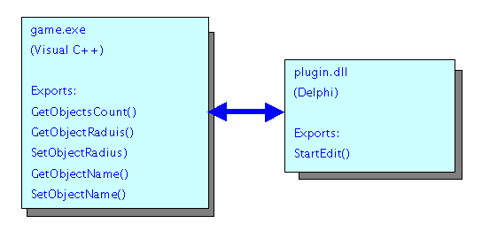
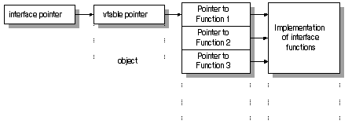
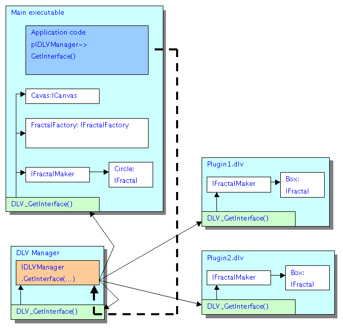
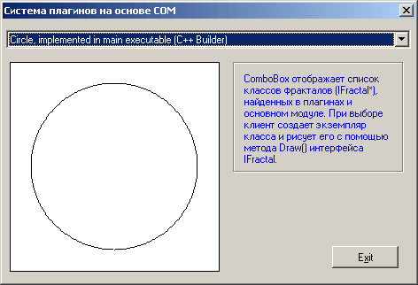
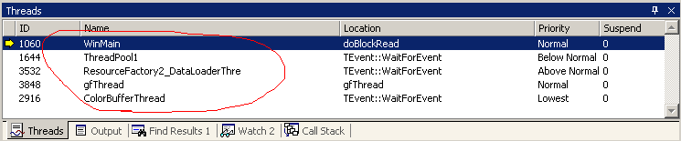
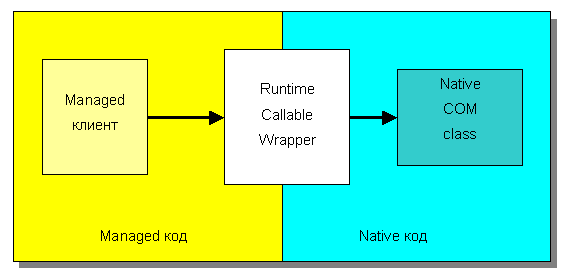

# Plugins Based on COM Interfaces

*This article was published on the site [dtf.ru](https://web.archive.org/web/20080101150038/http://dtf.ru/articles/read.php?id=44995).*

*Related topics: Programming using abstract interfaces, exporting classes from DLLs, cross-language interaction, plugin system.*

In this article, I will tell you how to use COM interfaces to ensure binary compatibility between modules written in different programming languages.

## Interoperability of Programs Written in Different Programming Languages

Although Andrey Plakhov did not mention Delphi and C++ Builder in his lecture on programming languages at KRI 2006 [12], we actively use these products to create editors, utilities, and plugins.

The reason is simple: Borland products allow us to write GUI applications very quickly and easily, and there is a huge number of useful components available for them.

Unfortunately, the simplicity of writing a GUI plugin, say, for editing a particle system, ends when it becomes necessary to link it with the engine code, which is inevitably written in Visual C++.

Neither Delphi nor C++ Builder are compatible with Visual C++ in terms of obj and lib file formats, so the only way to link them is to export functions from a DLL.



In principle, this works, but there are many inconvenient aspects. Object-oriented programming turns into a "parody of objects."

The DLL format allows exporting only functions. Visual C++ has an extension that allows exporting classes and variables, but VC++ is only compatible with itself in this regard.

Therefore, we have to write and export:

- a constructor function that constructs an instance of the class (using `new`) and returns a pointer to this instance as `void*`;
- a complete set of proxy functions duplicating the class methods, which take a pointer to the instance as `void*` and call the corresponding method on the class instance;
- a destructor function that takes a pointer to the instance as `void*` and destroys the object.

Example. A `TSphere` class is implemented in a DLL on VC++. Here's how its export-import looks in Delphi:

```
=================== VC ++ =================
class TSphere
 private:
  T3DVECTOR center;
  float radius;

 public:
  ...
  T3DVECTOR& GetCenter() const;
  float GetRadius() const;
  ...
};

void* __cdecl TSphere_Create()
{
 return new TSphere();
}

void __cdecl TSphere_GetCenter(void* pthis, float* x, float* y, float* z)
{
 T3DVECTOR c = ((TSphere*)pthis)->GetCenter();
 *x = c.x;
 *y = c.y;
 *z = c.z;
}

float __cdecl TSphere_GetRadius(void* pthis)
{
 return ((TSphere*)pthis)->GetRadius();
}

void TSphere_Destroy(void* pthis)
{
 delete ((TSphere*)pthis);
}
=================== Delphi =================
function TSphere_Create(): pointer; cdecl; external 'mydll.dll';
procedure TSphere_GetCenter(pthis: pointer; var x, y, z: single); cdecl; external 'mydll.dll';
function TSphere_GetRadius(pthis: pointer): single; cdecl; external 'mydll.dll';
procedure TSphere_Destroy(pthis: pointer); cdecl; external 'mydll.dll';

var
  p: pointer;
begin
  p := TSphere_Create();
  radius := TSphere_GetRadius(p);
  TSphere_Destroy(p);
end;
```

Obviously, working like this is completely inconvenient. When changing or adding a class method, you need to correct the proxy function, its counterpart in the project on another language, and rebuild both projects anew. In addition, in the case of exporting from Delphi to VC++, you have to describe address retrieval through `GetProcAddress()`, since VC++ does not allow simply writing "the function is located in such-and-such DLL" as is possible in Delphi. The DLL has to be loaded dynamically using the `LoadLibrary()` function.

Despite the shortcomings, this method is widely used when porting libraries. There are many articles on this topic [13] [14] [15] [16] [17] [18].

The fundamental problem is that the same class, compiled by different compilers, or even by the same compiler but with different settings, is not compatible in binary form.

You cannot pass a pointer to a class instance from a VC++ module to a C++Builder module and try to call methods on this class there, even if the same `.h` file with the class description is used.

Fortunately, almost all compilers support the Component Object Model (COM).

By formatting classes as COM objects, but without using all the "heavy" capabilities of COM, you can achieve binary compatibility of classes between different programming languages and compilers.

## Component Object Model (COM)

The COM architecture is a fairly extensive topic, so I will simply refer to the links [1] [2] [6] [9] [11].

The principle of COM operation in brief:

- Class code is located in libraries (DLLs), which are registered in a special section of the system registry.
- Each class implements one or more known COM interfaces.
- The DLL exports a function for creating an instance of the specified class, returning a pointer to the base interface `IUnknown` (all classes must implement it).
- Each interface is assigned a GUID.
- The user calls `CoCreateInstance(GUID)`, which searches for a record in the registry, loads the DLL, and calls the factory function.
- Work with the object is carried out through a pointer to the interface; the lifetime is controlled by a reference counter (`IUnknown->Release()`).

A COM interface can be perceived as a base abstract class without a constructor, destructor, and data fields. A pointer to a COM object in binary form is a pointer to an instance, the first four bytes of which contain a pointer to the virtual function table (vtable).



### Plugins Based on COM

The idea of using COM-like interfaces is an extension of the idea of abstract interfaces in engine design [4]. Advantages: separation of interface and implementation, encapsulation, low coupling, and as a result, understandable architecture and ease of maintenance.

A game "engine" represents a set of various managers (objects, textures, models, levels, etc.). By creating a COM interface for all these objects, you can ensure wide possibilities for writing plugins.

The plugin system includes:

- a plugin manager `dlvmnager.dll`, which loads plugins and dispatches the call `DLVManager.GetInterface()` to all DLV modules (analog of `CoCreateInstance()`);
- plugins - modules `dll`, renamed to `dlv`. A DLV module exports three functions: `DLV_Init()`, `DLV_GetInterface()`, and `DLV_Close()`;
- each interface description is assigned a unique identifier (`DWORD`) and version (`DWORD`) - an analog of GUID;
- to expand functionality, a plugin either configures callbacks/listeners in `DLV_Init()`, or creates objects/factories of objects with known IDs in `DLV_GetInterface()`.



### Interfaces in C++

```
//==========================================================
// ICanvas
//==========================================================
class ICanvas : public IUnknown
{
 public:
  virtual void GetWidth(OUT unsigned int* width) = 0;
  virtual void GetHeight(OUT unsigned int* height) = 0;
  virtual void DrawPixel(unsigned int x, unsigned int y, unsigned int RGB) = 0;
  virtual void DrawLine(unsigned int x1, unsigned int y1,
                        unsigned int x2, unsigned int y2,
                        unsigned int RGB) = 0;
};

extern "C" __declspec(dllexport)
void DLV_Init()
{
  DLVManager.RegisterObject(ICanvas::ID, ICanvas::VERSION, GetCanvas);
}
```

In Delphi, interfaces are supported natively, but lifetime management differs. For example, if `Manager.DeleteObject(i)` deletes the object, you need to explicitly nullify all pointers to the interface so that the compiler does not call `Release()` on the destroyed object:

```
var
  iptr: ISomeInterface;
  i: integer;
begin
  for i := 0 to Manager.ObjectsCount() - 1 do
  begin
    pointer(iptr) := Manager.GetObject(i);
    if iptr.Selected() = true then
    begin
      Manager.DeleteObject(i);
      pointer(iptr) := nil; // important to nullify
      break;
    end;
  end;
end;
```

Incorrect variant: the compiler may create a temporary variable `ISomeInterface`, which it will try to destroy after deleting the object:

```
var
  i: integer;
begin
  for i := 0 to Manager.ObjectsCount() - 1 do
    if ISomeInterface(Manager.GetObject(i)).Selected() = true then
    begin
      Manager.DeleteObject(i);
      break;
    end;
end;
```

### Interfaces in Delphi



### Managed C++

When developing under .NET, the problem of cross-language interaction almost disappears; however, if part of the application is written in native languages, you can use COM interfaces.

For native clients to be able to call a managed interface, you need to declare it with special attributes:

```
//==========================================================
// ICanvas
//==========================================================
[InterfaceTypeAttribute(ComInterfaceType::InterfaceIsIUnknown),
 GuidAttribute("83893202-0000-0000-0000-000000000000")]
public interface class ICanvas
{
 public:
  virtual void GetWidth(OUT unsigned int* width)  = 0;
  virtual void GetHeight(OUT unsigned int* height) = 0;
  virtual void DrawPixel(unsigned int x, unsigned int y, unsigned int RGB) = 0;
  virtual void DrawLine(unsigned int x1, unsigned int y1,
                        unsigned int x2, unsigned int y2,
                        unsigned int RGB) = 0;
};
```

The implementation is compiled into managed code, so for calls from native code, a **Callable COM Wrapper (CCW)** is used - a special class that performs type conversion and calls managed functions.



You can get the CCW like this:

```
//===============================================
// IntPtr GetCCW()
//===============================================
// return ptr to COM callable wrapper for object implementing interfaceType
// used to pass pointers to interfaces out of .net framework
static IntPtr GetCCW(Object^ obj, Type^ interfaceType)
{
  GuidAttribute^ ga =
      (GuidAttribute^)Attribute::GetCustomAttribute(interfaceType, GuidAttribute::typeid);

  String^ SIID = ga->Value;
  Guid guid(SIID);

  IntPtr unknownIntPtr = Marshal::GetIUnknownForObject(obj); // AddRef()

  IntPtr CCW;
  Marshal::QueryInterface(unknownIntPtr, guid, CCW);

  int ii = Marshal::Release(unknownIntPtr); // do not increase refcount on CCW
  System::Diagnostics::Debug::WriteLine("refcount after GetCCW() = " + ii);

  return CCW;
}
```

For managed code to be able to call methods of native COM interfaces, a **Runtime Callable Wrapper (RCW)** is needed:

```
ICanvas^ Canvas =
  (ICanvas^)Marshal::GetTypedObjectForIUnknown(pCanvas, ICanvas::typeid);
```



### C#

Of all the mentioned languages, C# is the hardest to use for plugins: the absence of direct export of native functions from a DLL requires writing an additional Managed C++ project, which exports `DLV_Init()`, `DLV_Close()`, `DLV_GetInterface()`, and calls methods from the C# assembly.

Nevertheless, there is a way to export native functions from a C# assembly [19.1], but after such a transformation, the plugin cannot be run under the debugger.

The description of the interface in C# follows the same rules as for Managed C++:

```
//==========================================================
// ICanvas
//==========================================================
[InterfaceTypeAttribute(ComInterfaceType.InterfaceIsIUnknown),
 Guid("83893202-0000-0000-0000-000000000000")]
public interface ICanvas
{
  void GetWidth(out uint width);
  void GetHeight(out uint height);
  void DrawPixel(uint x, uint y, uint RGB);
  void DrawLine(uint x1, uint y1, uint x2, uint y2, uint RGB);
};

public static class iCanvas
{
  public static uint ID      = 0x83893202;
  public static uint VERSION = 0x00010000;
};
```

The same rules apply when obtaining CCW/RCW.

Additional features:

1. In .NET, the garbage collector can move objects. In native code, you can only pass pointers to objects created in non-relocatable memory:

   ```
   private IntPtr name;

   name = Marshal.StringToHGlobalAnsi("Diamond, implemented in C# plugin");

   public void GetDesc(out IntPtr desc)
   {
     desc = name;
   }
   ```

2. The GC destroys the object only during garbage collection. If the object holds resources, an explicit release method is needed, because the destructor will not be called at the moment of `Release()`.

3. When closing the plugin, you need to call:

   ```
   GC.Collect();
   GC.WaitForPendingFinalizers();
   ```

   to guarantee the correct operation of destructors.

The book [21] describes in detail various examples of interaction between managed and native code.

## Conclusion

The described system can be extended to other languages as well: VB, VB.net, J#, etc. An application example [20.2] is attached to the article; the work techniques in it clearly demonstrate the implementation methods.

A similar system is used in the Vital Engine 3.0 engine. In the example for this article, the plugin system is simplified a bit to focus attention on the basic principles, and also expanded to support .NET languages.

## References

[1] [3 whales of COM. Whale first: registry](http://wasm.ru/article.php?article=comkit1)  
[2] [3 whales of COM. Whale second: dll](http://wasm.ru/article.php?article=comkit2)  
[3] [Adding Plug-ins To Your Application](http://www.flipcode.com/articles/article_winplugins.shtml)  
[4] "Programming with abstract interfaces", *Game Programming Gems 2*  
[5] "Exporting C++ classes from DLLs", *Game Programming Gems 2*  
[6] [COM Interface Basics](http://www.codeproject.com/com/COMBasics.asp)  
[7] [Abstract class versus Interface](http://www.codeproject.com/csharp/abstractsvsinterfaces.asp)  
[8] [C++ and Java: joint use](http://articles.org.ru/cfaq/index.php?qid=2427&catid=64)  
[9] [COM in plain C](http://www.codeproject.com/com/com_in_c1.asp)  
[10] [How to automate exporting .NET function to unmanaged](http://www.codeproject.com/useritems/DllExport.asp)  
[11] [Archive of articles "What is "technology COM""](http://www.developing.ru/com/index.html)  
[12] [Andrey Plakhov. Parallel dimension, or beyond C++](http://www.kriconf.ru/2006/index.php?type=info&doc=speech_records)  
[13] [Calling a Delphi DLL from MS Visual C++](http://www.delphirus.com/article69.html)  
[14] [Using C++ objects in Delphi](http://www.rvelthuis.de/articles/articles-cppobjs.html)  
[15] [Utilizing Delphi Codes in VC Without Using a DLL](http://www.codeguru.com/cpp/w-p/dll/importexportissues/article.php/c3647/)  
[16] [Using C DLLs with Delphi](http://www.drbob42.com/delphi/headconv.htm)  
[17] [Step by Step: Calling C++ DLLs from VC++ and VB – Part 2](http://www.codeproject.com/dll/XDllPt2.asp)  
[18] [Creating a dll in the Borland C++ Builder environment compatible with Visual C++](http://www.rsdn.ru/article/devtools/bcbdll.xml)  
[19.1]/[19.2] [Unmanaged code can wrap managed methods](http://www.codeproject.com/dotnet/emilio_managed_unmanaged.asp)  
[20.1]/[20.2] [Application - example](cominterface.rar)  
[21] Bruce Bukovics. *.NET 2.0 Interoperability Recipes.* ISBN-13: 978-1-59059-669-2, ISBN-10: 1-59059-669-2