# Архитектура современного 3D “движка”: Разработка Xenus: Точка кипения

*Лекция прочитана на конференции разработчиков компьютерных игр [КРИ-2007](https://web.archive.org/web/20071217140959/http://www.kriconf.ru/2007/)*
*Аудиозапись лекции ([ogg](KRI_2007_Programming_08apr_neptun_03_Lut_Roman_DeepShadows.ogg))*

[Слайды на SlideShare: Архитектура современного 3D “движка”](https://www.slideshare.net/slideshow/3-d-xenus/13904796)

## Конспект лекции

Я представлюсь: Я – Роман Лут, ведущий программист, компания Deep Shadows.

О чем лекция: лекция о том, какие системы должны присутствовать в современном трехмерном движке для игр от первого/третьего лица, на примере движка Vital Engine. В какой-то степени это будет постмортем Xenus, но речь пойдет не только о нем. Еще я покажу скриншоты и ролики из двух наших текущих проектов: Precursors и White Gold.

Для кого лекция: лекция ориентирована на программистов, руководителей проектов. Лекция достаточно обзорная. Здесь не будет идти речь о конкретных технологиях, а, в основном, о принципах работы, поэтому на самом деле будет интересно послушать довольно широкому кругу разработчиков.

Цель лекции: реклама движка Vital Engine.

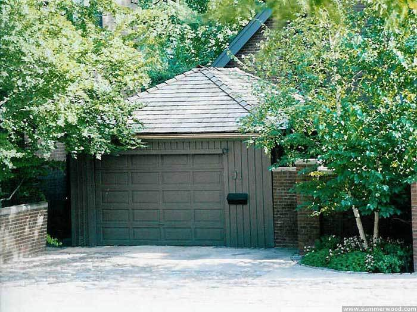

Что это такое? Это – офис типичной игровой компании 80-х годов. Как известно, в те времена игры делали энтузиасты в собственном гараже.

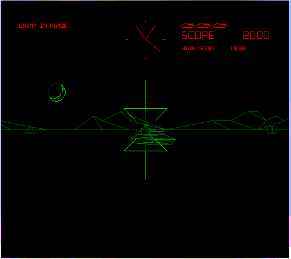

*BattleZone. Atari, 1980*

Вот скриншот из первой трехмерной игры. Проволочная графика, два цвета.

Теперь давайте посмотрим скриншот из современной трехмерной игры.

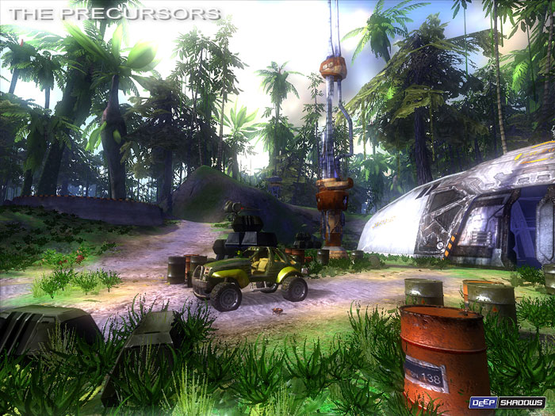

На лицо огромное различие. Что же изменилось за эти годы? Мощность компьютеров выросла в сотни раз. Соответственно, появилась возможность выдавать намного более реалистичную картинку, производить качественную симуляцию мира, воспроизводить отличный звук, и значительно повысить внимание к деталям.

Что сразу видно из скриншота:
– фототекстуры;
– имитация различных материалов (шейдеры);
– сложное освещение;
– обилие деталей;
– построцессинг;

Что не видно из скриншота:
– интерактивность
– точные столкновения, сложная физика;
– искусственный интеллект;
– качественная анимация;
– качественный звук;

Чтобы это увидеть, давайте посмотрим ролик из игры "Xenus: Точка кипения".

[Watch Xenus trailer on YouTube](https://www.youtube.com/watch?v=MBV_Fxryj3Q)

Итак – обилие деталей, обилие систем. Все это тянет за собой значительное увеличение сложности разработки современных игр. Типичная команда разработчиков включает 30 и более человек. Сложность разработки возросла настолько, что многие неопытные, а иногда и опытные, но слишком оптимистично настроенные разработчики просто забывают включить в план работ чуть ли не половину необходимых задач. Это приводит к нарушению сроков, перерасходу бюджета, краху проектов или снижению их качества.

На сегодняшний день разработка игры включает разработку "движка", разработку игрового кода и разработку "контента".

Начиная разработку современного трехмерного "движка" для игры класса "AAA", нужно четко представлять себе, какие системы придется сделать. А сделать придется очень много. Об этом и пойдет речь в нашей лекции, на примере движка Vital Engine.

Итак, разработка движка.

Прежде всего хочу сказать, что многие начинающие разработчики под словом "движок" понимаю рендер. К сожалению, для создания игры одного рендера недостаточно. Забыт звук, колижин, физика, сеть, редакторы и плагины. Скажем, на самом деле разработка внутренних редакторов может занять времени больше, чем разработка той части движка, которая пойдет на диск. Текущий уровень звука, колижина, и физики и других систем в играх очень высок, поэтому их разработка занимает времени не меньше, а может и больше, чем самого рендера.

Хотя, в общем-то, понятно, почему именно рендер получил такую роль – первое ознакомление публики с игрой происходит именно по скриншотам. Поэтому с графики и начнем.

Итак, рендер. Что он должен уметь?

Поскольку коридорные игры в последнее время начали всем надоедать, современные игры постепенно смещаются в сторону открытых пространств и симуляции больших интерактивных миров.

Vital engine использует тайловую карту мира: карта составляется из клеток, каждая клетка – это уровень 600×600м (в Xenus было 200×200м). Уровни можно использовать повторно, что мы активно использовали в Xenus. Причем клетки можно поворачивать на 90,180 и 270 градусов, комбинируя типовые отрезки дорог в трассы.

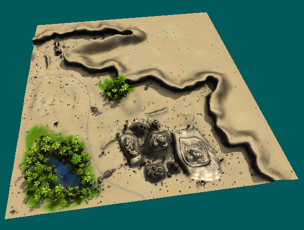

Геометрия рисуется таким образом, что при поворотах вершины клеток стыкуются. В редакторе есть специальные утилиты для автоматической стыковки вершин соседних уровней, для стыковки прорисовки слоев земли, для стыковки освещения.

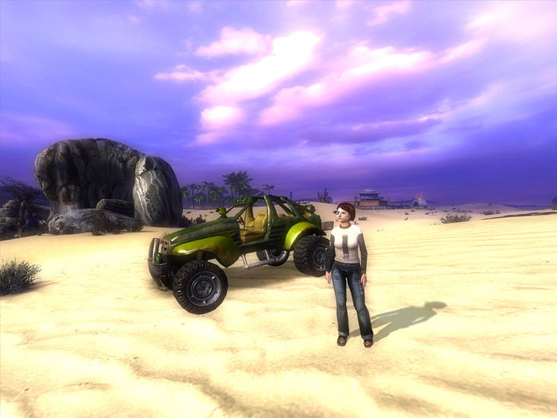

Вот как выглядит эта карта от первого лица.

Поскольку уровни очень детализированы, движек может держать в памяти только примерно 12 уникальных уровней. Это несколько ближайших к игроку клеток. Когда игрок движется по миру, уровни загружают в фоновом потоке.

Чтобы обеспечить высокую дальность видимости, "движек" на дальнем расстоянии рисует т.н. Импосторы (impostors) уровней. Импостор – это упрощенная версия уровня, 2000-3000 треугольников, одна текстура.

Импостор создается автоматически с помощью специальной утилиты. То есть художник загружает уровень в редактор, нажимает «создать импостор», указывает количество треугольников и идет курить. Через 15 минут – импостор готов. Художникам очень нравится.

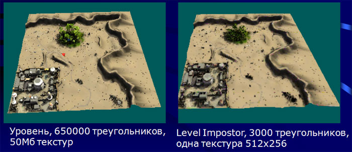

На слайде слева – уровень, справа – импостор. На дальнем расстоянии они практически не отличимы. Технология очень мощная.

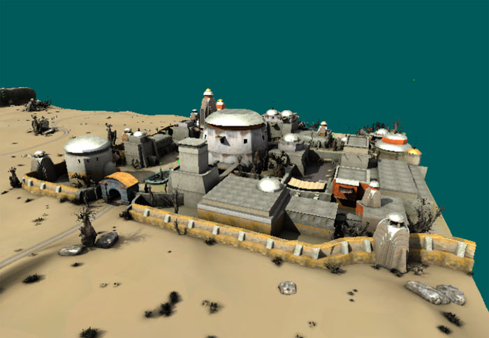

Импосторы занимают мало памяти и отрисовываются очень быстро. Таким способом движек может обеспечивать очень большую дальность видимости.

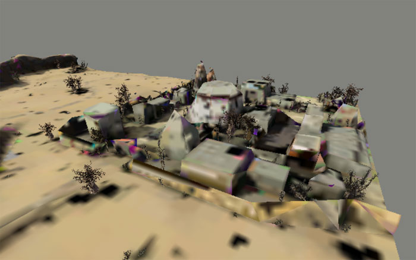

Вот здесь на слайде – реальный уровень, вот импостор.

Терреин и здания – это только начало. Чтобы наполнить мир деталями, нужно расставить в нем массу разнообразных объектов.

Дизайнер делает это в нашем редакторе уровней.

У нас существует четкое разделение: объекты, которые не двигаются (деревья, столбы) и объекты, которые двигаются (персонажи, машины). Это сделано по той причине, что для объектов, которые не двигаются (а их на порядок больше), можно применять определенные оптимизации.

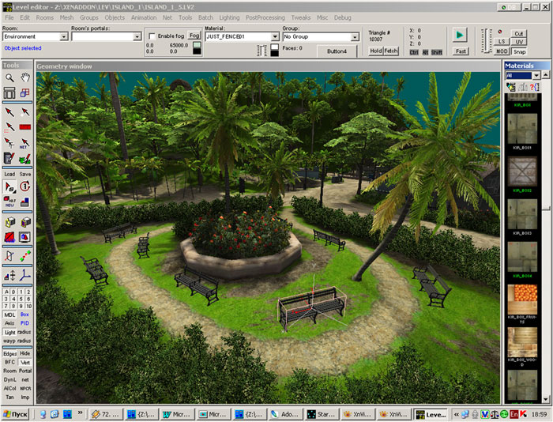

Вот так выглядит редактор. Вот дизайнер расставляет скамейки – двигает, клонирует, поворачивает.

Таких объектов на уровне может быть очень много. Вот что получается. Терреин и дома – геометрия уровня, все деревья – это объекты.

Для того, чтобы движок «потянул» такое огромное количество объектов, он обязательно должен использовать уровни детализации – упрощать модели с расстоянием.

Для многих движков LOD уровни нужно создавать вручную, но плагин экспорта Vital Engine делает это автоматически.

Но даже упрощение моделей не помогает, поэтому на дальнем расстоянии вместо предметов отображаются спрайты. В Xenus мы их делали вручную, теперь они создаются автоматически специальной утилитой.

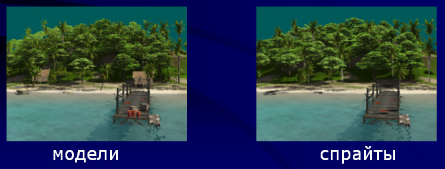

Вот здесь на картинках можно видеть, как выглядят спрайты: слева – только модели, справа – только спрайты. Практически – неотличимы. В Xenus был достаточно четко заметен момент переключения на спрайт, потому что спрайт был один. Теперь их несколько на одну модель – с разным освещением, и при переключении используется crossfade. Переключение практически не заметно.

Статические объекты – это не значит, что они неподвижны. Ближние объекты могут переключаться в активное состояние, и проигрывать анимацию, например – деревья шевелятся на ветру. Они реагируют на взрывы, могут быть разрушены.

[Watch video on YouTube](https://www.youtube.com/watch?v=e_nv_3p9RH0)

Это не специальные кактусы – так можно сделать со всеми кактусами на уровне.

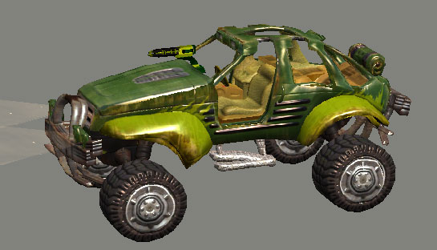

Дальше. Рендеринг движущихся объектов. Это машины, персонажи, предметы которые можно двигать (бочки, ящики). Чем они отличаются от статических? Они все время анимируются. То есть дерево на дальнем расстоянии может застыть и переключиться в спрайт, монстр – нет. Рендерить объекты с анимацией труднее, поэтому они обрабатываются отдельно. Кроме того, для них нужно по-другому считать освещение и тени.

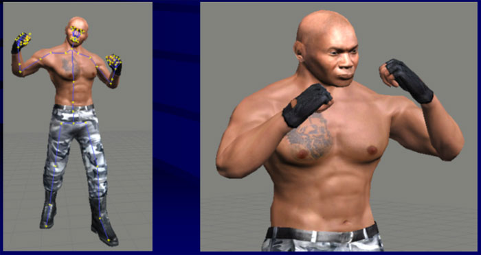

Поскольку в этих моделях много треугольников (в среднем, 5000 треугольников на машину и персонаж), здесь тоже обязательно используются LOD уровни, причем и для скелета тоже. То есть на расстоянии 20 метров лицевая анимация и пальцы уже отключаются.

[Watch video on YouTube](https://www.youtube.com/watch?v=0YfUcgd9OaU)

Вот такой вот солдат у нас.

Дальше. Рендеринг эффектов. Большинство эффектов в игре – это системы частиц. Взрывы, крошка от попадания в стену, огонь, дым из трубы, огонь из дула при стрельбе.

Партиклы реализованы в концепции движка как процедурная модель – то есть модель, которая не создана в Максе, а создается программно в реальном времени и умеет рендерить себя.

Таким же образом реализованы и другие эффекты – трасеры, flare, lens flare, тормозной путь на асфальте, инверсионный след в космосе. Кстати, космос я покажу в конце лекции.

[Watch video on YouTube](https://www.youtube.com/watch?v=9vC6wU8-hJI)

Дальше – объекты детализации. То есть трава, различный мелкий мусор. Позволяют значительно повысить воспринимаемую детализацию. Позволяют скрыть «плоскость земли», уйти от «бега по текстуре».

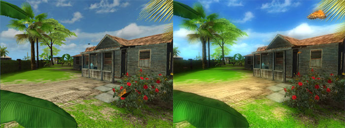

Постпроцессинг. После того, как все отрендерено, начинается финальная обработка двумерной картинки. Это очень важный этап. Построцессинг позволяет минимальными затратами значительно повысить качество картинки.

Постпроцесс описывается как порядок применения различных фильтров к картинке – уменьшение, размытие, комбинирование, выленение ярких частей картинки. Таким образом реализованы bloom(ореолы вокруг ярких предметов, бликов), fake HDR – то есть когда мы выходим из помещения на улицу, сначала все засвечено, потом глаза привыкают. В пустыне у нас идет искажение картинки от теплого воздуха.

Сам построцесс описывается в обычном текстовом файле, вот пример.

Что это дает? Вот картинка без обработки, вот с эффектом bloom. Намного приятней. Солнце светит, травка зеленеет.

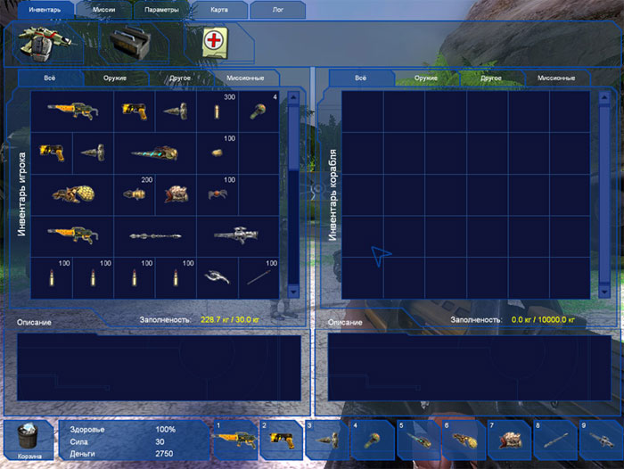

Дальше – рендеринг элементов HUD. Это то, о чем все забывают. В результате начинают вручную прописывать каждую кнопку, диалог, а потом когда нужно что-то подвинуть на 10 пикселов, программист говорит, что он застрелится.

Движок Vital Engine включает систему UI с редактором a-la Delphi. Есть уже готовые элементы интерфейса, в которых в редакторе указывается, какую текстуру взять для рамки, какой ширины вот эта часть и т.д.

Поскольку UI игр не терпит стандартов, придется писать свои элементы, наследуясь от TWidget. Нужно всего лишь добавить новые свойства и реализовать метод Draw(). Новый элемент интерфейса автоматически появляется в редакторе.

Я рассказал о том, что мы рисуем, теперь о том, как мы рисуем. Библиотека шейдеров.

[Watch video on YouTube](https://www.youtube.com/watch?v=iak9fWH-tyo)

Движек написан под DirectX 9.0. У нас нет редактора шейдеров как Maya – shader graph, или как в Unreal Engine. Шейдеры пишет отдельный программист, наследуя класс TShader.

Все-таки шейдеры – это программирование. Каким бы продвинутым ни был художник, он не сможет написать оптимизированный шейдер. А пиксельный шейдер – это то, что выполняется миллионы раз на кадр, так что оптимизация здесь очень важна.

Здесь нужно заменить, что у наш «движок» ориентирован на материалы, а не на шейдеры. То есть художник указывает, что он хочет использовать материал с таким-то поведением, и все. Он не должен заботиться, откуда берется освещение – из lightmap, вершинных цветов, динамического источника – об этом заботится движок. Поэтому одному материалу соответствуют несколько пиксельных шейдеров, и движок сам выбирает, какой их них использовать.

Вот пример описания материала. Текстовый файл, вот указан тип материала: Bumpmap. Этому материалу нужны две текстуры, вот они указаны.

У нас уже реализована куча материалов с различным поведением. Если нужен новый шейдер – добавить занимает от пол до 4 дней.

Освещение.
У нас применяются lightmap’ы для гометрии уровня, вершинное освещение для статических объектов, и динамическое освещение для персонажей.

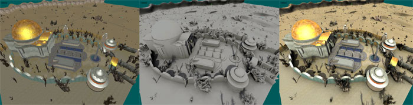

После того, как художник нарисовал уровень, все выглядит вот так.
Совсем плоская картинка, не видно объема.

Вот здесь показано освещение, которое посчитал редактор. Мы считаем ambient ocсlusion + освещение от солнца и источников света. Ambient occlusion позволяет очень хорошо показать форму и объем. Вот здесь видно, как оттенен забор и стена.

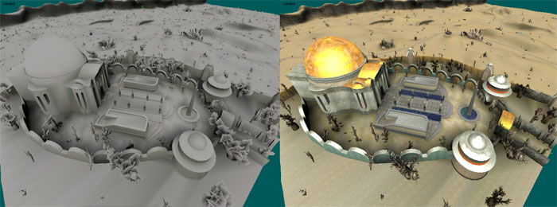

Движек может работать и в режиме только вершинного освещения. При этом экономится память на lightmap. Четкие тени, при этом, естественно, исчезают. Вот так выглядит вершинное освещение.

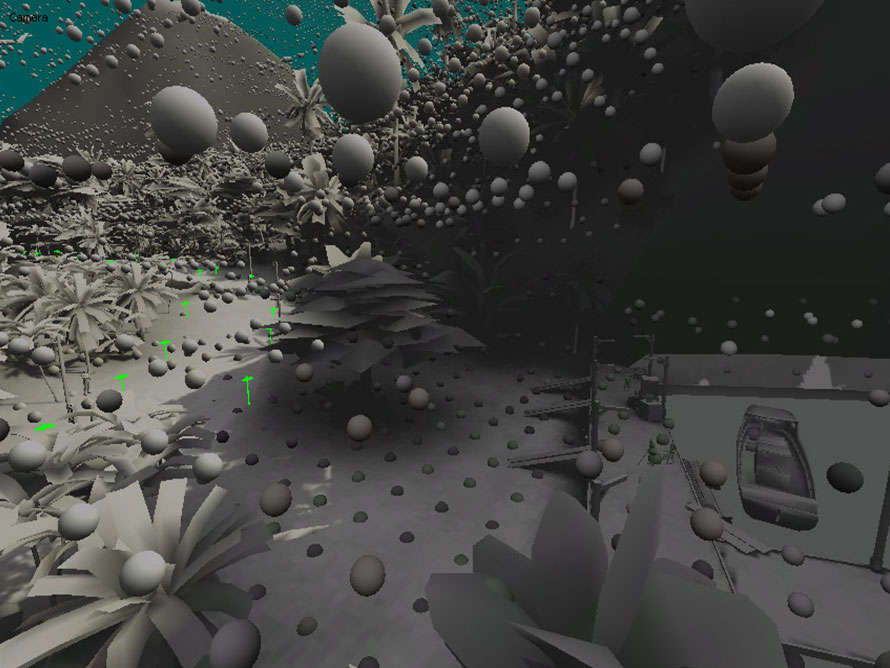

Рассчет освещения – полностью автоматический, может выполняться в пакетном режиме. Делать какие-то раскладки на lightmap не нужно. Обычно художник оставляет на выходные пачку уровней, в понедельник они уже готовы. Полная компиляция одного уровня занимает до 20 часов.

Редактор рассчитывает два освещения: дневное и ночное. Ночное освещение – вершинное. Комбинируя два освещения, можно в реальном времени получать смену времени суток.

О Collision, AI ,физика, сеть звук вам расскажет Сергей Забарянский.

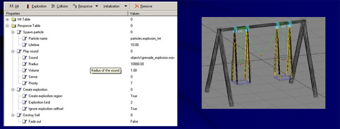

*(Докладывает Сергей Забарянский)*

Редакторы. Движок data-driven. Где же, собственно, создавать эти данные, то есть контент?

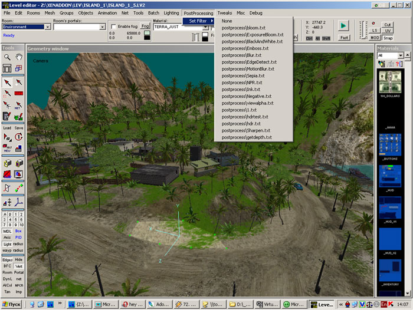

Можно, конечно, взять 3DS Max и делать уровни в нем. Но если вы читали постмортемы от разрабочиков игр, которые так делали, вы знаете, что они об этом сильно пожалели. 3DS MAX не тянет огромные сцены, треубует много памяти, тормозит, глючит, не дает возможности увидеть уровень в финальном качестве.

Наш редактор уровней позволяет делать уровни с нуля или просто вносить небольшие изменения. Поскольку многие вещи все-таки удобнее делать в 3DS Max, редактор с ним тесно взаимодействует. Буквально: вы выбираете несколько треугольников, нажимаете кнопку "Send to max", и переносятся в 3DS MAX. Там делаете изменения, и так же просто переносите обратно.

Движок не использует CSG, как, например Quake. Уровень – это меш. Буквально: художник нарисовал что-то в 3ds max, засунул в движок – и можно бегать, стрелять, ездить.

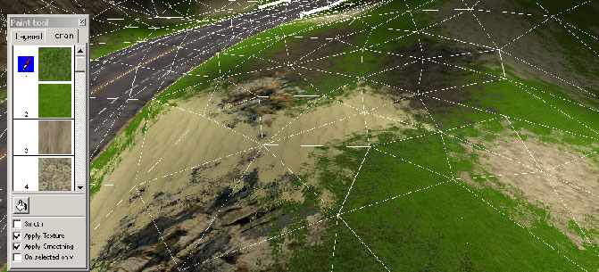

Что кроме редактирования геометрии: накладывание материалов, прорисовка слоев террейна. Рисуется кисточкой. Наложили материал – рисуем.

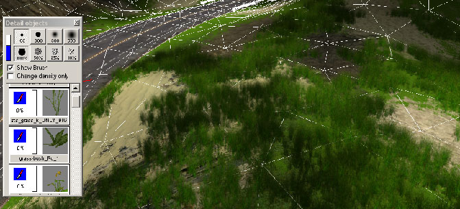

Прорисовка травы – тоже кисточкой. В диалоге выбираем стиль, и рисуем.

Одно из самых важных предназначений редактора – расстановка на уровне объектов и редактирование их параметров.

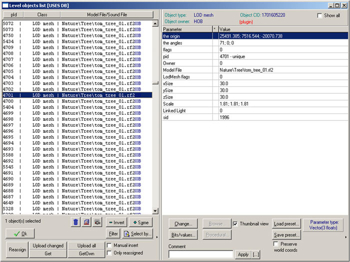

Вот так выглядит диалог: у каждого объекта есть набор параметров.

Причем если программист написал новый юнит, он появляется в редакторе автоматически, редактор перекомпилировать не нужно.

Редактор поддерживает коллективную работу: объекты могут расставлять несколько человек одновременно. Например, дизайнер уровня еще расставляет деревья, а гейм дизайнер уже расставляет персонажей и прописывает диалоги и квесты. Оба скидывают свои объекты на сервер, и получают с него чужие. Вот тут есть кнопки get и upload. На сервере установлена база данных, в которой хранятся все объекты всех уровней.

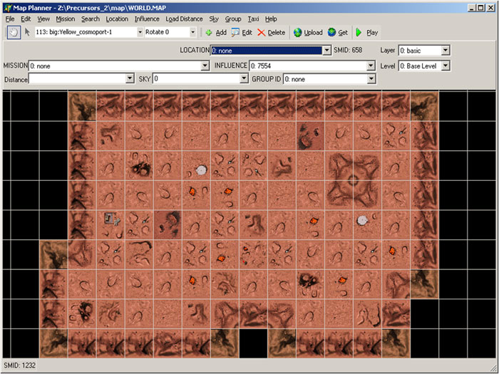

Дальше. Редактор карты мира. Здесь все очень просто и понятно. Тоже поддерживается одновременная работа и аплоад на сервер.

Плагин экспорта. Что касается редактирования уровней – тут лучше иметь свой редактор. Но что касается моделей – тут 3DS Max "не переплюнуть". Поэтому мы своего редактора не делали. У нас есть мощный плагин экспорта, который может автоматически создавать LOD уровни геометрии и скелета при экспорте, компрессит анимацию, поддерживает любой тип ключей анимации.

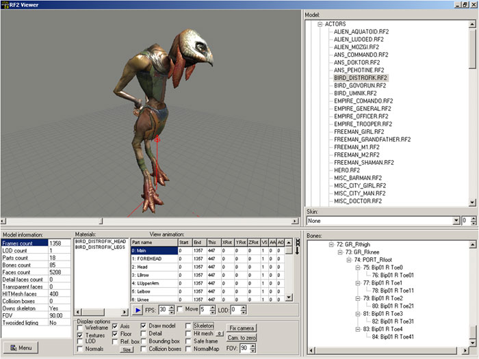

Чтобы увидеть, что получилось, используется просмотрщик моделей. Он запускается автоматически после экспорта. Вот так он выглядит. Вот список моделей, вот иерархия скелета, вот группы костей, вот материалы. Здесь можно проверить анимацию, разделение на части, правильно ли работают контроллеры.

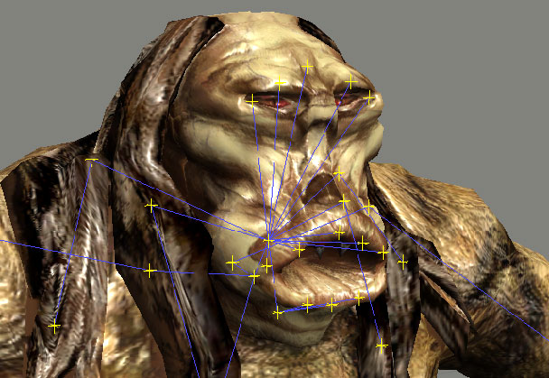

Отдельно нужно сказать о скелетной анимации. Для того, чтобы реализовать то, что мы видим в современных играх, система скелетной анимации должна позволять очень много. Я здесь перечислил, зачитаю:

- блендинг 2 или 4 анимаций
- скелет разделен на части – каждая часть проигрывает свою анимацию
- можно программно скрывать треугольники, привязанные к указанной группе костей
- можно программно вращать группы костей (bone controller)
- можно программно управлять положением и ориентацией группы костей (bone controller)
- используется сжатие анимации (персонаж – 4000 кадров, 60 костей)
- используется LOD скелета
- можно «вешать» одну модель на кость («порт») другой – пистолет в руке, партикл выстрела на дуле пистолета
- лицевая анимация – 12 костей на лице

Дальше. Редактор системы частиц.

Все, о чем я рассказал на этой лекции – есть в Vital Engine.
Вопросы?

## Другие материалы к слайдам

Boiling Point: Road to Hell (Xenus) trailer

[Watch on YouTube](https://www.youtube.com/watch?v=PJcGcuDtDY8)

The Precursors gameplay

[Watch on YouTube](https://www.youtube.com/watch?v=Xt-sv4_Oe1I)