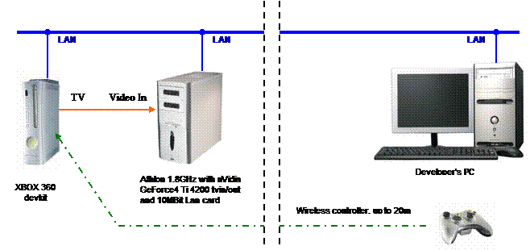
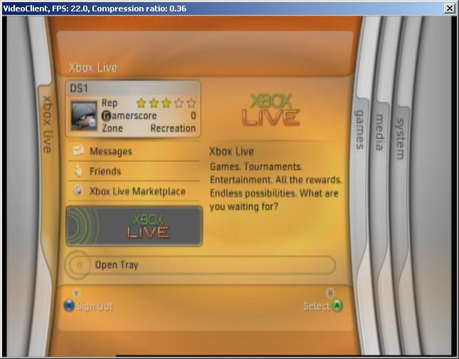

# Video broadcast from console devkit for remote development

I'm working in game development company [[6]](http://www.deep-shadows.com/). Recently we finally got XBOX 360 devkit, and were happy to start porting our game engine to new platform.

Despite strong security requirements from Microsoft, devkit itself is a rather expensive piece of hardware. Just placing it next to the lead programmer's desktop in large office room is insecure. Another problem is that when some other programmer has to fix a few bugs, he has to move devkit and TV next to his computer.

So we decided to lock devkit in server room, and use remote development.

XBOX 360 debugging is done through LAN, so we just had to connect LAN jack into devkit. Luckily, wireless controller can work at distances up to 15-20 meters. USB connection with PC is required for DVD emulation mode, but we didn't need that yet. Anyway, there are several USB-over-network solutions available [[7]](http://www.usb-over-network.com/). Sound can be delivered with wireless headphones. The only problem left was a video connection.

We had no possibility to provide video cable link from server room to our workplaces. A search for some wireless solution had no luck. The solution we found is to put an old PC, equipped with TV-in on videocard, next to devkit, to broadcast console video output via LAN.

There are many ready to use software solutions available (Microsoft Media Encoder, VideoLAN etc.), but everything we tested, showed unacceptable lag. Common video broadcast software is specially designed for slow network connections, and receiving side (player) is buffering several frames, or even seconds, of video stream to compensate connection problems.

After small research, I decided to implement my own version of simple video streaming.

Videocard is capturing in 640x480 resolution in UYVY format. Single frame is 640x480x2 = 614400 bytes. For 10Mbit network, we can transmit 15 FPS maximum. To get desired 30 FPS, we have to use some compression. We only need 0.5 compression ratio, so I decided to use losses LZO algorithm [[4]](http://www.oberhumer.com/opensource/lzo/).

Using my experience from previous projects, I was able to make a beta version of application in Delphi 7.0 with tsCap32 component [[2]](http://tscap32.sourceforge.net/) just in one hour. Later time I also implemented Zlib [[3]](http://www.zlib.net/) and RangeCoder [[5]](http://www.compressconsult.com/rangecoder/) just for comparison. This algorithms provide better compression, but raw 10Mbit LAN transmit speed is faster then compress/transmit/decompress.

To achieve better compression, application transforms [UYVY] stream into [YY][U][V]. Adjacent pixels a likely to contain similar values in same channels. As a result of this transformation, compression ratio increases by ~20%.

A number of lossy filters can be applied to frames. Quantization filters level 1 and level 2 are clearing lower 2 bits in Y channel, and 2 or 3 bits in UV channels, respectively. These filters also effectively remove video noise.

Deinterlace filter is using only odd fields for final image output. Even fields are reconstructed with linear interpolation. Quick implementation just sets all even fields to zero before transmitting a frame, thus effectively doubling compression ratio.

Server supports multiple clients, but each new client will decrease overall FPS, since server's network bandwidth is limited.

Current application supports only UYVY source video format.

Full package (source code and binaries) can be downloaded here [[1]](http://www.deep-shadows.com/hax/downloads/videobroadcast.rar).

Before usage, server's IP address should be specified in .ini files.

Roman Lut  
[hax@deep-shadows.com](mailto:hax@deep-shadows.com)  
[http://www.deep-shadows.com/hax/](http://www.deep-shadows.com/hax/)

---

## References

1. Source code and binaries of VideoBroadcast app  
   [http://www.deep-shadows.com/hax/downloads/videobroadcast.rar](http://www.deep-shadows.com/hax/downloads/videobroadcast.rar)

2. tsCap32 video capture component for Delphi  
   [http://tscap32.sourceforge.net/](http://tscap32.sourceforge.net/)

3. ZLIB  
   [http://www.zlib.net/](http://www.zlib.net/)

4. MiniLZO compression library  
   [http://www.oberhumer.com/opensource/lzo/](http://www.oberhumer.com/opensource/lzo/)

5. Range Encoder compression library  
   [http://www.compressconsult.com/rangecoder/](http://www.compressconsult.com/rangecoder/)

6. Deep Shadows game development company  
   [www.deep-shadows.com](http://www.deep-shadows.com/)

7. USB over network  
   [http://www.usb-over-network.com/](http://www.usb-over-network.com/)
