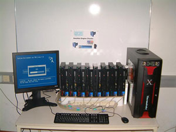

# Распределённые вычисления в малом и среднем офисе

*Статья опубликована на сайте [DTF.ru](https://web.archive.org/web/20080101065215/http://dtf.ru/articles/read.php?id=46196)*  
*Article published on [codeproject.com](http://www.codeproject.com/Articles/28788/Distributed-Computing-in-Small-and-Medium-Sized-Of)*

При разработке контента для компьютерных игр встречается ряд задач, требующих большой вычислительной мощности. Например, расчет освещения на среднем игровом уровне в нашем редакторе занимает примерно сутки.

Понятно, что чем медленнее работает операция – тем реже ее будут выполнять, и тем меньше результирующее качество, поскольку качество требует большого количества итераций для подбора параметров.


Я длительное время интересовался концепцией GPGPU[1] – использования мощности видеокарты для увеличения скорости работы внутренних утилит. Ранние версии нашего редактора уровней рассчитывали освещение (Ambient occlusion[2] + direct lighting), используя рендеринг видов для сторон полукуба (hemicube) из каждой точки карты освещения (lightmap).

К сожалению, в результате экспериментов выяснилось, что из-за низкой скорости обмена CPU↔GPU, простенький CPU-only рейтрейсер выполняет ту же работу в 2-3 раза быстрее. Возможно, я смог бы добиться каких-то результатов, реализовав весь алгоритм полностью на GPU, но такая реализация требует неоправданно больших трудозатрат. При переносе задачи на GPU приходится отойти от линейного программирования, и адаптировать алгоритмы под архитектуру видеокарты. Только совсем недавно nVidia предоставила более-менее простой framework, предполагающий программирование на C[3][28].

Появление многоядерных процессоров наметило некоторые перспективы в этой области. Второй процессор, в отличие от GPU, может выполнять тот же бинарный код – то есть для повышения скорости работы не придется полностью переносить весь алгоритм на другой язык программирования и другую архитектуру.

Я не успел воспользоваться этой возможностью, так как наконец-то понял, что нужно мыслить масштабнее – и пора уже давно.

  
Прежде чем продолжить, я попрошу читателя нажать CTRL+ALT+DEL и переключиться на закладку "производительность". Взгляните на индикатор "Использование CPU". Думаю, большинство из вас увидит там значение, не превышающее 10%. Если у Вас двухпроцессорная машина – второй процессор практически все время будет свободен.

При обычной работе полная мощность компьютера используется только в короткие моменты генерации отклика на действие пользователя. Паузы между нажатиями клавиш при наборе текста в Microsoft Word для процессора сравнимы с вечностью. Доля приложений, использующих полную мощность компьютера, составляет не такой уж и большой процент.

Теперь посчитайте, какая мощность простаивает в среднем офисе (50+ машин) – и Вы получите цифру, дотягивающую до современных суперкомпьютеров.

  
К сожалению, некоторое традиционное отношение кластерных вычислений в высокой науке долгое время служило для меня ментальным барьером для попыток использования распределенных вычислений для решения "приземленных" практических задач. К счастью, великолепное приложение – Incredibuild[4] – показало, что их можно использовать не только для практических, но и, возможно, real-time задач.

Набор рабочих станций, соединенных TCP/IP сетью (кластер), можно рассматривать как мультипроцессорную систему с разделенной памятью. Для выполнения расчетов на такой системе наиболее прост и эффективен подход с разделением данных (Data parallel computing).

  
Говоря простыми словами, если обычное приложение обрабатывает массив независимых друг от друга данных, то при вычислении на кластере каждая рабочая станция получает на обработку свой кусочек массива.

При работе на такой системе необходимо заниматься разделением задачи на "кусочки", отсылкой данных на рабочие станции, выполнением задач на рабочих станциях, приемом обработанных данных, а также отсылкой на рабочие станции каких-либо глобальных данных, требуемых при расчете выделенной задачи.

Этой работой занимается программное обеспечение кластера. Я долго пытался найти готовое ПО, удовлетворяющее следующим требованиям:

- на рабочих станциях установлена Windows XP;
- необходимо использовать только свободное процессорное время, не мешая пользователю;
- "никто никому ничего не должен" – рабочая станция может быть перезагружена, отключена или занята ресурсоемкой задачей в любой момент времени.

Первое же условие отбросило практически всех кандидатов[5][6]. Причина понятна – зачем покупать лицензионную ОС на каждый рабочий узел, если есть бесплатный linux?

Второе и третье условие свело список кандидатов к нулю, хотя из рассмотренных библиотек хочется отметить несколько экземпляров, которые мне понравились.

MPICH2[7]. Реализация библиотеки MPI для Windows. К сожалению, запускает процессы с нормальным приоритетом, что мешает работе пользователя. Если рабочая станция становится недоступной в процессе использования кластера – это приводит к ошибке.

libGlass[8]. Несмотря на достаточно удобную модель программирования, я побоялся использовать эту библиотеку, т.к. она долгое время не обновлялась.

Alchemy[9]. Наиболее интересный кандидат. Предлагает удобную модель программирования, работает на основе .NET framework, что, кстати, теоретически позволяет использовать в качестве рабочей станции, скажем, смартфон Motorola Mpx 200. Содержит наглядные примеры, и продолжает развиваться.

К сожалению, при тестировании несколько примеров "вылетало" при выходе из приложения, и оставляло холостые процессы на рабочих станциях.

После безуспешных поисков, я принял решение разработать библиотеку самостоятельно.

### Hxgrid

При разработке библиотеки я ориентировался на следующие дополнительные предположения (кроме приведенных ранее):

- для пересылки данных используется локальная сеть 10-1000MBit, по протоколу TCP/IP;
- сеть считается внутренней и безопасной; библиотека не содержит абсолютно никаких средств аутентификации и защиты от атак. Хорошая система безопасности, с одной стороны, значительно увеличивает сроки разработки библиотеки, с другой – усложняет использование;
- соотношение "время пересылки объема данных/время выполнения задачи на узле" <=0.1. При этом объем данных может составлять до от 0 до 100 Мбайт;
- в сети присутствует постоянно доступный сервер, на котором можно запустить программу-координатор;
- библиотеку предполагается использовать как для долгих (до нескольких часов), так и полуинтерактивных задач (до нескольких секунд);
- в данный момент времени на текущей машине может выполняться только одно приложение, использующее кластер (ограничение текущей версии);
- на одной машине могут выполняться одновременно приложение, использующее кластер, агент и координатор;
- рабочие узлы могут становиться недоступными или доступными во время использования кластера. Узлы, ставшие доступными, должны включаться в работу немедленно;
- кластер может использоваться одновременно несколькими пользователями. Доступные вычислительные ресурсы должны распределяться поровну;
- на рабочих узлах необходимо использовать все доступные процессоры;
- предполагается использовать библиотеку из C++ и Delphi.

Для сокращения времени разработки, для реализации был выбран Delphi. Библиотека использует COM-подобные интерфейсы[11]. Библиотека использует Jedy Visual Code Library[15] и ZLIB[27].

### Настройка кластера

Для начальной установки кластера необходимо скачать дистрибутив[10.1].

  
Кластер состоит из трех компонент:

1. Координатор. Координатор необходимо установить на машине, которая постоянно доступна. Координатор занимается мониторингом доступных вычислительных ресурсов, и выдачей этой информации пользователям кластера (приложениям, использующим библиотеку). Координатор должен быть установлен только на одном компьютере в сети.Агенты и Пользователи находят Координатор, посылая broadcast сообщения, поэтому при переносе координатора на другую машину или смене IP адреса, не требуется конфигурировать всех агентов.После получения списка агентов, Пользователь общается с ними напрямую. Это позволяет избежать лишних задержек при передаче данных по сети.

2. Агенты. Агенты устанавливаются на всех компьютерах в сети. Агент позволяет использовать свободное процессорное время компьютера, на котором он установлен.

3. Пользователь – приложение, написанное с использованием библиотеки hgGrid.

### Модель программирования

hgGrid позволяет выполнять задачи (tasks) на рабочих узлах кластера. Приложение добавляет набор задач в очередь выполнения и ожидает их завершения.

Входные данные для каждой задачи записываются в поток (IGenericStream inStream). При успешном выполнении задачи, пользователь получает результат работы задачи тоже в потоке (IGenericStream outStream).

При необходимости, агент, выполняющий задачу, может запросить у пользователя дополнительные данные, общие для всей сессии.

Каждая задача представляет собой процедуру:

```cpp
typedef bool (__cdecl TTaskProc)(IAgent* agent, DWORD sessionId, IGenericStream* inStream, IGenericStream* outStream);
```

```pascal
type TTaskProc = function(agent: IAgent; sessionId: DWORD; inStream: IGenericStream; outStream: IGenericStream): boolean; cdecl;
```

где sessionId – уникальный идентификатор сессии, используется при получении дополнительных данных сессии.

Функция возвращает false, если была прервана (см. ниже).

Такие процедуры должны находиться в DLL. Библиотека осуществляет "доставку кода" процедуры передачей DLL каждому агенту. Процедура TTaskProc должна быть thread-safe. После выполнения задачи на агенте, библиотека передает по сети выходной поток приложению, и вызывает калбек FinalizeTask():

```cpp
typedef void (__cdecl TFinalizeProc)(IGenericStream* outStream);
```

```pascal
type TFinalizeProc = procedure(outStream: IGenericStream); cdecl;
```

Эта функция тоже должна быть thread-safe.

Если однопоточное приложение обрабатывает большой массив независимых данных, то очевидным способом ускорения операции является разделение массива на небольшие участки, которые будут обрабатываться на рабочих узлах кластера параллельно.

### Принцип работы библиотеки

Каждый агент при запуске находит координатора, посылая broadcast сообщения по локальной сети. После соединения с координатором, агент периодически отсылает ему свое состояние (количество свободного процессорного времени, свободной физической памяти, количество назначенных задач).

При инициализации библиотеки hxGrid, она находит координатора, посылая broadcast сообщения по локальной сети. После соединения с координатором, библиотека запрашивает IP адреса всех агентов и устанавливает с ними прямое соединение. Библиотека готова к выполнению задач.

Приложение, использующее библиотеку, добавляет задачи в очередь выполнения. С момента добавления первой задачи, библиотека начинает рассылку заданий агентам в фоновом потоке, и прием завершенных задач. Если связь с каким-либо агентом теряется, библиотека отсылает задачи, выполнявшиеся на этом агенте, другому агенту.

При завершении приложения, библиотека отсоединяется от агентов.

Для повышения эффективности, были применены следующие технические решения:

- чтобы компенсировать время передачи данных, библиотека пересылает следующее задание еще до того, как агент отрапортует о завершении текущего задания;
- в некоторых случаях библиотека отсылает копию задания, выполняющегося на каком-либо агенте, другим свободным агентам. Это позволяет избавиться от ожидания, если задача попала к агенту, у которого сейчас нет доступных вычислительных ресурсов;
- библиотека контролирует количество доступного процессорного времени и физической памяти на агентах. Библиотека не будет посылать задания, если доступных ресурсов на агенте меньше, чем указано в настройках библиотеки;
- библиотека контролирует длину очереди задач и ее объем. Если суммарный объем входных потоков (inStream) превышает сконфигурированное значение, библиотека блокирует выполнение приложения до завершения хотя бы одной задачи;
- если установлена соответствующая опция, библиотека может свопить на диск очередь задач, чтобы не занимать много памяти;
- при передаче по сети больших объемов данных, используется предварительное сжатие ZLIB;
- агент локально кеширует DLL с кодом процедур на время сессии;
- если на агенте нет свободного процессорного времени в течении 10 секунд, то предполагается, что пользователь запустил ресурсоемкое приложение. В этом случае агент полностью приостанавливает рабочие потоки на 25 секунд, иначе менеджер потоков Windows будет выделать 120ms time slice рабочим потокам[12]. Если этого не делать, то, например, при игре в Counter-Strike, каждые 5 секунд будет возникать провал FPS.



*Кластер на основе PlayStation 2[16.1]*

### Использование библиотеки

Библиотека поставляется в виде двух DLL: hxGridUserDLL.dll, zlib.dll.

Чтобы начать сессию, нужно создать объект IGridUser (см. примеры examples\picalculator\C++ и examples\picalculator\Deplhi):

```cpp
====================================
#include "hxGridInterface.h"

IGridUser* user = CreateGridUserObject(IGridUser::VERSION);
======================================
```

```pascal
====================================
Uses T_GenericStream, I_GridUser;

var user: IGridUser;

begin IGridUser_Create(user);
======================================
```

С этого момента можно выполнять задачи на агентах:

```pascal
====================================
IGenericStream* stream = CreateGenericStream();

DWORD d=1+i*9; stream->Write(&d,4); user->RunTask("picalculator_task.dll","RunTask",stream,Finalize,&d,true);
======================================

====================================
//записать входные данные для задачи в поток

stream := TGenericStream.Create(); d := 1+i*9; stream.write(d,4);

//добавить задачу в очередь выполнения
user.RunTask('picalculator_task.dll','RunTask',stream,Finalize,d,true);

//ownership потока перешел библиотеке, убрать наш refcount
pointer(stream) := nil;
======================================
```

В параметрах метода RunTask() указываются:

- имя dll, в которой находится код задачи.;
- символьное имя процедуры (процедура должна быть экспортирована из DLL по имени);
- поток с входными данными. Поток переходит во владение библиотеке (библиотека самостоятельно снимет 1 refcount);
- адрес локальной процедуры, которая будет вызвана для обработки выходных данных;
- адрес переменной, в которую будет записан уникальный id задачи;
- флаг блокирования.

Если задача не может быть добавлена немедленно (из-за ограничения на длину очереди или общую память очереди задач), и флаг блокирования установлен, то метод не вернет управление до успешного выполнения. Иначе вернет S_FALSE (при этом можно подождать удачного момента с помощью метода User->WaitForCompletionEvent()).

Необходимо учитывать, что на удаленном компьютере могут быть не установлены некоторые run-time библиотеки. Лучше всего это сразу проверить, просмотрев таблицу импорта с помощью утилиты tdump. Чтобы передать на агент дополнительные DLL, нужно указать их через запятую после основной DLL, например:

```pascal
user.RunTask('GridGMP_task.dll,GMPPort.dll','RunTask',stream,Finalize,d,true);
```

Для обеспечения нормальной работы агента, необходимо, чтобы задача периодически вызывала метод агента:

```pascal
if (agent.TestConnection(sessionId)<>S_OK) then begin result := false; exit; end;
```

чтобы агент мог прервать или приостановить выполнение задачи. Этот метод работает очень быстро, и его можно смело вызывать в длинных циклах.

Для завершения сессии нужно уничтожить объект IGridUser :

```cpp
====================================
user->Release();
======================================
```

```pascal
====================================
user:=nil;
======================================
```

В этом коротком абзаце описан весь процесс простого использования библиотеки.

  
*Кластер на основе XBOX[17]*

### Получение дополнительных данных сессии от пользователя

В некоторых случаях задачи, выполняемые на агентах, должны обращаться к определенному набору данных, общему для всех задач сессии.

Если объем данных велик, то передавать их каждый раз во входном потоке задачи неэффективно. Для получения общих данных агент предоставляет метод:

```cpp
virtual HRESULT __stdcall GetData(DWORD sessionId, const char* dataDesc, IGenericStream** stream) = 0;
```

```pascal
function GetData(sessionId: DWORD; dataDesc: pchar; var stream:IGenericStream): HRESULT; stdcall;
```

dataDesc – символьный описатель данных, например 'geometry';  
stream – поток, в который будут записаны данные (объект потока создает агент. Должен быть освобожден пользователем).

Для отсылки данных, на пользователе нужно зарегистрировать callback:

```cpp
====================================
typedef void (__cdecl TGetDataProc)(const char* dataDesc, IGenericStream** outStream);

user->BindGetDataCallback(GetDataCallback);
======================================
```

```pascal
====================================
type TGetDataProc = procedure(dataDesc: pchar; var stream: IGenericStream); cdecl;

User->BindGetDataCallback(callback: TGetDataProc); stdcall;
======================================
```

TGetDataproc должна создать объект потока и записать в него данные.

Обычно задача проверяет, получены ли уже глобальные данные, и если нет, то получает их и записывает в глобальный кеш, адресуемых по sessionId и символьному имени.

Пример использования этих методов демонстрирует приложение examples\normalmapper-3-2-2.

  
*Кластер на основе PlayStation 2[16.2]*

### Дополнительные методы

```cpp
virtual void __stdcall GetSettings(TGridUserSettings settings);
virtual void __stdcall SetSettings(TGridUserSettings settings);
```

```pascal
User.GetSettings(var settings: TGridUserSettings); stdcall;
User.SetSettings(var settings: TGridUserSettings); stdcall;
```

Методы позволяют программно изменить настройки библиотеки. Например, можно отключить сжатие при передаче данных, если приложение сжимает поток самостоятельно.

```cpp
virtual HRESULT __stdcall CompressStream(IGenericStream* stream);
```

```pascal
User.CompressStream(stream: IGenericStream): HRESULT; stdcall;
```

Метод позволяет сжать поток. Например, имеет смысл один раз подготовить и сжать блок глобальных данных, а потом только отдавать его в калбеке TGetDataCallback(). Агент автоматически распакует поток перед передачей задаче на агенте. См. пример examples\normalmapeer-3-2-2. Библиотека определяет сжатые потоки по специальной сигнатуре в начале потока.

```cpp
virtual HRESULT __stdcall FreeCachedData(DWORD sessionId, const char* dataDesc);
```

```pascal
HRESULT __stdcall IAgent::FreeCachedData(DWORD sessionId, const char* dataDesc) = 0;
```

Агент кеширует в памяти глобальные данные, запрашиваемые задачей на время сессии. Метод позволяет освободить эти данные, если известно, что они никогда не понадобятся. Используется для минимизации использования памяти на агентах.

Например, задача получает глобальные данные, строит из них структуры данных, и запоминает их в глобальном кеше. Остальные задачи будут использовать те же глобальные структуры, и вызывать agent.GetData() во время данной сессии уже не будут.

### Примеры использования библиотеки

### PI Calculator (examples\PICalculator)

Наиболее простой пример. Расчет числа Пи с указанной точностью. Каждая задача считает [n…n+8] цифр числа.


### Mandelbrot (examples\mandelbrot\)

Эксплорер фрактала Мандельброта. Есть три версии:


- SingleCPUExtended – с использованием 10-байтных чисел с плавающей запятой (FPU native) на одном CPU. Недостаточная точность не позволяет выполнять большое увеличение.
- SingleGMP – с использованием 256-байтных "больших чисел" на одном CPU. Используется порт библиотеки GMP[13].
- GridGMP – с использованием 256-байтных "больших чисел" и библиотеки hxGrid. Каждый агент считает одну вертикальную линию картинки. Это приложение также показывает пример неудачного распределения нагрузки – вертикальные линии могут требовать совершенно разного количества вычислений, часто в соотношении 1:50. Правильным способом мог бы быть просчет каждого n-го пиксела картинки при горизонтальном сканировании.

### Normalmapper (examples\normalmapper-3-2-2\)

ATI NormalMapper 3.2.2[14], переписанный под библиотеку hxgrid.

Normalmapper является идеальным приложением для распределенных вычислений. Пикселы карты нормалей рассчитываются в цикле и не зависят друг от друга. При включении ambient occlusion, расчет одной карты нормалей может занимать до 12 часов.

Модифицированная версия отсылает на агенты задачи расчета примерно ста пикселов карты нормалей. Каждый агент получает готовые структуры (деревья и геометрию) с помощью метода IAgent->GetData(). Объем геометрии может достигать 100Мбайт, и передавать ее каждый раз во входных данных задачи – не неэффективно.

Кроме того, в приложение добавлен механизм ожидания (в данный момент выполняется только одна копия приложения) – можно запустить несколько копий NormalMapper с разными моделями. Они будут выполняться по очереди.

Следует заметить, что библиотека не гарантирует очередность выполнения задач. Поскольку при расчете карты нормалей очередность расчета пикселов имеет значение (из-за пересечения треугольников или их границ), приложение предпринимает специальные меры, чтобы результат получался полностью совпадающим с оригинальной версией.

### Установка Distributed Normalmapper

Приведу здесь краткую справку, как использовать Distributed Normalmapper:

1. установить на один компьютер в сети программу-координатор (hxgrid_coordinator_setup.exe[10.2]);
2. установить на все компьютеры сети агенты (hxgrid_agent_setup.exe);
3. установить на компьютер художника Normalmapper (hxgri_ATI_NormalMapper_setup.exe)

После этого приложение доступно через меню Пуск: Пуск-> Программы-> hxgrid->Normalmapper.

### Результаты

Тестовые системы:

1. Intel Pentium D Presler 3.0GHz
2. Intel Pentium 4 2.8 GHz (HT)
3. Intel Core 2 Duo 1.8GHz
4. Intel Core 2 Duo 2.13GHz
5. Athlon X2 3600+
6. LG GE notebook (Intel Celeron M 1.4 GHz)

Производился расчет карты нормалей car_low.nmf+car_high.nmf, 4096×4096, Bent normals, Ambient occlusion.

Normalmapper.exe -on carlow.nmf carhigh.nmf 2048 2048 test.tga

Оригинальная версия ATI Normalmapper была перекомпилирована в VS 2005 с агрессивными оптимизациями (без PGO), чтобы результаты экспериментов были "честными".

Эксперименты показали, что hxGrid можно с успехом использовать, чтобы просто задействовать все ядра одного компьютера. Для этого на нем нужно установить все три компонента библиотеки (агент, координатор, приложение). Если на машине нет сетевой карты, необходимо установить Microsoft loopback адаптер и присвоить ему сетевой адрес.

  
*Расчет карты нормалей, часов*


*Прирост скорости в результате использования библиотеки, раз*

Итого, расчет карты нормалей на кластере занял 8 минут, против 4 часов на отдельном компьютере (ускорение в 23 раза).

Расчет на HT процессоре показал вполне ожидаемый пророст скорости – 12%, а вот результаты Core 2 Duo я объяснить не могу – 35%, хотя я ожидал увидеть ~80%. Возможно, узким местом в данном случае оказался общий L2 кеш, т.к. Pentium D Presler показал результат 73%.


*Состояние кластера (конец рабочего дня)*

### Энергопотребление

Из-за высокого энергопотребления, кластерная комната обязательно должна быть оборудована вентиляцией и охлаждением. Насколько возрастает энергопотребление офиса при активизации агентов?

  
*Энергопотребление узла кластера, Вт*

100% загрузка процессора увеличивает энергопотребление примерно на 30Вт. Точность моего мультиметра может быть поставлена под сомнение (MT-930F), но даже при 50 узлах, увеличение мощности составит всего 1.5кВт, что меньше хорошего электрочайника (1.8кВт).

### Известные проблемы

При разработке библиотеки мне не удалось решить следующие проблемы:

- из-за невозможности насильно прервать соединение на стороне сервера (особенности компонента TServerSocket), отсоединение от агентов может занять до 30 секунд. При использовании Distributed Normalmapper это не составляет проблемы, но при решении real-time задач это может быть проблемой. Если кто-то может подсказать решение – я буду благодарен[29].
- не реализованы методы StartSession()/EndSession();
- не окончен механизм обработки ошибок и исключений.

### Ссылки

[1] [General-Purpose Computation Using Graphics Hardware](http://www.gpgpu.org/)  
[2] [Ambient occlusion – From Wikipedia, the free encyclopedia](http://en.wikipedia.org/wiki/Ambient_occlusion)  
[3] [NVIDIA CUDA Homepage](http://developer.nvidia.com/category/zone/cuda-zone)  
[4] [Incredibuild by Xoreax software](http://www.xoreax.com/)  
[5] [Globus Toolkit Homepage](http://www.globus.org/toolkit/)  
[6] [Кластерная система Condor](http://www.osp.ru/os/2000/07-08/178077/)  
[7] [MPICH2](http://www.mcs.anl.gov/research/projects/mpich2/)  
[8] [libGlass – distributed computing library](http://libglass.sourceforge.net/download.php)  
[9] [Alchemy – distributed computing library](http://www.cloudbus.org/~alchemi/projects.html)  
**[10.1][10.2] Дистрибутив hxGrid**
   [hxgrid_agent_setup.zip](hxgrid_agent_setup.zip),
   [hxgrid_coordinator_setup.zip](hxgrid_coordinator_setup.zip),
   [hxgrid_ATI_NormalMapper_setup.zip](hxgrid_ATI_NormalMapper_setup.zip)  
[11] [Программирование с использованием COM-подобных интерфейсов](http://www.dtf.ru/articles/read.php?id=44995)  
[12] [То, что вам никто не говорил о многозадачности в Windows](http://www.dtf.ru/articles/read.php?id=39888)  
[13] [The GNU MP Bignum Library](http://gmplib.org/)  
[14] [ATI Normalmapper](http://developer.amd.com/archive/gpu/normalmapper/Pages/default.aspx)  
[15] [Jedy Visual Code Library](http://jvcl.delphi-jedi.org/)  
[16.1][16.2] [PlayStation 2: Computational Cluster](http://arrakis.ncsa.uiuc.edu/ps2/cluster.php)  
[17] [Unmodified Xbox Cluster](http://www.bgfax.com/xbox/home.html)  
[18] [Информационно-аналитический центр parallel.ru](http://www.parallel.ru/)  
[19] [Распределенные вычисления: поиск лекарства от рака](http://www.3dnews.ru//software/cure-for-cancer/)  
[20] [Распределенные Мозги](http://fuga.ru/articles/2003/01/distributed.htm)  
[21] [Взлом NTV+ с помощью распределенных вычислений](http://www.xakep.ru/post/20600/default.asp)  
[22] [Знаете ли вы, что большинство времени ресурсы компьютера используются менее чем на 5%?](http://v1.distributed.ru/?what-is)  
[23] [Распределенные вычисления с минимальными затратами](http://www.nestor.minsk.by/kg/2002/07/kg20708.html)  
[24] [Распределенные вычисления на FreePascal под Windows](http://freepascal.ru/article/raznoe/20051207110629/)  
[25] [Распределенные вычисления – паразитные вычисления](http://www.xakep.ru/post/18980/)  
[26] [Sony рассматривает возможность продавать процессорное время PS3](http://www.gamasutra.com/php-bin/news_index.php?story=13476)  
[27] [ZLIB](http://zlib.net/)  
[28] [NVIDIA Texture Tools 2 Alpha](http://developer.nvidia.com/content/gpu-accelerated-texture-compression)  
[29] [Исходные коды библиотеки](hxgrid_src.7z)