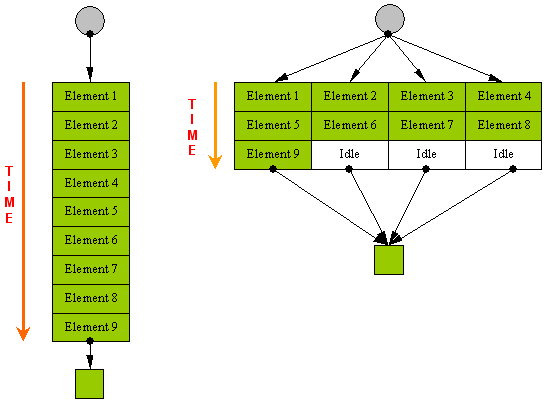
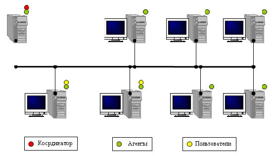
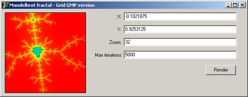
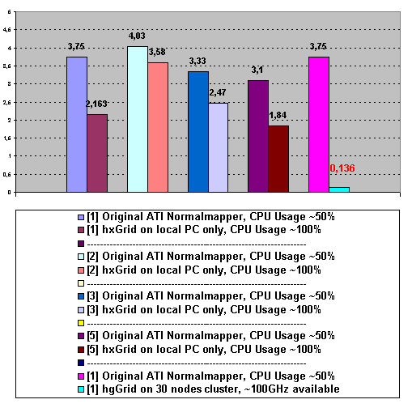
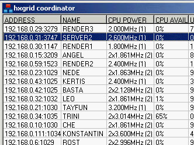

# Distributed Computing in Small and Medium Offices

*Article published on the site [DTF.ru](https://web.archive.org/web/20080101065215/http://dtf.ru/articles/read.php?id=46196)*  
*Article published on [codeproject.com](http://www.codeproject.com/Articles/28788/Distributed-Computing-in-Small-and-Medium-Sized-Of)*

When developing content for computer games, a number of tasks arise that require significant computational power. For example, lighting calculation on an average game level in our editor takes about a day.

It is clear that the slower an operation works – the less often it will be performed, and the lower the resulting quality will be, since quality requires a large number of iterations for parameter tuning.


For a long time, I was interested in the GPGPU[1] concept – using the power of the graphics card to increase the speed of internal utilities. Early versions of our level editor calculated lighting (Ambient occlusion[2] + direct lighting), using rendering of views for the sides of the hemicube from each point of the lightmap.

Unfortunately, as a result of experiments, it turned out that due to the low speed of CPU↔GPU exchange, a simple CPU-only raytracer performs the same work 2-3 times faster. Perhaps I could have achieved some results by implementing the entire algorithm fully on GPU, but such an implementation requires unreasonably large labor costs. When transferring a task to GPU, one has to move away from linear programming and adapt algorithms to the graphics card architecture. Only quite recently did nVidia provide a more or less simple framework, assuming programming in C[3][28].

The emergence of multi-core processors outlined some prospects in this area. The second processor, unlike the GPU, can execute the same binary code – that is, to increase the speed of work, it will not be necessary to completely transfer the entire algorithm to another programming language and another architecture.

I did not have time to take advantage of this opportunity, since I finally understood that one needs to think on a larger scale – and it's high time already.

  
Before continuing, I will ask the reader to press CTRL+ALT+DEL and switch to the "performance" tab. Look at the "CPU Usage" indicator. I think most of you will see a value not exceeding 10%. If you have a dual-processor machine – the second processor is practically free all the time.

In normal operation, the full power of the computer is used only in short moments of generating a response to a user action. The pauses between keystrokes when typing text in Microsoft Word are comparable to eternity for the processor. The proportion of applications that use the full power of the computer is not such a large percentage.

Now calculate what power is idle in an average office (50+ machines) – and you will get a figure approaching modern supercomputers.

  
Unfortunately, some traditional attitude towards cluster computing in high science has long served as a mental barrier for me to attempts to use distributed computing to solve "earthly" practical tasks. Fortunately, the excellent application – Incredibuild[4] – showed that they can be used not only for scientific, but also, possibly, real-time tasks.

A set of workstations connected by a TCP/IP network (cluster) can be considered as a multiprocessor system with shared memory. For performing calculations on such a system, the most simple and effective approach is the data division approach (Data parallel computing).

  
In simple terms, if a regular application processes an array of data independent of each other, then when computing on a cluster, each workstation receives its own piece of the array for processing.

When working on such a system, it is necessary to deal with dividing the task into "pieces", sending data to workstations, executing tasks on workstations, receiving processed data, as well as sending any global data required for calculating the allocated task to the workstations.

This work is done by the cluster software. I tried for a long time to find ready-made software that satisfies the following requirements:

- Windows XP is installed on the workstations;
- it is necessary to use only free processor time, without interfering with the user;
- "no one owes anyone anything" – a workstation can be rebooted, disconnected, or busy with a resource-intensive task at any moment.

The first condition threw out practically all candidates[5][6]. The reason is clear – why buy a licensed OS for each working node, if there is free linux?

The second and third conditions reduced the list of candidates to zero, although from the considered libraries I would like to note several instances that I liked.

MPICH2[7]. Implementation of the MPI library for Windows. Unfortunately, it launches processes with normal priority, which interferes with the user's work. If a workstation becomes unavailable during cluster use – this leads to an error.

libGlass[8]. Despite a fairly convenient programming model, I was afraid to use this library because it had not been updated for a long time.

Alchemy[9]. The most interesting candidate. Offers a convenient programming model, works on the basis of .NET framework, which, by the way, theoretically allows using, say, a Motorola Mpx 200 smartphone as a workstation. Contains clear examples, and continues to develop.

Unfortunately, during testing, several examples "crashed" when exiting the application, and left idle processes on the workstations.

After unsuccessful searches, I decided to develop the library myself.

### Hxgrid

When developing the library, I was guided by the following additional assumptions (in addition to those listed earlier):

- for data transmission, a local network of 10-1000MBit is used, via TCP/IP protocol;
- the network is considered internal and secure; the library does not contain absolutely any means of authentication and protection against attacks. Good security system, on the one hand, significantly increases the development time of the library, on the other – complicates its use;
- the ratio "data transfer time/volume of data execution time on the node" <=0.1. At the same time, the volume of data can be up to from 0 to 100 Mbytes;
- there is a constantly available server in the network on which the coordinator program can be launched;
- the library is supposed to be used both for long (up to several hours), and semi-interactive tasks (up to several seconds);
- at the current moment in time, only one application using the cluster can be running on the current machine (limitation of the current version);
- on one machine, the application using the cluster, agent, and coordinator can run simultaneously;
- working nodes can become unavailable or available during cluster use. Nodes that become available should be included in the work immediately;
- the cluster can be used simultaneously by several users. Available computing resources should be distributed equally;
- all available processors must be used on the working nodes;
- it is assumed to use the library from C++ and Delphi.

To reduce development time, Delphi was chosen for implementation. The library uses COM-like interfaces[11]. The library uses Jedy Visual Code Library[15] and ZLIB[27].

### Cluster Setup

For the initial cluster installation, you need to download the distribution[10.1].

  
The cluster consists of three components:

1. Coordinator. The coordinator must be installed on a machine that is constantly available. The coordinator is engaged in monitoring available computing resources, and providing this information to cluster users (applications using the library). The coordinator must be installed only on one computer in the network. Agents and Users find the Coordinator by sending broadcast messages, so when moving the coordinator to another machine or changing the IP address, there is no need to configure all agents. After receiving the list of agents, the User communicates with them directly. This allows avoiding unnecessary delays in data transmission over the network.

2. Agents. Agents are installed on all computers in the network. The agent allows using the free processor time of the computer on which it is installed.

3. User – an application written using the hgGrid library.

### Programming Model

hgGrid allows executing tasks (tasks) on the working nodes of the cluster. The application adds a set of tasks to the execution queue and waits for their completion.

Input data for each task is written to a stream (IGenericStream inStream). Upon successful task execution, the user receives the result of the task work also in a stream (IGenericStream outStream).

If necessary, the agent executing the task can request additional data from the user, common for the entire session.

Each task represents a procedure:

```cpp
typedef bool (__cdecl TTaskProc)(IAgent* agent, DWORD sessionId, IGenericStream* inStream, IGenericStream* outStream);
```

```pascal
type TTaskProc = function(agent: IAgent; sessionId: DWORD; inStream: IGenericStream; outStream: IGenericStream): boolean; cdecl;
```

where sessionId – unique session identifier, used when obtaining additional session data.

The function returns false if it was interrupted (see below).

Such procedures must be located in a DLL. The library carries out "code delivery" of the procedure by transferring the DLL to each agent. The TTaskProc procedure must be thread-safe. After task execution on the agent, the library transmits the output stream over the network to the application, and calls the FinalizeTask() callback:

```cpp
typedef void (__cdecl TFinalizeProc)(IGenericStream* outStream);
```

```pascal
type TFinalizeProc = procedure(outStream: IGenericStream); cdecl;
```

This function must also be thread-safe.

If a single-threaded application processes a large array of independent data, then the obvious way to speed up the operation is to divide the array into small sections that will be processed on cluster working nodes in parallel.

### Principle of Library Operation

Each agent upon startup finds the coordinator by sending broadcast messages over the local network. After connecting to the coordinator, the agent periodically sends it its state (amount of free processor time, free physical memory, number of assigned tasks).

When initializing the hxGrid library, it finds the coordinator by sending broadcast messages over the local network. After connecting to the coordinator, the library requests IP addresses of all agents and establishes direct connections with them. The library is ready for task execution.

The application using the library adds tasks to the execution queue. From the moment the first task is added, the library starts distributing tasks to agents in a background thread, and receiving completed tasks. If the connection to any agent is lost, the library sends the tasks that were being executed on this agent to another agent.

Upon application completion, the library disconnects from the agents.

To increase efficiency, the following technical solutions were applied:

- to compensate for data transfer time, the library sends the next task even before the agent reports on the completion of the current task;
- in some cases, the library sends a copy of the task being executed on some agent to other free agents. This allows getting rid of waiting if the task fell to an agent that currently has no available computing resources;
- the library controls the amount of available processor time and physical memory on agents. The library will not send tasks if the available resources on the agent are less than specified in the library settings;
- the library controls the length of the task queue and its volume. If the total volume of input streams (inStream) exceeds the configured value, the library blocks the execution of the application until at least one task is completed;
- if the corresponding option is set, the library can swap the task queue to disk to not occupy much memory;
- when transferring large volumes of data over the network, preliminary ZLIB compression is used;
- the agent locally caches the DLL with procedure code for the session duration;
- if there is no free processor time on the agent for 10 seconds, then it is assumed that the user has launched a resource-intensive application. In this case, the agent completely suspends working threads for 25 seconds, otherwise the Windows thread manager will allocate 120ms time slice to working threads[12]. If this is not done, then, for example, when playing Counter-Strike, every 5 seconds there will be an FPS drop.


*Cluster based on PlayStation 2[16.1]*

### Using the Library

The library is supplied as two DLLs: hxGridUserDLL.dll, zlib.dll.

To start a session, you need to create an IGridUser object (see examples examples\picalculator\C++ and examples\picalculator\Deplhi):

```cpp
====================================
#include "hxGridInterface.h"

IGridUser* user = CreateGridUserObject(IGridUser::VERSION);
======================================
```

```pascal
====================================
Uses T_GenericStream, I_GridUser;

var user: IGridUser;

begin IGridUser_Create(user);
======================================
```

From this moment, tasks can be executed on agents:

```pascal
====================================
IGenericStream* stream = CreateGenericStream();

DWORD d=1+i*9; stream->Write(&d,4); user->RunTask("picalculator_task.dll","RunTask",stream,Finalize,&d,true);
======================================

====================================
//write input data for the task to the stream

stream := TGenericStream.Create(); d := 1+i*9; stream.write(d,4);

//add task to execution queue
user.RunTask('picalculator_task.dll','RunTask',stream,Finalize,d,true);

//ownership of the stream passed to the library, remove our refcount
pointer(stream) := nil;
======================================
```

The RunTask() method parameters specify:

- the name of the dll where the task code is located.;
- the symbolic name of the procedure (the procedure must be exported from the DLL by name);
- the stream with input data. The stream passes into the library's ownership (the library will remove 1 refcount itself);
- the address of the local procedure that will be called to process the output data;
- the address of the variable into which the unique task id will be written;
- the blocking flag.

If the task cannot be added immediately (due to queue length limitation or total queue memory), and the blocking flag is set, then the method will not return control until successful execution. Otherwise, it will return S_FALSE (in this case, you can wait for a successful moment using the User->WaitForCompletionEvent() method).

It should be taken into account that some run-time libraries may not be installed on the remote computer. It is best to check this immediately by viewing the import table using the tdump utility. To pass additional DLLs to the agent, you need to specify them separated by commas after the main DLL, for example:

```pascal
user.RunTask('GridGMP_task.dll,GMPPort.dll','RunTask',stream,Finalize,d,true);
```

To ensure normal agent operation, the task must periodically call the agent's method:

```pascal
if (agent.TestConnection(sessionId)<>S_OK) then begin result := false; exit; end;
```

so that the agent can interrupt or suspend task execution. This method works very quickly, and it can be safely called in long loops.

To end the session, destroy the IGridUser object:

```cpp
====================================
user->Release();
======================================
```

```pascal
====================================
user:=nil;
======================================
```

In this short paragraph, the entire process of simple library usage is described.

  
*Cluster based on XBOX[17]*

### Obtaining Additional Session Data from the User

In some cases, tasks executed on agents must access a certain set of data common to all tasks of the session.

If the volume of data is large, then transmitting them each time in the task input stream is inefficient. To obtain common data, the agent provides the method:

```cpp
virtual HRESULT __stdcall GetData(DWORD sessionId, const char* dataDesc, IGenericStream** stream) = 0;
```

```pascal
function GetData(sessionId: DWORD; dataDesc: pchar; var stream:IGenericStream): HRESULT; stdcall;
```

dataDesc – symbolic data descriptor, for example 'geometry';  
stream – the stream into which the data will be written (the stream object is created by the agent. Must be freed by the user).

To send data, a callback must be registered on the user side:

```cpp
====================================
typedef void (__cdecl TGetDataProc)(const char* dataDesc, IGenericStream** outStream);

user->BindGetDataCallback(GetDataCallback);
======================================
```

```pascal
====================================
type TGetDataProc = procedure(dataDesc: pchar; var stream: IGenericStream); cdecl;

User->BindGetDataCallback(callback: TGetDataProc); stdcall;
======================================
```

TGetDataproc must create a stream object and write data to it.

Usually, the task checks whether the global data has already been received, and if not, then receives them and writes them to the global cache, addressed by sessionId and symbolic name.

The application examples\normalmapper-3-2-2 demonstrates the use of these methods.

  
*Cluster based on PlayStation 2[16.2]*

### Additional Methods

```cpp
virtual void __stdcall GetSettings(TGridUserSettings settings);
virtual void __stdcall SetSettings(TGridUserSettings settings);
```

```pascal
User.GetSettings(var settings: TGridUserSettings); stdcall;
User.SetSettings(var settings: TGridUserSettings); stdcall;
```

The methods allow programmatically changing the library settings. For example, compression can be disabled when transmitting data if the application compresses the stream itself.

```cpp
virtual HRESULT __stdcall CompressStream(IGenericStream* stream);
```

```pascal
User.CompressStream(stream: IGenericStream): HRESULT; stdcall;
```

The method allows compressing the stream. For example, it makes sense to prepare and compress a block of global data once, and then only give it in the TGetDataCallback callback. The agent automatically unpacks the stream before passing it to the task on the agent. See example examples\normalmapeer-3-2-2. The library identifies compressed streams by a special signature at the beginning of the stream.

```cpp
virtual HRESULT __stdcall FreeCachedData(DWORD sessionId, const char* dataDesc);
```

```pascal
HRESULT __stdcall IAgent::FreeCachedData(DWORD sessionId, const char* dataDesc) = 0;
```

The agent caches global data requested by the task in memory for the session duration. The method allows freeing these data if it is known that they will never be needed. Used to minimize memory usage on agents.

For example, the task receives global data, builds data structures from them, and remembers them in the global cache. Other tasks will use the same global structures, and will not call agent.GetData() during this session.

### Examples of Library Usage

### PI Calculator (examples\PICalculator)

The simplest example. Calculation of the number Pi with specified precision. Each task calculates [n…n+8] digits of the number.


### Mandelbrot (examples\mandelbrot\)

Mandelbrot fractal explorer. There are three versions:



- SingleCPUExtended – using 10-byte floating-point numbers (FPU native) on one CPU. Insufficient accuracy does not allow performing large magnification.
- SingleGMP – using 256-byte "big numbers" on one CPU. Uses the GMP[13] library port.
- GridGMP – using 256-byte "big numbers" and the hxGrid library. Each agent calculates one vertical line of the picture. This application also shows an example of unsuccessful load distribution – vertical lines can require completely different amounts of calculations, often in a ratio of 1:50. The correct way could be to calculate every n-th pixel of the picture during horizontal scanning.

### Normalmapper (examples\normalmapper-3-2-2\)

ATI NormalMapper 3.2.2[14], rewritten for the hxgrid library.

Normalmapper is an ideal application for distributed computing. Normal map pixels are calculated in a loop and do not depend on each other. When ambient occlusion is enabled, calculating one normal map can take up to 12 hours.

The modified version sends tasks to agents to calculate approximately one hundred normal map pixels. Each agent receives ready structures (trees and geometry) using the IAgent->GetData() method. The geometry volume can reach 100Mbytes, and transmitting it every time in the task input data is inefficient.

In addition, a waiting mechanism has been added to the application (currently only one copy of the application is running) – you can launch several copies of NormalMapper with different models. They will be executed in turn.

It should be noted that the library does not guarantee the order of task execution. Since the order of pixel calculation in normal map calculation matters (due to triangle intersections or their boundaries), the application takes special measures so that the result is completely identical to the original version.

### Installing Distributed Normalmapper

Here is a brief guide on how to use Distributed Normalmapper:

1. install the coordinator program on one computer in the network (hxgrid_coordinator_setup.exe[10.2]);
2. install agents on all computers in the network (hxgrid_agent_setup.exe);
3. install Normalmapper on the artist's computer (hxgri_ATI_NormalMapper_setup.exe)

After that, the application is available through the Start menu: Start-> Programs-> hxgrid->Normalmapper.

### Results

Test systems:

1. Intel Pentium D Presler 3.0GHz
2. Intel Pentium 4 2.8 GHz (HT)
3. Intel Core 2 Duo 1.8GHz
4. Intel Core 2 Duo 2.13GHz
5. Athlon X2 3600+
6. LG GE notebook (Intel Celeron M 1.4 GHz)

Calculation of the normal map car_low.nmf+car_high.nmf, 4096×4096, Bent normals, Ambient occlusion was performed.

Normalmapper.exe -on carlow.nmf carhigh.nmf 2048 2048 test.tga

The original ATI Normalmapper version was recompiled in VS 2005 with aggressive optimizations (without PGO), so that the experiment results were "fair".

The experiments showed that hxGrid can be successfully used to simply engage all cores of one computer. To do this, all three library components (agent, coordinator, application) must be installed on it. If the machine does not have a network card, you need to install the Microsoft loopback adapter and assign it a network address.

  
*Normal map calculation, hours*


*Speed increase as a result of library usage, times*

In total, normal map calculation on the cluster took 8 minutes, compared to 4 hours on a single computer (acceleration by 23 times).

Calculation on the HT processor showed a quite expected speed increase – 12%, but I cannot explain the Core 2 Duo results – 35%, although I expected to see ~80%. Perhaps the common L2 cache was the bottleneck, since Pentium D Presler showed a result of 73%.



*Cluster state (end of working day)*

### Power Consumption

Due to high power consumption, the cluster room must be equipped with ventilation and cooling. How much does office power consumption increase when agents are activated?

  
*Cluster node power consumption, W*

100% CPU load increases power consumption by approximately 30W. The accuracy of my multimeter can be questioned (MT-930F), but even with 50 nodes, the power increase will be only 1.5kW, which is less than a good electric kettle (1.8kW).

### Known Problems

During library development, I was unable to solve the following problems:

- due to the inability to forcibly terminate the connection on the server side (features of the TServerSocket component), disconnecting from agents may take up to 30 seconds. When using Distributed Normalmapper, this is not a problem, but when solving real-time tasks, this may be a problem. If someone can suggest a solution – I will be grateful[29].
- StartSession()/EndSession() methods are not implemented;
- the error and exception handling mechanism is not completed.

### References

[1] [General-Purpose Computation Using Graphics Hardware](http://www.gpgpu.org/)  
[2] [Ambient occlusion – From Wikipedia, the free encyclopedia](http://en.wikipedia.org/wiki/Ambient_occlusion)  
[3] [NVIDIA CUDA Homepage](http://developer.nvidia.com/category/zone/cuda-zone)  
[4] [Incredibuild by Xoreax software](http://www.xoreax.com/)  
[5] [Globus Toolkit Homepage](http://www.globus.org/toolkit/)  
[6] [Cluster system Condor](http://www.osp.ru/os/2000/07-08/178077/)  
[7] [MPICH2](http://www.mcs.anl.gov/research/projects/mpich2/)  
[8] [libGlass – distributed computing library](http://libglass.sourceforge.net/download.php)  
[9] [Alchemy – distributed computing library](http://www.cloudbus.org/~alchemi/projects.html)  
**[10.1][10.2] hxGrid distribution**
   [hxgrid_agent_setup.zip](hxgrid_agent_setup.zip),
   [hxgrid_coordinator_setup.zip](hxgrid_coordinator_setup.zip),
   [hxgrid_ATI_NormalMapper_setup.zip](hxgrid_ATI_NormalMapper_setup.zip)  
[11] [Programming using COM-like interfaces](http://www.dtf.ru/articles/read.php?id=44995)  
[12] [What no one told you about multitasking in Windows](http://www.dtf.ru/articles/read.php?id=39888)  
[13] [The GNU MP Bignum Library](http://gmplib.org/)  
[14] [ATI Normalmapper](http://developer.amd.com/archive/gpu/normalmapper/Pages/default.aspx)  
[15] [Jedy Visual Code Library](http://jvcl.delphi-jedi.org/)  
[16.1][16.2] [PlayStation 2: Computational Cluster](http://arrakis.ncsa.uiuc.edu/ps2/cluster.php)  
[17] [Unmodified Xbox Cluster](http://www.bgfax.com/xbox/home.html)  
[18] [Information and analytical center parallel.ru](http://www.parallel.ru/)  
[19] [Distributed computing: searching for a cure for cancer](http://www.3dnews.ru//software/cure-for-cancer/)  
[20] [Distributed Brains](http://fuga.ru/articles/2003/01/distributed.htm)  
[21] [Hacking NTV+ using distributed computing](http://www.xakep.ru/post/20600/default.asp)  
[22] [Do you know that most of the time computer resources are used less than 5%?](http://v1.distributed.ru/?what-is)  
[23] [Distributed computing with minimal costs](http://www.nestor.minsk.by/kg/2002/07/kg20708.html)  
[24] [Distributed computing on FreePascal under Windows](http://freepascal.ru/article/raznoe/20051207110629/)  
[25] [Distributed computing – parasitic computing](http://www.xakep.ru/post/18980/)  
[26] [Sony is considering selling PS3 processor time](http://www.gamasutra.com/php-bin/news_index.php?story=13476)  
[27] [ZLIB](http://zlib.net/)  
[28] [NVIDIA Texture Tools 2 Alpha](http://developer.nvidia.com/content/gpu-accelerated-texture-compression)  
[29] [Library source codes](hxgrid_src.7z)