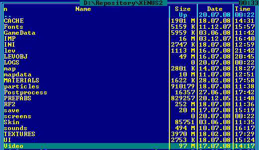
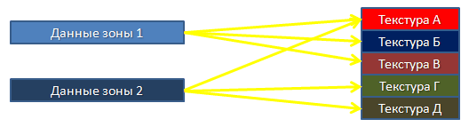
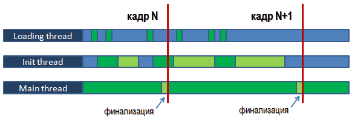

# Стриминг и эффективное чтение с DVD диска

Данная лекция была подготовлена для конференции разработчиков компьютерных игр [КРИ-2008](https://web.archive.org/web/20091201033637/http://kriconf.ru/2008/).

Статья опубликована на сайте [DTF.ru](https://web.archive.org/web/20090908184352/http://dtf.ru/articles/read.php?id=52134).

[Слайды на SlideShare: Стриминг и эффективное чтение с DVD диска](http://www.slideshare.net/Roman_Lut/dvd-13813392)

В настоящее время скорость центрального процессора, мощность видеокарты и размер HDD растут намного быстрее, чем объём оперативной памяти. Современные игровые уровни имеют огромную детализацию, но относительно малый объём памяти не позволяет загрузить весь мир целиком. В простейшем случае игра вынуждена прерывать геймплей экранами загрузки, что особенно мешает в ролевых играх.


Для избавления от экранов загрузки применяется стриминг – загрузка ресурсов на фоне. В статье рассматриваются преимущества и проблемы этой технологии, стратегии загрузки, реализация в современных «движках», а также вопросы эффективного стриминга с DVD. Несмотря на широкое использование стриминга в современных играх, в интернете практически нет информации по этой теме, что и побудило автора написать эту статью.

## Что такое стриминг?

Стриминг – это загрузка ресурсов с диска в оперативную память на фоне. Для игрока процесс прозрачен: он продолжает играть без пауз. Стриминг позволяет реализовывать большие детализированные миры, где в памяти находится только «активный» контент. При путешествии ненужный контент выгружается, а вместо него загружаются данные, которые скоро понадобятся.

![Рисунок 2. Мир Xenus 2: Белое золото [8].](images/image2.jpg)

Игроки ненавидят экраны загрузки «на самом интересном месте». Владельцы консолей ожидают, что вставят диск и сразу будут играть. Многие консольные игры со стримингом не только избавлены от экранов загрузки, но и сокращают время начального старта, загружая контент во время роликов или меню. На консолях малый объём памяти и медленный DVD/Bluray-привод – главные ограничения, против которых работает стриминг.

## Ресурсы

Часть ресурсов (строки UI, скрипты, описания материалов и объектов, шейдеры, списки текстур) занимает мало памяти и обычно загружается при старте игры. Самый большой объём почти всегда занимают текстуры, поэтому именно они чаще всего стримятся. Помимо текстур игра может подгружать звуки, музыку, модели, уровни, анимацию, collision mesh, скрипты, видео и т.д. Стриминг кода встречается редко.



## Что включает в себя поддержка стриминга

После решения «добавить стриминг» нужно обеспечить:

- возможность загружать ресурсы на фоне;
- ориентацию «движка» на асинхронную работу с ресурсами;
- стратегию предварительной загрузки;
- стратегию выгрузки ресурсов при недостатке памяти.

Основное — механизм фоновой загрузки (пример реализации приведён ниже). Поскольку в любой момент какого-то ресурса может не быть в памяти, игра должна это понимать: запрашивать фоновую загрузку и приступать к использованию только после её завершения. Если невозможен алгоритм с ожиданием, нужно гарантировать, что к моменту использования ресурс уже в памяти (стратегия предзагрузки). Когда стримятся разные типы ресурсов, приходится решать, что выгружать при нехватке памяти.

## Классический (линейный) стриминг

Простейший пример — гоночный симулятор. Трасса разделена на участки ~200 м, дальность отображения 150 м. В памяти максимум две зоны (игрок может быть на стыке). Следующая зона загружается на фоне, позади — выгружается, когда новая подключается.


Благодаря линейности движения порядок загрузки зон известен. В RPG, где игрок может идти куда угодно, принцип тот же, но сложнее. Мир делится на компактные зоны (часто квадраты).


В памяти держатся зоны внутри окружности радиусом примерно 150 % дальности видимости; иначе зона выгружается. Фоновая загрузка стартует, когда зона попадает в окружность радиусом ~140 % дальности видимости. Радиус зависит от скорости загрузки и скорости игрока. Из-за свободы движения возможны случаи, когда загруженная зона оказывается не нужна. Примеры игр: GTAIII (архитектурные элементы), Oblivion (квадраты), Gothic (квадраты), Operation Flashpoint (квадраты 1×1 км), Xenus (квадраты 200×200 м).

## Уникальные и shared ресурсы

Каждая зона использует набор ресурсов. Есть уникальные (ландшафт, геометрия построек) и общие (библиотека текстур, моделей). Возможны разные подходы к обработке общих ресурсов.

### Стратегия 1. Все ресурсы зоны считаются уникальными


**Преимущества**

- простота дизайна «движка»;
- зона — линейный блок на диске (быстрое чтение, меньше фрагментации памяти);
- однозначные требования к контенту.

**Недостатки**

- дублирование одинаковых ресурсов в памяти и на диске → рост размера зоны и игры.

### Стратегия 2. Часть типов — общие, для каждого типа свой кэш

При загрузке зоны в кэш догружаются нужные ей ресурсы; при выгрузке — удаляются ресурсы с `refcount == 0`.



**Преимущества**

- экономия памяти;
- уменьшение объёма догружаемых данных (часть уже в кэше).

**Недостатки**

- фрагментация памяти;
- недетерминированный порядок чтения (много DVD seek).

### Стратегия 3. Общие ресурсы хранятся в независимом кэше и подгружаются по надобности


Зоны могут быть крупными; часть их ресурсов (например, текстура картины в здании) может не понадобиться. Такие ресурсы загружаются только при попадании в поле зрения.

**Преимущества**

- ещё большая экономия памяти;
- ещё меньше объём загрузки зоны.

**Недостатки**

- фрагментация памяти;
- много непредсказуемых seek;
- сложная логика взаимодействия кэшей (какой кэш освобождает память?);
- трудно задавать чёткие бюджеты арта, приходится опираться на тестирование.

## Класс StreamableResource

Все классы ресурсов наследуются от абстрактного `TStreamableResource`; фоновую загрузку ведёт менеджер ресурсов. Экземпляры ресурсов создаются при инициализации «движка» и содержат описание, но в стартовом состоянии готовы только к связыванию.

Интерфейс должен включать:

- метод опроса состояния: не загружен / загружается / загружен;
- `StartBackgroundLoad()` — сигнал менеджеру о старте фоновой загрузки;
- `Unload()` — немедленная выгрузка (без долгого ожидания);
- метод приоритета ресурса (для стратегии 3);
- методы поддержки `refCount` (для стратегий 2 и 3); при стратегии 3 «движок» должен «лочить» всю группу зависимых ресурсов;
- поле `lastUsedOnFrameId` (для выбора кандидатов на выгрузку при стратегии 3).

## Эффективное чтение на фоне

CPU и DVD работают параллельно. Для максимальной скорости чтение с диска и обработка (распаковка) должны идти одновременно, для чего создаются два дополнительных потока.



- Поток загрузки обрабатывает очередь чтения; почти всё время блокирован I/O и может работать на ядре основного потока.
- Поток обработки (resource init thread) готовит ресурсы к использованию: распаковка, инициализация.

Чтобы основной поток не использовал ресурсы, которые ещё не подключены, вводится этап «финализации» в конце кадра в основном потоке. Фоновый поток полностью готовит ресурс, но основной его «видит» только после финализации. Это упрощает отладку и устраняет гонки.

## Стратегии предварительной загрузки ресурсов зоны

Ресурс должен быть в памяти к моменту использования, иначе придётся ждать загрузку и FPS провалится. Возможные критерии старта предзагрузки:

- расстояние до зоны;
- триггер, установленный дизайнером;
- статистика (для стратегии 3): если текстура `stone39` потребовалась в точке X,Y,Z, то при приближении к ней можно инициировать предзагрузку (недостатки статистики очевидны);
- эвристики (например, виден автомобиль → загрузить повреждённую модель и текстуры; игрок переключился на гранатомёт → загрузить модель ракеты, дым, взрыв).

Для некоторых ресурсов трудно обеспечить предзагрузку. До их загрузки можно:

- использовать dummy-ресурс (уменьшенная текстура и т.п.). 5000 текстур 64×64 DXT1 занимают ~50 МБ и могут быть загружены при инициализации;
- не отображать объект (если модели видны с 600 м, можно начать показ с 500 м; туман может скрыть позднее появление).

Для звуков и collision mesh dummy-ресурсы невозможны, поэтому стратегия 3 им не подходит — их нужно грузить при инициализации или вместе с зоной (стратегии 1/2).

Если ресурс нельзя держать в памяти, но объём велик, можно хранить его упакованным (например, ZIP) и распаковывать по требованию. Распаковка быстрее чтения с диска и не даёт просадки FPS.

Примеры dummy-ресурсов: уменьшенная текстура; модель — billboard или нижний LOD; звук — моно, низкий битрейт; музыка может не проигрываться до загрузки.

## Фрагментация памяти

Стратегия 1 лучше всего борется с фрагментацией: зона — линейный блок, можно загружать подготовленный блок и делать fixup. Поэтому она популярна на портативных консолях. При стратегии 3 проблема фрагментации максимальна; помогают кастомные аллокаторы с пулами по размеру, handle-based указатели и сборка мусора. Эффективно резервировать «слоты» для уникальных данных зон: если в памяти должны быть две зоны и одна загружается, резервируются три одинаковых слота.

## Насколько большой может быть зона?

Все «активные» зоны и их общие ресурсы должны помещаться в память. Если зоны грузятся в «слоты», их размер жёстко лимитирован размером слота. Также важны скорость движения игрока и скорость чтения с диска.

Пример (гонки): зона — сегмент 0.5 км, максимальная скорость 100 км/ч. Следующий сегмент должен быть в памяти за 0.1 км до него, значит загрузка не должна превышать 14.5 с (0.4 км / 100 км/ч). Минимальная скорость DVD — 6 МБ/с, за 14.5 с — 87 МБ без учёта seek и при условии линейного блока. Здесь размер зоны ограничен скоростью диска, а не объёмом памяти (512 МБ), поэтому нас интересуют физические характеристики устройств хранения.

## Физические характеристики HDD / DVD / Blu‑ray

![Рисунок 10. Физические характеристики устройств хранения [6].](images/image10.gif)

DVD-привод может снижать скорость на плохо читаемых дисках. Перед чтением привод позиционирует головку (seek), делая несколько «толчков» и проверок «где я?», поэтому seek занимает ощутимое время.

**Правило:** максимальная скорость чтения достигается сокращением времени на seek.

Пример: средняя скорость 12 MB/s. Один seek 120 ms теряет 1.44 MB/s; seek + layer change (200 ms) — 2.4 MB/s; spin up 2 s — минус 24 MB.

Чтение файла 0.5 MB требует трёх seek (каталог, FAT, данные), давая 7.68 MB/s вместо 12 MB/s. Чем глубже файл в дереве, тем медленнее.

## Оптимизация чтения с DVD

Главная задача — минимизировать количество seek.

![Рисунок 11. Механизм HD-DVD привода [7].](images/image11.jpg)

Если seek неизбежен, хорошо бы позиционироваться на соседние дорожки: короткие seek быстрее (в пределах нескольких дорожек лазер может лишь наклониться). Вторая задача — уменьшить объём данных.

Приёмов несколько:

- Компрессия ресурсов снижает объём и укорачивает seek (ресурсы ближе друг к другу).
- Групповые файлы устраняют парсинг дерева каталогов и выравнивание кластера, приближая количество позиционирований к одному. Файлы располагаются плотно, экономя место и уменьшая длину seek.
- Располагайте зависимые ресурсы физически рядом (текстуры модели сразу за геометрией). Удобнее делать это внутри групповых файлов.
- Иногда полезно дублировать файлы, чтобы сократить seek (текстура сразу после каждой модели, что её использует). Это увеличивает размер игры и random seek, поэтому применять осторожно.
- Очередь загрузки с одинаковым приоритетом стоит пересортировать: загружать следующий ресурс, чьи данные ближе к текущему положению головки (или позиции в групповом файле). Простая оптимизация может дать до 50 % эффекта.
- Если консоль имеет HDD, можно кэшировать данные с DVD на выделенном разделе во время простоя DVD (меню, ролики). После копирования используется HDD, но стриминг мира должен работать и только с DVD, так как HDD может быть опционален.

## Компрессия

Для обычных данных подойдут Zlib или LZO. LZO сжимает хуже (~+20 % к ZIP), но умеет распаковывать *in place* — запакованные данные загружаются в «слот» и там же разжимаются без дополнительной памяти, что полезно для стратегии 1.

Для текстур — DXT/JPEG или ZLIB поверх DXT. Для звуков — mp3, ogg.

Параллельное чтение и распаковка почти вдвое повышают эффективную скорость. Пример: чтение 12 MB/s, распаковка ZIP 30 MB/s, степень сжатия 0.6. Последовательно: 14.3 MB/s; параллельно: 20 MB/s.

## Xenus 2: White Gold. Стратегия загрузки

![Рисунок 13. Xenus 2: Белое золото [8].](images/image12.jpg)

Мир Xenus 2 разделён на квадраты 600×600 м. Уникальные ресурсы зон: геометрия ландшафта и построек, collision mesh, структуры AI, lightmaps, вершинное освещение моделей. Общие (независимый кэш): текстуры, модели, анимации, звуки, музыка, импосторы уровней. При инициализации загружаются шейдеры, строковые ресурсы (диалоги), hitmesh и collision mesh моделей, описания систем частиц.

В памяти находятся зоны, пересекающиеся с bounding box 1100×1100 м вокруг игрока (4 ближайшие зоны). Дизайнер может указывать группы зон, которые должны быть загружены цельно (например, вершина горы). Контент собран так, чтобы суммарный объём уникальных данных загруженных зон не превышал фиксированный бюджет.

Под текстурный кэш выделен фиксированный объём; кэш не загружает текстуры сверх бюджета. Уменьшенные версии всех текстур (не более 64×64) загружаются при инициализации (~50 МБ на 5000 текстур).

Модели и анимация начинают грузиться при попытке отображения; до загрузки модель не рисуется. Для деревьев на дальних расстояниях используются импосторы, которые остаются до появления полной модели. Чтобы сократить неприятные эффекты, применяются эвристики зависимостей (автомобиль ↔ взорванный автомобиль, модель оружия ↔ гильзы и т.д.). Некоторые модели и текстуры (например, HUD) «залочены» в кэше.

Для минимизации seek применяются групповые файлы (100 MB–2 GB) отдельно по типам ресурсов (текстуры, модели, уровни). Так данные одного приоритета лежат близко. При загрузке запросы сортируются для уменьшения seek.

При построении групповых файлов создаётся граф связей между файлами (текстура–текстура в пределах модели; модель–модель в пределах зоны и между зависимыми моделями; звук–звук и т.д.). Чем сильнее связь, тем ближе должны быть файлы. Оптимизация размещения сводится к минимизации функции:

```
S = Σ((k * distance(f1, f2))^2)
```

где `k` — «толщина» связи (каждая зависимость добавляет +1), `distance(f1, f2)` — расстояние между позициями начала файлов (в байтах). Из‑за большого графа (~5000 узлов, ~50 000 связей) оптимальное решение недостижимо, поэтому применяется генетический алгоритм с ограничением по времени: 2 часа на групповой файл (за это время функция перестаёт быстро уменьшаться). Алгоритм может вставлять дубликаты файлов, но размер группового файла не должен вырасти более чем на 20 %.

Решение сохраняется в специальный файл и переиспользуется при сборке; в идеале пересчитывается периодически на выделённой машине. Текстуры — DXT1/DXT5 + ZIP сверху, звуки и музыка — ogg (декодирование в реальном времени), остальные ресурсы — ZIP.

## Оптимизация чтения с DVD: с чего начать?

Реальный вклад методов (от большего к меньшему):

1. Сортировка очереди загрузки ресурсов.
2. Параллельная распаковка и чтение с DVD.
3. Групповые файлы.
4. Компрессия ресурсов.
5. Оптимизация размещения файлов внутри группового файла.
6. Вставка дубликатов файлов.

В зависимости от контента иногда одной сортировки очереди достаточно.

## Заключение и планы на будущее

Оптимизация загрузки с DVD — задача с нечёткими критериями. Понять, решена ли она, можно только тестированием; когда отдел тестирования перестаёт жаловаться, можно считать результат достигнутым. Практическая цифра: время начальной инициализации удалось сократить с 2 минут до 30 секунд.

Сейчас система загрузки расширяется под распараллеленный «движок». Перед финализацией ресурсов синхронизируются все потоки, которые их используют: в нужные моменты потоки кратко останавливаются, чтобы один поток выполнил финализацию. Это позволяет обходиться без критических секций. С введением параллельного рендеринга все ресурсы получили поле `RefCount`, чтобы любой поток мог «залочить» ресурс в кэше на время использования. После реализации описанных оптимизаций работа над менеджером ресурсов завершена, поставленные цели достигнуты.

## Ссылки

1. [Highly Detailed Continuous Worlds: Streaming Game Resources From Slow Media](http://www.gamasutra.com/features/gdcarchive/2003/Denman_Stu.ppt)
2. [Streaming for Next Generation Games](http://www.gamasutra.com/view/feature/1769/streaming_for_next_generation_games.php?print=1)
3. [It’s Still Loading?](http://www.drizzle.com/~scottb/gdc/its-still-loading.pp)
4. [PS3 Oblivion Seeing Double To Counteract Blu-Ray](http://www.gamesetwatch.com/2007/01/ps3_oblivion_seeing_double_to.php)
5. [Blog debate: PS3 to load games slower than the Xbox 360](http://www.joystiq.com/2006/09/04/ps3-to-load-games-slower-than-the-xbox-360/2)
6. [Is Blu-Ray better for Games](http://forum.beyond3d.com/showthread.php?t=37751)
7. [Война форматов 2: HD DVD наступает под флагом компании NEC, но пока только в области DVD-ROM](http://www.ixbt.com/optical/nec-hr1100.shtml)
8. [Официальный сайт игры Xenus 2: Белое золото](http://whitegold-game.com/)
9. [Материалы лекции](http://www.deep-shadows.com/hax/downloads/DVDReading.7z)
10. [Аудиозапись лекции](http://www.deep-shadows.com/hax/downloadsKRI_2008_Programming_20apr_saturn_04_Lut_Roman_Deep_Shadows.ogg)

