# DIY Home Theatre PC

*Article published on [Hardware Portal](http://www.hwp.ru/articles/Home_Theatre_PC_svoimi_rukami/) on 18.08.2008*

*Article – prize winner of the "DIY" contest on Hardware Portal.ru*

## Introduction

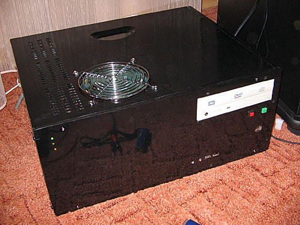

*Figure 1. My "home theater".*

Say what you will – but a portable computer is convenient. Of course, a desktop is "easier" to upgrade – but it's worth paying extra for the freedom of movement. Therefore, slowly but surely, I "switched" to a laptop.

The old desktop gathered dust under the desk for a long time, working sometimes as an internet router for the laptop, sometimes as a network drive, until one day I decided to convert it into a Home Theatre PC.

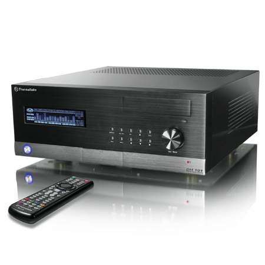

*Figure 2. HTPC Thermaltake DH-101*

At the same time, nothing prevents you from building such a device yourself from available components.

*Figure 3. Before the conversion.*

In total, I set myself the goal of converting the desktop into a silent computer, in a horizontal case, with a remote control.

## Original Configuration

| Component | Model |
|-----------|-------|
| Processor | Athlon XP 2400 |
| Motherboard | Soltek SL-75FRN-2L (nVidia nForce2 chipset) |
| HDD | Seagate 160GB |
| Video card | Radeon 9600 Pro |
| Power supply | Codegen 350W |

## Case

A regular Midi tower was shortened by 7 cm using an angle grinder. The front panel was cut from acrylic glass.

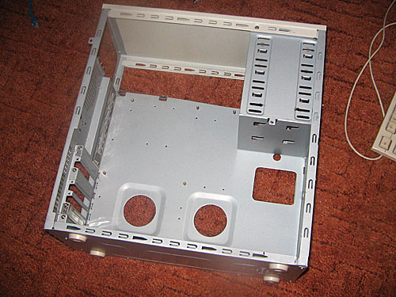

*Figure 4. The case in its original form.*

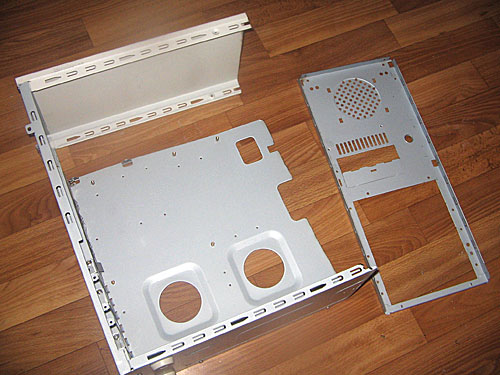

*Figure 5. The case became 7 cm shorter.*

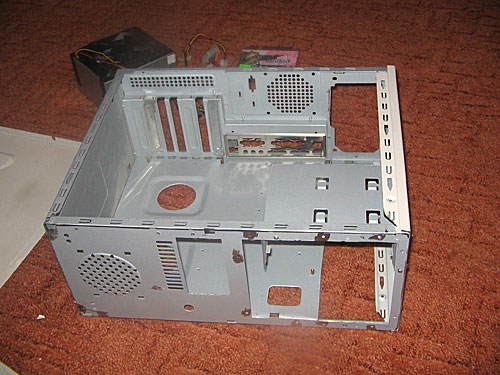

*Figure 6. Now the case will stand horizontally.*

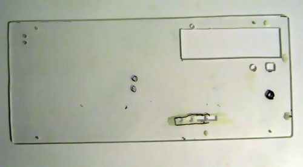

*Figure 7. The front panel.*

After mechanical processing, the entire case will be painted black with spray paint.

## Power Supply

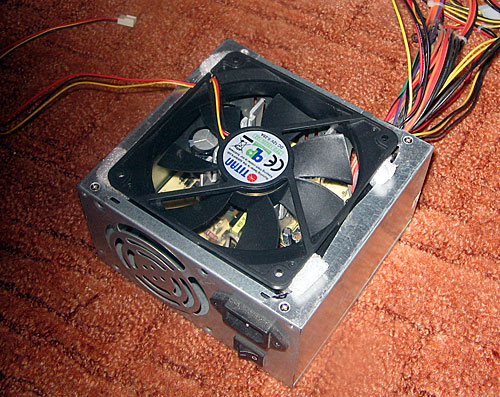

*Figure 8. Replacing the fan on the PSU.*

## CPU Cooling

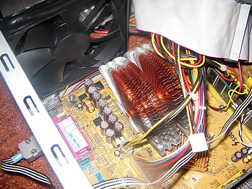

*Figure 9. Zalman 6000CU.*

Next, I needed to replace the 80mm fan on the processor. The first attempt was to use a Zalman 6000CU cooler with a fan installed nearby. Unfortunately, despite the impressive design of the cooler, in this configuration the processor overheats.

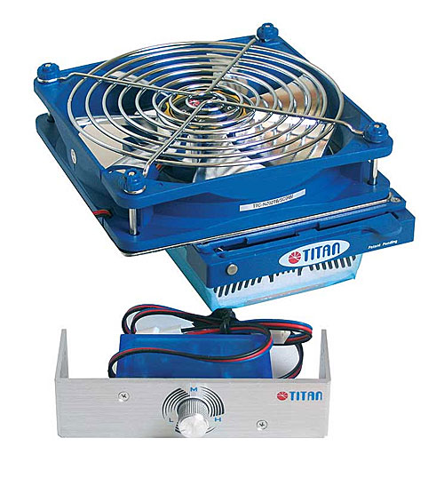

*Figure 10. The Titan Siberia CPU cooler comes with a 120mm fan and a speed controller for installation in the drive bay.*

While searching for a new 120mm fan, I came across the Titan Siberia cooler. The cooler comes with a 120mm fan, has a manual speed controller, and is advertised as silent.

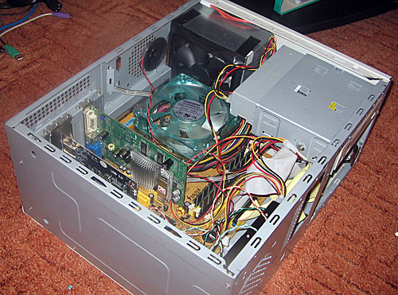

*Figure 11. The final version of the CPU cooling system.*

After several attempts to run the fans at reduced voltage, it turned out that two fans were not enough. Therefore, I added another one to the top cover. This fan should blow air into the case.

## Video Card

Among the dusty components, I found two video cards: ATI Radeon 9600 and 9600 Pro.

*Figure 12. The Radeon 9600 (top) and Radeon 9600Pro (bottom) have identical mounts for the cooling system.*

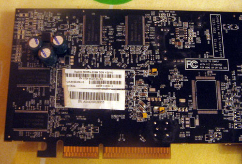

*Figure 13. When installing the heatsink, three capacitors had to be resoldered to the other side of the board.*

## Reducing Fan Speed

After several attempts, I came to the conclusion that in maximum performance mode (games) I would have to give up silent mode – the fans must run at full speed.

Additionally, reduced voltage is not enough for a confident start. All experiments could have ended there, if not for the Anti-burn shield (ABS II) on the motherboard.

Simply turning on the fans at reduced voltage won't work – a control circuit is needed that supplies 12V at startup and reduces the voltage later.

Experiments with lowering the processor frequency and voltage to reduce heat did not pay off. You can reduce the processor temperature by 2-3 degrees using Bus disconnect with the S2kCtl utility[9].

You can also find several analog fan speed control circuits on the internet[3],[6],[7],[8]. Due to the complexity of setting up analog circuits, I decided to make a stepped circuit with software control.

## Speed Controller

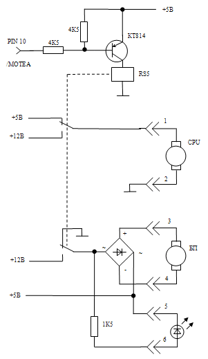

*Figure 14. Speed controller circuit diagram.*

In "quiet" mode, the PSU fan runs at 7V, and the CPU and top cover fans run at 5V.

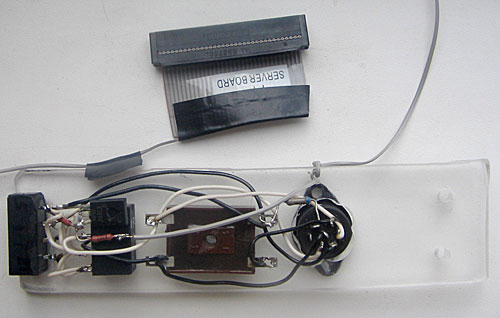

*Figure 15. The circuit is mounted on a piece of acrylic glass.*

The program transmits the control signal through the /MOTEA pin of the floppy drive controller. I could have done the same through the LPT or COM port, but I decided not to use them.

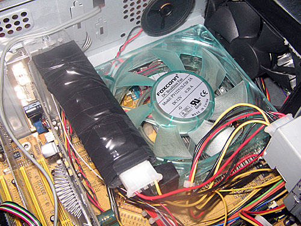

*Figure 16. The control circuit is insulated and mounted inside the case.*

## Software

*Figure 17. The control program displays the CPU temperature in the Tray.*

After digging through the internet and manuals, I wrote a small program in Delphi – FanDriver.

The program only works with the Winbond 83627HF chip. This is exactly what is installed on my chipset. I won't describe the algorithm for communicating with the chip – everything can be seen in the source code[10].

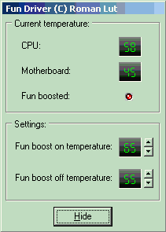

*Figure 18. The program allows you to configure the trigger thresholds.*

The program needs to be added to startup.

## Remote Control

As a remote control, I bought the simplest remote from a Philips TV. I recommend getting remotes specifically from TVs, because some DVD player remotes that I tried sent codes that were too long for programs to recognize.

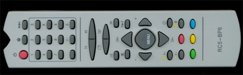

*Figure 19. Philips RC5-BP6 remote control*

The IR signal receiver was built according to the circuit from article[14].

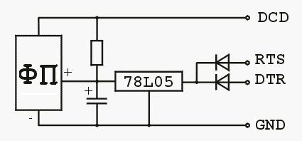

*Figure 20. Circuit diagram of the simplest IR signal receiver for a computer.*

For software, I considered uIce[13], Girder[15], SlyControl 2.0[16]. I liked uIce the most for its simple interface and recognition stability.

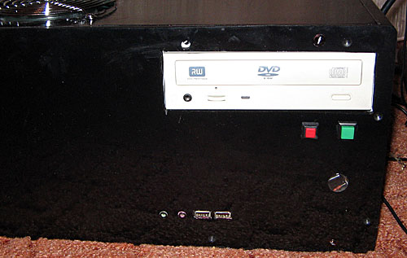

*Figure 21. The IR sensor looks through a window on the front panel.*

## Media Center Software Shell

Media Portal[11] was chosen as the software shell. The program has extensive capabilities and a simple interface that displays well even on a regular TV screen.

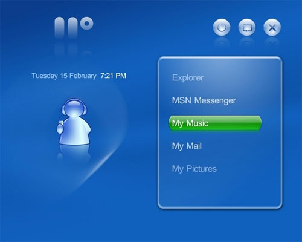

*Figure 22. MediaPortal program interface.*

This was the first application I tried, and I stuck with it.

## Additional Accessories

### Keyboard

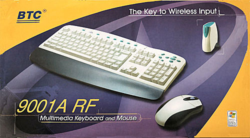

*Figure 23. BTC-9001ARF keyboard and mouse.*

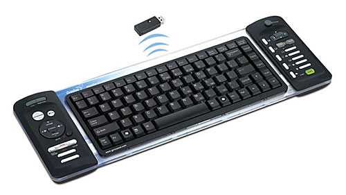

*Figure 24. Genius Media Cruiser keyboard.*

### Gamepad

The Logitech Cordless Rumblepad 2 gamepad is an excellent and convenient device that works at distances up to 9m.

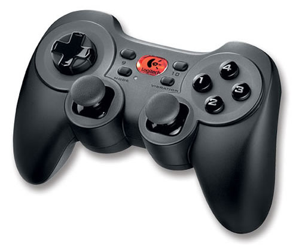

*Figure 25. Logitech Cordless Rumblepad 2 gamepad.*

If a game doesn't support a joystick, you can emulate key presses using the Joy2key program[12]. The abundance of buttons on the gamepad even allows you to configure it for controlling the media center.

### Steering Wheel

As entertainment for my child, I built a steering wheel for Colin McRae Rally from an old toy in one evening. I removed all the old radio control electronics from the wheel housing and installed a potentiometer as a rotation sensor.

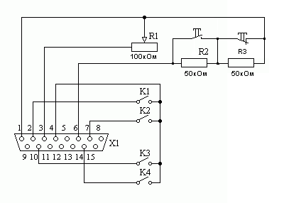

*Figure 26. Steering wheel circuit diagram.*

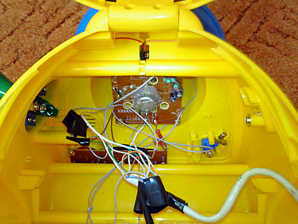

*Figure 27. The basis of the steering wheel is a potentiometer.*

The accuracy of such a steering wheel leaves much to be desired, but it's enough to have fun and not buy the digital wheels available in stores. Not that many games support steering wheels. For example, GTA3 doesn't support steering wheels (!).

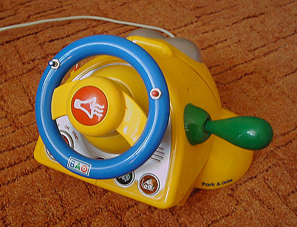

## Conclusion

In conclusion, I'll give my personal opinion. Will a DIY HTPC replace a consumer DVD player or DVD Recorder? Absolutely. Despite the long startup time (even when resuming from hibernate mode), an HTPC has enormous capabilities, and this compensates for everything.

## References

1. Introduction to HTPC (Home Theater Personal Computer)
   [http://www.ixbt.com/monitor/htpc-1.shtml](http://www.ixbt.com/monitor/htpc-1.shtml)

2. Building a multimedia PC (HTPC) for Blu-ray, HD-DVD and HDTV
   [http://www.thg.ru/desktop/htpc_blu_ray_hd-dvd_hdtv/onepage.html](http://www.thg.ru/desktop/htpc_blu_ray_hd-dvd_hdtv/onepage.html)

3. Simple auto-regulator for cooler based on DC-DC converter
   [http://people.overclockers.ru/Djemshut/records](http://people.overclockers.ru/Djemshut/records)

4. SpeedFan
   [http://www.almico.com/speedfan.php](http://www.almico.com/speedfan.php)

5. How to make your motherboard control fans yourself
   [http://www.hardwareportal.ru/Handmade/Mobofan/index.html](http://www.hardwareportal.ru/Handmade/Mobofan/index.html)

6. Fan speed controller
   [http://www.radioland.net.ua/sxemaid-401.html](http://www.radioland.net.ua/sxemaid-401.html)

7. DIY high-efficiency automatic fan controller
   [http://www.hardwareportal.ru/articles/Visokoeffektivniy_avtomaticheskiy_kontroller_ventilyatorov_svoimi_rukami/](http://www.hardwareportal.ru/articles/Visokoeffektivniy_avtomaticheskiy_kontroller_ventilyatorov_svoimi_rukami/)

8. DIY Smart Fan
   [http://www.ferra.ru/online/supply/s25357/](http://www.ferra.ru/online/supply/s25357/)

9. S2kCtl
   [http://www.stargaz0r.nm.ru/](http://www.stargaz0r.nm.ru/)

10. Fan speed control program
    [FunDriver.rar](FunDriver.rar)

11. MediaPortal
    [http://www.team-mediaportal.com/](http://www.team-mediaportal.com/)

12. Joy2Key
    [http://www.electracode.com/4/joy2key/JoyToKey%20English%20Version.htm](http://www.electracode.com/4/joy2key/JoyToKey%20English%20Version.htm)

13. Universal infrared control engine (uIce)
    [http://www.mediatexx.com/download/index.htm](http://www.mediatexx.com/download/index.htm)

14. Controlling a PC with a remote from any TV
    [http://reset-me.net.ru/catalog/stat/4/1/45.html](http://reset-me.net.ru/catalog/stat/4/1/45.html)

15. Girder
    [http://www.promixis.com/](http://www.promixis.com/)

16. SlyControl 2.0
    [http://slydiman.narod.ru/scr/index.htm](http://slydiman.narod.ru/scr/index.htm)

17. Three ways to control a computer through any IR remote
    [http://pc.km.ru/magazin/view.asp?id=930475682E1E444894AD231409E2AA81](http://pc.km.ru/magazin/view.asp?id=930475682E1E444894AD231409E2AA81)

18. DIY steering wheel
    [http://www.joysticks.ru/wheels/samodel/05.shtml](http://www.joysticks.ru/wheels/samodel/05.shtml)

19. DIY steering wheel for computer
    [http://reset-me.net.ru/catalog/stat/4/1/43.html](http://reset-me.net.ru/catalog/stat/4/1/43.html)
